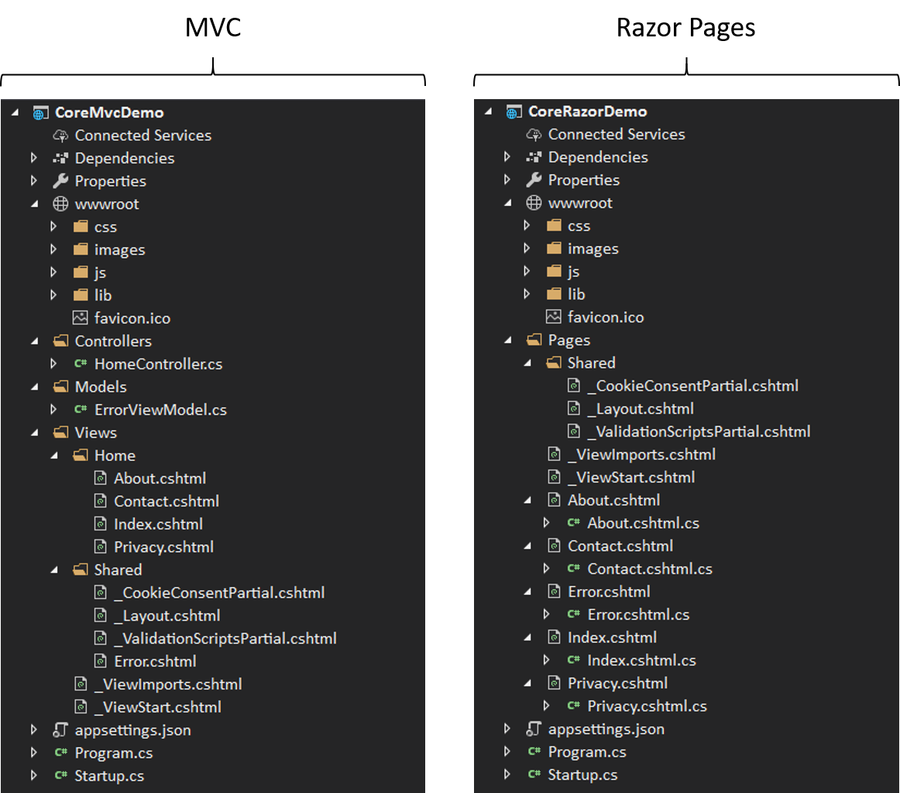
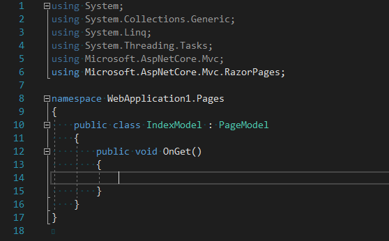
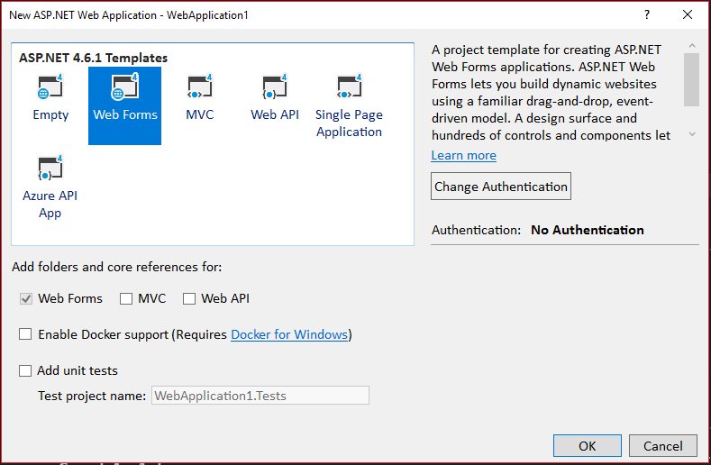

During the last couple of years I’ve been doing lots of web development with technologies like [JavaScript](https://en.wikipedia.org/wiki/JavaScript) and [PHP](http://php.net/) and [Zend Framework](https://framework.zend.com/), with a strong focus on the front end. Before that, however, the vast majority of the work I did as a web developer was with the [.NET Framework](https://www.microsoft.com/net).

I love .NET. Particularly the [C# language](https://docs.microsoft.com/en-us/dotnet/csharp/). However, the greatest thing about .NET is the vibrant ecosystem full of tools (the [Visual Studio IDE](https://visualstudio.microsoft.com/), for example, is outstanding), libraries and frameworks that make one’s life easier and more productive. It has, however, a crucial weakness that prevents it from reaching even greater heights: it’s locked to Windows systems. So, whenever the need comes to develop something outside of a Windows environment, you’re out of luck.

So, naturally, when Microsoft announced their initiative to make the .NET Framework open source and bring it to other platforms a few years ago, I was really excited. Fast forward to today and we have [.NET Core](https://dotnet.github.io/) as the product of great effort from both Microsoft and the community.

I’ve definitely kept it on my radar since its inception back in 2016, but haven’t had the chance to take a really deep dive and see what the technology is about and get a feel for the ecosystem surrounding it.

Well, that time has come and just last week I decided to go in and see what’s up and how everything works. Suffice it to say, I am impressed. The promise of being able to write .NET code everywhere has been pretty much fulfilled.

In terms of features, .NET Core is still missing some stuff but the feature set is mature enough that it can handle most use cases. Me being first and foremost a web developer though, what has me most excited is [ASP.NET Core](https://docs.microsoft.com/en-us/aspnet/core/?view=aspnetcore-2.1), .NET Core’s own web development framework inspired by [classic ASP.NET](https://www.asp.net/).

ASP.NET Core is not just a port of ASP.NET, it is a complete rewrite with a new architecture, new features and ways to develop apps.

At the core of ASP.NET Core (no pun intended) there’s the notion that an HTTP request gets processed by a pipeline composed of several components named middleware, which also produce a response. When the server receives a request, each of the middleware components in the pipeline take their turn in processing the request, are responsible for calling the next middleware in the pipeline and, finally, generating a response to send back to the client.

ASP.NET Core is not the only modern web framework with this pipeline based request processing design. [Zend Expressive](https://docs.zendframework.com/zend-expressive/), for example, also uses this architecture.

Overall, I think this approach is a good solution to the problem of request processing which results in a good [mental model](https://en.wikipedia.org/wiki/Mental_model) for developers to have about how the application is working under the hood.

All of this is more concerned with application startup and initial configuration though. When it comes to actually writing business logic, ASP.NET Core offers two alternatives for web apps with GUIs: [MVC](https://docs.microsoft.com/en-us/aspnet/core/mvc/overview?view=aspnetcore-2.1) and, most recently, [Razor Pages](https://docs.microsoft.com/en-us/aspnet/core/razor-pages/?view=aspnetcore-2.1&tabs=visual-studio).

From the point of view of the developer’s experience, MVC is very similar to classic ASP.NET MVC: there are Controllers which contain Action Methods which return Views which are processed by a templating engine (i.e. [Razor](https://docs.microsoft.com/en-us/aspnet/core/mvc/views/razor?view=aspnetcore-2.1)) to generate a GUI that a user can see and interact with. Razor Pages though, is a new approach that is exclusive to ASP.NET Core and makes things slightly different. The developers at Microsoft say that this new approach is even preferred to MVC for building web UIs. That is, non-[API](https://en.wikipedia.org/wiki/Web_API) web applications.

With Razor Pages, Controllers, Actions and Views are gone and in their place we’ve got Pages and so-called Page Models. So, while in MVC we have the router match a URL to a Controller and Action combo that handles the request and returns a processed View to the client; in Razor Pages we have the router match a URL to a Page and an optional Page Model file (via their location in the project directory) that handle the request and finally present some GUI to the client. Another way to look at it is that, while MVC focuses on Controllers and Actions to handle a request, Razor Pages focuses on actual files.

To better illustrate their differences, here’s what the directory structure of each looks like:

As you can see, the main difference is that the Controllers, Models and Views folders are gone and instead we have a Pages folder. The Pages folder contains all of the .cshtml files (which are the Views or templates) together with accompanying .cshtml.cs files (which are the presentation logic behind the views, or Page Models). These Page Model files contain the logic to respond to requests as well as any properties containing values used for presentation in the template. These properties are a substitute for having separate View Model [DTO](https://www.martinfowler.com/eaaCatalog/dataTransferObject.html) objects that the Actions pass to the Views.

Looking at this directory structure, it’s very easy to see that this model, on the surface at least, looks an awful lot like a Page/Code Behind model that hasn’t been used since the first iteration of ASP.NET: [Web Forms](https://docs.microsoft.com/en-us/aspnet/web-forms/what-is-web-forms). This, together with the fact that MVC’s clean cut separation of Controllers and Views seems to have been merged into some [SRP](https://en.wikipedia.org/wiki/Single_responsibility_principle)-violating Page Model file, has raised some red flags in the eyes of some people in the community.

Perhaps unsurprisingly, Razor Pages has sparked quite the controversy. There’s a big discussion over on the [project’s GitHub page](https://github.com/aspnet/Docs/issues/6146), as I’m sure there is elsewhere in places like [StackOverflow](https://stackoverflow.com/questions/46777404/why-is-razor-pages-the-recommended-approach-to-create-a-web-ui-in-asp-net-core-2).

And, I gotta be honest, I myself, being very familiar with Web Forms and its pitfalls, had a similar initial gut reaction as well. And I think everything is also compounded by the fact that now, seemingly out of nowhere, the ASP.NET Core team are touting this new, inferior (to the eyes of some) method as the preferred method for building new applications moving forward. So, people fear that their preferred style will stop being supported and go away for good.

So, what is the truth? Well, I don’t think it’s as bad as some people are making it out to be. Of course, the technology is fairly new and still needs to be battle tested in large scale real world projects to make sure it’s got what it takes. But as of now, I don’t think the design is fundamentally flawed. In fact, I think it offers a competent way to develop web apps, and I can definitely see why the ASP.NET Core team sees this as the preferred method over MVC.

I’m going to offer some arguments as to why I see Razor Pages as a perfectly fine technology choice. To do that, I’ll address some of the critiques that I’ve seen have been levied against it.

# 1. It’s a worse design than MVC

Some people are saying that MVC is just better on the grounds that it has better [Separation of Concerns](https://en.wikipedia.org/wiki/Separation_of_concerns). This may look like fact at first because of how the files are structured. Like we saw before, in MVC, presentation logic is distributed among three types of files: Controllers (which contain Action Methods), Views and, generally View Models. In Razor Pages we only have a template and an accompanying file which merges Controller, Action and View Model all together. However, we have to ask ourselves: in MVC, are Controllers, Actions and View Models truly separated? And should they even be?

In the context of MVC, View Models are nothing more than DTOs that serve as containers for data that the Actions in the Controller send to the View for rendering. As such, these are most of the time tightly and statically coupled with the View that uses them and the Action that generates them. Rarely you see a View Model being reused across multiple Actions and Views, or injected as an abstract dependency to the Controller.

So, this means that, with a design like the one Razor Pages uses, we’re not actually losing much in the way of Separation of Concerns. Actually, we gain something in the convenience of having all related presentation logic consolidated and close together instead of dispersed across the directory tree.

Finally, I think one frame of mind that helps further see the value of what Razor Pages offers is thinking of the Page Model as a View Model. And I mean View Model in the sense of [MVVM](https://en.wikipedia.org/wiki/Model%E2%80%93view%E2%80%93viewmodel) as opposed to its MVC counterpart. As we’ve already discussed, in MVC, a View Model is nothing more than a DTO that serves to carry data from the Controller to the View. In MVVM, a View Model is much more, as it serves not only as a data store but also as a mechanism to respond to user interactions and execution of presentation logic. This is the pattern used by many modern front end development frameworks like [React](https://reactjs.org/), [Angular](https://angularjs.org/) and [Vue.JS](https://vuejs.org/). The only difference is that, while the MVVM JavaScript frameworks bridge the gap between the [DOM](https://www.w3schools.com/js/js_htmldom.asp) and our app’s code; Razor Pages is bridging the gap between an HTTP client and a server. As a consequence, the vocabulary of the messages is completely different. In the front end, we have the View Model responding to click, and hover and mouseEnter events that come from the DOM. In Razor Pages, we have our “View Model” (i.e. the Page Model) responding to events that come from the client via HTTP; so we get things like GET or POST or PUT, with the associated request payloads.

# 2. It’s just Web Forms all over again

This one is simply not true as both technologies are very different. It is true that, from a file organization point of view, you can definitely see some similarities. After all, both in Razor Pages and Web Forms we have the focus on pages with some code behind them. However, the way that they go about implementing actual websites is completely different.

Just to be clear, I don’t subscribe to the idea that Web Forms is a bad technology or that it was badly designed. For its time, Web Forms was a huge step forward in terms of rapid application development. Also, its model tried to abstract away all the nuance of HTTP and offer a development experience that was very similar to what was seen before in Windows Forms. Now, most modern web development frameworks embrace HTTP’s idiosyncrasies rather than trying to take them out of the way of developers. However, at the time it was an interesting proposition that helped to bridge the gap that developers had to cross in order to move from building desktop apps on Windows to building web apps on a Windows based server.

Anyway, Razor Pages is very different from ASP.NET Web Forms. First of all, in Razor Pages, there’s no abstraction of HTTP whatsoever. Actually, what you see in those Page Model files is not an html page’s “Code Behind“, what you see are HTTP-[Verb](https://www.w3.org/Protocols/rfc2616/rfc2616-sec9.html)-specific Action Methods of sorts that the framework calls for handling requests. You’re going to see methods like OnGet and OnPost, instead of Button3_OnClick or DropDownList1_OnSelect. Much like MVC, you also have access to the complete Request, Response and HttpContext objects that help out in processing requests. Also, the main pain points in WebFroms: Postbacks and the ViewState, are nowhere to be found. Instead, everything is stateless and you’re 100% in control of the messaging that’s happening between server and client.

Here’s what an empty Page Model file looks like:

In reality, these Page Model files look quite a bit like traditional MVC Controllers in that they contain, essentially, Action Methods. The difference is that, in MVC, we had many Action Methods in one Controller where each Action Method corresponded to a specific route. Through routing, each Action Method was executed depending on the incoming request URL. Then the Action Method was responsible of handling the request depending on the HTTP Verb (i.e. GET, POST, etc) and other incoming data. Finally it would produce a useful response.

Meanwhile, in Razor Pages we have these “Action Methods” of sorts that are geared towards handling the various HTTP Verbs for requests that come to the front facing page that they are associated to. This means that a given Page Model and Page combo will always only serve a particular, specific route (i.e. URL). Where a traditional MVC Controller would potentially server multiple routes, depending on how many Action Methods were defined within it.

So, while it is true that, with Razor Pages, we “went back” to having pairs of files representing one web app functional unit, like we did in ASP.NET Web Forms; the way they go about it and the developer experience that they offer is completely different. Also, Razor Pages is not that different than MVC after all. All the building blocks are still there, they are just slightly rearranged.

# 3. It’s going to replace MVC completely

I understand the fear that, when the new thing comes out, the old thing is going to be left to the wayside. This is the same feeling that many had (me included!) when ASP.NET MVC for the [OG](https://www.urbandictionary.com/define.php?term=OG) .NET Framework first came out way back in 2009. Web Forms was doomed. Well, guess what? Web Forms is still around. While it’s true that the last major update happened years ago, the technology is still a first class citizen in the .NET ecosystem and [perfectly usable](https://docs.microsoft.com/en-us/aspnet/web-forms/what-is-web-forms#advantages-of-a-web-forms-based-web-application). And I attribute the lack of recent big updates with new features to the fact that it is a mature framework that is “pretty complete”, rather than Microsoft pulling the plug. After all, it’s still supported in the newest version of Visual Studio and the .NET Framework and [new features and improvements do get developed](https://www.youtube.com/watch?v=KFeuCplwhaQ), albeit small.

Here’s what Visual Studio shows when asked to create a new web application project:

Yup, still alive and kicking.

So yeah, I feel like this is pretty natural human behavior but it’s ultimately baseless, given the history of this ecosystem. Much like Web Forms is still alive after years and years, I think MVC in ASP.NET Core is going to be just fine.

And that concludes my long winded opinion piece about the whole MVC vs Razor Pages controversy and my recent discovery of how cool the .NET Core framework is. As far as I see it, the technology is ready for prime time and I’m looking forward to using it in my projects.

Original post in https://superlativelabs.com/2018/08/14/whats-the-deal-with-asp-net-core-razor-pages/