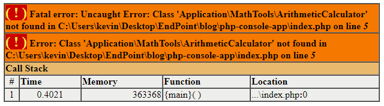

When Rasmus Lerdorf created [PHP](http://php.net/) in the 90s, I bet he never thought that his language would become the engine that powers most of the web, even today, 23 years later.

PHP is indeed super popular. Part of that popularity stems for the fact that it can run pretty much anywhere. You'd be hard pressed to find a hosting solution that doesn't support PHP out of the box. Even the cheapest ones. It is also fully functional in pretty much any version of the most used operating systems, so development and deployment has a very low barrier of entry.

Both because and as a result of this ubiquity and popularity, PHP also boasts an expansive, active community and a rich ecosystem of [documentation](http://php.net/docs.php), tools, libraries and frameworks. [Zend Framework](https://framework.zend.com/) being a great example of one of the latter.

I started using Zend Framework a good while ago now when it became clear that writing vanilla PHP wasn't going to cut it anymore for moderately sized projects. I needed help and Zend Framework extended a very welcomed helping hand. Zend Framework is basically a big collection of libraries and frameworks that cover most of the needs that we would have as web developers building PHP applications.

While most parts of Zend Framework are standalone components that we can plug into an existing code base, picking and choosing what's needed; there's also the likes of [Zend MVC](https://docs.zendframework.com/tutorials/getting-started/overview/). Zend MVC is, in its own right, a framework for developing web applications using the MVC design pattern (shocker, I know). A Zend MVC application is itself comprised of several other components from Zend Framework's library like Zend Form (which helps with developing HTML forms), Zend Db (which helps with database access), Zend Validator (which helps with input validation), and many more.

Obviously, these are very useful within the context of web applications but they can also be valuable on their own. One could put together a PHP console app and make one's life much easier by leveraging the features provided by these libraries. Coming back to the point of PHP's ubiquity, it is very easy to put together such a script that runs in a server where a PHP web app is already deployed. No installation of an additional language interpreter needed; which means no need for special server permissions. No fuss, just good old PHP, which is already running on the server, being used to perform some backend task, some database maintenance, some file downloading, etc.

So, the question becomes, how do we leverage the power of Zend Framework components outside the context of a Zend MVC application? Composer is the key.

Composer is a widely used package manager and module loader for PHP and it is what powers Zend MVC applications' module resolution engine.

In vanilla PHP, the `include` and `require` statements are the main forms of code reuse. When we want to bring functions or classes defined in other files to our script, these are what we use. PHP also supports namespaces. In their most abstract definition, namespaces are things used for organizing other things. In a programing language, they are little more and a name, a series of characters, that group together classes, functions, variables, etc. I.e. program constructs.

Some PHP file in our source code could look like this:

```php
// calc.php
<?php

namespace Application\MathTools;

class ArithmeticCalculator
{
    public function add($x, $y)
    {
        return $x + $y;
    }
}
```

The `namespace` statement near the top says that our `ArithmeticCalculator` is in the `Application\MathTools` namespace.

Elsewhere in our project, we could have something like this:

```php
// index.php
<?php

use Application\MathTools\ArithmeticCalculator;

$calc = new ArithmeticCalculator();

$result = $calc->add(5, 6);

echo $result;
```

In this file, we're getting a reference to the `ArithmeticCalculator` via its namespace. That is, we're calling it with its fully qualified name.

The funny thing though, is that namespaces do not serve to resolve dependencies. That is, just because we use `use Application\MathTools\ArithmeticCalculator;`, it does not mean that PHP knows where the file that actually contains the class is located. In other words, the `use` statement doesn't know how to go out of the current file and look for the corresponding `namespace` statements in other files to figure out what to include. Given that, the savvy reader would be able to deduce that the previous code doesn't actually work. In fact, if we run this as it is, it will most surely throw an exception with PHP complaining about just what we discussed.



Not fun. We're asking PHP to use a namespace that's not in the current executing context. To fix the code above we just need to add our trusty `include` (or `require`) statement. Like this:

```php
// index.php
<?php

include 'calc.php';

// ... rest of the code ...
```

Now it does work. Well, hurray I guess. It's still kind of a bummer because we now have to use BOTH `include`/`require` AND `use` if we want to use namespaces. Imagine how quickly will that become a mess in a project with a good number of files. Thankfully, Composer can help us with that.

Alright, after that long tangent about requiring and including scripts and using namespaces, finally Composer comes back into the picture. Composer includes what's called an autoloader. An autoloader is precisely what we need here because we can use it to make it so our scripts don't need to use `require`/`include` statements anymore. The autoloader takes notice of the `use` statements and then includes the actual files where the source code lives as it sees fit. Alright, let's see how we can create a Composer managed PHP project and use the files that we already have.

First of all, make sure to install Composer from [the official website](https://getcomposer.org/).

Let's create a new directory to work in. I'm going to call mine "`my-console-app`". Go into it and run `composer init` in your console.

This will result in Composer's config generator showing up. It is an interactive prompt that helps you through the setup of your project's `composer.json` file. That file's purpose is to store references to all of your dependencies as well as some general project information like name, description, author, license and the like. For now, just hit enter a few of times until asked whether you'd like to interactively define your dependencies for both dev and prod. Say `no` to those and then finally say `yes` when asked to confirm generation. When all is said and done, the whole thing should look like this:

```
$ composer init


  Welcome to the Composer config generator


This command will guide you through creating your composer.json config.

Package name (<vendor>/<name>) [kevin/my-console-app]:
Description []:
Author [Kevin Campusano <kcampusano@endpoint.com>, n to skip]:
Minimum Stability []:
Package Type (e.g. library, project, metapackage, composer-plugin) []:
License []:

Define your dependencies.

Would you like to define your dependencies (require) interactively [yes]? n
Would you like to define your dev dependencies (require-dev) interactively [yes]? n

{
    "name": "kevin/my-console-app",
    "authors": [
        {
            "name": "Kevin Campusano",
            "email": "kcampusano@endpoint.com"
        }
    ],
    "require": {}
}

Do you confirm generation [yes]? y
```

You should have a brand new `composer.json` file created as well with that final json content that `composer init` showed in the console.

Alright, now let's, in that same directory, create two PHP files with the contents that we saw above. Here they are again for your convenience:

```php
// calc.php
<?php

namespace Application\MathTools;

class ArithmeticCalculator
{
    public function add($x, $y)
    {
        return $x + $y;
    }
}
```

```php
// index.php
<?php

use Application\MathTools\ArithmeticCalculator;

$calc = new ArithmeticCalculator();

$result = $calc->add(5, 6);

echo $result;
```

The directory now looks like this:

```
$ ls
calc.php  composer.json  index.php
```

This right now, still doesn't work. We need to wire up the autoloading. First, let's tell Composer which files we want to autoload by adding this to our `composer.json` file.

```javascript
// composer.json
{
    // ...
    "autoload": {
        "classmap": [
            "calc.php"
        ]
    },
    // ...
}
```

Here, we just use a file name directly but it also supports directories.

Next, we need to generate the actual runtime component that will do the autoloading. We do this with this command:

```
composer dump-autoload -o
```

This creates a series of files that contain the actual autoloading logic to fulfill what we described in our `composer.json` file. They live inside a new `vendor` directory created at the root of our project. An `ls` reveals the current state of our directory:

```
$ ls
calc.php  composer.json  index.php  vendor
```

This new `vendor` directory is also where Composer stores all of the dependencies that we download and add to our project. More on that later though.

Ok, so back to our code. The only thing left to enjoy Composer's autoloading feature is to include the file generated in the previous step in our script. Let's add the following line at the top of our `index.php` file:

```php
// index.php
<?php
include 'vendor/autoload.php';

// ...
```

Now, run `index.php` in your favorite web server or in the console and bask in the glory of hardcoded simple arithmetics.

```
$ php index.php
11
```

Pretty sweet, huh? So, what have we done so far? We've created a Composer project by setting up a `composer.json` file. We've developed a simple application that adds two hardcoded numbers using a separate calculator class. That class is defined in a separate file which is annotated with a namespace. It gets included in our main application entry point (i.e. `index.php`) using Composer's autoloading feature. That is, instead of including the file directly with something like `include 'calc.php';`, we've included it using namespaces and `use` statements like `use Application\MathTools\ArithmeticCalculator;`. The only gotcha is that, in order to enable autoloading in our main file, we need to include the autoloader using `include 'vendor/autoload.php';`. We generated this file by configuring the `composer.json` file with the list of files that contain classes that we want to autoload and then running Composer's own `composer dump-autoload -o` command.

Ok, now that we've learned all that, we're ready to get back to our initial question: "how do we leverage the power of Zend Framework components outside the context of a Zend MVC application?"

As we've seen already, we can run our application in multiple ways. We can serve our directory in a web server and access `index.php` from a browser. We can also just run it from the console with something like `php index.php`. The result will be the same: the addition of 5 plus 6 printed to either the console or the response buffer. This is a console application so let's stick with running it via the console.

Now, as we've discussed before, Zend Framework offers many libraries that we can use. For the purposes of our demonstration, let's use the [Zend Validator](https://docs.zendframework.com/zend-validator/) library. We can install it in our project by running:

```
composer require zendframework/zend-validator
```

After a few seconds of Composer printing out stuff to the console, the package will be installed. The `composer.json` file will be updated and will include the new package in the `require` section. Like this:

```javascript
// composer.json
{
    // ...
    "require": {
        "zendframework/zend-validator": "^2.10"
    }
}
```

The required files were downloaded into the `vendor` folder but we don't really care too much about that right now. It's important to note though, that we should never be changing anything in there, just let Composer do its job. Now, back in our `index.php` file we can "use" our new validator package and start validating some stuff. Our file could look like this:

```php
<?php
include 'vendor/autoload.php';

use Zend\Validator\EmailAddress;
use Zend\Validator\CreditCard;

// Imagine these come from a file, database or http request or something
$emailsToValidate = [
    "kcampusano@endpoint.com",
    "what is this?",
    312321,
    null
];

$creditCardsToValidate = [
    "4111111111111111",
    "what is this?",
    9128173,
    null
];

echo "Validating emails... \n\n";

$emailValidator = new EmailAddress();
foreach ($emailsToValidate as $email) {
    if ($emailValidator->isValid($email)) {
        echo "✔ the {$email} email is valid\n";
    } else {
        echo "✕ the {$email} email is not valid\n";
    }
}

echo "\n";

echo "Validating credit cards... \n\n";

$creditCardValidator = new CreditCard();
foreach ($creditCardsToValidate as $card) {
    if ($creditCardValidator->isValid($card)) {
        echo "✔ the {$card} credit card is valid\n";
    } else {
        echo "✕ the {$card} credit card is not valid\n";
    }
}

echo "\n";
```

Demonstrating the breath of functionality that we can take advantage of by using the Zend Validator component is obviously well beyond the scope of this article. However, in the example above, we can see what including such a component in our scripts could look like. We put together a simple credit card and email validator that works on incoming arrays of data. All we had to do was run `composer require zendframework/zend-validator` to install our package and put this line at the beginning of our script `include 'vendor/autoload.php';`. We didn't even have to generate the autoloader like we did with our custom `AruthmeticCalculator` class. This is because Composer knows how to deal with dependencies installed with `composer require` without us needing to tell it so.

And that concludes today's post about how to use Zend Framework components in a console App in PHP. As a bonus, we also learned about code reuse with `require` and `include`, what namespaces are, how to use them, what they can and cannot do, what is Composer, how to set up a project using it and how to use it for autoloading modules. That's a pretty good bang for your buck.
