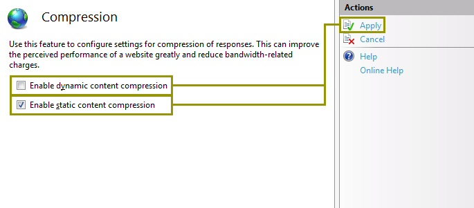
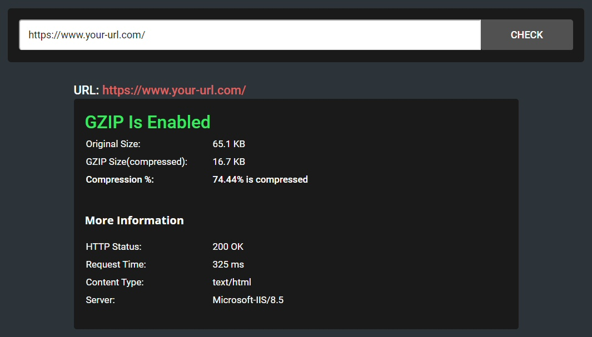
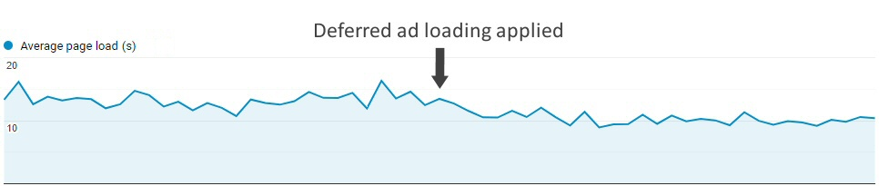

 [Photo](https://flic.kr/p/bmJtgf) by [Johan Larsson](https://www.flickr.com/photos/johanl/), used under [CC BY 2.0](https://creativecommons.org/licenses/by/2.0/)

We live in a competitive world, and the web is no different. Improving latency issues is crucial to any Search Engine Optimization (SEO) strategy, increasing the website’s ranking and organic traffic (visitors from search engines) as a result.

There are many factors that can lead to a faster response time, including optimization of your hosting plan, server proximity to your main traffic source, or utilization of a Content Distribution Network (CDN) if you are expecting visitors on an international level. Some of these solutions and many others can be implemented with only a couple hours of coding.

###Inline styles and scripts for the topmost content

Nobody enjoys waiting for long load times. When opening a Google search link, being met with a blank page or a loading GIF for several seconds can seem agonizing. That’s why optimizing the initial rendering of your page is crucial.

The content that immediately appears to the user without the need to scroll down is referred to as “above-the-fold”. This is where your optimization efforts should be aimed. So here’s a plan to load and display as quickly as possible:

* First, differentiate the critical styles and scripts you need to render the topmost content, and separate them from the rest of our stylesheet and external script references.

* Then, <a href="https://www.imperva.com/learn/performance/minification/">minify</a> the separated <a href="https://csscompressor.com/">styles</a> and <a href="https://jscompress.com/">scripts</a>, and insert them directly on our page template, right before the closing `</head>` tag.

* Finally, take the stylesheet and scripts link references from the `<head>` tag (where it’s usually located) and move them to the end of the above-the-fold content.

Now, the user won’t have to wait until all references are loaded before seeing content. <b>Tip</b>: Remember to use the <a href="https://developer.mozilla.org/en-US/docs/Web/HTML/Element/script#attr-async">async</a> tag on scripts whenever possible.

* <b>example.html</b>:

```html
<head>
	<style>{above-the-fold minified inline styles goes here}</style>
	<script type="text/javascript">{above-the-fold critical scripts goes here}</script>
</head>
<body>
	<div class="above-the-fold-content"></div>
	<link rel="stylesheet" href="{below-the-fold minified stylesheet reference goes here}" />
	<script async src="{below-the-fold minified javascript reference goes here}" />
	<div class="below-the-fold-content"></div>
</body>
```

###Deferred loading of ads

If you’re monetizing your website through Google AdSense or another ad agency that uses scripts to load ads, consider loading ads after the content is fully rendered. This may have a small impact on your revenue, but will improve the user’s experience while optimizing the load speed.

Although there are several ways to achieve this, a technique I have successfully used on many websites is removing all of the script references to Google AdSense until your page is fully loaded. A short delay can be added in order to allow some browsing time before showing ads.

* Remove script references, the comment, and extra spaces from your original ad code, to convert it from something like this...

```html
<script async src="https://pagead2.googlesyndication.com/pagead/js/adsbygoogle.js"></script>
<!-- Your ad name -->
<ins class="adsbygoogle"
     style="display:inline-block;width:728px;height:90px"
     data-ad-client="ca-pub-XXXXXXXXXXXXXXXXX"
     data-ad-slot="XXXXXXXXX"></ins>
<script>
     (adsbygoogle = window.adsbygoogle || []).push({});
</script>
```

* ...to something like this:

```html
<ins class="adsbygoogle" style="display:inline-block;width:728px;height:90px" data-ad-client="ca-pub-XXXXXXXXXXXXXXXXX" data-ad-slot="XXXXXXXXX"></ins>
```

A lot shorter, isn’t it? This will create an empty slot in which the ad will be displayed after the page is fully rendered. To accomplish that, a new script like the one below must be added (assuming jQuery is present on the website):

* <b>async-ads.js</b>:

```javascript
// Create a script reference
function addScript(src, async, callback) {
	var js = document.createElement("script");
	js.type = "text/javascript";
	if (async)
		js.async = true;
	if (callback)
		js.onload = callback;
	js.src = src;
	document.body.appendChild(js);
}

// Called when document is ready
$(document).ready(function() {

	// Wait for one second to ensure the user started browsing
	setTimeout(function() {
		(adsbygoogle = window.adsbygoogle || []);
		$("ins.adsbygoogle").each(function() {
			$("<script>(adsbygoogle = window.adsbygoogle || []).push({})</script>").insertAfter($(this));
		});
		addScript("https://pagead2.googlesyndication.com/pagead/js/adsbygoogle.js", true);
	}, 1000);

});
```

This code will wait for one second once the document is ready, and then leave instructions for Google to push a new ad for each slot. Finally, the AdSense external script will be loaded so that Google will read the instructions and start filling all the slots with ads.

<b>Tip</b>: Enabling balancing from your AdSense dashboard may improve the average load speed as well as the user’s experience since ads will not be shown when the expected revenue is deprecable. And if you’re still on the fence about showing fewer ads, <a href="https://fatstacksblog.com/adsense-ad-balance-experiment/">try out an experiment</a> like I did. A balance of 50% worked well in my case, but the right balance will depend on your niche and website characteristics.

###Lazy load for images

Because the user will most likely spend the majority of the visit reading above-the-fold content (and may even leave before scrolling at all), loading all images from content below-the-fold at first is impractical. Implementing a custom lazy-loading script (also referred to as deferred-loading or loading-on-scroll) for images can be an easy process. Even though changes to the backend would be likely, the concept of this approach is simple:

* Replacing the `src` attributes from all images that will have lazy loading with a custom attribute such as `data-src` (this part will probably require backend changes) and set a custom class for them, like `lazy`.

* Creating a script that will copy the `data-src` content into the `src` attribute as we scroll through the page.

* <b>lazy-load.js</b>:

```javascript
;(function($) {

	$.fn.lazy = function(threshold, callback) {
		var $w = $(window),
		th = threshold || 0,
		attrib = "data-src",
		images = this,
		loaded;
		this.one("lazy", function() {
			var source = this.getAttribute(attrib);
			source = source || this.getAttribute("data-src");
			if (source) {
				this.setAttribute("src", source);
				if (typeof callback === "function") callback.call(this);
			}
		});

		function lazy() {
			var inview = images.filter(function() {
				var $e = $(this);
				if ($e.is(":hidden")) return;
				var wt = $w.scrollTop(),
				wb = wt + $w.height(),
				et = $e.offset().top,
				eb = et + $e.height();
				return eb >= wt - th && et <= wb + th;
			});
			loaded = inview.trigger("lazy");
			images = images.not(loaded);
		}

		$w.scroll(lazy);
		$w.resize(lazy);
		lazy();
		return this;
	};

})(window.jQuery);

$(document).ready(function() {
	$('.lazy').each(function () {
		$(this).lazy(0, function() {
		$(this).load(function() {
			this.style.opacity = 1;
		});
	});
});

// Set the correct attribute when printing
var beforePrint = function() {
	$("img.lazy").each(function() {
		$(this).trigger("lazy");
		this.style.opacity = 1;
	});
};
if (window.matchMedia) {
	var mediaQueryList = window.matchMedia('print');
	mediaQueryList.addListener(function(mql) {
		if (mql.matches)
			beforePrint();
	});
}
window.onbeforeprint = beforePrint;
```

This script will search for all `` tags with class `lazy`, and change the `data-src` attribute to the `src` attribute once the image becomes visible due to scrolling. It also includes some additional logic to set the `src` attribute before printing the page.

###Server-side caching

Instead of performing all the backend rendering calculations every time, server-side caching allows you to output the same content to the clients over a period of time from a temporary copy of the response. This not only results in a decreased response time but also saves some resources on the server.

There are several ways to enable server-side caching, depending on factors such as the backend language and hosting platform (e.g. Windows/IIS vs. Linux/Apache), among other things. For this example, we will use ASP.NET (C#) since I’m mostly a Windows user.

The best and most efficient way to do this is by adding a declaration in the top of our ASP.NET page:

```c#
<%@ OutputCache Duration="10" VaryByParam="id;date" %>
```

This declaration is telling the compiler that we want to cache the output from the server for 10 minutes, and we will save different versions based on the `id` and `date` URL parameters. So pages like:

* https://www.your-url.com/cached-page/?id=1&date=2020-01-01
* https://www.your-url.com/cached-page/?id=2&date=2020-01-01
* https://www.your-url.com/cached-page/?id=2&date=2020-02-01

will be saved and then served from different cache copies. If we only set the `id` parameter as a source for caching, pages with different dates will be served from the same cache source (this can be useful as the `date` parameter is only evaluated on frontend scripts and ignored in the backend).

There are other configurations in ASP.NET to set our output cache policy. The output can be set to be based on the browser, the request headers, or even custom strings. <a href="https://www.c-sharpcorner.com/UploadFile/chinnasrihari/Asp-Net-mvc-framework-server-side-html-caching-techniques/">This page</a> has more useful information on this subject.

###GZip compression

GZip compression—when the client supports it—allows compressing the response before sending it over the network. In this way, more than 70% of the bandwidth can be saved when loading the website. Enabling GZip compression for dynamic and static content on a Windows Server with IIS is simple: Just go to the “Compression” section on the IIS Manager and check the options “Enable dynamic/static content compression”.



However, if you are running an ASP.NET MVC/WebForms website, this won’t be enough. For all backend responses to be compressed before sending them to the client, some custom code will also need to be added to the `global.asax` file in the website root:

* <b>global.asax</b>:

```c#
<%@ Application Language="C#" %>

<script runat="server">

    void Application_PreRequestHandlerExecute(object sender, EventArgs e)
    {
        HttpApplication app = sender as HttpApplication;
        string acceptEncoding = app.Request.Headers["Accept-Encoding"];
        System.IO.Stream prevUncompressedStream = app.Response.Filter;

        if (app.Context.CurrentHandler == null)
            return;

        if (!(app.Context.CurrentHandler is System.Web.UI.Page ||
            app.Context.CurrentHandler.GetType().Name == "SyncSessionlessHandler") ||
            app.Request["HTTP_X_MICROSOFTAJAX"] != null)
            return;

        if (acceptEncoding == null || acceptEncoding.Length == 0)
            return;

		if (Request.ServerVariables["SCRIPT_NAME"].ToLower().Contains(".axd")) return;
		if (Request.ServerVariables["SCRIPT_NAME"].ToLower().Contains(".js")) return;
		if (Request.QueryString.ToString().Contains("_TSM_HiddenField_")) return;

        acceptEncoding = acceptEncoding.ToLower();

        if (acceptEncoding.Contains("deflate") || acceptEncoding == "*")
        {
            app.Response.Filter = new System.IO.Compression.DeflateStream(prevUncompressedStream,
                System.IO.Compression.CompressionMode.Compress);
            app.Response.AppendHeader("Content-Encoding", "deflate");
        }
        else if (acceptEncoding.Contains("gzip"))
        {
            app.Response.Filter = new System.IO.Compression.GZipStream(prevUncompressedStream,
                System.IO.Compression.CompressionMode.Compress);
            app.Response.AppendHeader("Content-Encoding", "gzip");
        }
    }

</script>
```

To make sure our code is working properly, an external tool like <a href="https://www.giftofspeed.com/gzip-test/">this</a> will inform you if GZip is enabled or not.



###Summary

While there are many ways of decreasing the load time of a website, most are common and expensive. However, with a few minor tweaks, we can offer a better user experience in addition to improve our position in the search engine results. Every bit of optimization counts towards the goal with SEO. Load time is a very important factor (to both the developer and the user), especially on mobile platforms where users expect to get what they want instantly.

The image below is a Google Analytics report from one of my websites where, over several months, I implemented most of these formulas. A month ago, I made the latest change of deferring ad loading, which had an observable impact on the average loading speed of the page:



Do you have any other page load optimization techniques? <b>Leave a comment below!</b>
