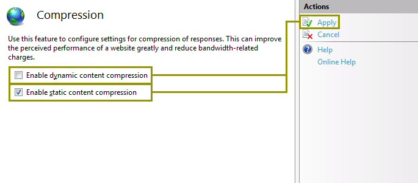
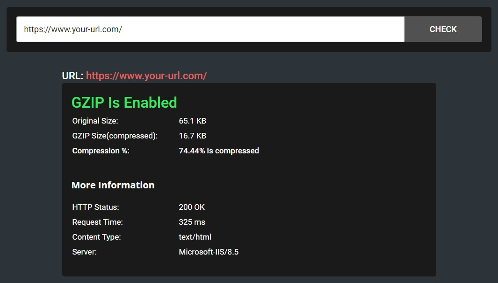
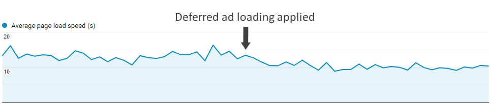

 [Photo](https://flic.kr/p/bmJtgf) by [Johan Larsson](https://www.flickr.com/photos/johanl/), used under [CC BY 2.0](https://creativecommons.org/licenses/by/2.0/)

###Introduction

We live in a competitive world, so why the web should be any different? (Well, maybe it should, but it isn't). And when it comes to organic traffic (the visitors we're getting from search engines), having a low latency on our website is crucial to any SEO strategy, at least for the main landing pages. It's one of the most important keys in order to improve our website ranking.

There are some obvious things to do if our response time is high, like having a better hosting plan, locating our server physically near our main traffic source, or using a CDN if we have many visitors from several countries... But there are also other things we can do that may have slipped under our radar. And some of them can be achieved with only a couple hours of coding.


###Inline styles and scripts for the topmost content

Of course, this will depend on the niche our website is, but as an average, <a href="https://www.statista.com/statistics/277125/share-of-website-traffic-coming-from-mobile-devices/" target="_blank">more than half of web traffic is generated from mobile devices</a>. And when you tap on a Google search result, you don't want to see a blank page or a loading GIF for many seconds. That's why optimizing the first initial rendering of your page is crucial.

The content that will appear immediately to the user without needing to scroll down the page is called "above-the-fold content", and there is where our optimization efforts should be aiming to. So we need to create a plan to load and display it as fast as possible:

* First, we need to differentiate the critical styles and scripts we would need to render the topmost content, and separate it from the rest of our stylesheet and external script references.

* Then, we need to <a href="https://www.imperva.com/learn/performance/minification/">minify</a> the separated <a href="https://csscompressor.com/">styles and <a href="https://jscompress.com/">scripts</a>, and insert it directly on our page template, right before the closing `</head>` tag.

* Finally, we have to move the stylesheet and scripts link references from the `<head>` tag (where it's usually located) to the end of the above-the-fold content, so the user won't have to wait until all references are loaded before seeing any content. <b>Tip</b>: Remember to use the <a href="https://www.w3schools.com/tags/att_script_async.asp">async</a> tag on scripts whenever possible.

* <b>example.html</b>:

```html
<html>
<head>
	<style>{above-the-fold minified inline styles goes here}</style>
	<script type="text/javascript">{above-the-fold critical scripts goes here}</script>
</head>
<body>
	<div class="above-the-fold-content"></div>
	<link rel="stylesheet" href="{below-the-fold minified stylesheet reference goes here}" />
	<script async src="{below-the-fold minified javascript reference goes here}" />
	<div class="below-the-fold-content"></div>
</body>
</html>
```


###Deferred loading of ads

If you're using Google AdSense to monetize your website, or another ad agency that uses scripting to show ads on your pages, you should consider loading ads once the content is fully rendered. This will probably have some impact on your revenue (although almost unnoticeable in most cases), but it will not only increase the user experience but also improve your loading speed.

There are several ways to achieve this: a technique I did on many websites is removing all the script references to Google AdSense until your page is fully loaded. You can even add a short delay to make sure the user will start browsing your content before showing ads.

* Remove both script references, the comment and extra spaces from your ad original code, to convert it from something like this...

```html

<script async src="https://pagead2.googlesyndication.com/pagead/js/adsbygoogle.js"></script>
<!-- Your ad name -->
<ins class="adsbygoogle"
     style="display:inline-block;width:728px;height:90px"
     data-ad-client="ca-pub-XXXXXXXXXXXXXXXXX"
     data-ad-slot="XXXXXXXXX"></ins>
<script>
     (adsbygoogle = window.adsbygoogle || []).push({});
</script>
```

* ...to something like this:

```html
<ins class="adsbygoogle" style="display:inline-block;width:728px;height:90px" data-ad-client="ca-pub-XXXXXXXXXXXXXXXXX" data-ad-slot="XXXXXXXXX"></ins>
```

Quite shorter, isn't it? This will only create an empty slot in which we will load our ad after the page is fully rendered. To accomplish that, we need to create a new script like this one (assuming we have jQuery on our website):

* <b>async-ads.js</b>:

```javascript
// Create a script reference
function addScript(src, async, callback) {
	var js = document.createElement("script");
	js.type = "text/javascript";
	if (async)
		js.async = true;
	if (callback) 
		js.onload = callback;
	js.src = src;
	document.body.appendChild(js);
}

// Called when document is ready
$(document).ready(function() {

	// Wait for one second to ensure the user started browsing
	setTimeout(function() {
		(adsbygoogle = window.adsbygoogle || []);
		$("ins.adsbygoogle").each(function() {
			$("<script>(adsbygoogle = window.adsbygoogle || []).push({})</script>").insertAfter($(this));
		});
		addScript("https://pagead2.googlesyndication.com/pagead/js/adsbygoogle.js", true);
	}, 1000);

});
```

This code will wait for one second once the document is ready, and then leave instructions for Google to push a new ad for each slot we have created. Finally, we will load the AdSense external script so Google will read the instructions and start filling all the slots with ads.

<b>Tip</b>: You can also enable balancing from your AdSense dashboard, improving the average load speed and increasing the user experience since you won't be showing any ads at all when the expected revenue is deprecable. And if you're not sure if displaying fewer ads is better, <a href="https://fatstacksblog.com/adsense-ad-balance-experiment/">you should try out an experiment</a> as I did. A balance of 50% worked for me, but the right balance will depend on your niche and website characteristics.


###Lazy load for images

Loading all images from content below-the-fold right from the start doesn't make much sense, since the user will probably spend most of his time reading the content above-the-fold, and probably even bouncing out from the page or tapping on a link before scrolling. So adding a custom lazy-loading script (or deferred-loading, loading-on-scroll, there are several ways to name it) for images is relatively simple, although we would probably have to change our backend code as well. The idea behind this approach is simple:

* Replacing the `src` attributes from all images that will have lazy loading with a custom attribute (like `data-src`. This step will probably involve some backend changes) and set a custom class for them, like `lazy`.

* Creating a script that will copy the `data-src` content into the `src` attribute as we scroll through the page.

* <b>lazy-load.js</b>:

```javascript
;(function($) {

	$.fn.lazy = function(threshold, callback) {
		var $w = $(window),
		th = threshold || 0,
		attrib = "data-src",
		images = this,
		loaded;
		this.one("lazy", function() {
			var source = this.getAttribute(attrib);
			source = source || this.getAttribute("data-src");
			if (source) {
				this.setAttribute("src", source);
				if (typeof callback === "function") callback.call(this);
			}
		});

		function lazy() {
			var inview = images.filter(function() {
				var $e = $(this);
				if ($e.is(":hidden")) return;
				var wt = $w.scrollTop(),
				wb = wt + $w.height(),
				et = $e.offset().top,
				eb = et + $e.height();
				return eb >= wt - th && et <= wb + th;
			});
			loaded = inview.trigger("lazy");
			images = images.not(loaded);
		}

		$w.scroll(lazy);
		$w.resize(lazy);
		lazy();
		return this;
	};

})(window.jQuery);

$(document).ready(function() {
	$('.lazy').each(function () {
		$(this).lazy(0, function() {
		$(this).load(function() {
			this.style.opacity = 1;
		});
	});
});

// Set the correct attribute when printing
var beforePrint = function() {
	$("img.lazy").each(function() {
		$(this).trigger("lazy");
		this.style.opacity = 1;
	});        
};
if (window.matchMedia) {
	var mediaQueryList = window.matchMedia('print');
	mediaQueryList.addListener(function(mql) {
		if (mql.matches)
			beforePrint();
	});
}
window.onbeforeprint = beforePrint;
```

This script will search for all `` tags with class `lazy`, and copy the `data-src` attribute to the `src` attribute once the image became visible due to scrolling. It also includes some additional logic to set the `src` attribute before printing the page.


###Server-side caching

Server-side caching allows to output the same content to the clients over a period of time from a temporary copy of the response, instead of performing all the backend calculations that rendered that response every time. That way we will decrease our response time but also save some resources on the server.

There are several ways to enable server-side caching, and it will depend of the backend language we're using, our hosting platform (Windows/IIS vs. Linux/Apache), and other things. Since I'm mostly a Windows user, I'll make an example on enabling server-side caching on ASP.NET (C#).

The best -and also easiest- way to do this is by adding a declaration in the top of our ASP.NET page:

```c#
<%@ OutputCache Duration="10" VaryByParam="id;date" %>
```

What this declaration is telling the compiler is that we want to cache the output from the server for 10 minutes, and we will save different versions based on the `id` and `date` URL parameters. So pages like:

* https://www.your-url.com/cached-page/?id=1&date=2020-01-01
* https://www.your-url.com/cached-page/?id=2&date=2020-01-01
* https://www.your-url.com/cached-page/?id=2&date=2020-02-01

Will be saved and then served from different cache copies. If we only set the `id` parameter as a source for caching, pages with different dates will be served from the same cache source (this can be useful is the `date` parameter is only evaluated on frontend scripts and ignored in the backend).

There are other configurations in ASP.NET to set our output cache policy: We can vary the output based on the browser, on the request headers, or even on custom strings. <a href="https://www.c-sharpcorner.com/UploadFile/chinnasrihari/Asp-Net-mvc-framework-server-side-html-caching-techniques/">This page</a> has more useful information on this subject.


###GZip compression

GZip compression allows us, when the client supports it, to compress the response before sending it over the network. That way we can save up more than 70% of the bandwidth needed to load our website. Enabling GZip compression for dynamic and static content is relatively simple at least in Windows Server with IIS: We need to go to the "Compression" section on the IIS Manager and check the options "Enable dynamic/static content compression".



Now, if we are running an ASP.NET MVC/WebForms website, this won't be enough: We will also need to add some custom code to our `global.asax` file in our website root, for all backend responses to be compressed before sending the response to the client:

* <b>global.asax</b>:

```c#
<%@ Application Language="C#" %>

<script runat="server">

    void Application_PreRequestHandlerExecute(object sender, EventArgs e)
    {
        HttpApplication app = sender as HttpApplication;
        string acceptEncoding = app.Request.Headers["Accept-Encoding"];
        System.IO.Stream prevUncompressedStream = app.Response.Filter;

        if (app.Context.CurrentHandler == null)
            return;

        if (!(app.Context.CurrentHandler is System.Web.UI.Page ||
            app.Context.CurrentHandler.GetType().Name == "SyncSessionlessHandler") ||
            app.Request["HTTP_X_MICROSOFTAJAX"] != null)
            return;

        if (acceptEncoding == null || acceptEncoding.Length == 0)
            return;
			
		if (Request.ServerVariables["SCRIPT_NAME"].ToLower().Contains(".axd")) return;
		if (Request.ServerVariables["SCRIPT_NAME"].ToLower().Contains(".js")) return;
		if (Request.QueryString.ToString().Contains("_TSM_HiddenField_")) return;

        acceptEncoding = acceptEncoding.ToLower();

        if (acceptEncoding.Contains("deflate") || acceptEncoding == "*")
        {
            app.Response.Filter = new System.IO.Compression.DeflateStream(prevUncompressedStream,
                System.IO.Compression.CompressionMode.Compress);
            app.Response.AppendHeader("Content-Encoding", "deflate");
        }
        else if (acceptEncoding.Contains("gzip"))
        {
            app.Response.Filter = new System.IO.Compression.GZipStream(prevUncompressedStream,
                System.IO.Compression.CompressionMode.Compress);
            app.Response.AppendHeader("Content-Encoding", "gzip");
        }
		app.Response.Filter = new WhitespaceFilter(app.Response.Filter);
    }
		
    void Application_Error(object sender, EventArgs e)
    {
    }	

    void Application_Start(object sender, EventArgs e) 
    {
    }
    
    void Application_End(object sender, EventArgs e) 
    {
    }

    void Session_Start(object sender, EventArgs e) 
    {
    }

    void Session_End(object sender, EventArgs e) 
    {
    }
	
       
</script>
```

And to make sure our code is working properly, we can use an external tool like <a href="https://www.giftofspeed.com/gzip-test/">this website</a> that will kindly inform us if we're GZip enabled or not.




###Summary

There are many ways of increasing the loading speed on a website. Most are common and expensive, but there are also other minor tweaks that can help us bring a better user experience and also gain a couple of positions in the search engine results. And on SEO, every tiny bit of optimization counts to our goal. Every fraction of a second we can save matters -to both us and the user-, especially on mobile where people expect to get what they want almost immediately.

This is a view from Google Analytics from one of my websites, where I applied most of these formulas over several months to assess the results. The latest change I did a month ago was the deferred ad loading, and while it's not huge, it clearly made an impact on the average page load speed:



Do you have any other page load optimization techniques? <b>Leave us a comment below!</b>