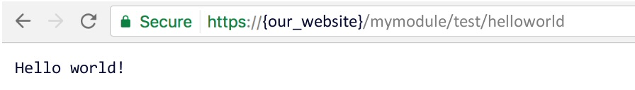

[Photo](https://unsplash.com/photos/q4ZBGVzJskE) by [Babatunde Olajide](https://unsplash.com/@olajidetunde), cropped from original

A Magento module is a set of classes and routines that will depend on and interact with other Magento classes in order to add a specific feature to a Magento application. While a [theme](https://devdocs.magento.com/guides/v2.3/frontend-dev-guide/themes/theme-overview.html) is orientated towards the front-end and user experience, a [module](https://devdocs.magento.com/guides/v2.3/architecture/archi_perspectives/components/modules/mod_intro.html) is orientated towards backend logic and application flow.

We will need to create a custom module if we want to add or change the existing logic at a level where Magento doesn’t provide a setting or option for it. For example, if our business has a specific feature or set of features or requirements that are not common to the market, a module can fill that gap for us.

### Creating a basic Magento 2 module

Creating a simple module in Magento 2 is not that hard. We will need to accomplish the following tasks:

- Create a new directory for the module
- Create a `registration.php` script
- Create a `etc/module.xml` information file
- Install the new module

#### Creating a new directory for the module

Where should the new directory for our module be placed? We have two options to choose from:

- `app/code/{vendor}/`
- `vendor/{vendor}/`

If your module is intended for a specific website you’re working on, you can use the first option. If you’re creating a module with the intention of it being used on several websites, it’s best to choose the second option. We’ll use the first for this example.

Let’s create a directory named `EndPoint` (our vendor name) with a subdirectory inside it, `MyModule`:

```bash
cd {website_root}
mkdir -p app/code/EndPoint/MyModule
```

#### Creating the registration.php script

The `registration.php` file tells Magento to register the new module under a specific name and location. Let’s create a file named `app/code/EndPoint/MyModule/registration.php` with the folllowing content:

```php
<?php
\Magento\Framework\Component\ComponentRegistrar::register(
    \Magento\Framework\Component\ComponentRegistrar::MODULE,
    'EndPoint_MyModule',
    __DIR__
);
```

We’re telling Magento that our module will be named EndPoint_MyModule.

#### Creating the etc/module.xml information file

Now, let’s create our module information file, where we’ll specify the module version number. First, we need to create the `etc` directory inside `app/code/EndPoint/MyModule`:

```bash
mkdir app/code/EndPoint/MyModule/etc
```

then create `module.xml` with the following content:

```xml
<?xml version="1.0"?>
<config xmlns:xsi="http://www.w3.org/2001/XMLSchema-instance" xsi:noNamespaceSchemaLocation="urn:magento:framework:Module/etc/module.xsd">
    <module name="EndPoint_MyModule" setup_version="1.0.0">
    </module>
</config>
```

#### Installing the new module

That’s it! We have everything we need to install our new module. Now we need to tell Magento we want to install and enable our new module. So from our website root we need to run:

```bash
php bin/magento setup:upgrade
```

Magento will output a list of module names and configuration updates, and our new module `EndPoint_MyModule` should be listed in that output.

### Adding a custom route to our module

Now we have a working, enabled module, but it’s not doing anything yet! What’s a simple way to check that our module is enabled? Let’s set up a custom route, so if we hit a URL like `https://{our_website}/mymodule/test/helloworld` we can return a custom response from a controller.

Creating a custom route will need some steps on its own:

- Create a new directory for the controller
- Create a `etc/routes.xml` file
- Create the controller
- Upgrade the new module

#### Creating a new directory for the controller

First we need to create a new directory where the new PHP controller for our custom route will live. The new directory path should be:

`app/code/EndPoint/MyModule/Controller`

We can create as many directory levels we want, depending on our desired path. For example, if we create a class named `Index` in `app/code/EndPoint/MyModule/Controller`, the URL that will be routed to this controller will be `https://{our_website}/mymodule/index` (the “Controller” directory is ignored). If we create a class named `HelloWorld` in `app/code/EndPoint/MyModule/Controller/Test`, the resulting URL will be `https://{our_website}/mymodule/test/helloworld`.

#### Creating the etc/routes.xml file

`routes.xml` will tell Magento what base URL will be used for our module. First, we need to create the “frontend” directory where the routes.xml file needs to be placed:

```bash
mkdir app/code/EndPoint/MyModule/etc/frontend
```

In this example, we want the base URL to be `MyModule`, so we need to create an XML file inside the new directory that will route all requests made to the given URL to our module controllers:

```xml
<?xml version="1.0" ?>
<config xmlns:xsi="http://www.w3.org/2001/XMLSchema-instance" xsi:noNamespaceSchemaLocation="urn:magento:framework:App/etc/routes.xsd">
    <router id="standard">
        <route frontName="mymodule" id="mymodule">
            <module name="EndPoint_MyModule"/>
        </route>
    </router>
</config>
```

#### Creating the controller

If we want to respond to requests for `https://{our_website}/mymodule/test/helloworld` we first need to create the base `Controller` directory and the `Test` subdirectory:

```bash
mkdir -p app/code/EndPoint/MyModule/Controller/Test
```

Under this directory, we’ll create our custom Magento controller. All route controllers should extend `\Magento\Framework\App\Action\Action`. We also need to have a public `construct()` method to pass the context to our ancestor and an `execute()` function that will be called when the URL is hit:

```php
<?php

namespace EndPoint\MyModule\Controller\Test;

class HelloWorld extends \Magento\Framework\App\Action\Action
{

    public function __construct(
        \Magento\Framework\App\Action\Context $context
    ) {
        parent::__construct(
            $context
        );
    }

    public function execute()
    {
        echo "Hello world!";
    }

}
```

#### Upgrading the new module

We have everything in place to tell Magento we have new changes to be deployed. How we do that? First, we need to upgrade our Magento setup. But since we added a new controller that gets parameters from the dependency injector in the construct, we also need to compile the dependency injection engine (including factories, proxies, and interceptors). And finally, we need to clear the cache so new content will be served from our custom URL:

```bash
php bin/magento setup:upgrade
php bin/magento setup:di:compile
php bin/magento cache:flush
```

This process can take a few minutes to complete, but after it’s done we can try to reach our new custom URL. If we get a response like the one below:



That means our module is working!

That’s all for now. In upcoming posts, we’ll start complicating things a bit by overriding Magento classes with our custom ones and creating custom controllers that will return information from the Magento core classes. We will also explore how to customize the front-end by creating a theme. Don’t forget to add any questions, suggestions, or issues in the comments below!
