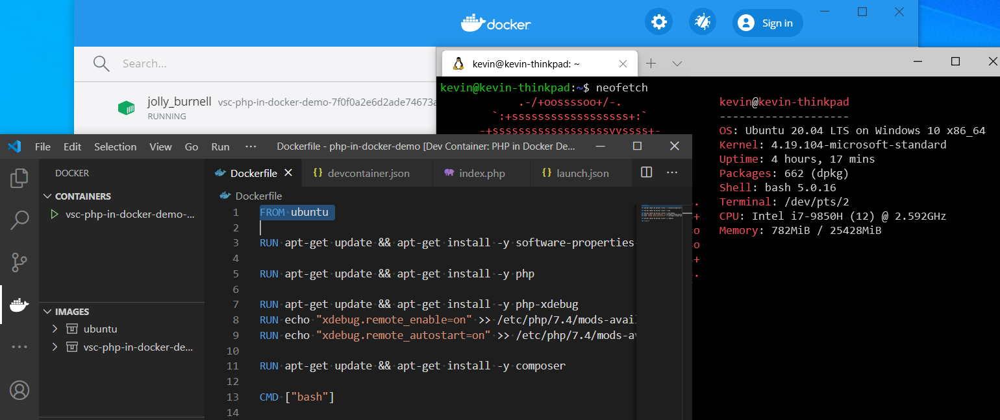
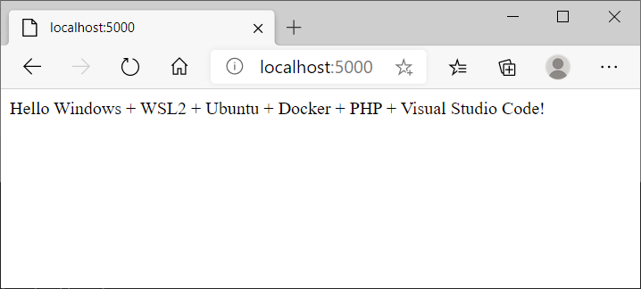
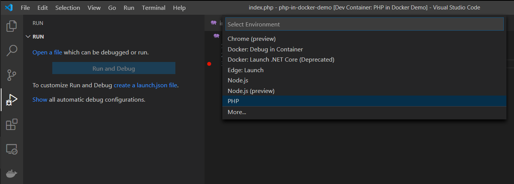
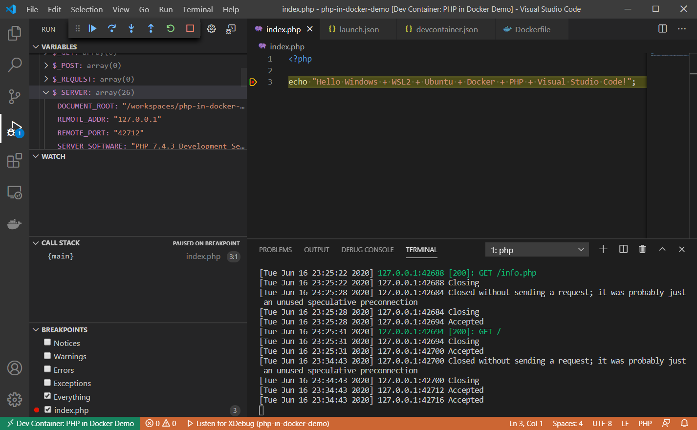

I'm first and foremost a Windows guy. For a few years now though, moving away from working mostly with [.NET](https://dotnet.microsoft.com/) and into a plethora of open source technologies has given me the opportunity to change platforms and run a Linux based system as my daily driver. Ubuntu, which I honestly love for work, has been serving me well by supporting my development workflow with languages like [PHP](https://www.php.net/), [JavaScript](https://www.javascript.com/) and [Ruby](https://www.ruby-lang.org/en/). And with the help of the excellent [Visual Studio Code](https://code.visualstudio.com/) editor, I've never looked back. There's always been an inclination in the back of my mind though, to take some time and try giving Windows another shot...

With the latest improvements coming to the [Windows Subsystem for Linux with its second version](https://docs.microsoft.com/en-us/windows/wsl/wsl2-index), the new and exciting [Windows Terminal](https://github.com/microsoft/terminal) and [Docker support for running containers inside WSL2](https://docs.docker.com/docker-for-windows/wsl/); I think the time is now.

In this post, we'll walk through the steps that I had to take to set up a PHP development environment in Windows, running in a Ubuntu Docker container running on WSL2, and VS Code. Let's go.

> Note: You have to be on the latest version of Windows 10 Pro (Version 2004) in order to install WSL2 by the usual methods. If not, you'd need to be part of the Windows insiders program in order to have access to the software.

## What's new with WSL 2.

Many have written about this so I won't be redundant and just point you right to the source: https://docs.microsoft.com/en-us/windows/wsl/wsl2-index

Being a WSL 1 veteran, what I can mention are the main improvements that have been made since the last time I used it which have sparked my interested in trying it again.

### 1. It's faster and more compatible.

WSL 2 introduces a complete architectural overhaul. Now, Windows ships with a full Linux Kernel which is what WSL 2 distributions use to run. This results in greatly improved file system performance and much better compatibility with Linux programs. It's no longer running a Linux look-alike, but rather, actual Linux.

### 2. It's better integrated with Windows.

This is a small one: we can now use the Windows explorer to browse files within a WSL distribution. This is not a WSL 2 exclusive feature, it has been there for a while now. I think it's worth mentioning though because it truly is a great convenience and a far cry from WSL's first release, where Microsoft specifically advised against browsing WSL distribution file systems from Windows. If anything else, this makes WSL feel like a first class citizen in the Windows ecosystem and shows that Microsoft actually cares about making it a good experience. 

### 3. It can run Docker.

I've recently been learning more and more about Docker and it's quickly becoming my preferred way of setting up development environments. Due to its lightweightness, ease of use, and VM-like compartmentalization, I find it really convenient to develop against a purpose-built Docker container, rather than directly in my local machine. And with VS Code's Remote development extension, the whole thing is very easy to set up. Docker for windows now supports running containers within WSL, so I'm eager to try that out and see how it all works.

### 4. A newer version means several bugfixes.

Performance not whistanding, WSL's first release was pretty stable. I did however, encounter some weird bugs and gotchas when working with the likes of SSH and Ruby during certain specific tasks. It was nothing major as workwrounds were readily available, so I won't bother mentioning them here again. I've already discussed some of them [here](https://www.endpoint.com/blog/2019/04/04/rails-development-in-windows-10-pro-with-visual-studio-code-and-wsl). But the fact that the technology has matured since last time I saw it, and considering the architectural direction it is going in, I'm excited to not have to deal with any number of quirks. Developing software is hard enough as it is, I don't need to also be fighting my OS.

## The development environment

Ok, now with some of the motivation out of the way, let's try and build a quick PHP hello world app, run it in a Docker container inside WSL 2, and make sure we can edit and debug it with VS Code and browse it in a browser from Windows.

### Step 1: Install WSL2 and Ubuntu

Step 1 in obviously to install a Linux distribution that we like and the engine that runs it. [Microsoft's own documentation](https://docs.microsoft.com/en-us/windows/wsl/install-win10) offers an excellent guide on how to do just that. But in summary, we need to:

1. Enable the "Windows Subsystem for Linux" and "Virtual Machine Platform" features by running these on an elevated PowerShell:

```ps
dism.exe /online /enable-feature /featurename:Microsoft-Windows-Subsystem-Linux /all /norestart
dism.exe /online /enable-feature /featurename:VirtualMachinePlatform /all /norestart
```

2. Restart your machine.
3. Set WSL 2 as the default version with: `wsl --set-default-version 2`. Also from a PowerShell.
4. Install your desired distribution from the Microsoft Store. In my case, I chose [Ubuntu 20.04 LTS](https://www.microsoft.com/es-do/p/ubuntu-2004-lts/9n6svws3rx71?rtc=1&activetab=pivot:overviewtab).
5. After installing, open the resulting new app from the Start menu and it should come up with a command line console, and wait for it to finish installing. It should prompt for a username and password along the way.

Optionally, you can install the [Windows Terminal](https://github.com/microsoft/terminal) app to get a better command line experience. Windows Terminal can be used to interact with PowerShell and the classic CMD, and also with our WSL distributions.

### Step 2: Install Docker

Installing Docker is very straight forward. Just download the installer for [Docker Desktop for Windows](https://hub.docker.com/editions/community/docker-ce-desktop-windows/), execute it, and follow the wizard's steps. The only gotcha is to make sure that, during installation, the "Use the WSL 2 based engine" option is selected. In most cases, the installer will detect WSL 2 though, and automatically have the option selected.

Follow the [official instructions](https://docs.docker.com/docker-for-windows/wsl/) for more details on the process, but it really is that simple.

### Step 3: Install some useful VS Code extensions

Our objective is to create a new development environment inside a Docker container and connect to it directly with VS Code. To do that, we use a few useful extensions:

1. [The Docker extension](https://marketplace.visualstudio.com/items?itemName=ms-azuretools.vscode-docker) which allows us to browse and manage images and containers and other types of Docker assets.
2. [The Remote - WSL extension](https://marketplace.visualstudio.com/items?itemName=ms-vscode-remote.remote-wsl) which allows VS Code to connect to a WSL distribution.
3. [The Remote - Containers extension](https://marketplace.visualstudio.com/items?itemName=ms-vscode-remote.remote-containers) which allows VS Code to connect to a container.

### Step 4: Create the development container

The extensions that we installed will allow us to use VS Code to work on code from within our WSL Ubuntu as well as from the container. What we want though, is to connect VS Code to a container. There are a few ways to do this, but I will describe the one I think is the easiest, most convenient and "automagic" by fully leveraging the tools.

Let's begin by opening a terminal session into our WSL Ubuntu, which will show something like this:

```
Welcome to Ubuntu 20.04 LTS (GNU/Linux 4.19.104-microsoft-standard x86_64)

 * Documentation:  https://help.ubuntu.com
 * Management:     https://landscape.canonical.com
 * Support:        https://ubuntu.com/advantage

...

kevin@kevin-thinkpad:/mnt/c/Users/kevin$
```

#### The project directory

Let's change to our home, create a new directory for our new project, and change into it.

```sh
$ cd ~
$ mkdir php-in-docker-demo
$ cd php-in-docker-demo
```

Because we installed the Remote - WSL extension, we can open up this directory in VS Code with `code .`. Opening a terminal in this VS Code instance opens WSL console, not Windows.

#### The Dockerfile

Now let's create a new file called `Dockerfile` which will define what our development environment image will look like. For a no frills PHP environment, mine looks like this:

```docker
# Base the image on the official Ubuntu one from Docker Hub: https://hub.docker.com/_/ubuntu
FROM ubuntu

# The RUN statement executes the command that follows it inside the container
# These install PHP and its prerequisite
RUN apt-get update && apt-get install -y software-properties-common
RUN apt-get update && apt-get install -y php

# These ones install Xdebug and configure it so that the VS Code debugger can use it.
RUN apt-get update && apt-get install -y php-xdebug
RUN echo "xdebug.remote_enable=on" >> /etc/php/7.4/mods-available/xdebug.ini
RUN echo "xdebug.remote_autostart=on" >> /etc/php/7.4/mods-available/xdebug.ini

# This installs Composer
RUN apt-get update && apt-get install -y composer

# The CMD statement tells Docker which command to run when it starts up the container. Here, we just call bash
CMD ["bash"]
```

This script will later be used to create our development container. It will have PHP, [Xdebug](https://xdebug.org/) and [Composer](https://getcomposer.org/). This is all we need for our simple hello world app. For more complex scenarios, other software like database clients or PHP extensions can be easily installed with additional `RUN` statements that call upon the `apt` package manager.

Consider reading through [Docker's own official documentation](https://docs.docker.com/engine/reference/builder/) on Dockerfiles to learn more.

#### The Configuration File

Now, to leverage VS Code's capabilities, let's add a so-called "Development Container Configuration File". In our current location, we need to create a new directory called `.devcontainer` and, inside that, a new file called `devcontainer.json`. I put these contents in mine:

```json
{
    // The name used by VS Code to identify this development environment
    "name": "PHP in Docker Demo",

    // Sets the run context to one level up instead of the .devcontainer folder.
    "context": "..",

    // Update the 'dockerFile' property if you aren't using the standard 'Dockerfile' filename.
    "dockerFile": "../Dockerfile",

    // Add the IDs of extensions you want installed when the container is created.
    // This is the VS Code PHP Debug extension.
    // It needs to be installed in the container for us to have access to it.
    "extensions": [
        "felixfbecker.php-debug"
    ],

    // Use 'forwardPorts' to make a list of ports inside the container available locally.
    // When we run our PHP app, we will use this port.
    "forwardPorts": [5000],
}
```

A default version of this file can be automatically generated by running the "Remote-Containers: Add Development Container Configuration Files..." command in the Command Palette in VS Code (Ctrl + Shift + P).

#### The Development Container

Now that we have all that in place, we can create our image, run our container, and start coding our app. Bring up the VS Code Command Palette with Ctrl + Shift + P and run the "Remote-Containers: Reopen in Container" command. The command will:

1. Read the Dockerfile and create an image based on that. This is like running `docker build -t AUTOGENERATED_IMAGE_ID .`
2. Run that image with the settings specified in `.devcontainer/devcontainer.json`. In our case, all it will do is enable the container's port 5000 to be accessible by the host. This is more or less like running: `docker run -d -p 5000:5000 -v ${PWD}:/workspaces/php-in-docker-demo AUTOGENERATED_IMAGE_ID`
3. Open a new VS Code instance connected to the container with the `/workspaces/php-in-docker-demo` directory open.

It will take a while, but after it's done, we will have a VS Code instance running directly in the container. This is super awesome. Open the VS Code terminal with Ctrl + \` and see for yourself. It will show a prompt looking like this: 

```sh
root@ec5be7dd0b9b:/workspaces/php-in-docker-demo#
```

You can for example, run `php -v` in this terminal, and expect something along these lines:

```
PHP 7.4.3 (cli) (built: May 26 2020 12:24:22) ( NTS )
Copyright (c) The PHP Group
Zend Engine v3.4.0, Copyright (c) Zend Technologies
    with Zend OPcache v7.4.3, Copyright (c), by Zend Technologies
```

This is PHP running, not in Windows, not in our WSL Ubuntu, but in the Docker container.

#### Hello Windows + WSL2 + Ubuntu + Docker + PHP + Visual Studio Code

Let's now create out app. Add a new `index.php` file containing something silly like:

```php
<?php

echo "Hello Windows + WSL2 + Ubuntu + Docker + PHP + Visual Studio Code!";
```

Then, in the VS Code console (remember, Ctrl + \`), start up an instance of the built in PHP development server wth `php -S 0.0.0.0:5000`. It's important that we use port 5000 because that's the one that we configured our container to use.

Navigate to `http://localhost:5000/` in your browser and feel good about a job well done.



#### Interactive debugging

When configuring our Development Container, we added Xdebug and the PHP Debug VS Code extension. This means that VS Code can leverage Xdebug to provide an interactive debugging experience for PHP code.

Almost everyting is set up at this point, we just need to do the usual VS Code configuration and add a `launch.json` file. To do so, in VS Code, press Ctrl + Shift + D to bring up the "Run" panel, click on the "create a launch.json file" link, and in the resulting "Select Environment" menu, select "PHP".



After that, the "Run" panel will show a green triangular "Start Debugging" button next to a "Listen to XDebug" text. If you haven't already, start up a dev web server with `php -S 0.0.0.0:5000`, click on the "Start Debugging" button, put a breakpoint somewhere in your `index.php` file, and finally open up `http://localhost:5000/` in a browser.



We're interactively debugging PHP code running on a Docker container in WSL from our Windows IDE/editor. Pretty cool, huh?

### Resources:

- [Windows Subsystem for Linux Installation Guide for Windows 10](https://docs.microsoft.com/en-us/windows/wsl/install-win10)
- [Using Docker in WSL 2](https://code.visualstudio.com/blogs/2020/03/02/docker-in-wsl2)
- [Docker Desktop WSL 2 backend](https://docs.docker.com/docker-for-windows/wsl/)
- [https://code.visualstudio.com/docs/remote/remote-overview](https://code.visualstudio.com/docs/remote/remote-overview)
