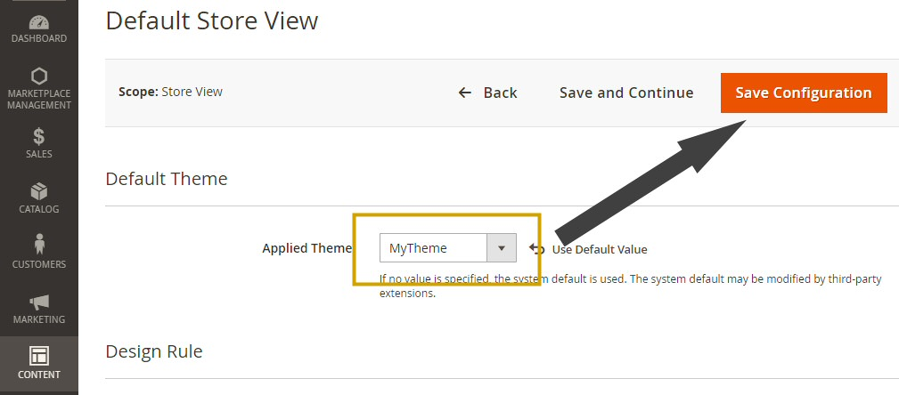
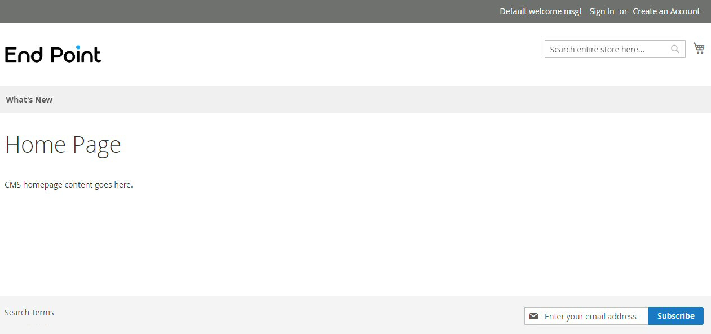

 [Photo](https://flic.kr/p/Se3vkA) by [Maria Eklind](https://www.flickr.com/photos/mariaeklind/), [CC BY-SA 2.0](https://creativecommons.org/licenses/by-sa/2.0/)


In my previous post, we went through the steps needed to <a href="/blog/2020/04/01/magento-2-creating-a-custom-module" target="_blank">create a custom module in Magento 2</a>. While modules consist on a set of functions to add new features to Magento, a theme controls how these features, and the entire website in general, will be displayed to the user. As stated in the <a href="https://devdocs.magento.com/guides/v2.3/frontend-dev-guide/themes/theme-overview.html" target="_blank">Magento guide</a>, a theme uses a combination of custom templates, layouts, styles and/or images to provide a consistent look-and-feel across a Magento store.

### Creating a new Magento 2 theme

To create a new theme, we can either inherit it from an existing default "parent" theme, or create a new standalone theme from scratch. For most cases, I would reccommend to use the first option. For this example, we will choose <a href="http://magento2.demo.ubertheme.com/" target="_blank">Luma</a> as our parent theme. The other option would be inheriting from the default "blank" theme.

Here's an initial task list to get our new theme ready:

* Creating a new directory for the theme
* Creating the registration.php script
* Creating the `theme.xml` information file
* Activating the new theme

#### Creating a new directory for the theme

While all our backend code should go in the `app/code` path, the frontend content is expected to go in `app/design`. And as our theme will only apply design changes to the frontend content, we should create the new directory for it under the path `app/design/frontend`. If we want to create a theme for the admin area instead, we need to create the directory inside the `app/design/adminhtml` path.

Let's create a directory named `EndPoint` (our vendor name, continuing with the example from our previous article) and a subdirectory inside it, `MyTheme`:

```bash
cd {website_root}
mkdir -p app/design/frontend/EndPoint/MyTheme
```

#### Creating the registration.php script

Similar to the file we created for our module, the purpose of the `registration.php` that we will create is telling Magento to register the new theme with the name and location we specify.
Our file will be located at `app/design/frontend/EndPoint/MyTheme/registration.php` and it should have the following content:

```php
<?php
\Magento\Framework\Component\ComponentRegistrar::register(
    \Magento\Framework\Component\ComponentRegistrar::THEME,
    'frontend/EndPoint/MyTheme',
    __DIR__
);
```

This way, Magento will know what path our theme will have.

#### Creating the theme.xml information file

Next step is to create our theme information file, where we will specify the theme name and Parent theme. So our `app/design/frontend/EndPoint/MyTheme/theme.xml` file should have the following content:

```xml
<?xml version="1.0"?>
<theme xmlns:xsi="http://www.w3.org/2001/XMLSchema-instance" xsi:noNamespaceSchemaLocation="urn:magento:framework:Config/etc/theme.xsd">
     <title>MyTheme</title>
     <parent>Magento/luma</parent>
 </theme>
```

<b>Optional</b>: If we want our theme to be easily distributed as a package, we can also create a `composer.json` file in the theme's root directory. The content for the file should be as follows, specifying the theme's description, dependencies, version and license types:

```json
{
    "name": "endpoint/mytheme",
    "description": "My Theme by End Point",
    "require": {
        "magento/theme-frontend-luma": "100.0.*",
        "magento/framework": "100.0.*"
    },
    "type": "magento2-theme",
    "version": "100.0.1",
    "license": [
        "OSL-3.0",
        "AFL-3.0"
    ],
    "autoload": {
        "files": [
            "registration.php"
        ]
    }
}
```

#### Activating the new theme

That was easy! We have everything we need to activate our new theme. Now we need to log in into our admin area and enable our theme. Once in the dashboard, we need to go to Content > Design > Configuration, edit our store view, and select our new theme from the dropdown list:



Magento will search for new themes every time we log in into the admin area, so our new theme will appear on the list automatically.

#### Adding custom content

We have the basic structure for our theme, but when enabled, it will look the same as its parent theme (Luma, in this case), since we didn't add any design rules or static files yet. Let's do some more things with our theme to change how it's displayed in the frontend:

* Creating a custom `etc/view.xml` file
* Adding a custom logo
* Adding static files (Javascript/CSS/images/fonts)
* Adding a custom layout

### Creating a custom view file

The `etc/view.xml` file controls many frontend configurations like the product thumbnail width, how the product image gallery is displayed, and the image magnifier tool among other things. To add our custom view file to our theme, we need to copy the existing file from our parent theme. For Luma, it will be located at `vendor/magento/theme-frontend-blank/etc/view.xml`. To copy the file, in our website root, we need to run:


```bash
mkdir -p app/design/frontend/EndPoint/MyTheme/etc
cp vendor/magento/theme-frontend-blank/etc/view.xml app/design/frontend/EndPoint/MyTheme/etc/view.xml
```

And then we can use our preferred text editor to change the values we want, like setting a custom size for the images in the category page grid:

```
  <image id="category_page_grid" type="small_image">
      <width>300</width>
      <height>300</height>
  </image>
```

### Adding a custom logo

Adding a logo to our theme is really simple. We just need to save our picture in SVG format inside our theme root as `web/images/logo.svg`. If we want to use a different filename or format for our logo, we will have to create a default layout file for our theme in the path `/Magento_Theme/layout/default.xml` inside our theme root with a content similar to this:

```
<page xmlns:xsi="http://www.w3.org/2001/XMLSchema-instance" xsi:noNamespaceSchemaLocation="urn:magento:framework:View/Layout/etc/page_configuration.xsd">
    <body>
        <referenceBlock name="logo">
            <arguments>
                <argument name="logo_file" xsi:type="string">images/custom_logo.png</argument>
                <argument name="logo_width" xsi:type="number">300</argument>
                <argument name="logo_height" xsi:type="number">200</argument>
                <argument name="logo_alt" xsi:type="string">Custom logo name</argument>
            </arguments>
        </referenceBlock>
    </body>
</page>
```

We can use different formats such as SVG, PNG or JPG. We can also use a custom width and height for the logo, and set a custom alternate text.

### Adding static files (Javascript/CSS/images/fonts)

All the static files should be located inside the `web` directory. Common static files include Javascript files, stylesheets, images and fonts. The Javascript files should be located at `web/js`, stylesheets at `web/css`, images at `web/images`, and our custom fonts should be located at `web/fonts`.

All the static files will be published as direct links, without any processing from Magento, at the `pub/static/frontend/EndPoint/MyTheme/en_US` path (the default language is en_US, we can change it for our theme if needed).

### Adding a custom layout

Finally, if we want to use the new assets we added and have custom content on different sections of our website, we need to extend or override the existing layouts from our parent theme.

For example, if we want to add a reference to a new stylesheet file we added, we need to extend the existing header layout from our parent theme. To do this, we will create a new layout file located at `Magento_Theme/layout/default_head_blocks.xml` inside our theme root:

```
<page xmlns:xsi="http://www.w3.org/2001/XMLSchema-instance" xsi:noNamespaceSchemaLocation="urn:magento:framework:View/Layout/etc/page_configuration.xsd">
  <head>
    <!-- Custom stylesheet -->
    <css src="css/mytheme.css"/>
  </head>
</page>
```

This way we will be adding a reference to a new file named `mytheme.css` that we have inside the `web/css` directory of our theme.

After we made all the desired changes to our theme, we will need to tell Magento to update the frontend. We need to deploy the new changes and clear the cache. We can achieve that by running, from our website root:

```bash
php bin/magento setup:static-content:deploy
php bin/magento cache:clean
```

This process can take some minutes to complete. After it's done, we can try to browse our website and see if the frontend changes are applied:



Of course, there's a lot more we can do from there, from extending or overriding layouts from modules (Magento or third-party) to bundling scripts or using LESS files for our custom styles... But that is material for new posts, so that's all for now! Please add any questions you might have below.