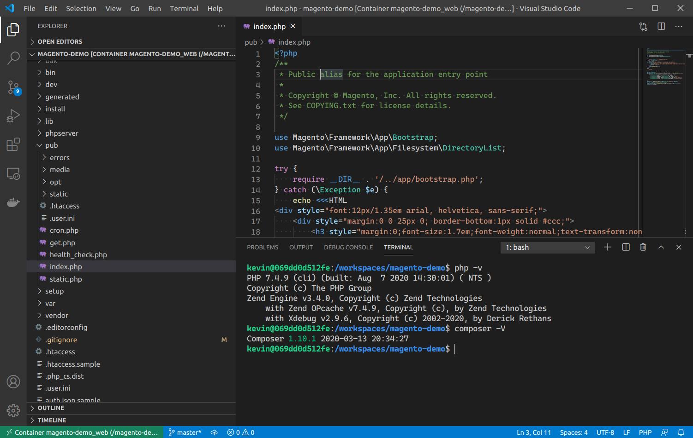
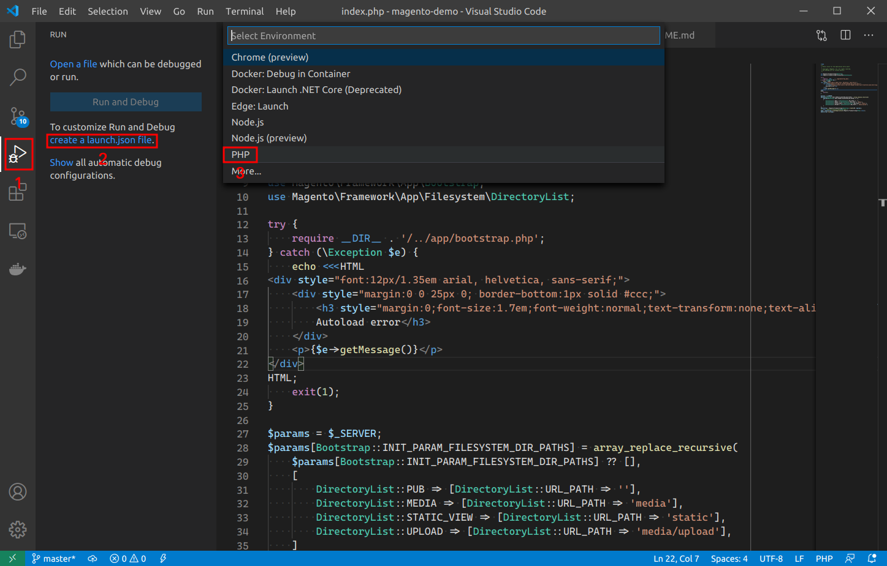
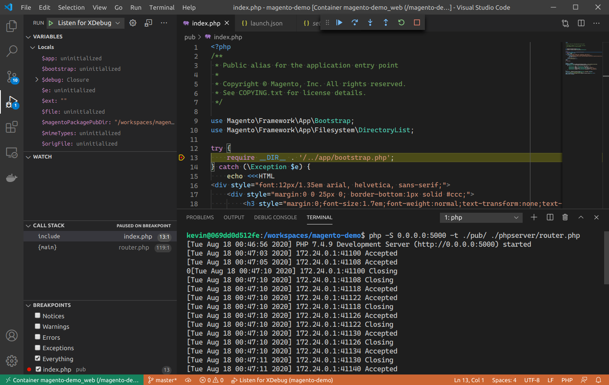

[Magento](https://magento.com/) is a complex piece of software, and as such, we need all the help we can get when it comes to developing customizations for it. A fully featured local development environment can do just that, but these can often times be very complex as well. It'd be nice to have some way to completely capture all the setup for such an environment and be able to get it all up and running quickly, repeatably... With a single command even. Well, [Docker](https://www.docker.com/) containers can help with that. And they can be easily provisioned with the [Docker Compose](https://docs.docker.com/compose/) tool.

In this post, we're going to go in depth into how to fully containerize a Magento 2.4 installation for development. Complete with its other dependencies: [Elasticsearch](https://www.elastic.co/) and [MySQL](https://www.mysql.com/). By the end of it, we'll have a single command that sets up all the infrastructure needed to install and run Magento, and develop for it. Let's get started.

## Magento 2.4 application components

The first thing that we need to know is what the actual components of a Magento application are. Starting with 2.4, [Magento requires access to an Elasticsearch](https://devdocs.magento.com/guides/v2.4/install-gde/prereq/elasticsearch.html) service to power catalog searches. Other than that, it's the usual suspects for most PHP applications. Here's what we need:

1. Mysql
2. Elasticsearch
3. A web server running the Magento application

In terms of infrastructure, this is pretty straightforward: This would cleanly translate into three separate machines talking to each other via the network. In the Docker world, each of these machines become containers. Since we need multiple containers for our infrastructure, things like Docker Compose can come in handy to orchestrate the creation of all that. So let's get to it.

## Creating a shared network

Since we want to create three separate containers that can talk to each other, we need to ask the Docker engine to create a network for them. This can be done with this self explanatory command:

```sh
docker network create magento-demo-network
```

`magento-demo-network` is the name I've chosen for my network but you can choose whatever is most appropriate.

You can run the following command to check your newly created network:

```sh
docker network ls
```

Output usually looks like this:

```sh
$ docker network ls
NETWORK ID          NAME                   DRIVER              SCOPE
bd562b9cf5a4        bridge                 bridge              local
adb9ec2365c5        host                   host                local
2dba8d97410e        magento-demo-network   bridge              local
c3473c60ed52        none                   null                local
```

There's our `magento-demo-network` network among other networks that Docker creates by default. 

## Containerizing MySQL

Getting a MySQL instance up and running is super easy these days thanks to Docker. There's already [an official image for MySQL](https://hub.docker.com/_/mysql) in [Docker Hub](https://hub.docker.com/) so we will use that. We can set it up with this command:

```sh
docker run -d \
  --name magento-demo-mysql \
  --network magento-demo-network \
  --network-alias mysql \
  -p 3306:3306 \
  -v magento-demo-mysql-data:/var/lib/mysql \
  -e MYSQL_ROOT_PASSWORD=password \
  -e MYSQL_USER=kevin \
  -e MYSQL_PASSWORD=password \
  -e MYSQL_DATABASE=magento_demo \
  mysql:5.7
```

And just like that, we have a running MySQL. Running `docker ps` can get you a list of currently running containers. The one we just created should show up there.

```sh
$ docker ps
CONTAINER ID        IMAGE               COMMAND                  CREATED             STATUS              PORTS                               NAMES
b73739ad5d66        mysql:5.7           "docker-entrypoint.s…"   22 seconds ago      Up 21 seconds       0.0.0.0:3306->3306/tcp, 33060/tcp   magento-demo-mysql
```

Let's go through each one of the options from that command now to understand it better.

- `docker run -d`: Runs the container in detached mode. This means that it's run in the background as a daemon. Control is returned to the console immediately.
- `--name magento-demo-mysql`: This is the name of our container. Normally, Docker will generate random names for containers. In this case, we want to give it a name to refer to it with other Docker commands.
- `--network magento-demo-network`: Tells Docker to run the container as part of the `magento-demo-network` network that we created earlier. This is the network that we will use for all of our containers.
- `--network-alias mysql`: This is the name of this container within the network. This is how other containers in the network will be able to reference it. We'll see that come to life a bit later.
- `-p 3306:3306`: Sets up our new MySQL container to allow connections over port `3306`. This is MySQL's default port, which Magento will use to connect to it. This basically says "requests coming over the network to port `3306` of this container are going to be handled by the service installed in this container that listens to port `3306`". That service happens to be MySQL.
- `-v magento-demo-mysql-data:/var/lib/mysql`: Creates a Docker volume. Specifically, we're setting this one up to store the data files from MySQL. We need to do this so that the data stored in our MySQL container is persisted across shutdowns. `magento-demo-mysql-data` is the name of the volume and `/var/lib/mysql` is the directory within the MySQL container where that volume is mounted. In other words, any files stored in that directory are going to be stored within the volume instead. The volume is stored by Docker in the host machine, outside the container. `/var/lib/mysql` is the default directory where MySQL stores databases.
- `-e MYSQL_ROOT_PASSWORD=password`: Is the password for the root user for MySQL. This is passed into the containerized MySQL via environment variables. Hence the `-e` option.
- `-e MYSQL_USER=kevin`: Creates a new login in MySQL with `kevin` as its username.
- `-e MYSQL_PASSWORD=password`: Sets the word `password` as the password for that `kevin` user.
- `-e MYSQL_DATABASE=magento_demo`: Creates a database named `magento_demo`.
- `mysql:5.7`: This is the image that we're using for our container. `5.7` specifies the version that we want to run. [The `mysql` image in Docker Hub](https://hub.docker.com/_/mysql) contains a few more versions. Or "tags", in Docker words.

### Connecting to this container

`docker ps` showed us that our container was running. We can also interact with it. Here are a couple of ways of doing it:

#### Connecting from within the container

The easiest way of connecting to the MySQL instance is by running `mysql` CLI client from within the container itself. You can do that with:

```sh
docker exec -it magento-demo-mysql mysql -u kevin -p
```

Here's how that command works:

- `docker exec -it` is used to run commands inside a container in interactive mode. Just what we need here in this case because we're running `mysql`, which is an interactive CLI.
- `magento-demo-mysql` is the name we gave our container in the `docker run` command from before via the `--name magento-demo-mysql` option. This is why it's useful to give names to containers: so we can use them in commands like this.
- `mysql -u kevin -p` is the command that's run within the container. This is just the usual way of connecting to a MySQL server instance using the `mysql` CLI client. We use `kevin` because that's what we set `MYSQL_USER` to when we created our container before.

After runnung the previous command, the console will ask you for your password. We set that to `password` via `MYSQL_PASSWORD` so that's what we need to type in. This will eventually result in the `mysql` prompt showing up. Run `show databases` to confirm that the `magento_demo` database that we specified via `MYSQL_DATABASE` got created. 

```sh
mysql> show databases;
+--------------------+
| Database           |
+--------------------+
| information_schema |
| magento_demo       |
+--------------------+
2 rows in set (0.00 sec)
```

You can `Ctrl + D` you way out from that when you're done exploring the containerized MySQL instance.

#### Connecting directly from the host machine

We can also connect to the MySQL instance runnig in the container, directly from our host machine. We can use:

```sh
mysql -h localhost -P 3306 --protocol=tcp -u kevin -p
```

> Note that it is required that the `mysql` CLI client is installed in the host machine for this to work.

Same as before, `mysql` will ask you for the password and, once typed in, it will give you its prompt.

## Containerizing Elasticsearch

Like MySQL, there's an official [Elasticsearch Docker image up in Docker Hub](https://hub.docker.com/_/elasticsearch). As a result, getting a working Elasticsearch insallation is a piece of cake. It's done with a command like this:

```sh
docker run -d \
  --name magento-demo-elasticsearch \
  --network magento-demo-network \
  --network-alias elasticsearch \
  -p 9200:9200 \
  -p 9300:9300 \
  -e "discovery.type=single-node" \
  elasticsearch:7.8.1
```

You can validate that the Elasticsearch is running with `curl -X GET "localhost:9200/_cat/health"`. That should return something like this:

```sh
$ curl -X GET "localhost:9200/_cat/health"
1597622135 23:55:35 docker-cluster green 1 1 0 0 0 0 0 0 - 100.0%
```

Alright! That was easy enough. Again, thanks to Docker, we have an application that's somewhat complex to set up, up and running in a matter of seconds.

Like before, let's dissect that command that we used. Very similar to the MySQL one, only with some Elasticsearch specific settings:

- `docker run -d`: Same as with the MySQL container, runs it in detached mode.
- `--name magento-demo-elasticsearch`: Gives the container a friendly name.
- `--network magento-demo-network`: Puts the container in the same network as the rest of our infrastructure.
- `--network-alias elasticsearch`: Is the name by which other containers in the network can refer to this contianer.
- `-p 9200:9200`: Opens port `9200` so that other containers within the network can talk to this one.
- `-p 9300:9300`: Same thing but for a different port.
- `-e "discovery.type=single-node"`: Sets up the `discovery.type` environment virable that the image uses to configure Elasticsearch with.
- `elasticsearch:7.8.1`: Specifies that our container will be running version `7.8.1` of Elasticsearch.

## Containerizing Magento

Now this is the step where things get a little bit more involved. Nothing crazy however, so let's get into it.

### The Dockerfile

There's no image of Magento 2 that would be able to get us up and running as quickly as with MySQL or Ealsticsearch. Not that I could find at least. So we're going to have to create our own. We can create our own images with the help of [Dockerfiles](https://docs.docker.com/engine/reference/builder/). A Dockerfile is, well, a file that contains all the specifications needed for a container. The Docker engine uses it to create images which can then be used as basis for running containers. Here's a Dockerfile for Magento 2.4 that I came up with:

```dockerfile
# /path/to/project/Dockerfile
# Our image is based on ubuntu.
FROM ubuntu

# Here we define a few arguments to the Dockerile. Specifically, the user, user id and group id for a new account that we will use to work as within our contianer.
ARG USER=docker
ARG UID=1000
ARG GID=1000

# Installing PHP, composer and all extensions needed for Magento.
RUN apt-get update && apt-get install -y software-properties-common curl

RUN add-apt-repository ppa:ondrej/php
RUN apt-get update && apt-get install -y php
RUN apt-get update && apt-get install -y \
    php-mysql php-xml php-intl php-curl \
    php-bcmath php-gd php-mbstring php-soap php-zip \
    composer

# Installing Xdebug for a better developer experience.
RUN apt-get update && apt-get install -y php-xdebug
RUN echo "xdebug.remote_enable=on" >> /etc/php/7.4/mods-available/xdebug.ini
RUN echo "xdebug.remote_autostart=on" >> /etc/php/7.4/mods-available/xdebug.ini

# Installing the mysql CLI client.
RUN apt-get update && apt-get install -y mysql-client

# Set up a non root user with sudo access
RUN groupadd --gid $GID $USER \
    && useradd -s /bin/bash --uid $UID --gid $GID -m $USER \
    # Add sudo support for the non-root user
    && apt-get install -y sudo \
    && echo $USER ALL=\(root\) NOPASSWD:ALL > /etc/sudoers.d/$USER\
    && chmod 0440 /etc/sudoers.d/$USER

# Use the non root user to log in as into the container
USER ${UID}:${GID}

# Set this as the default directory when we connect to the container.
WORKDIR /workspaces/magento-demo

# This is a quick hack to make sure the container has something to run when it starts, preventing it from closing itself automatically when created. You could also remove this and run the container with "docker run -t -d" to get the same effect. More on "docker run" further below.
CMD ["sleep", "infinity"]
```

Feel free to go through the comments in the file above for more details. But essentially, this Dockerfile describes what a machine ready to run Magento would look like. It's got PHP and all the necessary extensions, [Xdebug](https://xdebug.org/) and [Composer](https://getcomposer.org/). It also includes the `mysql` CLI client.

Importantly, it allows for creating a user account with sudo access. Later, we'll use this capability to create a user acocunt, inside the container that mimics the one we're using in our host machine. Efectively using the same user both inside and outside the container. The purpose of this is to make it possible to work on the Magento source code files from inside the container without having to deal with Linux permissions issues when we try to do the same from outside the container. That is, directly via the host machine.

### The image

Alright, now that we have our image defined in the form of our Dockerfile, let's create it. To do that, we go into our project directory, create a new file named `Dockerfile`...

```sh
cd /path/to/project
touch Dockerfile
```

Then save the contents from above into it, and finally run this command:

```sh
docker build \
  --build-arg USER=kevin \
  --build-arg UID=$(id -u) \
  --build-arg GID=$(id -g) \
  -t magento-demo-web .
```

Here's what this all means:

- `docker build`: Is the command to build images from Dockerfiles.
- `--build-arg USER=kevin`: Specifies the username for the account with sudo access that we will log into our container as. I've chosen `kevin` here but you should use the one you're logged in as in your own machine.
- `--build-arg UID=$(id -u)`: Uses the `id -u` to pass in the Id of the currently logged in user.
- `--build-arg GID=$(id -g)`: Uses the `id -g` to pass in the Group Id of the currently logged in user.
- `-t magento-demo .`: Specifies the name of the resulting image to be `magento-demo`. The `.` is a reference to the current working directory from where we're running the command, which is where our Dockerfile is located.

Run `docker image ls` and you should see our new home grown `magento-demo` image along with the other ones that we've downloaded from Docekr Hub:

```sh
REPOSITORY                                                  TAG                 IMAGE ID            CREATED             SIZE
magento-demo                                                latest              90d311df434f        22 minutes ago      452MB
mysql                                                       5.7                 718a6da099d8        12 days ago         448MB
ubuntu                                                      latest              1e4467b07108        3 weeks ago         73.9MB
elasticsearch                                               7.8.1               a529963ec236        3 weeks ago         811MB
```

### The container

Ok now that we have an image that's capable of running Magento. Let's put it to work by creating a container based on it. We do that with:

```sh
docker run -d \
  --name magento-demo-web \
  --network magento-demo-network \
  --network-alias web \
  -p 5000:5000 \
  -v ${PWD}:/workspaces/magento-demo \
  magento-demo-web
```

Line by line, this is telling Docker engine to:

- `docker run -d`: Run the container in detached mode. You could also add the `-t` argument which makes sure the container stays up and running even if there's no program or service running within it. We don't need that in this case though because we defined our Dockerfile with that nifty `sleep infinity` command.
- `--name magento-demo-web`: Set the name of our container to `magento-demo-web`.
- `--network magento-demo-network`: Make our container will part of the same network as the MySQL and Elasticsearch ones.
- `--network-alias web`: Set our container's name within the network.
- `-p 5000:5000`: Open port `5000` to access our soon-to-be running Magento app.
- `-v ${PWD}:/workspaces/magento-demo`: Create a new volume that makes our current working directory be the same as the `/workspaces/magento-demo` directory within the container. This is where we'll store all the Magento files. Binding these directories makes it possible to access and modify the Magento files both from the container and from the host machine. This just makes things easier and more convenient for development purposes.
- `magento-demo-web`: Name our container this way.

Running `docker container ls` will show a list of all running containers. Including the one we just created:

```sh
docker container ls
CONTAINER ID        IMAGE                 COMMAND                  CREATED             STATUS              PORTS                                            NAMES
4af35c42e0bb        magento-demo-web      "/bin/bash"              5 minutes ago       Up 5 minutes        0.0.0.0:5000->5000/tcp                           magento-demo-web
6c5ea65a7bd6        elasticsearch:7.8.1   "/tini -- /usr/local…"   2 hours ago         Up 2 hours          0.0.0.0:9200->9200/tcp, 0.0.0.0:9300->9300/tcp   magento-demo-elasticsearch
b73739ad5d66        mysql:5.7             "docker-entrypoint.s…"   3 hours ago         Up 3 hours          0.0.0.0:3306->3306/tcp, 33060/tcp                magento-demo-mysql
```

### Connecting to the container

With the container up and runing, we can connect to it with:

```sh
docker exec -it magento-demo-web bash
```

Which you may remember as the same command we've used before to connect to the MySQL container. Only this time we're using it to connect to our `magento-demo-web` container, referenced by the name we gave it, and running `bash` on it in order to open a shell.

After that, a prompt like this should show up:

```sh
kevin@4af35c42e0bb:/workspaces/magento-demo$
```

We're now inside our container. Notice how we're automatically taken to the `/workspaces/magento-demo`. This is just like we specified in our Dockerfile with the `WORKDIR` command. Feel free to `php -v` or `composer -V` to validate that the setup from our Dockerfile got all the way into our container:

```sh
kevin@4af35c42e0bb:/workspaces/magento-demo$ php -v
PHP 7.4.9 (cli) (built: Aug  7 2020 14:30:01) ( NTS )
Copyright (c) The PHP Group
Zend Engine v3.4.0, Copyright (c) Zend Technologies
    with Zend OPcache v7.4.9, Copyright (c), by Zend Technologies
    with Xdebug v2.9.6, Copyright (c) 2002-2020, by Derick Rethans
kevin@4af35c42e0bb:/workspaces/magento-demo$ composer -V
Composer 1.10.1 2020-03-13 20:34:27
```

### Talking to other containers in the network

We also need to validate that our containers are actually able to talk to each other via the network that we set up. If all went according to plan, still from within our `magento-demo-web` container, this command showld open a `mysql` session:

```sh
mysql -h mysql -u kevin -p
```

Notice how this time we don't use `localhost` or `127.0.0.1` to connect to our MySQL instance. This time, we use `mysql`. This is the network alias we gave out MySQL container, so this is how our `magento-demo-web` sees it. To `magento-demo-web`, the MySQL container is just another machine in the same network.

For the Elasticsearch container, same deal. We can do something like this to talk to it:

```sh
curl -X GET "elasticsearch:9200/_cat/health"
```

Again, from the perspective of `magento-demo-web`, this is just another machine in the network which it can reach by using the `elasticsearch` network alias that we gave it when creating it.

### Installing Magento in our container

Now that we have our environment ready for Magento. Let's install it. First order of business is to create the Composer project:

```sh
composer create-project --repository-url=https://repo.magento.com/ magento/project-community-edition ./install
```

If you're familiar with Composer, then this should look very familiar to you. This command will download all the magento files as specified by the `magento/project-community-edition` project from the `https://repo.magento.com/` repository. There are a few gotchas though:

First, Magento is not openly available to download just like that. As such, Composer will ask for authentication in order to do so. Follow [this guide](https://devdocs.magento.com/guides/v2.4/install-gde/prereq/connect-auth.html) to obtain the authentication keys from the Magento Marketplace. When Composer asks for a "Username", type in the "Public Key"; when it asks for "Password", type in the "Private Key".

Second, you'll notice that I specified `./install` at the end of that command. This is where all the files will be downloaded. I've chosen this (i.e. an `install` directory inside our current one) because `composer create-project` will refuse to download the files in a directory that's not empty. Ours isn't, because we've got our Dockerfile in it. But that's nothing to worry about, once composer finishes downloading everything, we'll just copy the files over to their rightful location at `/workspaces/magento-demo`. You can do so with some Linux sorcery like this one:

```sh
(shopt -s dotglob; mv -v ./install/* .)
```

Ok this Composer operation will take a good while, but when it's done, make sure to move all the contents of `./install` into `/workspaces/magento-demo`. We now need to actually "install" Magento. We do it with this command:

```sh
bin/magento setup:install \
  --base-url=http://localhost:5000 \
  --db-host=mysql \
  --db-name=magento_demo \
  --db-user=kevin \
  --db-password=password \
  --admin-firstname=admin \
  --admin-lastname=admin \
  --admin-email=admin@admin.com \
  --admin-user=admin \
  --admin-password=admin123 \
  --language=en_US \
  --currency=USD \
  --timezone=America/New_York \
  --use-rewrites=1 \
  --elasticsearch-host=elasticsearch \
  --elasticsearch-port=9200
```

Even if you have never installed Magento before, the command from above should be pretty straightforward. An interesting thing to note is how we've set up our database and Elasticsearch settings here:

```sh
  --db-host=mysql \
  --db-name=magento_demo \
  --db-user=kevin \
  --db-password=password \
```

and 

```sh
  --elasticsearch-host=elasticsearch \
  --elasticsearch-port=9200
```

`--db-host` is the hostname of the "machine" where the MySQL server is running. We use our container's network alias here. `--db-name` is the name of the databse that we created when initializing our container via the `MYSQL_DATABASE` environment variable. `--db-user` and `--db-password` are the credentials for the login that we created in the same manner. `--elasticsearch-host` is the network alias of our Elasticsearch container, and finally `--elasticsearch-port` is the port that we configured it to listen to.

As you can see, these are the same settings that we used to configure our MySQL and Elasticsearch containers. So make sure to do the same if you've been following along and decided to go with different values.

Once that command is done, we're ready. We have a working Magento. Try it our by running...

```sh
php -S 0.0.0.0:5000 -t ./pub/ ./phpserver/router.php
```

And navigating to `localhost:5000` in your browser of choice. You should see your empty Magento homepage.

### Optional: Installing the sample data

If you're planning on developing some custom extension to Magento, or just play with it to get to know it better, you may want to add some sample data to it. Luckily, the Magento devs have graciously provided such a thing in the form of a Composer package. If you want, you can install it with this recipe:

```sh
bin/magento sampledata:deploy
bin/magento setup:upgrade
bin/magento indexer:reindex
bin/magento cache:flush
```

`bin/magento sampledata:deploy` will also ask you for your Magento Makerplace keys so have them ready.

So turn off the PHP built in server, run these, wait a good while, and fire the built in server once more. Your Magento app should now have catalog and all sorts of other data loaded in.

## Composing it all together

Now that was a lot. It was much easier than having to set everything up from scratch without Docker, but still, I promised a minimal setup overhead. A single command. With Docker Compose we can do just that.

For containers, the usual workflow is a three step process: 

1. Create the Dockerfile (sometimes omitted if we have a readily available image like it was the case with MySQL and Elasticsearch).
2. Create or download an image.
3. Run the container.

Docker Compose can help us by capturing all the settings needed to create containers in a single file; which then can be taken by a CLI tool (i.e. `docker-compose`) and it can set up the complete infrastructure. This single file is named `docker-compose.yml` and this is what it may look like for our current setup:

```yml
version: "3.8"

# Listing our three containers. Or "services", as known by Docker Compose.
services:
    # Defining our MySQL container.
    # "mysql" will be the network alias for this container.
    mysql:
        image: mysql:5.7
        container_name: magento-demo-mysql
        networks:
            - magento-demo-network
        ports:
            - "3306:3306"
        volumes:
            - magento-demo-mysql-data:/var/lib/mysql
        environment:
            MYSQL_ROOT_PASSWORD: password
            MYSQL_USER: kevin
            MYSQL_PASSWORD: password
            MYSQL_DATABASE: magento_demo

    # Defining our Elasticsearch container
    # "elasticsearch" will be the network alias for this container.
    elasticsearch:
        image: elasticsearch:7.8.1
        container_name: magento-demo-elasticsearch
        networks:
            - magento-demo-network
        ports:
            - "9200:9200"
            - "9300:9300"
        environment:
            discovery.type: single-node

    # Defining our custom Magento 2 container.
    # "web" will be the network alias for this container.
    web:
        # The build section tells Docker Compose how to build the image.
        # This essentially runs a "docker build" command.
        build:
            context: .
            dockerfile: Dockerfile
            args:
                USER: kevin
                UID: 1000
                GID: 1000
        container_name: magento-demo-web
        networks:
            - magento-demo-network
        ports:
            - "5000:5000"
        volumes:
            - .:/workspaces/magento-demo

# The volume that is used by the MySQL container
volumes:
    magento-demo-mysql-data:

# The network where all the containers will live
networks:
    magento-demo-network:
```

As you can see, most of the `docker-compose.yml` is more or less rewriting the `docker run` commands in a YML format. With the exception of the `web` container/service which includes a `build` section that reflects the `docker build` command that was used to take the Dockerfile and turn it into an image.

If you want to try it out, make sure to remove all the infrastructure we've created, to avoid any conflicts. You can do so from your host machine with these:

```sh
docker container rm -f magento-demo-web magento-demo-elasticsearch magento-demo-mysql
docker image rm magento-demo-web
docker network rm magento-demo-network
docker volume rm magento-demo-mysql-data
```

Make sure you're in the directory where the Dockerfile lives in the host machine. Then create a new `docker-compose.yml` file and put all of the content above into it. Finally, run:

```sh
docker-compose up -d
```

This will take a little while, but by the end of it, you'll have a complete infrastructure with the three containers that we've created step by step throughout this article. With the `docker-compose.yml` file, `docker-compose up` essentially takes care of running all of our `docker build` and `docker run` commands.

The `-d` option means that the the command will run in the background and give you back control of your console. You can also run it without it if you want the console to show the logs from the containers.

You can still see the logs even in detached mode with:

```sh
docker-compose logs
```

You can also inspect the running contianers. For that, you can use:

```sh
docker-compose ps
```

Output will look something like this:

```sh
$ docker-compose ps
           Name                         Command               State                       Ports                     
--------------------------------------------------------------------------------------------------------------------
magento-demo-elasticsearch   /tini -- /usr/local/bin/do ...   Up      0.0.0.0:9200->9200/tcp, 0.0.0.0:9300->9300/tcp
magento-demo-mysql           docker-entrypoint.sh mysqld      Up      0.0.0.0:3306->3306/tcp, 33060/tcp             
magento-demo-web             sleep infinity                   Up      0.0.0.0:5000->5000/tcp                        
```

Notice how `docker-compose ps` gives us our container names just as we specified them in the `docker-compose.yml` file.

`docker-compose` has many other utilities. Check them out with `docker-compose --help`.

Now, same as before, we still need to open a terminal into our Magento container to run some installation commands on it. To do so, we can run the following command:

```sh
docker-compose exec web bash
```

Notice how with `docker-compose` we refer to the container via its service name. That is, the name we gave the container under the `services` section of `docker-compose.yml`.

Of course, we can still use the same command that we used before, when we created our container directly with `docker`:

```sh
docker exec -it magento-demo-web bash
```

Now, once inside our container we need to install Magento again. Remember that we wiped out all the infrastructure we created manually, so these are fresh new containers; akin to new "machines".

If you were running this from scratch you would just go ahead and do...

```sh
composer create-project --repository-url=https://repo.magento.com/ magento/project-community-edition ./install
```

and

```sh
(shopt -s dotglob; mv -v ./install/* .)
```

In this case however, we already have all the Magento files in our directory. So we can save time and skip this step. We can reuse these files and just run our `bin/magento setup:install`.

This is a new Magento installation though, so we do need to remove the config file before `setup:install`'ing. So go ahead and...

```sh
rm app/etc/env.php
```

...then:

```sh
bin/magento setup:install \
  --base-url=http://localhost:5000 \
  --db-host=mysql \
  --db-name=magento_demo \
  --db-user=kevin \
  --db-password=password \
  --admin-firstname=admin \
  --admin-lastname=admin \
  --admin-email=admin@admin.com \
  --admin-user=admin \
  --admin-password=admin123 \
  --language=en_US \
  --currency=USD \
  --timezone=America/New_York \
  --use-rewrites=1 \
  --elasticsearch-host=elasticsearch \
  --elasticsearch-port=9200
```

After a while, Magento will be fully installed in our new infrastructure created by Docker Compose and ready to be fired up via the PHP built in server:

```sh
php -S 0.0.0.0:5000 -t ./pub/ ./phpserver/router.php
```

## Bonus: Interactive debugging with Visual Studio Code

So this is a fully functioning Magento installation with files that we can edit to our hearts' content. In terms of a "fully featured" development environment however, we need to spruce it up a bit.

So install VS Code from https://code.visualstudio.com/ and install the [Remote Development plugin](https://marketplace.visualstudio.com/items?itemName=ms-vscode-remote.vscode-remote-extensionpack).

Open a new VS Code window and open the command palette with `Ctrl + Shift + P`. In there, type in `Remote-Containers: Attach to Running Container...` and press `Enter`. In the menu that shows up, select our `magento-demo-web` container.

That will result in a new VS Code instance that is connected to the container. Open an integrated terminal in VS Code and you'll see:



Now, install the [PHP Debug extension](https://marketplace.visualstudio.com/items?itemName=felixfbecker.php-debug) so that we can take advantage of that Xdebug that we installed in our container via our Dockerfile.

Create a new launch configuration for interactive debugging with PHP by clicking on the "Run" button in the action bar to the left (`Ctrl + Shift + D` also works). Click the "create a launch.json file" link in the pane that appears. Then, in the resulting menu at the top of the window, select the "PHP" option. Here's a screen capture for guidance:



That will result in a new `.vscode/launch.json` file created that contains the launch configuration for the PHP debugger.

Now let's put a breakpoint anywhere, like in line 13 of the `pub/index.php` file; press the "Start debugging" button in the "Run" pane, near the top left of the screen (making sure that the "Listen to XDebug" option is selected), and start up the PHP built in server from VS Code's integrated terminal with `php -S 0.0.0.0:5000 -t ./pub/ ./phpserver/router.php`. Now navigate to `localhost:5000` in your browser and enjoy VS Code's interactive debugging experience:



Whew! That was quite a bit. In this blog post, we've done a deep dive into how to set up all the pieces of a Magento application using Docker containers: MySQL, Ealsticsearch and Magento itself. Then, we captured all that knowledge into a single `docker-compose.yml` file which can be run with a single `docker-compose up` command to provision all the infrastructure in our local machine. As a cherry on top, we set up interactive debugging of our brand new Magento application with VS Code. Thanks to the safety net provided by these tools, I feel like I'm ready to really dig into Magento and start developing customizations, or debugging existing websites. If you've been following along this far, dear reader, I hope you do too.
