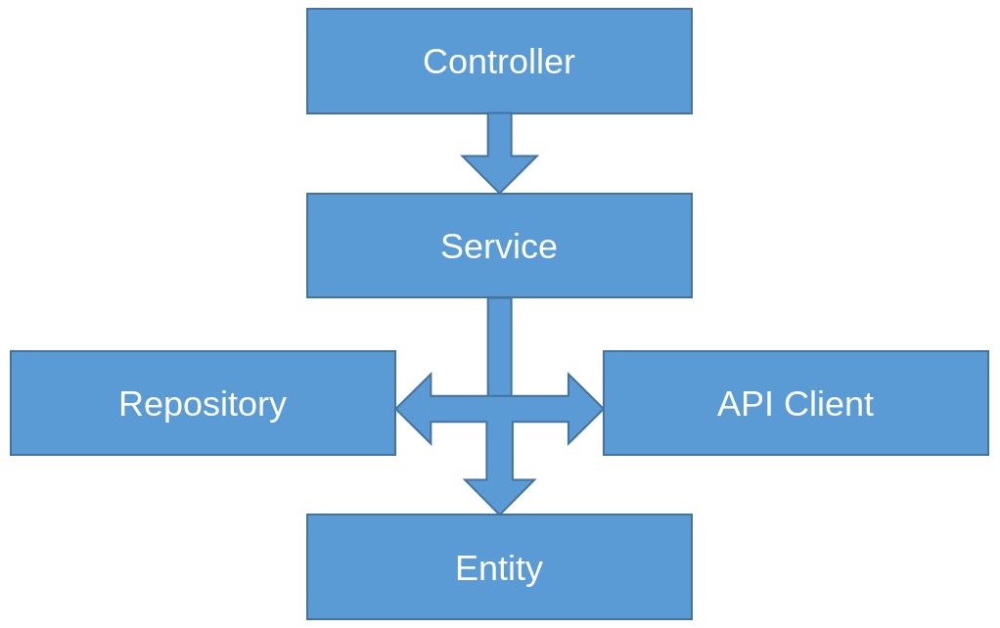

# An introduction to automated testing for web applications by example with Symfony

Testing is an immense topic in software engineering. A lot has been written and a lot of experience has been collected about it by the greater software development community. There are many types of testing that can be done, many techniques and approaches, philosophies and strategies.

With a big topic such as this, it would be futile to try to touch on every aspect of it in an article like this. Instead, I'll try to take a pragmatic approach and discuss a testing strategy that I've found success with in the past, and the amount of testing with which I feel comfortable putting code into production. This article could also serve as a sort of introduction to automated testing, where we use the [Symfony framework](https://symfony.com/) as a vehicle to explore various types of testing without really diving too deep into edge cases or framework specifics, but instead, leaning more into the concepts and design decissions that go into writing them. Still, we will make sure to have a running and competent test suite by the end of it.

So we're going to talk about automated testing, which in its own right is a very important part of the bigger discipline of software testing; and a topic that, as a developer (and as such, responsible for implementing this type of tests), I'm passionate about.

Let's get started.

# The types of tests that we're going to write

For web applications, as far as automated tests go, there are three categories which I think are essential to have and complement each other very well:

- [Unit tests](https://en.wikipedia.org/wiki/Unit_testing): This is the most numerous, low level and, in my opinion, the most important type of developer tests. Unit tests don't only make sure that the system does what it is supposed to do, but also that it is correctly factored, where individual components are decoupled. They need to be that way because unit tests focus on exercising specific classes and methods running in complete isolation, which becomes harder if the class you want to test is very tightly coupled with its dependencies/collaborators. These tests validate the behavior of basic programing constructs like classes and the algorithms within them. They need to be small and fast, as their intent is to be run several times by developers as they implement features and change existing ones.

- [Integration tests](https://martinfowler.com/bliki/IntegrationTest.html): These tests go one level of abstraction higher when compared to unit tests. They test that independently developed components work properly together. In the context of web applications, I like my integration tests to focus primarily on how the system interacts with external components. In this article, we're going to use integration level tests to validate functionality that has to do with interaction with a database and an external Web API. 

- [Functional tests](https://en.wikipedia.org/wiki/Functional_testing): These are the tests at the highest level of abstraction. These try to closely mimic the user's experience with the system by interacting with it as a user would. In terms of a web application, this means making HTTP requests, clicking buttons, filling out and submitting forms, inspecting HTML results, etc. As these tests exercise the complete system end to end, they are allowed to be a bit slower. This is not an issue because they are not run as frequently as unit tests.

If we can build an automated tests suite that provides good coverage, and exercises the system at these three levels, I would feel confident that the [system under test](https://en.wikipedia.org/wiki/System_under_test) can work properly in production. An added bonus is that with tests like these, we would have a live documentation of the system, the features it provides and, to an extent, how it works.

Virtually all serious software development ecosystems have at least one automated testing framework or library which we can leverage to write our tests. For our purposes in this article, we're going to be using the Symfony PHP framework which integrates beautifully with [PHPUnit](https://phpunit.de/) to provide developers with an effective, and even fun way to write tests.

# Getting to know the system under test

In order to help illustrate the topic by showing practical examples, I've prepared a simple weather app. The app is very straightforward. It only offers one feature: it will allow the user to see the current weather of a given city in the US. It does this by presenting a form where people can type in a city and a state, submit it, and get their information back.

The app obtains this information by contacting the [OpenWeatherMap Web API](https://openweathermap.org/). It also stores all requests in a database for posterity.

The site is a typical Symfony web app. It uses the [MVC](https://en.wikipedia.org/wiki/Model%E2%80%93view%E2%80%93controller) pattern and [Domain Driven Design](https://martinfowler.com/bliki/DomainDrivenDesign.html) concepts like [entities](https://martinfowler.com/bliki/EvansClassification.html), [repositories](https://martinfowler.com/eaaCatalog/repository.html) and [services](https://martinfowler.com/bliki/EvansClassification.html). Here's a diagram explaining the static structure of the app:



For a simple app like this, our entities are litlle more than containers for our data, the repositories take care of encapsulating the database access logic, and the services contain the logic that leverages the other objects to fulfill our business requirements.

The front end, as you'll see, is super simple. Not really any client side JavaScript logic to speak of. So this is more of an old-school, back end only app. Good enough for what we're trying to do here though.

So our only use case is the current weather request. We do have, however, a couple alternate scenarios within that use case. First, if the user types in an invalid US state code, the app will show a validation error. Second, if the user inputs a city that does not exist (or, more specifically, one that the OpenWeatherMap Web API can't find), the app will show another error message.

To get a better idea of how the classes interact with each other, here's an sequence diagram detailing how the app serves the main weather query scenario:


As you can see, the controller receives the request and calls upon the service class to validate the input and retrieve the information for the city specified by the user. Then, the service takes care of orchestrating the other objects like entities, repositories and other services in order to fulfill the request and return back the weather information that eventually gets rendered with the template.

You can explore the source code for our demo app here: https://github.com/megakevin/end-point-blog-automated-testing-with-symfony. The interesting files are under the `src` and `template` directories. Their contents should be self explanatory: `src/Controller` contains our controller, `src/Service` contain the service classes, and so on.

If you want to run it, you need to have installed [PHP](https://www.php.net/), [Composer](https://getcomposer.org/), the [Symfony CLI](https://symfony.com/download) and these extensions: php-sqlite3, php-xml, php-curl.

> If you like [Docker](https://www.docker.com/), there's a Dockerfile in the repo that you can use to fire up a container ready for running the app.

Once you've got all that set up, the app can be run by:

1. Cloning the git repo with `git clone git@github.com:megakevin/end-point-blog-automated-testing-with-symfony.git`.
2. `cd` into the directory that was just created and install the project's dependencies with `composer install`.
3. Initialize the database with `bin/console doctrine:schema:create`.
4. Fire up the application with `composer serve`.
5. Go to `localhost:3000`.

You should now be able to see something like this:


Ok now that we understand the system under test, what it does and how it works, we're ready to test it.

# Unit tests

## Surveying a class to write unit tests for it

I'd like to start by looking into the simplest kind of tests that we need to write for this app. Those would be unit tests for our entity classes. These tests are simple because the classes that they exercise are simple as well. If you look at our `Weather` and `WeatherQuery` classes inside `src/Entity` you'll see that they contain little more than some fields with their corresponding accessors and some convenience factory methods. They also don't have any dependencies, which is convenient because that's one less thing for our [test fixtures](https://en.wikipedia.org/wiki/Test_fixture) to worry about.

So, the first step that I always take is inspect the class that I'm about to test, to try and determine what's interesting from a testing perspective. I try to think about what's the main responsibility of the class, what sort of logic is actually adding value, what things could be broken inadvertently by other developers, what potential changes in the code would I like the test suite to alert developers of (by failing tests!), what features would benefit from having their API captured/documented in the form of an automated test. I ask myself these questions because often times it is not feasible to achieve 100% code coverage with unit tests (or with any kind of tests, for that matter). So, in those cases when we need to be strategic as to what tests we write, I try to write those that will add the most value. When faced with the reality of limited resources, I try to approach these things from a "bang for the buck" angle.

With that in mind, if we look at our `WeatherQuery` class, here are the things that come to my attention:

**First**, there are some fields annotated with validation logic. That's the `@Assert` comments on top of the field definitions. For example:

```php
/**
* @ORM\Column(type="string", length=255)
* @Assert\NotBlank(message="The city should not be blank.")
* @Assert\Type("string")
*/
private $city;
```

There are a few more. It'd be interesting to test those validation rules.

**Second**, for every field, there are accessor methods defined as well. That is, getters and setters like these:

```php
public function getState(): ?string
{
    return $this->state;
}

public function setState(string $state): self
{
    $this->state = $state;

    return $this;
}
```

These methods are very simple. If we were going for 100% coverage, we may have wanted to exercise those accessors. Being the strategic developers that we are though, I think we can ignore those for now. The logic is very simple, not really a lot of oportunity for things to go wrong here.

These types of methods become even less relevant in other languages like [C#](https://docs.microsoft.com/en-us/dotnet/csharp/programming-guide/classes-and-structs/properties) or [Ruby](https://ruby-doc.org/docs/ruby-doc-bundle/UsersGuide/rg/accessors.html) which support accessors as language level constructs. Testing those would be a moot point in those languages, since it would mean testing language/framework features, and not code that we own. There's no good reason to do that.

**Third**, there's a convenience factory method defined at the bottom of the class. It looks like this:

```php
public static function build(string $city, string $state): WeatherQuery
{
    $city = ucwords($city);
    $state = strtoupper($state);

    $weatherQuery = (new WeatherQuery())
        ->setCity($city)
        ->setState($state)
        ->setCreated(new DateTime())
    ;

    return $weatherQuery;
}
```

This `build` method has some interesting logic to it. There's some pre-processing that happens to the input parameters. It'd also be interesting for a test to exercise that the resulting object is correctly constructed.

## Deciding what tests to write

Ok so by analyzing our class we've identified parts of it that are interesting to test. We want to test the validation logic and the `build` method.

Let's start with the build method as that one's easier.

Now that we've identified the unit that we will test, we need to come up with test cases that exercise it in various ways. Looking at `build`'s code, line by line, I can come up with a few interesting test cases. Here's my thought process:

The first thing that I notice is that the method takes two parameters, city and state, and does this with them:

```php
$city = ucwords($city);
$state = strtoupper($state);
```

So that's something that the test suite should validate, that these values get processed like this.

There's also this part here where the object to return gets constructed:

```php
$weatherQuery = (new WeatherQuery())
    ->setCity($city)
    ->setState($state)
    ->setCreated(new DateTime())
;
```

This code is taking the parameters and assigning them to fields in the object. That'd be something interesting to validate. There's also a "created" field that gets initialized with the current date and time. Also interesting.

Having seen that, I can come up with this set of test cases for the `build` method:

- Test that it assigns the parameters to the correct fields in the resulting object.
- Test that it capitalizes each word in the city.
- Test that it capitalizes the state.
- Test that it sets the current moment as the "created" field in the resulting object.

## Tactics for writing the unit tests

I think that this addresses the main concerns of this method. So now let's write that in PHP with PHPUnit.

### Where to put them and what to name them

In the demo application that hopefully you've downloaded and explored, we write our tests under the `tests` directory. This is the default location that Symfony gives us for our tests and I think it's a good one. For our unit tests, we will put them in `tests/unit`. Tests for this class in particular go in the `tests/unit/Entity/WeatherQueryTest.php` file.

Notice our naming and file location convention. The name of the file that contains a given class' test cases is the same as the class itself, only with the word `Test` as a suffix. We've also made sure to mimic the project's `src` directory structure in our `tests/unit` directory. So, in this example, the `WeatherQuery` class is located in `src/Entity/WeatherQuery.php`. that means that its tests should live in `tests/unit/Entity/WeatherQueryTest.php`. Following this convention keeps things simple and easy to navigate and maintain.

### What a PHPUnit test class looks like

PHPUnit makes writing tests easy. A collection of tests are defined as a series of methods inside a class that extends the `PHPUnit\Framework\TestCase` class. Here's what our `WeatherQueryTest.php` file looks like:

```php
namespace App\Tests\Unit\Entity;

use PHPUnit\Framework\TestCase;

// ...

class WeatherQueryTest extends TestCase
{
    // build
    public function testBuildAssignsTheParametersToTheCorrectFields()
    {
        // ...
    }

    // ...
}
```

Notice how the test class name is, again, the same name of the class under tests, suffixed with the word `Test`. Notice how it extends from the `TestCase` class and notice how our test methods (aka, test cases) all begin with the word `test`. This is necessary for PHPUnit. This is how we signal to it that this is, in fact, a test case that it needs to run.

### How to name the individual test methods

Another important thing to note is the naming convention that we're using here for our test methods. Remember the test cases that we came up with above:

- Test that it assigns the parameters to the correct fields in the resulting object.
- Test that it capitalizes each word in the city.
- Test that it capitalizes the state.
- Test that it sets the current moment as the "created" field in the resulting object.

These are wordy descriptions of exactly what the test cases are about. Just by reading these, we are able to be able to get a good idea of what the purpose of the test case is, and what's its expected outcome. For the same reasons of readability and self documentation, the names of our test methods in the actual test suite implementation need to be as close to that as possible. I've come up with these:

- `testBuildAssignsTheParametersToTheCorrectFields`
- `testBuildCapitalizesTheGivenCityParameter`
- `testBuildCapitalizesTheGivenStateParameter`
- `testBuildSetsTheCurrentMomentAsTheCreatedField`

They begin with the word `test` in order to fulfill PHPUnit's requirements. Then, they include as many details as possible on what they are about.

### The anatomy of a test case

When it comes to actually writing the tests, I put great focus on making them as easy to understand as possible. Test cases do not only serve the purpose of validating system behavior. They also can serve as a live documentation of the system's features, and, in the case of unit tests, its inner workings. To be able to fulfill that purpose, tests need to be easy to read, navigate, and understand.

That's why I always like to call attention to the general three steps that almost every test follows: "Setup", "Exercise" and "Verify". Or, as I like to call them: "Arrange", "Act" and "Assert". So the first thing I do is add those three as comments in the test method body:


```php
public function testBuildAssignsTheParametersToTheCorrectFields()
{
    // Arrange
    // Act
    // Assert
}
```

"Arrange" is the step where we set up our test fixture. That is, we configure the world around the unit under test, the input, dependencies, etc; so that we can control all the variables that go into the execution of the unit.

"Act" is quite simply where we have our unit under test be executed.

"Assert" is where we verify that the unit under test behaved correctly. That it met the test case's expectations. We normally do this by checking the output of the method or some other side effect that its execution causes.

> In the [Behavior Driven Development](https://en.wikipedia.org/wiki/Behavior-driven_development) world, "Given", "When" and "Then" are parallels for these. You may see that terminology used as well. The spirit is the same.

Usually the next most obvious step is Act. This example is like that: we just need to call our `build` method and capture its output. Adding that, our test method would look like this now:

```php
public function testBuildAssignsTheParametersToTheCorrectFields()
{
    // Arrange
    // Act
    $result = WeatherQuery::build($testCity, $testState);
    // Assert
}
```

By writing our Act portion, we discovered that we need parameters. AKA input values. That's what the Arrange step is for:

```php
public function testBuildAssignsTheParametersToTheCorrectFields()
{
    // Arrange
    $testCity = 'MyCity';
    $testState = 'ST';

    // Act
    $result = WeatherQuery::build($testCity, $testState);

    // Assert
}
```

Finally, we need to actually validate that the `build` method did what we expected. We do that by writing some assertions. What did we expect it to do though? Well, the name of the test method has the answer: we expect it to "assign the given parameters into the correct fields of the resulting object". In PHPUnit, we do it like so:

```php
public function testBuildAssignsTheParametersToTheCorrectFields()
{
    // Arrange
    $testCity = 'MyCity';
    $testState = 'ST';

    // Act
    $result = WeatherQuery::build($testCity, $testState);

    // Assert
    $this->assertEquals($testCity, $result->getCity());
    $this->assertEquals($testState, $result->getState());
}
```

PHPUnit has an extensive number of different types of assertion methods. In this case, we use one of the simpler ones: `assertEquals`. This method will compare two values and report the test as a failure if they are different. It will report it as a success if they are equal.

In this test case, we want PHPUnit to validate for us that the resulting object's `city` field is the same that we passed in. Same of the object's `state` field.

And that does it for our first unit test! We've prepared some input, called the unit that we wanted to test, and inspected its state to validate that it did what it was supposed to do.

### Running PHPUnit tests

Symfony also makes it easy to run unit tests. By default, [Symfony projects created with either `symfony new my_project_name --full` or `composer create-project symfony/website-skeleton my_project_name`](https://symfony.com/doc/current/setup.html#creating-symfony-applications) already include the PHPUnit library and the configuration necessary to execute unit tests like this one. You can run it, along with all the others in this test class with this command.

```
bin/phpunit tests/unit/Entity/WeatherQueryTest.php
```

This will result in something like this:

```
$ bin/phpunit tests/unit/Entity/WeatherQueryTest.php
PHPUnit 7.5.20 by Sebastian Bergmann and contributors.

Testing App\Tests\Unit\Entity\WeatherQueryTest
........                                                            8 / 8 (100%)

Time: 64 ms, Memory: 8.00 MB

OK (8 tests, 9 assertions)
```

Notice how we just call the PHPUnit executable and pass it the file name that contains the tests that we want to run.

I prefer the [TestDox](https://en.wikipedia.org/wiki/TestDox) style output though, so I like to use this instead:

```
bin/phpunit --testdox tests/unit/Entity/WeatherQueryTest.php
```

Which gives us:

```
$ bin/phpunit --testdox tests/unit/Entity/WeatherQueryTest.php
PHPUnit 7.5.20 by Sebastian Bergmann and contributors.

Testing App\Tests\Unit\Entity\WeatherQueryTest
App\Tests\Unit\Entity\WeatherQuery
 ✔ Build assigns the parameters to the correct fields
 ✔ Build capitalizes the given city parameter
 ✔ Build capitalizes the given state parameter
 ✔ Build sets the current moment as the created field
...

Time: 68 ms, Memory: 8.00 MB

OK (8 tests, 9 assertions)
```

And this is where us giving those really long and detailed names to the test methods pays off. Now running a test suite results in output that reads in plain English and serves as a specification of sorts on how a given class works. Fulfilling the automated tests suite's secondary objective of serving as live documentation for the system.

### Other interesting details

Now that we've discussed my thought process for writing this first unit test, the rest of the `build` unit tests should be pretty self explanatory. They all follow the same pattern, the only difference is the Arrange and Assert parts, which change according to what the particular tests's purpose is.

For instance, notice how the `testBuildCapitalizesTheGivenCityParameter` test passes the `build` function `'my city'` as the value for the city parameter. Then, it asserts that the return object's property was set to `My City`. Thus, assuring that the `$city = ucwords($city);` line in the `build` method's implementation is working properly. If somebody changes this by mistake, the test will break and let them know that they have to fix it.

Another interesting test case is this one: `testBuildSetsTheCurrentMomentAsTheCreatedField`. Here, we need to assert that the `WeatherQuery` object returned by the `build` method has its "created" field set to the current moment in time. However, timestamps are so precise, that one obtained before calling the method, and one obtained inside it, are different. We still need to assert equality though. So, to deal with that, we use this variation of the `assertEquals` assertion:

```php
$this->assertEquals(
    (new DateTime())->getTimestamp(),
    $result->getCreated()->getTimestamp(),
    '', 1
);
```

This one tests for equality, but with a certain allowed difference. If the difference is within this margin of error, then the assertion deems that the two values are equal. Just what we need in this case. This basically says: "assert that the current timestamp and the resulting object's timestamp are 'pretty much' the same". That's as good a job as PHPUnit can do to for that assertion. Luckily, that's good enough for us. 

### Testing behavior with varying input

Ok now we've tested one piece of functionality defined within the `WeatherQuery` class. There is something else to test though, the validation rules. The class has several validation rules defined as annotations. We are able to define validation rules like this thanks to [Symfony's Validator component](https://symfony.com/doc/current/validation.html). To validate an object against those rules, we need to use the `Symfony\Component\Validator\Validation` class. Here's what a test that exercises those validation values looks like:

```php
public function testValidation($city, $state, $expected)
{
    // Arrange
    $subject = WeatherQuery::build($city, $state);

    $validator = Validation::createValidatorBuilder()
        ->enableAnnotationMapping()
        ->getValidator();

    // Act
    $result = $validator->validate($subject);

    // Assert
    $this->assertEquals($expected, count($result) == 0);
}
```

If you are familiar at all with Symfony, then you may know what all this is about. If not, then it's not hard at all. We just need this recipe `Validation::createValidatorBuilder()->enableAnnotationMapping()->getValidator();` to obtain a `Validator` instance. We can pass a `WeatherQuery` object to it and it will validate it for us using the annotations defined within the class.

Now, that's how we validate an object in Symfony. However, validation is a common technique that's done regardless of framework. In general, to test validation rules, we always use the same approach: 1. we create the validation subject with some input data, 2. we call whatever component to validate said input data, and 3. we assert that the validation result is what we expect given the input.

This means that testing a set of validation rules boils down to running the same process over and over again with different input. The input is the only thing that varies. PHPUnit has the [data provider](https://phpunit.readthedocs.io/en/9.3/writing-tests-for-phpunit.html#data-providers) concept which lends itself beautifully for these scenarios.

To illustrate this, let's continue with our validation example. Consider the annotation and signature of the test method:

```php
/**
* @dataProvider getValidationTestCases
*/
public function testValidation($city, $state, $expected)
{
    // ...
}
```

The `@dataProvider getValidationTestCases` annotation tells PHPUnit to look for a method named `getValidationTestCases` to obtain the list of sets of arguments to pass to the annotated test method.

Our `testValidation` method expects three parameters: a city, a state, and a boolean representing whether the validation should succeed or not. So, the `getValidationTestCases` method needs to provide them. Let's look at it now then:

```php
public function getValidationTestCases()
{
  return [
    'Succeeds when data is correct' => [ 'New York', 'NY', true ],
    'Fails when city is missing' => [ '', 'NY', false ],
    'Fails when state is missing' => [ 'New York', '', false ],
    'Fails when state is not a valid US state' => [ 'New York', 'AAA', false ],
  ];
}
```

`getValidationTestCases` returns an associative array that contains four items. Each item's key is a description of the test case and the value is the data that makes up the test case. That data is what will get passed as parameters to `testValidation`. The keys are used in the TestDox output to make it more descriptive, like so:

```
$ bin/phpunit --testdox tests/unit/Entity/WeatherQueryTest.php
PHPUnit 7.5.20 by Sebastian Bergmann and contributors.

Testing App\Tests\Unit\Entity\WeatherQueryTest
App\Tests\Unit\Entity\WeatherQuery
...
 ✔ Validation with data set "Succeeds when data is correct"
 ✔ Validation with data set "Fails when city is missing"
 ✔ Validation with data set "Fails when state is missing"
 ✔ Validation with data set "Fails when state is not a valid US state"

Time: 68 ms, Memory: 8.00 MB

OK (8 tests, 9 assertions)
```

As you can see, this results in PHPUnit running the `testValidation` method four times, once per each test case defined in `getValidationTestCases`, using their corresponding data as parameters.

I find PHPUnit's data provider feature very useful for testing input validation logic. However, it can be used for other types of tests as well. I always consider trying it out whenever I see a series of test cases that look very similar to each other. This usually means that they can be written in a generic way to eliminate repetition. The data provider feature makes it easy to push variability out of the test cases code and into the input arguments.

### Using mocks to test classes with dependencies

Now let's move on to a set of classes that are generally a bit less straightforward to test: services. Service classes, as opposed to entities, are seldom so independent and self contained. Because of their very nature as integrators and orchestrators of other classes that fulfill core business logic, services often have dependencies and collaborators.

Take a look at our `WeatherService` class in `src/Service/WeatherService.php`. Just by looking at the constructor you can see that it depends on others to function:

```php
public function __construct(
    ValidatorInterface $validator,
    WeatherQueryRepository $repository,
    WeatherApiClient $apiClient
) {
    $this->validator = $validator;
    $this->repository = $repository;
    $this->apiClient = $apiClient;
}
```

In order to work properly, the `WeatherService` needs a few objects: a `ValidatorInterface`, a `WeatherQueryRepository`, and a `WeatherApiClient`. Instead of directly creating these objects though, this class uses a technique called [Dependency Injection](https://en.wikipedia.org/wiki/Dependency_injection), where the objects that it needs are passed to it via its constructor. In other words, all of its "dependencies" are "injected" into it. Dependency Injection is key for unit testing. Here's why: for unit tests, our objective is to test a unit in complete isolation. This means that, within a given test case, we want to exercize the code of one class and one class alone. If an object leverages other objects to do some work, we don't care about those other objects. If we did, then the unit test loses focus. It becomes something else. The unit under test is no longer a unit.

Dependency Injection allows client code to specify which concrete dependencies a given object will use. That's a feature that test cases can take advantage of to pass in fake objects that it sets up and controls. We call these [mocks](https://en.wikipedia.org/wiki/Mock_object).

Mocks are essentially fake objects that a test fixture uses to pass as dependencies to its test subject. They are objects that, to the eyes of the unit under test, are the real deal objects that they normally use and work with. However, in reality they are made up objects that look like the subject's dependencies that the test case fully controls and can inspect.

> Why do unit tests need to test objects in isolation? Because unit tests need to be simple, fast, and easy to understand. Having a test case focused only on validating a single, small piece of functionality is a great way to achieve those three goals.

Ok so let's see an example of some mock objects in action. consider the `testGetCurrentWeatherDoesNotReturnSuccessWhenTheApiCallIsUnsuccessful` test case in `tests/unit/Service/WeatherServiceTest.php`:

```php
public function testGetCurrentWeatherDoesNotReturnSuccessWhenTheApiCallIsUnsuccessful()
{
    // Arrange
    $validator = Validation::createValidatorBuilder()
        ->enableAnnotationMapping()
        ->getValidator();

    $mockRepository = $this->createMock(WeatherQueryRepository::class);

    $mockApiClient = $this->createMock(WeatherApiClient::class);
    $mockApiClient->method('getCurrentWeather')->willReturn([
        'success' => false
    ]);

    $service = new WeatherService(
        $validator,
        $mockRepository,
        $mockApiClient
    );

    // Act
    $result = $service->getCurrentWeather('New York', 'NY');

    // Assert
    $this->assertFalse($result['success']);
}
```

One feature of the `GetCurrentWeather` method in the `WeatherService` is that it uses a dependency, `WeatherApiClient`, to make an HTTP request to the OpenWeatherMap Web API, by calling its `getCurrentWeather` method. If the request is not successful, `WeatherApiClient` returns an array which contains a `success` field that's set to false. The good thing about a decoupled design made possible by Dependency Injection is that the `WeatherService` doesn't care about HTTP requests or responses or any of that. It only cares and knows about `WeatherApiClient`'s contract. In this case, the contract dictates that it returns an array with a `success` field. Knowing this, the test case can create a mock object that looks just like a `WeatherApiClient` instance and make it return something that will make the `WeatherService` think that the request failed. It's done like this:

```php
$mockApiClient = $this->createMock(WeatherApiClient::class);
$mockApiClient->method('getCurrentWeather')->willReturn([
    'success' => false
]);
```

The first statement uses PHPUnit's `createMock` method to obtain a fake object. Then, the second statement configures it by specifying that, whenever the `getCurrentWeather` gets called on that mock, it will return the value that will make `WeatherService` think that the request failed.

After that's set up, the rest of the test should be straightforward: in the Arrange section we set up other mocks for each of `WeatherService`'s constructor parameters (i.e. injected dependencies) and create a real instance of `WeatherService` which is our unit under test; in the Act section, we exercise our UUT by calling the method we want to test; and finally, in the Assert section, we validate that the UUT has returned a result that signals that the operation was unsuccessful. By looking at the resulting array's `success` field.

### Verifying behavior instead of state: Expectations with PHPUnit

In this last example, we used the mock to control the UUT's behavior and asserted on the result by verifying data or state. Mocks can do much more than that though. We can configure them to return whatever value we want, like we just did, but we can also inspect them to know if they have been called, what parameters where given to them, etc. This allows us to write a slightly different style of test. One that, instead of verifying state, verifies behavior. Here's an example of such a test case:

```php
public function testGetCurrentWeatherCallsOnTheApiClientToGetWeatherData()
{
    // Arrange
    $validator = Validation::createValidatorBuilder()
        ->enableAnnotationMapping()
        ->getValidator();

    $mockRepository = $this->createMock(WeatherQueryRepository::class);

    $mockApiClient = $this->createMock(WeatherApiClient::class);
    $mockApiClient->method('getCurrentWeather')->willReturn([
        'success' => true,
        'response' => $this->testApiResponse
    ]);

    $service = new WeatherService(
        $validator,
        $mockRepository,
        $mockApiClient
    );

    // Expect
    $mockApiClient
        ->expects($this->once())
        ->method('getCurrentWeather')
        ->with('New York', 'NY')
    ;

    // Act
    $service->getCurrentWeather('New York', 'NY');
}
```

See how this test case is not verifying a result from a method call. Instead, it verifies whether our mock was called in a specific way by the unit under test. Also, our typical Arrange, Act, Assert formula has changed a bit. The test now reads Arrange, Expect, Act. This is how we write expectation-style test cases in PHPUnit. Let's look at the statement:

```php
$mockApiClient
    ->expects($this->once())
    ->method('getCurrentWeather')
    ->with('New York', 'NY')
;
```

This basically says: "in this test case, expect that the mock `WeatherApiClient`'s `getCurrentWeather` method gets called with `'New York'` and `'NY'` as parameters.". If, within the test case, this doesn't happen, then it will be reported as a failure.

### The thought process of writing tests with mocks

How do we write these types of tests though? Well, we read the code that we want to test. Line by line, and try to identify the spots where dependencies are used, and how their results affect the behavior of the unit under test. That way we can mock them properly, configuring those mocks so that we can trigger the execution paths within the unit under test that we want to exercise. These types of tests are as [white box](https://en.wikipedia.org/wiki/White-box_testing) as can be, and are really coupled with the implementation. Most changes to the implementation will break them. This is good because subtle bugs can be caught. This could also be bad because tests breaking often means more work fixing them. I personally like my tests to have this fine grained focus, so I'm a big fan of mocking aggressively, but the most important thing is to find the balance that works best for you, your team and your project.

To continue our example, if we look at the `getCurrentWeather` method in `WeatherService`:

```php
public function getCurrentWeather(string $city, string $state)
{
    $weatherQuery = WeatherQuery::build($city, $state);

    $this->repository->add($weatherQuery);

    $result = $this->apiClient->getCurrentWeather($city, $state);

    if (!$result['success']) {
        return [
            'success' => false,
            'weatherQuery' => $weatherQuery
        ];
    }

    $apiResponse = $result['response'];

    $weather = Weather::build($weatherQuery, $apiResponse);

    return [
        'success' => true,
        'weather' => $weather,
        'weatherQuery' => $weatherQuery
    ];
}
```

We can work through it line by line and we see that:

First, it takes its parameters and creates a new instance of `WeatherQuery` with:

```php
$weatherQuery = WeatherQuery::build($city, $state);
```

Nothing to do with this for now from a testing perspective. We can't mock anything here because it's a static dependency. `WeatherQuery` is being referenced directly and its static `build` method is being called. It being a static dependency means that, as far as the test is concerned, `WeatherQuery::build` may as well be defined inside `WeatherService`. That's why we normally should try to avoid static dependencies like this and prefer using interfaces and passing dependencies into objects via Dependency Injection. If we wanted to test `WeatherService` without `WeatherQuery`, we wouldn't be able to do so. Because they are statically bound to one another. No big deal in this case, since this dependency is a simple factory method that saves `WeatherService` from having to construct an object that's pretty simple. If the logic to construct `WeatherQuery` instances was too complex to warrant it being isolated from `WeatherService` tests, then we'd be in trouble. We'd need to refactor to maybe add a new `WeatherQuery` [factory class](https://en.wikipedia.org/wiki/Factory_method_pattern) and pass that into `WeatherService` as an injected dependency that can be then mocked. We're good with what we have now though, as it is not that complex.

Then, `getCurrentWeather` calls on the repository to store the `WeatherQuery` in the database:

```php
$this->repository->add($weatherQuery);
```

This one is interesting. This one is a text book example of a side effect that we can easily write a test for using mocks. The mock in this case would be of the `WeatherQueryRepository` dependency and we would verify that its `add` method gets called with the expected parameter. This unit test would be impossible to write without mocks, because the result of this call to `WeatherQueryRepository`'s `add` is not captured nor returned as part of `getCurrentWeather`'s result. The only insight that a test case could have into this aspect of `getCurrentWeather`'s execution is via a mock.

The test case that covers this line is `testGetCurrentWeatherCallsOnTheRepositoryToSaveANewWeatherQuery`.

Next up, we've got:

```php
$result = $this->apiClient->getCurrentWeather($city, $state);
```

This calls the `WeatherApiClient`'s `getCurrentWeather` method. This is also one that we can test by mocking the dependency, and doing some behavior verification on whether the method was called and how.

The test case that does this is `testGetCurrentWeatherCallsOnTheApiClientToGetWeatherData`.

We can also do state verification because the result gets captured in a variable and used for the unit under test's return value. As we can see in the conditional statement that follows:

```php
if (!$result['success']) {
    return [
        'success' => false,
        'weatherQuery' => $weatherQuery
    ];
}
```

The tests that cover this are:

- `testGetCurrentWeatherDoesNotReturnSuccessWhenTheApiCallIsUnsuccessful`
- `testGetCurrentWeatherReturnsAWeatherQueryObjectWithCorrectFieldsWhenTheApiCallIsUnsuccessful`

Finally, the method captures the API response, builds a `Weather` object based on it (again, a static dependency that we can't intercept with a mock), and returns a result.

```php
$apiResponse = $result['response'];

$weather = Weather::build($weatherQuery, $apiResponse);

return [
    'success' => true,
    'weather' => $weather,
    'weatherQuery' => $weatherQuery
];
```

Here, we can test that the resulting associative array's fields are being generated correctly. We do this with this trifecta of test cases:

- `testGetCurrentWeatherReturnsSuccessWhenTheApiCallIsSuccessful`
- `testGetCurrentWeatherReturnsAWeatherObjectWithCorrectFieldsWhenTheApiCallIsSuccessful`
- `testGetCurrentWeatherReturnsAWeatherQueryObjectWithCorrectFieldsWhenTheApiCallIsSuccessful`

You can run all of the unit tests in the demo with `bin/phpunit --testdox tests/unit`.

# Integration tests

Like I said, I firmly believe that unit tests are the bread and butter of any serious automated test suite. However, I also like to do some higher level tests to supplement the unit tests. Integration tests are such tests. These focus on exercising system behavior that interacts with external components like databases and web APIs. In fact, in our demo app's test suite we have both. Let's look into them.

## Testing database interaction

Many frameworks offer ways to help testing database interaction code by creating databases that are exclusive to the test environment. Symfony is no exception. The idea is simple: we create a new database that is exclusive for testing, configure the test runner to use that, and write some tests that exercise some code that talks to the database. Luckily for us, we decided to encapsulate all database interaction logic inside a repository class, so for our database integration tests, it's obvious where we should focus on: `WeatherQueryRepository`.

Consider the sole test case at `tests/functional/Repository/WeatherQueryRepositoryTest.php`:

```php
public function testAddSavesANewRecordIntoTheDatabase()
{
    // Arrange
    $testWeatherQuery1 = WeatherQuery::build('My City 1', 'MY STATE 1');
    $testWeatherQuery2 = WeatherQuery::build('My City 2', 'MY STATE 2');

    self::bootKernel();
    $repository = self::$container->get(WeatherQueryRepository::class);

    // Act
    $repository->add($testWeatherQuery1);
    $repository->add($testWeatherQuery2);

    // Assert
    $records = $repository->findAll();

    $this->assertEquals(2, count($records));
    $this->assertEquals('My City 1', $records[0]->getCity());
    $this->assertEquals('MY STATE 1', $records[0]->getState());
    $this->assertEquals('My City 2', $records[1]->getCity());
    $this->assertEquals('MY STATE 2', $records[1]->getState());
}
```

This one is pretty straightforward. We create two objects, we call the `add` method to insert them as records, then we query the database with `findAll`, and assert on the data to make sure the objects we get out from the database are the same that we put in.

One interesting aspect about this test class is that we are calling two methods on `WeatherQueryRepository`: `add` and `findAll`. However, we only have a test case for `add`. Why is that? Well, if we look at `WeatherQueryRepository`'s implementation, we find out quickly: the `add` method is the only method in our class. The `findAll` one we get from `Doctrine\Bundle\DoctrineBundle\Repository\ServiceEntityRepository`, a framework base class that our repository inherits from. The test suite for our app should only be concerned in testing the code that we wrote and own. Our test suite has no business testing code that belongs to Symfony, Doctrine or any other framework or library. Test cases for that belong in their test suites, not ours.

Another interesting point is that we can't create a "real" `WeatherQueryRepository` to play with on our own, outside of the context of Symfony. that's why we, 1. have this test class extend `Symfony\Bundle\FrameworkBundle\Test\KernelTestCase` instead of plain old `PHPUnit\Framework\TestCase`, and 2: have to go through some hoops to obtain a `WeatherQueryRepository` instance:

```php
self::bootKernel();
$repository = self::$container->get(WeatherQueryRepository::class);
```

This is just how Symfony allows us to obtain fully featured objects in the context of our tests. Just as they would be if they were being executed in the application's normal day-to-day runtime. We ask Symfony for an instance instead of us directly `new`ing it up. And this is good news, because with a framework like Symfony that uses Dependency Injection so heavily, and many of our custom classes end up depending on complex framework objects, instantiating them on our own can get complicated.

In Symfony, there are a few configurations that need to happen so that we are able to run database integration tests. [Symfony's own documentation](https://symfony.com/doc/current/testing/database.html) is excellent for learning how to, but in a nutshell, here's what needs to happen:

1. Install this bundle which allows each test case to run with the same, unmodified database: `composer require --dev dama/doctrine-test-bundle`.

2. Enable it by adding the following to the `phpnuit.xml.dist` file: 

```xml
<phpunit>
    <!-- ... -->
    <extensions>
        <extension class="DAMA\DoctrineTestBundle\PHPUnit\PHPUnitExtension"/>
    </extensions>
    <!-- ... -->
</phpunit>
```

3. Create a test database with `bin/console doctrine:schema:create --env=test`.

Once that set up is done, tests can be run with something like `tests/functional/Repository/WeatherQueryRepositoryTest.php`.

```
$ bin/phpunit --testdox tests/functional/Repository/WeatherQueryRepositoryTest.php
PHPUnit 7.5.20 by Sebastian Bergmann and contributors.

Testing App\Tests\Functional\Repository\WeatherQueryRepositoryTest
App\Tests\Functional\Repository\WeatherQueryRepository
 ✔ Add saves a new record into the database

Time: 160 ms, Memory: 20.00 MB

OK (1 test, 5 assertions)
```

## Testing calls to an external Web API

Another interesting aspect of our application that we should cover with an integration test is the logic that calls on the OpenWeatherMap Web API. In `tests/functional/Service/WeatherApiClientTest.php`, we've done just that. Look at the file and you'll see that it is pretty similar to our other integration test that we wrote for `WeatherQueryRepository`.

```php
<?php

namespace App\Tests\Functional\Service;

use Symfony\Bundle\FrameworkBundle\Test\KernelTestCase;
use App\Service\WeatherApiClient;

class WeatherApiClientTest extends KernelTestCase
{
    public function testGetCurrentWeatherInvokesTheApiAndReturnsTheExpectedResponse()
    {
        // Arrange
        self::bootKernel();
        $apiClient = self::$container->get(WeatherApiClient::class);

        // Act
        $result = $apiClient->getCurrentWeather('New York', 'NY');

        // Assert
        $this->assertArrayHasKey('weather', $result['response']);
        $this->assertGreaterThanOrEqual(1, $result['response']['weather']);
        $this->assertArrayHasKey('main', $result['response']['weather'][0]);
        $this->assertArrayHasKey('description', $result['response']['weather'][0]);
        
        $this->assertArrayHasKey('main', $result['response']);
        $this->assertArrayHasKey('temp', $result['response']['main']);
        $this->assertArrayHasKey('feels_like', $result['response']['main']);
        $this->assertArrayHasKey('temp_min', $result['response']['main']);
        $this->assertArrayHasKey('temp_max', $result['response']['main']);
        $this->assertArrayHasKey('pressure', $result['response']['main']);
        $this->assertArrayHasKey('humidity', $result['response']['main']);

        $this->assertArrayHasKey('visibility', $result['response']);

        $this->assertArrayHasKey('wind', $result['response']);
        $this->assertArrayHasKey('speed', $result['response']['wind']);
        $this->assertArrayHasKey('deg', $result['response']['wind']);
    }
}
```

The same key elements are here: A test class that inherits from `Symfony\Bundle\FrameworkBundle\Test\KernelTestCase`, a test method that starts up the Symfony kernel and obtains a fully configured instance of `WeatherApiClient`, and the usual Arrange, Act and Assert structure that should be familiar by now. The Act portion just calls the method that we want to test and captures its return value. The assertions are done using simple state verification to validate that the result from the call to the API contains the data that we expect. Simple.

Running this test with a command like `bin/phpunit tests/functional/Service/WeatherApiClientTest.php` will actually make an real HTTP request to the OpenWeatherMap Web API and return back its response.

Perhaps the most interesting aspect to discuss about this integration test is how different it is from a unit test written against the same class. If we look inside `src/Service/WeatherApiClient.php`, we see that the `getCurrentWeather` method is where the magic happens:

```php
public function getCurrentWeather(string $city, string $state)
{
    $response = $this->httpClient->request(
        'GET',
        'http://api.openweathermap.org/data/2.5/weather?q=' . $city . ',' . $state . ',us&appid=' . $this->openWeatherMapAppId
    );

    if ($response->getStatusCode() != 200) {
        return [
            'success' => false,
        ];
    }

    $response = json_decode($response->getContent(), true);

    return [
        'success' => true,
        'response' => $response,
    ];
}
```

See how the method leverages the `$httpClient` (which is an object of type `Symfony\Contracts\HttpClient\HttpClientInterface`, injected into our `WeatherApiClient` class by Symfony), to make an HTTP request to the OpenWeatherMap Web API endpoint. Depending on its response, it constructs and returns a result value. There's some logic in this method, calls to dependencies being made, results being inspected, conditionals, associative arrays being constructed... Our integration test cares about none of that. In only cares that the Web API is getting called and that it returns what it expects. Unit tests on the other hand, do care about these details. As a result, `tests/unit/Service/WeatherApiClientTest.php`, which contains the unit tests for that same class, goes more in depth into it and exercises all the possible code paths, while providing a mock for the `HttpClientInterface` dependency. This makes sure that the unit test does not execute code from anything other than the unit under test. So, we end up with unit test cases like:

- `testGetCurrentWeatherCallsOnTheHttpClientToMakeAGetRequestToTheWeatherApi`
- `testGetCurrentWeatherDoesNotReturnSuccessIfTheResponseStatusCodeIsNot200`
- `testGetCurrentWeatherReturnsSuccessAndResponseDataAsArrayIfTheResponseStatusCodeIs200`

Which should be self explanatory at this point.

Essentially, the integration test would break if the API was down at some point, or if its contract has changed and we call it incorrectly. The unit test would break if somebody modifies the way the algorithm functions. They complement each other well.

# Functional tests

Now it's time to move on to the final type of test that we're going to discuss in this article, and the one that sits at the highest level of abstraction: functional tests. The focus of this kind of test is to exercise the complete system, end to end, while trying to mimic the experience that a user would have with it. To achieve this, Symfony gives us some tools that we can use to interact with the application at the protocol level. Just like a browser would. That is, sending HTTP requests to and inspecting the responses from a complete application running in a sandbox, fully configured and integrated with all of its external components like databases, etc.

Let's look at `tests/functional/Controller/WeatherControllerTest.php` to see that in action. The first thing to note is that functional test classes need to inherit from `Symfony\Bundle\FrameworkBundle\Test\WebTestCase`. This is how we tell Symfony that we need the tools necessary to talk to our application as if we were doing so via HTTP.

```php
use Symfony\Bundle\FrameworkBundle\Test\WebTestCase;

class WeatherControllerTest extends WebTestCase
{
    // ...
}
```

Then, in the test cases themselves, we find our usual three step structure. Take the first one, for example:

```php
public function testIndexWorks()
{
    // Arrange
    $client = static::createClient();

    // Act
    $client->request('GET', '/');

    // Assert
    $this->assertResponseStatusCodeSame(200);
}
```

This is a simple test that just makes a GET request to the root route of the site and expects it to return a 200 HTTP status code. Notice how we use the `static::createClient()` method to obtain an HTTP client object that we can use to talk to our application. Next we use the client to do just that with `$client->request('GET', '/');` and finally use the `assertResponseStatusCodeSame` assertion to check that the request was successful. All of these methods are available for our test because we defined our test class by extending `WebTestCase`.

We can go much deeper into our assertions on the responses though. Look at the `testShowDisplaysAllWeatherInfoIfGivenValidInput` test case, for example:

```php
public function testShowDisplaysAllWeatherInfoIfGivenValidInput()
{
    // Arrange
    $client = static::createClient();

    // Act
    $client->request('GET', '/show/New%20York/NY');

    // Assert
    $this->assertSelectorTextContains('div.wrapper', 'The current weather');
    $this->assertSelectorTextContains('div.wrapper', 'Temp');
    $this->assertSelectorTextContains('div.wrapper', 'Feels like');
    // ...
}
```

This is very similar to the previous one. The main differences are that, first, we're requesting a different route (the one that results in a page that presents the actual weather data that was requested), and second, that instead of only asserting HTTP status code of the response, we assert on the actual contents of the page that would be rendered in a browser. We can use `assertSelectorTextContains` for that.

Symfony includes many more goodies that help with functional testing. You can learn more [in the official docs](https://symfony.com/doc/current/testing.html#functional-tests). There are a few more examples in the demo source code so you may want to look them over now that you understand what their intent is and how they are written.

# Closing thoughts

In this article, we've gone through some of the basics of automated testing for web applications. We've used Symfony as a vehicle for conveying that information and as such, learned a little bit about what it takes to build a multi faceted test suite with that framework. And we did all that by offering many examples from a real (albeit simple) test suite that works.

We've discussed the three types of tests that I like to use in terms of their level of abstraction: unit tests, integration tests, and functional tests. What they are, what aspect of the system they focus on, and how to write them. I believe that a test suite that offers good coverage while including these three kinds of tests offers the best bang for the buck and gives us a cozy safety net to fall back to while we develop our applications. These three levels of testing complement each other very well.

We've also touched on the general approach and thought process behind writing automated tests. We discussed a three step approach: Arrange, Act and Assert. We also talked about test cases that do classic state verification, where input is provided to a unit under test, the unit is exercised, and finally its output is verified. We also saw a more advanced testing technique where, by leveraging mock objects, we do behavior verification. Here, we assert on whether the unit under test has called its collaborators/dependencies in a certain way. A style which is great for testing side effects and classes that need other dependencies in order to work. These two styles of tests work best when used together to compose a larger test suite.

And that's it for now! This has been quite a trip into some aspects in the topic of software testing. Like I said at the beginning, this discipline is huge, and one never stops learning. What we've discussed here though, I feel like is a good starting point to continue deepening our understanding, while also serving as a competent enough strategy to use in a real world application.
