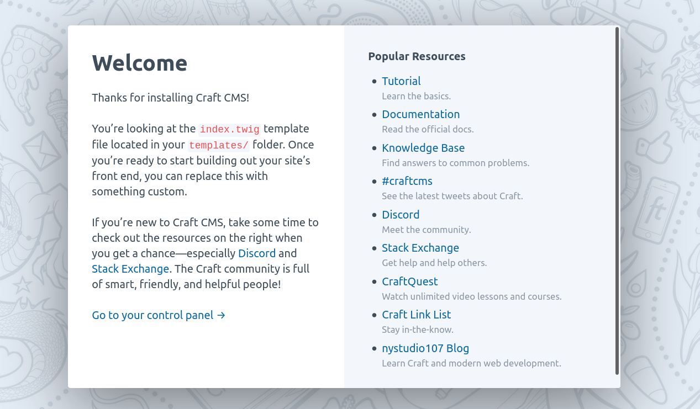

As a software engineer, I thrive and thoroughly enjoy working on fully custom software products. Applications concieved to model and help in the execution of some business process and that are built from the groud up by a team of developers.

Such projects are often complex and expensive though, and for some clients, they can be overkill. Some clients come up with requirements that are better served by off the shelf software solutions. One group of such off the shelf solutions are Content Management Systems. As a rule of thumb, if a client wants a website whose main purpose is to showcase some content, their brand or image, and custom business logic requirements are limited, then chances are that a CMS will fit the bill nicely.

Lately we've been using the Craft CMS for a certain client that meets the aforementioned criteria, and I gotta say, I've been pleasantly suprised by the developer experience it offers.

In this article I'm going to talk through a few of the key aspects of Craft that make me think that really, it's a CMS made for developers. So let's get started:

## Craft is easy to get up and running

Craft is really just a PHP application. And it is as typical as modern PHP applications go, capable of being initially set up with Composer and of running on top of a MySQL database (it also supports Postgres!) and an Apache web server. It can all be done via console too, if that's how you roll.

If you already have a box with Apache, PHP, MySQL and Composer, it all amounts to little more than creating a MySQL database for Craft, `composer install`ing the Craft package, sorting out some permissions, running `php craft setup` and following the prompts, and finally, configuring a virtual host for the `web` directory from inside where Craft was installed.

All of this is explained in Craft's [official documentation](https://craftcms.com/docs/3.x/installation.html).

### Bonus: Running a Dockerized instance of Craft

For ease of development and project bootstrapping, I've even created a containerized setup with Docker and Docker Compose encapsulating some infrasctructure tailored to my development needs. You can get the relevant files from here: [github link to the repo].

If you want to follow along, clone that repo, and you'll end up with this file structure:

```
.
├── apache_config
│   └── 000-default.conf
├── docker-compose.yml
├── Dockerfile
└── README.md

1 directory, 4 files
```

This setup includes two containers: one for running Apache and Craft, and another for running MySQL. The `apache_config/000-default.conf` contains some Apache Virtual Host configuration for serving the site. `docker-compose.yml` defines the whole infrastructure: both contianers, a network that they use to talk to each other, and a volume to persist MySQL database files. The `Dockerfile` is the definition of the image for the container that runs Apache and Craft. Fel free to explore the files, I've made sure to comment them out so that they are easy to understand and modify as you see fit.

If you have Docker and Docker Compose installed in your machine, you can go to the directory just creates by the `git clone` and:

1. Run `docker-compose up` to set up the infrastructure. You will see Docker and Docker Compose creating the image defined in `Dockerfile` and the containers defined in `docker-compose.yml`. Then the logs of the various containers will start showing. It you want to run this in the background, use `docker-compose up -d` instead.

2. Run `docker-compose exec web bash` to connect to the `web` container. This is the container that has Craft's code and is running Apache. You'll be "logged into" the container and located in `/var/www`. This is the directory that we've configured Apache to serve.

3. Once in there, run `composer create-project craftcms/craft ./install` and that will use Composer to install Craft. In other words, it will download all of the files that Craft needs to run. You should see something like this at the end:

```
> @php craft setup/welcome

   ______ .______          ___       _______ .___________.
  /      ||   _  \        /   \     |   ____||           |
 |  ,----'|  |_)  |      /  ^  \    |  |__   `---|  |----`
 |  |     |      /      /  /_\  \   |   __|      |  |
 |  `----.|  |\  \----./  _____  \  |  |         |  |
  \______|| _| `._____/__/     \__\ |__|         |__|
 
     A       N   E   W       I   N   S   T   A   L   L
               ______ .___  ___.      _______.
              /      ||   \/   |     /       |
             |  ,----'|  \  /  |    |   (----`
             |  |     |  |\/|  |     \   \
             |  `----.|  |  |  | .----)   |
              \______||__|  |__| |_______/


Generating an application ID ... done (CraftCMS--xxxxxxxxxxxxxxxxxxxxxxxxxxxxxxxxxxxx)
Generating a security key ... done (xxxxxxxxxxxxxxxxxxxxxxxxxxxxxxxx)

Welcome to Craft CMS! Run the following command if you want to setup Craft from your terminal:

    /var/www/install/craft setup
```

4. After that's done, use this bit of Linux black magic `(shopt -s dotglob; mv -v ./install/* .)`. This command moves all the files that composer just downloaded into `/var/www/install` out from there and into `/var/www`. Then `rm -r install` to remove the `install` directory because we will no longer need it.

5. Now do `php craft setup` to use Craft's CLI to set up the site, its configuration and database structure. Just follow the prompts. When it asks you for database configuration, choose `mysql` as the database drive, set `mysql` as the database server name, and use the environment variables defined in `docker-compose.yml` around lines 14 to 17 for the rest of the values. You can change these to whatever you want as long as you make sure that what you type into this prompt coincides with how you defined your MySQL database container in the `docker-compose.yml` file. The prompts should look something like this:

```
Which database driver are you using? [mysql,pgsql,?]: mysql
Database server name or IP address: [127.0.0.1] mysql 
Database port: [3306] 
Database username: [root] craft
Database password: 
Database name: craft_demo
Database table prefix: 
Testing database credentials ... success!
Saving database credentials to your .env file ... done
```

6. Next, sort out some Craft file permission requirements with these: `chmod -R o+w config && chmod -R o+w storage && chmod -R o+w web/cpresources`. These are just some directories that Craft needs write access to.

6. Now start up Apache with `sudo service apache2 start`.

And that's it! Go ahead and open a browser to `localhost` or `127.0.0.1` and you should see your Craft 3 welcome message.



And you can start playing with the control panel or the `templates/index.twig` right away. 

## Craft gives you complete freedom over your website

Most CMSs can be thought of as having two components: a front end and a back end. The back end is where content is authored and the front end is where the style and structure in which the content is presented is defined. In Craft, most of the effort has gone into creating a solid, highly customizable back end.

Craft comes out of the box with a back end control panel where site administrators and content creators can author new content. As far as front end goes though, Craft has nothing. For a developer well versed in front end web technologies, this is freeing, revelatory and transformative.

Craft makes no assumption and takes no decission for you when it comes to developing your site's look and feel. It gets out of your way and lets you do your job. There's no concept of "theme". There's no obscure API or framework to learn and integrate into. There's no proprietary templating language to struggle with. In Craft, you are completely free to write HTML, CSS and JS as you see fit to obtain the desired effect.

You do so by developing templates using the tried and true Twig templating engine. Which, if you have some experience with PHP, you've most likely already encountered and worked with it. All the content created in the backed is then exposed to the Twig templates via objects. Let's see how:

HERE

All this freedom is not particularly easy for end users, who may not know web development at all. Then again, Craft is made for developers.


- It's got sound abstractions when it comes to modeling content.
- Backend and front end design makes sense for software developers.
- It offers a backend which is very customizable.
- complete freedom when developing the front end.
- twig is a tried and true templating engine and language.
- easy to set up