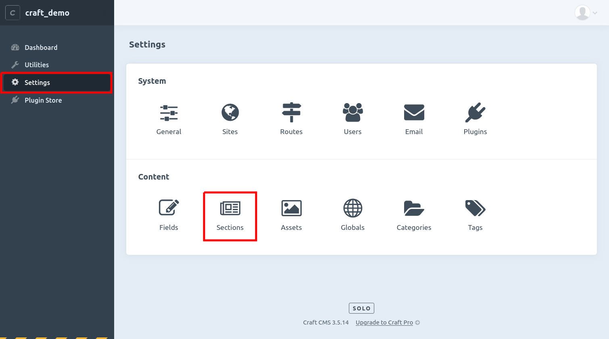
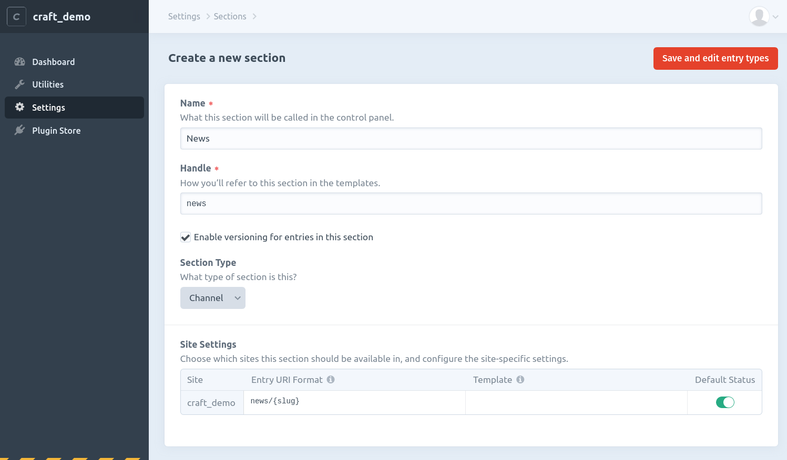
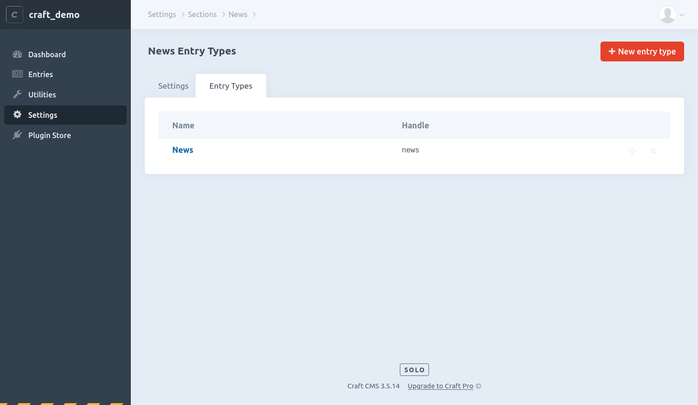
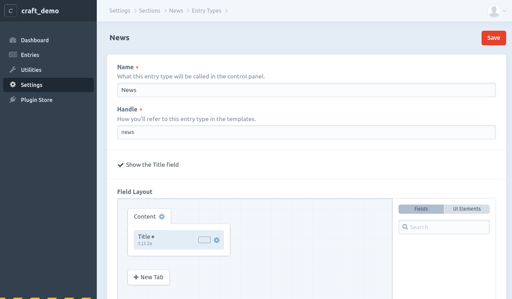
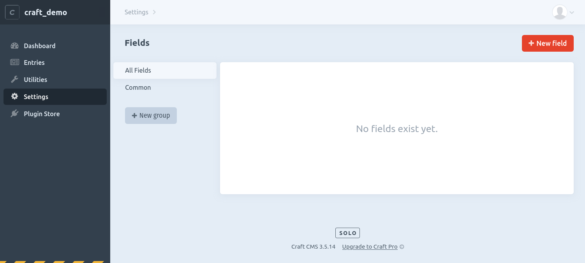
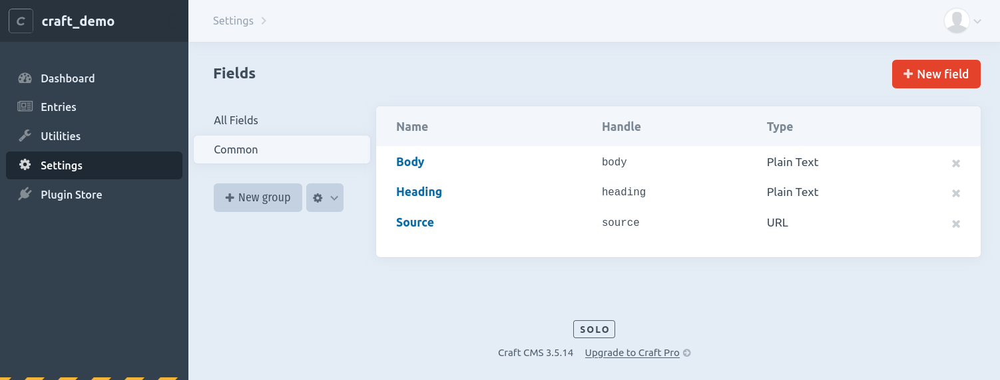
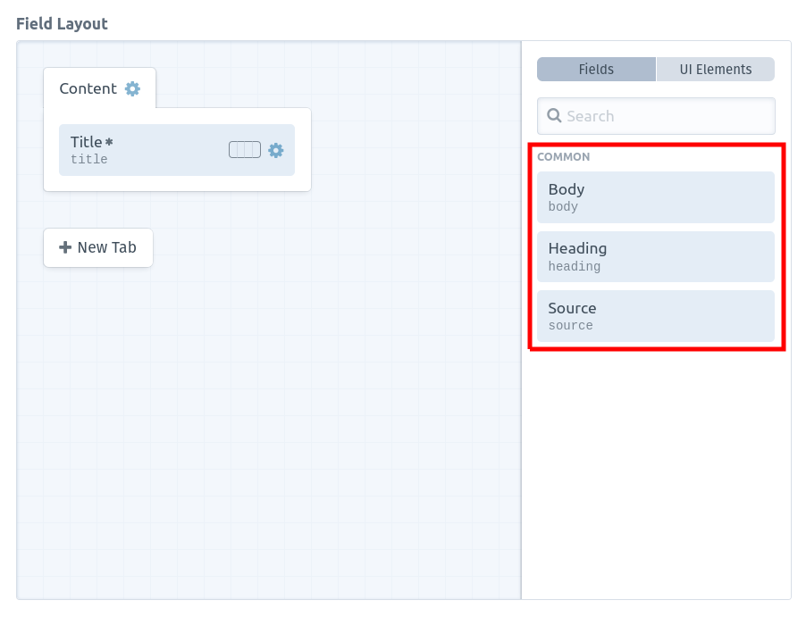
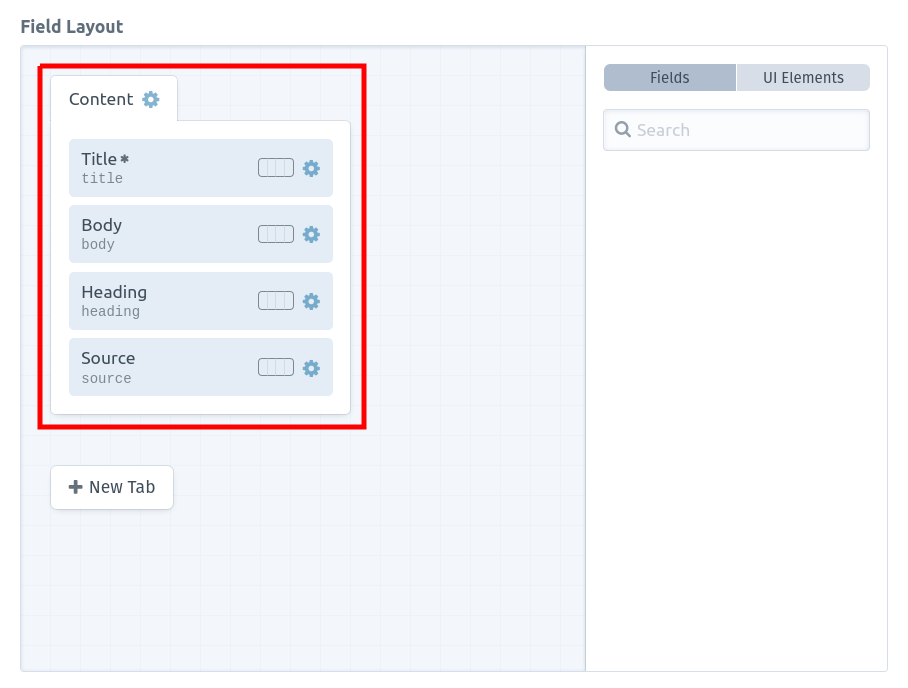
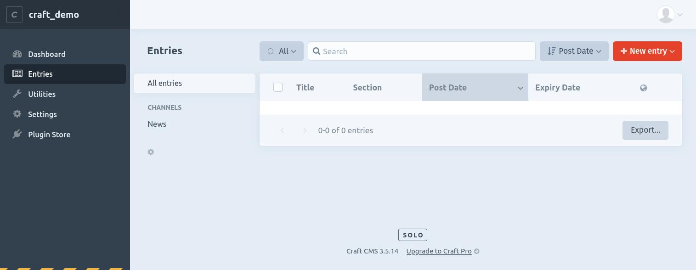
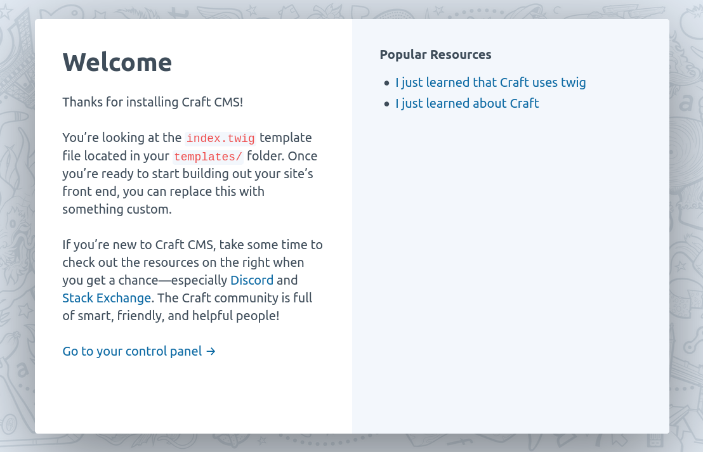

As a software engineer, I thrive and thoroughly enjoy working on fully custom software products. Applications conceived to model and help in the execution of some business process and that are built from the ground up by a team of developers.

Such projects are often complex and expensive though, and for some clients, they can be overkill. Some clients come up with requirements that are better served by off the shelf software solutions. One group of such solutions are [Content Management Systems](https://en.wikipedia.org/wiki/Content_management_system). As a rule of thumb, if a client wants a website whose main purpose is to showcase some content, their brand or image, and custom business logic requirements are limited, then chances are that a CMS will fit the bill nicely.

Lately we've been using the [Craft CMS](https://craftcms.com/) for a certain client that meets the aforementioned criteria, and I gotta say, I've been pleasantly surprised by the developer experience it offers.

In this article I'm going to talk through a few of the key aspects of Craft that make me think that really, it's a CMS made for developers. So let's get started:

## Craft is easy to get up and running

Craft is really just a [PHP](https://www.php.net/) application. And it is as typical as modern PHP applications go, capable of being initially set up with [Composer](https://getcomposer.org/) and of running on top of a [MySQL](https://www.mysql.com/) database (it also supports [Postgres](https://www.postgresql.org/)!) and the [Apache web server](https://httpd.apache.org/). [It can all be done via console](https://craftcms.com/docs/3.x/console-commands.html) too, if that's how you roll.

If you already have a box with Apache, PHP, MySQL and Composer, it all amounts to little more than creating a MySQL database for Craft, `composer install`ing the Craft package, sorting out some permissions, running `php craft setup`, following the prompts, and finally, configuring a virtual host in Apache to serve the `web` directory from inside where Craft was installed.

> All of this is explained in Craft's [official documentation](https://craftcms.com/docs/3.x/installation.html).

## Craft is easy to put in containers

For ease of development and project bootstrapping, I've even created a containerized setup with [Docker](https://www.docker.com/) and [Docker Compose](https://docs.docker.com/compose/) that encapsulates some infrastructure tailored to my development needs. You can get the relevant files from here: https://github.com/megakevin/craft-cms-docker-bootstrap.

If you want to follow along, clone that repo, and you'll end up with this file structure:

```
.
├── apache_config
│   └── 000-default.conf
├── docker-compose.yml
├── Dockerfile
└── README.md

1 directory, 4 files
```

This setup includes two containers: one for running Apache and Craft, and another for running MySQL. The `apache_config/000-default.conf` contains some Apache Virtual Host configuration for serving the site. `docker-compose.yml` defines the whole infrastructure: both containers, a network that they use to talk to each other, and a volume to persist MySQL database files. The `Dockerfile` is the definition of the image for the container that runs Apache and Craft. Feel free to explore the files, I've made sure to comment them out so that they are easy to understand and modify as you see fit.

> If you want to run them, be sure to change the `ServerAdmin` value in `apache_config/000-default.conf`, and the `USER`, `UID`, and `GID` values in `docker-compose.yml` under `services > web > build > args`; according to your environment and user account information.

If you have Docker and Docker Compose installed in your machine, you can go to the directory just created by the `git clone` and:

1. Run `docker-compose up` to set up the infrastructure. You will see Docker and Docker Compose creating the image defined in `Dockerfile` and the containers defined in `docker-compose.yml`. Then the logs of the various containers will start showing. It you want to run this in the background, use `docker-compose up -d` instead and it will give you control of the terminal immediately after it's done.

2. Run `docker-compose exec web bash` to connect to the `web` container. This is the container that has Craft's code and is running Apache. You'll be "logged into" the container and be placed in `/var/www`. This is the directory where we will install Craft.

3. Once in there, run `composer create-project craftcms/craft ./install` and that will use Composer to install Craft. In other words, it will download all of the files that Craft needs to run. You should see something like this at the end:

```
> @php craft setup/welcome

   ______ .______          ___       _______ .___________.
  /      ||   _  \        /   \     |   ____||           |
 |  ,----'|  |_)  |      /  ^  \    |  |__   `---|  |----`
 |  |     |      /      /  /_\  \   |   __|      |  |
 |  `----.|  |\  \----./  _____  \  |  |         |  |
  \______|| _| `._____/__/     \__\ |__|         |__|
 
     A       N   E   W       I   N   S   T   A   L   L
               ______ .___  ___.      _______.
              /      ||   \/   |     /       |
             |  ,----'|  \  /  |    |   (----`
             |  |     |  |\/|  |     \   \
             |  `----.|  |  |  | .----)   |
              \______||__|  |__| |_______/


Generating an application ID ... done (CraftCMS--xxxxxxxxxxxxxxxxxxxxxxxxxxxxxxxxxxxx)
Generating a security key ... done (xxxxxxxxxxxxxxxxxxxxxxxxxxxxxxxx)

Welcome to Craft CMS! Run the following command if you want to setup Craft from your terminal:

    /var/www/install/craft setup
```

4. After that's done, use this bit of Linux black magic `(shopt -s dotglob; mv -v ./install/* .)`. This command moves all the files that composer just downloaded into `/var/www/install` out from there and into `/var/www`. Then `rm -r install` to remove the `install` directory because we will no longer need it.

5. Now do `php craft setup` to use Craft's CLI to set up the site, its configuration and database structure. Just follow the prompts. When it asks you for database configuration, choose `mysql` as the database driver, set `mysql` as the database server name (because that's the name we've given it in our `docker-compose.yml`), and use the environment variables defined in `docker-compose.yml` around lines 14 to 17 for the rest of the values. You can change these to whatever you want as long as you make sure that it coincides with how you defined your MySQL database container in the `docker-compose.yml` file. The prompts should look something like this:

```
Which database driver are you using? [mysql,pgsql,?]: mysql
Database server name or IP address: [127.0.0.1] mysql 
Database port: [3306] 
Database username: [root] craft
Database password: 
Database name: craft_demo
Database table prefix: 
Testing database credentials ... success!
Saving database credentials to your .env file ... done
```

6. Next, sort out some Craft file permission requirements with these: `chmod -R o+w config && chmod -R o+w storage && chmod -R o+w web/cpresources`. These are just some directories that Craft needs write access to.

6. Now start up Apache with `sudo service apache2 start`.

And that's it! Go ahead and open a browser to `localhost` or `127.0.0.1` and you should see your Craft 3 homepage.


You can start playing with the control panel or the `templates/index.twig` right away.

## Craft's design makes sense

When it comes to content modeling, Craft offers a set of abstractions that make sense. The main concepts to understand are [sections and entries](https://craftcms.com/docs/3.x/entries.html). Entries are the main pieces of content. An "article" in a news site or a "post" in a blog. Sections are the way in which Craft groups entries together. They are useful when your site has multiple streams of content. You can, for example, have a site where you publish news, opinion pieces, and random thoughts. With Craft, that would translate neatly into three separate sections, each one with its own type of entries.

Craft also allows you to set up [custom fields](https://craftcms.com/docs/3.x/fields.html) for every type of entry. For example, the entries on your news section may need to include a link to the original source of the news, while your opinion pieces need a short description instead. You can configure your entries using custom fields so that they include the data that makes sense for your use case.

Let's see what that looks like in concrete terms. Now that we have a Craft instance running in `localhost`, go to `localhost/admin` in your browser. You should see Craft's control panel. Click on the "Settings" option in the navigation bar to the left of the screen, then select the "Sections" item under "Content":



Next, click on the "+ New Section" button by the top of the screen and you'll be shown the section creation form. We will create a "News" section so let's fill in the form like this:



The "Name" and "Handle" fields are pretty self explanatory. The "[Section Type](https://craftcms.com/docs/3.x/entries.html#section-types)" is a concept we haven't discussed yet. We chose "[Channel](https://craftcms.com/docs/3.x/entries.html#channels)" for this one because, for a news section, which is a stream of multiple entries with the same structure, this is the most appropriate.

There are other types: "[Single](https://craftcms.com/docs/3.x/entries.html#singles)" is a type which you would use for entries that are unique, like a "homepage" or a "contact us" page. For sections of type "Single", there's generally one single entry that fits in them. This is unlike "Channels" which fit multiple entries. The other section type is "[Structure](https://craftcms.com/docs/3.x/entries.html#structures)". This type also accommodates multiple entries, but rather than a stream of ever growing content, it's more appropriate for similar entries that share a certain theme. A "Structrue" section type is appropriate for things like services offered or projects in a portfolio.

> Learn all about entries, sections, section types and more in [Craft's official docs](https://craftcms.com/docs/3.x/entries.html).

Now that we've filled the form, click the "Save and edit entry types" button. This has created our new "News" section and defined the "[entry type](https://craftcms.com/docs/3.x/entries.html#entry-types)" that this section will be able to contain. The control panel now shows this:



In Craft, a section can contain multiple types of entries. For our purposes with the news section though, just the default one is enough. Click on it, and you'll see an editor where you can select fields that make up that entry type:



The editor I mentioned before is below the "Field Layout" title. Here's where we can pick and choose which fields make up the entries for the "News" section. We have a fresh installation of Craft though, so we don't have any fields. Let's create a few by going to Settings > Fields.



This is where we can define new fields to be used for our entries throughout the site. Click the "+ New Field" button near the top of the screen and you'll be presented with the field creation form where you can specify all manner of details. For now, we just care about "Name", "Handle" and "Field Type", which should be obvious as to what they represent. Let's create three fields:

1. One named "Heading" with a type of "Plain Text".
2. One named "Body" with a type of "Plain Text".
3. One named "Source" with a type of "URL".

You should end up with something like this in the control panel's "Fields" page (`localhost/admin/settings/fields`):



Now, if we go back to our "News" section's default entry type (which should be at `http://localhost/admin/settings/sections/1/entrytypes/1` and you can also reach it via Settings > Sections > News > Entry Types > News)...



You can see how the new fields that we just created are present in the "Field Layout" panel. In order to make these fields available for our "News" entries, we just need to drag them into the box named "Content" inside the greyish area.



Click the "Save" button at the top, and that's all it takes to set up a "Channel" section, an entry type for it, and a few fields.

Now that we've set up the blueprints for them, let's actually create a few entries in the "News" section. To do so, click on the "Entries" link in the navigation bar to the left which should've revealed itself by now, and you'll see this screen:



If you're used to CMS back ends, them this is pretty familiar. In this screen you can create new entries and browse existing ones.

Click the big red "+ New Entry" button and select "News" in the resulting pop up menu. You should see a form with the fields that we defined in the "Field Layout" panel during previous steps. Feel free to create a few news entries. I've created these two:


## Craft gives you complete freedom over your front end

Most CMSs can be thought of as having two components: a front end and a back end. The back end is where content is authored and the front end is where the style and structure in which the content is presented. In Craft, most of the effort has gone into creating a solid, highly customizable back end.

As we've just seen, Craft comes out of the box with a back end control panel where site administrators and content creators can author new content. As far as front end goes though, Craft has nothing. For a developer well versed in front end web technologies, this is freeing and transformative.

Craft makes no assumption and makes no decision for you when it comes to developing your site's look and feel. It gets out of your way and lets you do your job. There's no concept of "theme". There's no obscure framework to learn and integrate into. There's no proprietary templating language to struggle with. In Craft, you are completely free to write HTML, CSS and JS as you see fit to obtain your desired effect for your site.

You do so by developing templates using the tried and true [Twig](https://twig.symfony.com/) templating engine. Which, if you have some experience with PHP, you've most likely already encountered and worked with it. All the content created in the backed is exposed to the Twig templates via objects. Let's see how.

First we need to specify a template for our sections. Continuing with our example, let's assign a template to our "News" section. Go to Settings > Sections > News and scroll down to find the "Site Settings" area. In the table there, type `news` into the "Template" column. Now go to the `template` directory where craft was installed and create a new `news.twig` file. The contents can be simple, like this:

```html
<html lang="en">
<head>
    <meta charset="UTF-8">
    <meta name="viewport" content="width=device-width, initial-scale=1.0">
    <title>{{ entry.title }} - Myt Craft Demo</title>
</head>
<body>
    <h1>{{ entry.heading }}</h1>
    <p>{{ entry.body }}</p>
    <p><a href="{{ entry.source }}">Source</a></p>
</body>
</html>
```

The only noteworthy aspect of this template is how we are injecting the data that we defined in the back end into this template. We do so by using the double curly bracket syntax to reference the `entry` variable. This is provided to Twig by Craft and it contains all the fields that we defined for our entries in the "News" section.

With that done, save and visit any of the entries you created and you'll see something like this:


As you can see, this entry's URL is `localhost/news/i-just-learned-that-craft-uses-twig`. Yours will obviously differ depending on the title (and slug) that you gave them.

What this example lacks in complexity, it more than makes up in potential. This is a plain old HTML document that we've created here. Via a Twig template, of course. This is the complete freedom that I like about Craft. From this point on, you can do whatever you want in terms of front end development: use whatever CSS or JavaScript framework or library you want, organize your template files in a way that makes sense to you, your team and your website, etc. The sky is the limit. 

That's good for individual news pages. But now let's try and link to them from the homepage. To do so, we need to edit the `templates/index.twig` file. Around line 174, remove the `<ul>` that's there along with all its `<li>`s and put this instead:

```html


<ul>
    
        <li><a href="{{ entry.url }}">{{ entry.title }}</a></li>
    
</ul>
```

Here, we leverage Twig's templating engine capabilities, sprinkled with some of Craft's features to obtain a list of all the entries in our "News" section. Then, we iterate over them to render links.

Effectively, Craft enhances what you can do with Twig by exposing an API for accessing the data that exists in the CMS back end.

If you're familiar with any sort of templating language like those included in most web application frameworks like [Ruby on Rails](https://rubyonrails.org/), [Symfony](https://symfony.com/), [ASP.NET Core MVC](https://docs.microsoft.com/en-us/aspnet/core/mvc/overview?view=aspnetcore-3.1), etc... You'll probably feel right at home with this.

Here's what the homepage looks like now:



You can click on any of the links and they will take you to the specific entry page.

> You can learn more about querying entries in Craft's [official documentation](https://craftcms.com/docs/3.x/entries.html#editing-entries).

## Craft is cool 🕶️

So, in conclusion, I've found that Craft is a cool tool to have in the toolbox. It is a full fledged CMS with tons of customization opportunities for how to model and organize the content, the data, of your site. When it comes to developing the front end though, it gets out of your way and lets you do your job. That, to me, is a big win.
