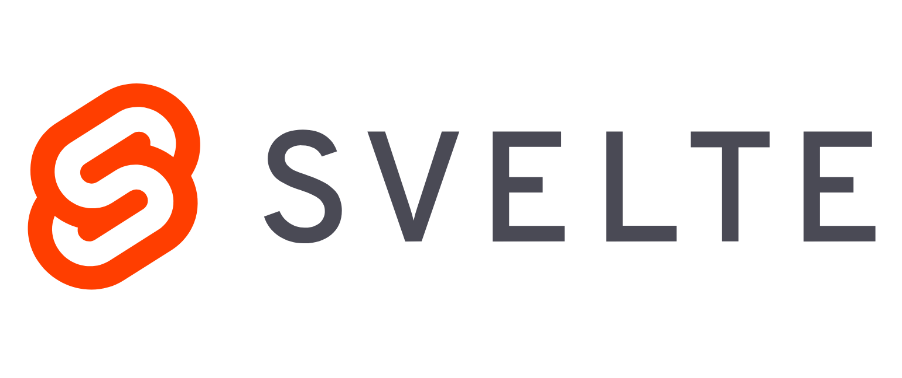

When it comes to [JavaScript frameworks](https://en.wikipedia.org/wiki/Comparison_of_JavaScript_frameworks), it seems like they are [a dime a dozen these days](https://dayssincelastjavascriptframework.com/). In the [JavaScript](https://www.javascript.com/) world, there are frameworks and libraries for almost every task that you can imagine, and there is much overlap. In the front end web development area though, there are three who reign supreme: [Angular](https://angularjs.org/), [React](https://reactjs.org/) and [Vue](https://vuejs.org/). Whether you're building full on [Single Page Apps](https://en.wikipedia.org/wiki/Single-page_application) or traditional web apps with some front end zest, you can't go wrong with either of these three.

Recently though, I discovered a new player in this field that promises to offer a similar developer experience to existing frameworks with [great performance gains](https://youtu.be/AdNJ3fydeao?t=1084). The name is [Svelte](https://svelte.dev/), and it achieves this promise in a very interesting way: [it's a compiler](https://svelte.dev/blog/svelte-3-rethinking-reactivity).

This is a novel approach to tackle the front end web development problem. While the traditional front end frameworks are libraries with runtime components that get loaded and executed in the browser; Svelte itself only runs at development/build time, in your development machine. Svelte takes the JavaScript components that we write, compiles them into pure, lean JavaScript and emits only that to the browser. No big library, or runtime, or interpretation of components ever happens in the browser. It doesn't do any of this, and yet, still offers a robust component framework with all the features that you might expect like reactivity, templating capabilities, scoped CSS, data binding, etc.

This is a great value porposition. If we can truly get [that much better performance](https://youtu.be/AdNJ3fydeao?t=1084), while still maintaining a familiar developer experience when compared to more traditional frameworks (or even better in some cases!), that sounds like we get to have our cake and eat it too.

After learning all that, I decided to take a closer look at Svelte and see how it works, how it's similar and different from other frameworks, and what new features it brings to the table. In this blog post, I'll discuss some of the findings that I found most interesting.

## Components are simple

In Svelte, the concept and mechanics of components are similar to those of other frameworks. Components encapsulate the HTML, CSS and JavaScript of a given portion of our applications in a reusable manner. Svelte components look very similar to plain old HTML files. [There's minimal ceremony](https://svelte.dev/blog/write-less-code). Here's what a "hello world" example could look like as a Svelte component:

```html
<h1>{ message }!</h1>

<script>
  let message = "Hello World";
</script>

<style>
  h1 {
    color: royalblue;
  }
</style>
```

Very simple. Refreshing even. This content would live inside a `*.svelte` file which is what Svelte components should be named. As you can see, the `<style>` and `<script>` tags contain just plain old CSS and JavaScript, respectively. The rest of the file, the view template, is also plain HTML with some curly brace goodness injected by Svelte that allows us to render the results from JavaScript expressions. In this case, we are just rendering the `message` variable that we defined in the `<script>` portion of our component.

Now, Svelte has a lot of features, so it does add some syntax to spice up HTML templates and it also uses some unconventional JavaScript to express some constructs. Nothing too revolutionary though, as we'll see later. 

## It's easy to set up

In front end web development, we spend most of the time authoring components like these, so we'll talk more about them later. In order for the components to do anything though, we need that compilation step that I mentioned earlier. That means setting up a new Svelte project in our development environment. Luckily for us, Svelte makes this easy.

All you need is to install [NodeJS](https://nodejs.org) so that you have `npm` and `npx` available and can run this:

```
npx degit sveltejs/template my-svelte-project
```

This will use the Svelte project template hosted in https://github.com/sveltejs/template to get you up and running quickly with a working application and build pipeline.

`cd` into the `my-svelte-project` directory that was just created and run `npm install` to install all dependencies needed by the app. Then, run `npm run dev` and that should start a development web server that you can reach with your browser via "localhost:5000". You'll be greeted by this:


Feel free to explore the app files. You'll see there's an `App.svelte` file that has our sole app component. It contains some HTML, CSS and JS. `main.js` is particularly interesting for us at this point because it shows us how a Svelte app is initiated.

```javascript
import App from './App.svelte';

const app = new App({
  target: document.body,
  props: {
    name: 'world'
  }
});

export default app;
```

This should be very familiar if you're used to the likes of VueJS. Here, we import the `App.svelte` file and instantiate the JavaScript component contained within by passing it it's target (that is, where in the DOM it is going to be mounted) and some props.

Notice how we import the component file directly and no Svelte library. We don't need it because our app does not need Svelte to run. It only needs Svelte to build. Svelte, after all, is a compiler. It's not a runtime dependency, but rather, a build time one.

Another interesting aspect of setting up a Svelte app is that it uses [Rollup](https://rollupjs.org) as a module bundler by default. You can confirm this by looking at the `my-svelte-project/rollup.config.js` file that was created. If you prefer [Webpack](https://webpack.js.org/), Svelte also supports it. All you need to do to build with Webpack instead of Rollup is use this command when creating your app:

```
npx degit sveltejs/template-webpack svelte-app
```

This is just using the project template hosted in GitHub at https://github.com/sveltejs/template-webpack and it will build out a Webpack based application functionally identical to the one we've just created.

## The templating capabilities are powerful

When it comes to templating, Svelte has everything that you would expect from a modern JavaScript front end framework and then some. You got your basics like interpolation and flow control, but there are also some more advanced features that look to be very useful. Here's an example component that demonstratee some of the most common capabilities:

```html
<script>
  let title = 'Trying out some Svelte features';
  let itsAllJustJavaScript = "It's all just JavaScript";
  let youCanAlsoUseHtml = 'You can also use <b><em>HTML</em></b>';
  let showThis = true;
  let things = ['a thing', 'another thing', 'a thingy'];
  let complicatedThings = [
    {id: 1, what: 'car', why: 'it can go fast'},
    {id: 2, what: 'plane', why: 'it can fly'},
    {id: 3, what: 'submarine', why: 'it can go underwater'}
  ];
</script>

<main>
  <!-- We can use any variable that's declared in <script> -->
  <h1>{title}</h1>

  <!-- We can use any valid JavaScript expression and its return value will be
    rendered.-->
  <p>{itsAllJustJavaScript.toUpperCase()}</p>

  <!-- Svelte will make sure to sanitize text so that no HTML is rendered by
    mistake... -->
  <p>{youCanAlsoUseHtml}</p>

  <!-- ...unless you explicitly tell it not to by using @html -->
  <p>{@html youCanAlsoUseHtml}</p>

  <!-- Conditional logic works as you would expect. -->
  {#if showThis}
    <p>Showing this</p>
  <!-- There's also {:else if ...} if you need it. -->
  {:else}
    <p>And not that</p>
  {/if}

  <!-- It can iterate over an array. -->
  <h2>Things</h2>
  <ul>
    {#each things as thing}
      <li>{thing}</li>
    {/each}
  </ul>

  <!-- It can also iterate over an array of objects and use their fields. -->
  <h2>Complicated things</h2>
  <ul>
    {#each complicatedThings as thing}
      <li>{thing.id}: a {thing.what} is complicated because {thing.why}</li>
    {/each}  
  </ul>
</main>
```

There's a more advanced feature that I think can prove very useful. Svelte supports rendering of templates based on promises. Here's an example demonstrating how easy it is to implement a very common pattern on front end development: displaying a loading message while we fetch some information via an HTTP request:

```html
<script>
  // First, we define our promise and capture it in a variable.
  let url = 'https://vpic.nhtsa.dot.gov/api/vehicles/getmodelsformake/subaru?format=json'
  let promiseToGetSubarus = fetch(url).then(response => {
    if (response.ok) {
      return response.json()
    } else {
      throw new Error("Something went wrong ☹️");
    }
  });
</script>

<main>
  <!-- Then, in the template, we await the promise and show a loading message
    in the meantime. -->
  {#await promiseToGetSubarus}
    <p>loading Subarus...</p>
  <!-- When the promise resolves, we can render the result. The "data"
    variable here captures what our promise resovles with, in this case,
    it's "response.json()", like we defined in our JavaScript code. -->
  {:then data}
    <p>Message: {data['Message']}</p>

    <h2>Subaru Models</h2>
    <ul>
      {#each data['Results'] as model}
        <li>{model['Model_Name']}</li>
      {/each}
    </ul>
  <!-- We can also do some error handling in case our request fails. -->
  {:catch error}
    <p style="color: red">{error.message}</p>
  {/await}
</main>
```

This is a pretty neat feature. It embraces the modern JavaScript concept of promises and has the potential of reducing a good amount of boilerplate and, as a consequence, make our components easier to read.

## Reactivity is built in, and leverages a quirky JavaScript feature

Svelte also checks the reactivity box, and it does so in some interesting ways.

First of all, any value that you include in a template is fully reactive. So, to take an example from Svelte's own documentation, this works as you'd expect:

```html
<script>
  // Here's our variable.
  let count = 0;

  // Here's a function that updates our "count" variable.
  function handleClick() {
    count += 1;
  }
</script>

<!-- This is how we tell svelte to respond to the click event on this button by
  calling the handleClick function. -->
<button on:click={handleClick}>
  <!-- We use the count variable to render some markup here. It is reactive by
    default. That means that the view will be updated automatically
    everytime the value changes. That is, everytime the button is clicked. -->
  Clicked {count} {count === 1 ? 'time' : 'times'}
</button>
```

Try it out in [Svelte's official tutorial](https://svelte.dev/tutorial/reactive-assignments).

There's also support for computed values. That is, values that are derived from other values and reactively change whenever the values they depend on are changed. Svelte solves this problem with so called [reactive declarations](https://svelte.dev/tutorial/reactive-declarations). They look like this:

```javascript
$: evenness = count % 2 == 0 ? 'even' : 'odd';
```

In the context of our count example, we could use it with something like this:

```html
<script>
  let count = 0;

  // Here's a reactive declaration. It gets recalculated everytime "count"
  // changes. That is, everytime the button is clicked. 
  $: evenness = count % 2 == 0 ? 'even' : 'odd';

  function handleClick() {
    count += 1;
  }
</script>

<button on:click={handleClick}>
  Clicked {count} {count === 1 ? 'time' : 'times'}
</button>

<!-- And as expected, this portion of the view also gets updated when "evenness"
  changes. -->
Evenness of count: {evenness}
```

The fist time I saw this `$:` syntax I thouhgt it was weird. And it kind of is. However, it's actually valid JavaScript. This is just a label (as explained in [MDN](https://developer.mozilla.org/en-US/docs/Web/JavaScript/Reference/Statements/label)). The Svelte magic comes into play when it finds a label like this one. The compiler looks at the statement to the right of the label and does what it needs to do in order to make it reactive.

Svelte can also reactively run arbitratry code. Pretty much any statement can be run reactively. For example, all of these work:

```javascript
// This gets executed everytime "evenness" changes.
$: console.log("The evenness changed to: " + evenness);

// This gets executed everytime "evenness" or "count" changes.
$: {
  console.log("The evenness changed to: " + evenness);
  console.log("The count is: " + count)
}

// This gets executed everytime "count" changes.
$: if (count >= 10) {
  alert("count is dangerously high!");
}
```

## You can go low level

Svelte offers various mechanisms for going low level and directly handling the DOM. One such method is the "this" binding. With it, we can take a given HTML element and have Svelte asign a reference to it into a variable of our choosing. Here's how it works:

```html
<script>
  // First, we need to import the "onMount" function which allows us to
  // execute some code when the Svelte component is fully mounted into the DOM
  // and ready to use.
  import { onMount } from 'svelte';

  // Here we define this variable which we will use to capture a reference to
  // one of our DOM elements.
  let myDiv;

  // The "myDiv" variable is initialized when the component is mounted. So any
  // code that uses it needs to be inside an "onMount" callback. The variable
  // contains a reference to our div element defined below.
  onMount(() => {
    console.log("Here's a reference to some div: ", myDiv);
    myDiv.innerText = "The component has been mounted";
  });
</script>

<!-- Using this 'bind:this="{div}"' binding, we tell Svelte to store a reference
  to the DOM element represented by this div into the myDiv varaible. -->
<div bind:this="{myDiv}">
  This is some text that will go away.
</div>
```

The only thing to keep in mind is that we should only use the `myDiv` variable inside the `onMount` lifecycle hook (more info [here](https://svelte.dev/tutorial/onmount)). This is the only way to make sure that the variable is correctly initialized, since it will be `undefined` before the component is mounted.

Another mechanism to perform low level DOM operations is via "actions" and the "use" directive. This is a more robust and reusable alternative to the "this" binding in that it allows us to define a separate function to augment a given DOM element with custom functionality and interact with the rest of the Svelte app ecosystem via firing events. Here's an example illustrating the most unnecesarily roundabout way of making a div clickable using the DOM API directly:

```html
<script>
  // This function encapsulates all direct DOM manipulations. It receives a
  // "node" parameter which contains a reference to the DOM element that had
  // the "use" directive called on it with this "customClickable" as a
  // parameter. This function could have been defined in a separate file and
  // imported here for easy reusability.
  function customClickable(node) {
    function handleOnClick(event) {
      // We have full acces to the DOM element. We can use members like
      // "id" or "dispatchEvent".
      console.log(`dispatching ${node.id}'s customclick event`);
      // Here we dispatch a custom event named "customclick" with some
      // arbitrary parameters.
      node.dispatchEvent(new CustomEvent('customclick', {
        detail: { x: event.clientX, y: event.clientY }
      }));
    }

    // Here we direcly use the DOM API to set up an event handler for our
    // "node".
    node.addEventListener('click', handleOnClick);

    // We should return an object with a "destroy" method to be called by
    // Svelte when the component is unmounted. In this case, all we do is
    // remove the event listener that we added above.
    return {
      destroy() {
        node.removeEventListener('click', handleOnClick);
      }
    };
  }

  // This function gets passed the custom event data, just as
  // "customClickable" defines it when it calls "dispatchEvent" on the "node".
  function logCoordinates(event) {
    console.log("Div clicked in ", {
      x: event.detail.x, y: event.detail.y
    });
  }
</script>

<!-- When defining our custom clickable div, we use the "use:customClickable"
  directive to tell Svelte to call the "customClickable" function and pass it
  the div's underlying DOM element. "customClickable" in turn augments the div
  so that it can dispatch a new type of event: "customclick". Then, using
  Svelte's usual event handling mechanisms, we set the element up so that when
  the div dispatches the "customclick" event, "logCoordinates" gets executed.
-->
<div
  id="my_custom_clickable_div"
  style="border: 1px solid blue; padding: 10px; cursor: pointer;"
  use:customClickable
  on:customclick={logCoordinates}
>
  Click here and see what happens.
</div>
```

Again, this example is doing something completely unnecessary because divs are already clickable. For a more complex example you can study [this one from Svelte's official documentation](https://svelte.dev/tutorial/actions).

And that's it for now. These are the features that called my attention as I dove into Svelte for the first time. Of course, Svelte offers many other features that I didn't discuss here like:

- [Two way data binding](https://svelte.dev/tutorial/text-inputs) (for input elements in forms and even between components).
- [Handling and dispatching DOM and custom events](https://svelte.dev/tutorial/dom-events) (to keep the flow of data through the component hierarchy clean).
- [Transitions](https://svelte.dev/tutorial/transition) and [Animations](https://svelte.dev/tutorial/animate) (which in Svelte are built in, first class citizens).
- [Component composition](https://svelte.dev/tutorial/slots) (traditional nesting and via slots)
- [Global application state management](https://svelte.dev/tutorial/writable-stores) (a la [Vuex](https://vuex.vuejs.org/) or [Redux](https://redux.js.org/)).
- A full stack application framework in the form of [Sapper](https://sapper.svelte.dev/).

These are features that other frameworks also include and Svelte offers similar implementations, with its own particular flavor. I just wanted to mention them so you know they are there. To learn more, I'd encourage you to work through the [excellent official tutorial](https://svelte.dev/tutorial/).

All in all, I think Svelte is a great contender. It offers all the features that put it right up there with the big guys. It also promises a great uplift in performance when compared to said big guys. As a cherry on top, it offers a great developer/code authoring experience which is familiar and also arguably better than existing frameworks. I for one am looking forward to seeing how the project evolves and matures and what cool things people make with it. And why not? Also try it out in some projects of my own.
