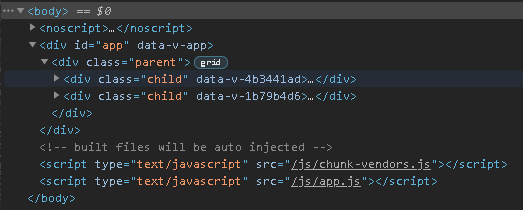
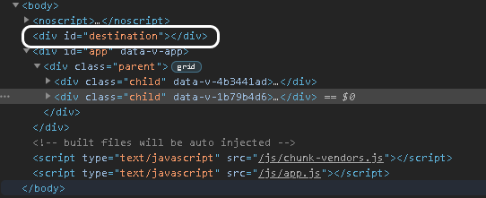
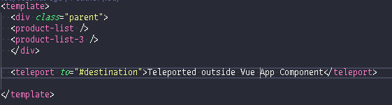
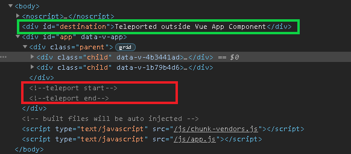
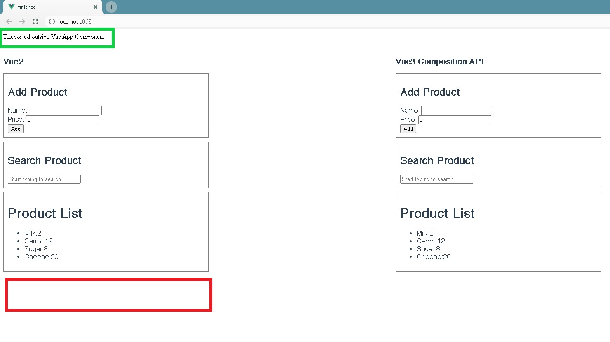

## Vue 3 is released
Vue 3, code-named “One-Piece” was officially released on September 18, 2020 with some [exciting new features and improved performance](https://github.com/vuejs/vue-next/releases/tag/v3.0.0). To learn more about migrating Vue 2 projects check out the [migration guide](https://v3.vuejs.org/guide/migration/introduction.html).
## Exciting new features

### Composition API
This is one of the most significant changes that helps in logically grouping related fragments of components. In Vue 2, we used the Options API to pass various options during component configuration:

```JavaScript
// src/components/ProductList.vue
<template>
    <div class="child">
      <h3>Vue2</h3>
        <div>
            <div class="add-product">
                <h2>Add Product</h2>
                <div>Name: <input name="name" v-model="newProduct.name" /></div>
                <div>Price: <input name="name" v-model="newProduct.price" /></div>
                <button @click="addProduct">Add</button>
            </div>
            <div class="search-product">
                <h2>Search Product</h2>
                <input name="name" v-model="filterText" placeholder="Start typing to search" />
            </div>
        </div>
        <div class="list-product">
        <h1>Product List</h1>
        <ul>
            <li v-for="product in filteredProducts" :key="product">{{product.name}}:{{product.price}}</li>
        </ul>
        </div>
    </div>
</template>

<script>
export default {
    data() {
        return {
            newProduct: {name: '', price: 0.00},
            productList: [
              {name: 'Milk', price: 2},
              {name: 'Carrot', price: 12},
              {name: 'Sugar', price: 8},
              {name: 'Cheese', price: 20}
              ],
            filterText: ''
        }
    },
    methods: {
      addProduct: function(){
        this.productList.push({...this.newProduct});
      }
    },
    computed: {
        filteredProducts: function () {
            if(this.filterText.trim().length > 0){
                return this.productList.filter(p => p.name.toLowerCase().indexOf(this.filterText.toLowerCase())>-1)
            }
            return this.productList;
        }
    }
}
</script>
```
This component has several responsibilities, as code grows, more responsibilities are added which will make it difficult to understand and implement new changes in future. Moreover, the related parts of code are scattered throughout each component's options (data, computed, methods). 

The new Composition API enables us to organize related code. `setup` is one of the component options in Vue 3, which is the entry point for the Composition API. `setup` is executed before the component is created, and after the `props` are resolved, which means, `this` cannot be accessed inside `setup` but `props` and `context` can be accessed because `props` and `context` are only passed in `setup` function.

The following code uses the Composition API to recreate the ProductList component from our earlier example.

```JavaScript
// src/components/ProductList3.vue
<template>
    <div class="child">
            <h3>Vue3 Composition API</h3>
        <div>
            <div class="add-product">
                <h2>Add Product</h2>
                <div>Name: <input name="name" v-model="newProduct.name" /></div>
                <div>Price: <input name="name" v-model="newProduct.price" /></div>
                <button @click="addProductToList">Add</button>
            </div>
            <div class="search-product">
                <h2>Search Product</h2>
                <input name="name" v-model="filterText" placeholder="Start typing to search" />
            </div>
        </div>
        <div class="list-product">
        <h1>Product List</h1>
        <ul>
            <li v-for="product in filteredProducts" :key="product">{{product.name}}:{{product.price}}</li>
        </ul>
        </div>
    </div>
</template>

<script>
import useProducts from '@/composables/useProducts'
import useProductNameSearch from '@/composables/useProductNameSearch'
import { ref } from 'vue'

export default {
    setup () {
      const newProduct = ref({name: '', price: 0.00})

      const { products, addProduct } = useProducts();

      const { filterText, filteredProducts } = useProductNameSearch(products)

      return {
        newProduct,
        addProduct,
        filterText,
        filteredProducts
      }
    },

    methods: {
      addProductToList: function(){
        // process product data before adding to list
        this.addProduct({...this.newProduct})
      }
    },
}
</script>

// src/composables/useProducts.js
import { ref } from "vue";

export default function userProducts(){
  const products = ref([
              {name: 'Milk', price: 2},
              {name: 'Carrot', price: 12},
              {name: 'Sugar', price: 8},
              {name: 'Cheese', price: 20}
              ]);

  const addProduct = (product) => products.value.push(product);

  return {
    products,
    addProduct
  }
}

// src/composables/useProductNameSearch.js
import { computed, ref } from "vue";

export default function useProductNameSearch(products){
  const filterText = ref('');

  const filteredProducts = computed(()=>{
    if(filterText.value.trim().length > 0){
    return products.value.filter(p => p.name.toLowerCase().indexOf(filterText.value.toLowerCase())>-1)
    }
    return products.value;
  })

  return {
    filterText,
    filteredProducts
  }
}
```
The two functions using the Composition API are now in two separate files, which are now imported by our ProductList component. Similarly, we can add more functions with isolated responsibility in different files and use them in our component. This will make code easier to understand and to make changes to the component.
The DEMO can be seen [Take a look at the demo](https://vue3-notable-features-demo.vercel.app/) and [source code(https://github.com/bimalghartimagar/vue3-notable-features-demo) if you like.

### Key Points & Takeaways
* `setup()` is the entry point for composition API and can be used as a standalone composition function in a separate file. To know more about `setup` [check out the v3 docs](https://v3.vuejs.org/guide/composition-api-setup.html#setup)
* Using `ref` to make a variable reactive, and using `.value` to access its value inside `setup` function
* `computed` properties can be created using the function imported from Vue. Here also, `.value` should be used to access the value of computed property.

There are more options like lifecycle hooks, watcher not used in the above code but can be used when required.
* Lifecycle hooks can be used in `setup` by prefixing with `on`. E.g. `mounted` becomes `onMounted`. [Visit the docs](https://v3.vuejs.org/guide/composition-api-lifecycle-hooks.html) to learn about all of the lifecycle hooks.
* To setup watcher and know more about it [read the docs](https://v3.vuejs.org/guide/composition-api-introduction.html#reacting-to-changes-with-watch)
* `toRefs` is another option which helps in making `props` reactive which are passed to the `setup` function . To learn more [visit the docs](https://v3.vuejs.org/api/refs-api.html#torefs)


These are some basic stuffs to get started with composition API, there are more things than this to explore on composition API

### Teleport
Teleport is another interesting feature which helps in making our HTML structure cleaner and more logical. Previously when we wanted to use a global modal or a notification/alert, it required deeply nested code.. 

With Teleport, the placing of components in the required location is easier. Let's take a look

- The snapshot below shows the rendered DOM (without teleport code), where vue application inserts DOM in `div#app`.



- Now we are going to add a section `<div id="destination"></div>` just above the vue application which is highlighted in the snapshot below. Notice that the section we added is outside of the vue application.



- Now on the vue component we will add teleport code `<teleport to="#destination">Teleported outside Vue App Component</teleport>`. This code used `to` props to pass reference of which element to use as parent to render the piece of HTML code.



- After adding the teleport code, we can see that contents of teleport code `Teleported outside Vue App Component` is rendered on the HTML node outside the vue application. Normally, the rendered part should have been available in the red region, but due to teleport feature it is rendered in the green region.




- Also in the browser, we can see the contents are located at the top of the page rather than at below the vue application code.



With teleport we can render the piece of HTML code anywhere in the DOM tree. It can even render the vue component and update the component if props change. The vue component would be rendered in different places but still it would be a child component to the parent component and react to props values. However I noticed one thing is that even if the same placeholder section like `<teleport to="#destination">Teleported outside Vue App Component</teleport>` is used anywhere in the vue components, that would not render the HTML. You can check out the code and demo to see the teleport in action.

### Fragments
In Vue 2.x, multi-root components were not supported, due to which multiple components needed to be wrapped in a single `<div>`. But in Vue 3.x, having multi-root components is possible.

Vue 2.x Syntax
```html
<!-- Layout.vue -->
<template>
  <div>
    <header>...</header>
    <main>...</main>
    <footer>...</footer>
  </div>
</template>
```
Vue 3.x syntax
```html
<!-- Layout.vue -->
<template>
  <header>...</header>
  <main>...</main>
  <footer>...</footer>
</template>
```

### Emits Component Option
In Vue 2.x, props are declared in vue Component that makes it readable to see which props are being used. But for custom events, we had to search the whole component to see what events are used in the component. This has been changed for custom events. Now, custom events can be declared just like props via the `emits` option. Since this option accepts object notation, validators for arguments can be defined similar to validators in props option.


Below you can see that we are passing custom events from the parent component to the child component and using the `emits` option to declare the custom event in the child component.

```javascript
// src/App.vue
<template>
  <div class="parent">
    <product-list />
    <product-list-3 @update-inventory="addToInventory"/>
  </div>

  <div id="inventory">
    <span v-show="inventory.length === 0">Inventory is empty.</span>
  <div v-show="inventory.length > 0">
    <h3>Inventory</h3>
    <ul>
      <li v-for="item in inventory" :key="item.name">{{item.name}}: {{item.price}}</li>
    </ul>
      Total: ${{inventory.reduce((acc,product)=>acc=acc+(+product.price),0)}}
  </div>
  </div>

  <teleport to="#destination">Teleported outside Vue App Component</teleport>
</template>

<script>
import ProductList from "./components/ProductList.vue";
import ProductList3 from "./components/ProductList3.vue";

export default {
  name: "App",
  components: {
    ProductList,
    ProductList3
  },
  data(){
    return {
      inventory: []
    }
  },
  methods: {
    addToInventory(products){
      this.inventory = [...this.inventory, ...products];
    }
  }
};
</script>

// src/components/ProductList3.vue
<template>
  . . .
      <div class="list-product">
        <h1>Product List</h1>
        <button @click="updateInventory()">Update Inventory</button>
        <ul>
          <li v-for="product in filteredProducts" :key="product">
            {{ product.name }}:{{ product.price }}
          </li>
        </ul>
      </div>
  . . .
</template>

<script>
import useProducts from "@/composables/useProducts";
import useProductNameSearch from "@/composables/useProductNameSearch";
import { ref } from "vue";
import ChildComponent from "./ChildComponent.vue";

export default {
  components: { ChildComponent },

  emits: ["update-inventory"],

  . . .

  methods: {
    . . .
    updateInventory: function() {
      this.$emit("update-inventory", [...this.filteredProducts]);
      this.emptyProducts();
    }
    . . .
  }
};
</script>

```


## Some breaking changes from 2.x are:
- New addition in Global API, `createApp`. Calling this returns the app instance which can be used to mount the root instance.

Vue 2.x
```Javascript
import Vue from 'vue'
import App from './App.vue'

Vue.config.productionTip = false

new Vue({
  render: h => h(App),
}).$mount('#app')

```

Vue 3.x
```Javascript
import { createApp } from 'vue'
import App from './App.vue'

createApp(App).mount('#app')

```

- Global API like `nextTIck`, `set`, `observable` and others are now restructured with tree-shaking support

Vue 2.x
```Javascript
import Vue from 'vue'

Vue.nextTick(() => {
  // something DOM-related
})

```

Vue 3.x
```Javascript
import { nextTick } from 'vue'

nextTick(() => {
  // something DOM-related
})

```
[Here](https://v3.vuejs.org/guide/migration/introduction.html#breaking-changes) are the list of more breaking changes.

Many vue libraries are yet to implement the changes that would work with vue 3.x. For example, we use vuetify in our various client projects and this is not supported yet in vue 3.x as of writing this blog. There is [a roadmap](https://vuetifyjs.com/en/introduction/roadmap/) planned for vuetify, where the alpha release would be in Q4 2020 and target release in summer 2021.

