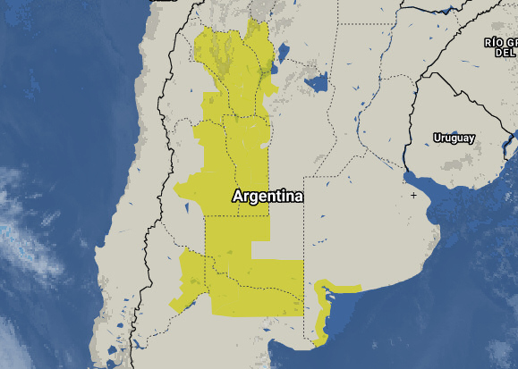

[Photo](https://flic.kr/p/nQNYxQ) by [Francois Powell](https://www.flickr.com/photos/119810478@N08/), [CC BY 2.0](https://creativecommons.org/licenses/by/2.0/), cropped


MySQL is one of the most widely used open-source relational databases. Most PHP websites rely on MySQL for persisting their information, which makes it one of the [top three most popular databases along with Oracle and SQL Server](https://towardsdatascience.com/top-10-databases-to-use-in-2021-d7e6a85402ba).

But one of the aspects that is not that well-known is that the engine supports working with spatial data, allowing to save different shapes (points, lines, polygons) and query information based on intersections, distances, or overlaps. This can be useful for many needs, including:

- Searching for places based on lat/long coordinates
- Displaying information and areas as layers on maps
- Architecture or home design applications

My first experience with spacial queries was for a weather website I developed that displays local alerts/warnings on a map, using MySQL spatial functions to return weather alerts that are active for a given location, or to inform if lightning has been observed near the user's current coordinates. So far, MySQL has given me all the resources I need to do such operations with relatively good performance and without needing to write lots of custom code.

### Adding spatial information

There are many resources available to import spatial information into our database. On the following link from the United States Census Bureau, we can find a [set of shapefiles with all US states and counties](https://www.census.gov/geographies/mapping-files/time-series/geo/carto-boundary-file.html). The [Back4App social database platform](https://www.back4app.com/database) also has many datasets available to download for free.

Of course, we can also create a table ourselves that contains any kind of spatial information. In the example below, we will create a table named restaurants which will have a name and location (lat/long) geometry for each row.

```sql
CREATE TABLE restaurants (
  name VARCHAR(100),
  location GEOMETRY NOT NULL,
  SPATIAL INDEX(location)
);
```

Note that we are adding an index of type SPATIAL to the location field. This is mainly for performance reasons. Once the table is created, we can populate it with some data using the `ST_GeomFromText()` function that will convert a string representation of any shape into a geometry:

```sql
INSERT INTO restaurants VALUES ('Restaurant 1', ST_GeomFromText('POINT(-26.66115 40.95858)'));
INSERT INTO restaurants VALUES ('Restaurant 2', ST_GeomFromText('POINT(-26.68685 40.93992)'));
INSERT INTO restaurants VALUES ('Restaurant 3', ST_GeomFromText('POINT(-31.11924 42.39557)'));
```

### Querying and filtering with spatial data

Let’s suppose we imported a list of US states from the website above, along with a shape field that holds the geometry associated with each state into a `states` table. Then, we will be able to get the geometry by just running a SELECT statement:

```sql
SELECT state_name, ST_AsText(shape) FROM states ORDER BY state_name;

*-----------------------------*
| state_name | shape          |
*-----------------------------*
| Alabama    | POLYGON((...)) |
| Alaska     | POLYGON((...)) |
| Arizona    | POLYGON((...)) |
| ...                         |
*-----------------------------*
```

The `ST_AsText()` function will convert the shape contents into a string representation for us to read and parse, doing the inverse process of the `ST_GeomFromText()` function we used above. In our application, we can then parse that string and process it the way we need.

### Intersecting

For example, we can get a list of states that intersects with a given shape. To do that, we will use the `ST_Intersects()` function, which will return a boolean value indicating if two shapes intersect or not.

```sql
SELECT s.state_name FROM states s WHERE ST_Intersects(s.shape, ST_GeomFromText(?)) ORDER BY s.state_name;
```

We can define our geometry to be any shape we need. For example, if we want to know which state contains a given point, we can set our parameter to something like `'POINT(40.69 -74.25)'` which should return the state of New York.

If we have a polygon, we can set the parameter to specify a polygon shape, i.e. `'POLYGON((40.69 -74.25, 41.10 -74.25, 41.10 -76.11, 40.69 -76.11, 40.69 -74.25))'` will mean a rectangle that intersects the states of New York and Pennsylvania. In that case, our query will return two rows with both state names.

### Spherical distance

Let’s get back to our `restaurants` table. If we want to get a list of restaurants that are within 10 kilometers of our location, we can use the `ST_Distance_Sphere()` function that will return a distance in meters between two points in a sphere (defaulting to Earth’s radius):

```sql
SELECT name FROM restaurants WHERE ST_Distance_Sphere(location, ST_GeomFromText(?)) <= 10 * 1000 ORDER BY name;
```

This query will give us a list of restaurants, sorted by name, that are within 10 kilometers from the point we pass as a parameter. We should set the parameter as `'POINT(lat long)'` where lat and long represent our current geolocation.

The image below shows several weather alerts rendered on a <a href="https://leafletjs.com/" target="_blank">Leaflet.js</a> map that were fetched from a field of type `GEOMETRY` in MySQL:



### Conclusion

We can avoid writing our own routines to handle spatial data by using MySQL’s built-in spatial types and methods. For most websites, MySQL offers a set of functions (with extended support for geographic and ellipsoid computations since version 8.0) that will provide support for most common scenarios.

We should consider that, if we need a complex solution for a robust spacial-based enterprise application, there are alternatives like [PostgreSQL’s postGIS](https://postgis.net/) that might be better suited to our purpose. MySQL lacks some advanced features like transformations, custom topology handling, or BRIN indexes, that might have an impact on our development process, depending on our needs.

### Resources

There are many other functions we can use to filter our results. From getting the centroid associated to a shape in order to automatically center a map view, to simplifying/optimizing existing geometry, I recommend reviewing the following links and start trying things out:

- MySQL spatial function reference (8.0): https://dev.mysql.com/doc/refman/8.0/en/spatial-function-reference.html

- Supported geometry (based on OpenGIS model) (8.0): https://dev.mysql.com/doc/refman/8.0/en/opengis-geometry-model.html

- GeoJSON support functions: https://dev.mysql.com/doc/refman/5.7/en/spatial-geojson-functions.html