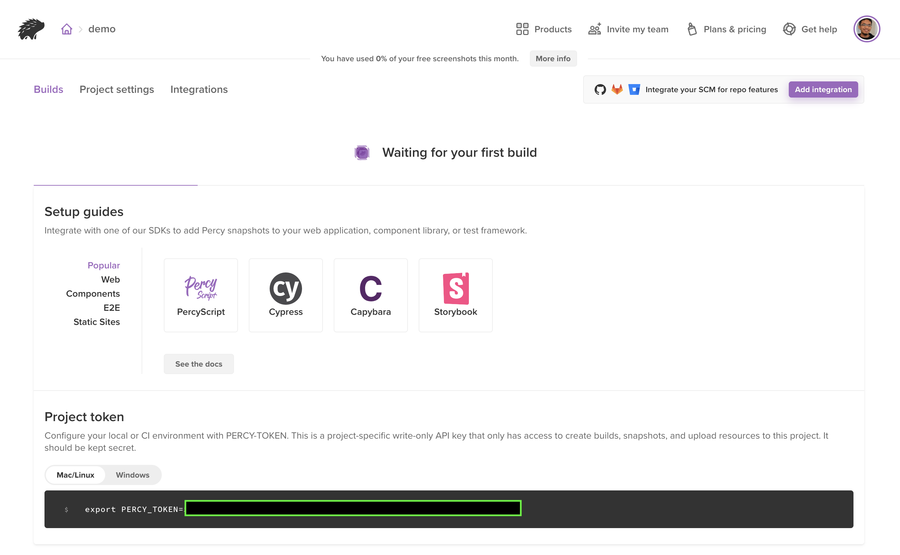
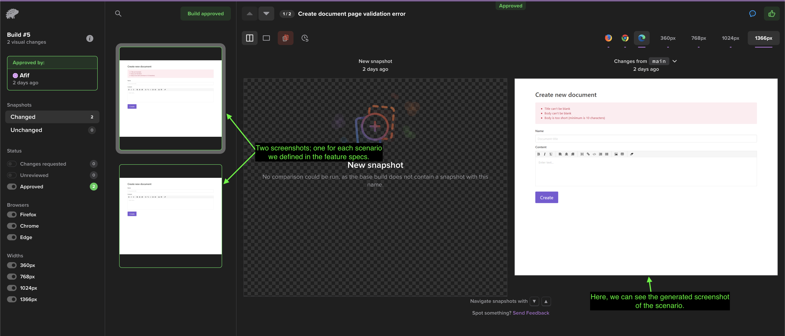
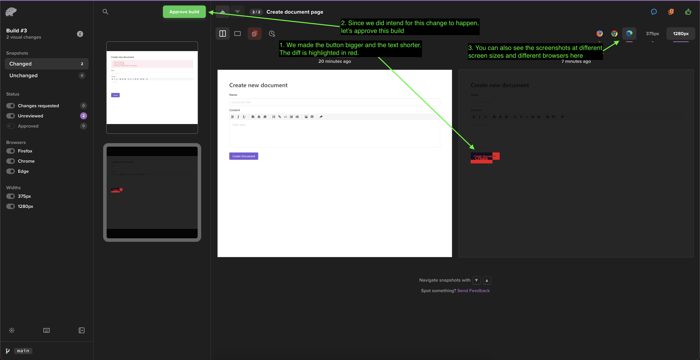
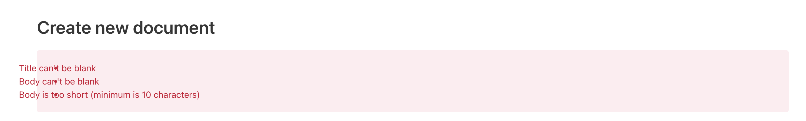
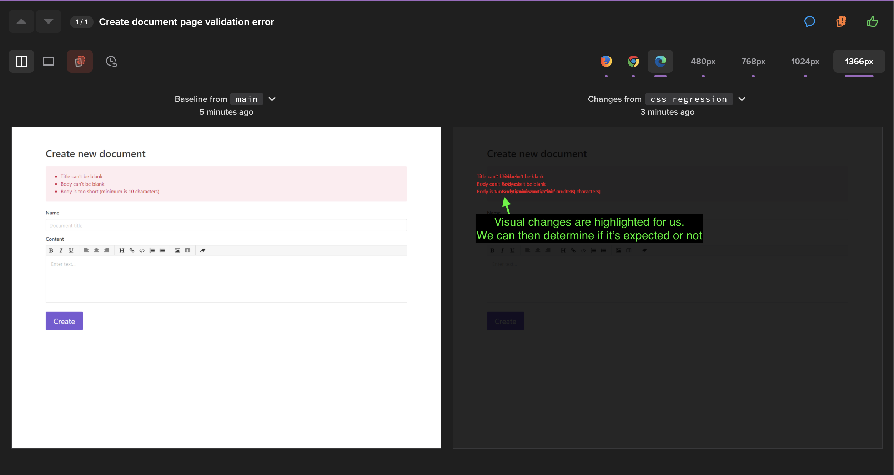

--- 
author: "Afif Sohaili"
title: "Catching CSS Regressions and Visual Bugs in Continous Integration"
tags: automation, ui, testing, css
gh_issue_number:
---

# Catching CSS Regressions and Visual Bugs in Continous Integration

Many projects nowadays are equipped with end-to-end tests to try to simulate real users and automatically test a real use case, but it still has a weakness. These browser automation tools run the tests by performing the interactions and assertions in the context of the DOM of the pages. That is very different from how humans use web applications, which is by looking at the user interface. Due to this, the tests' definition of a "functional web app" differ from that of a real human.

For example, let's take a simple music player with two buttons:
1. One in green with a play icon, and
2. One in red with a square icon.

The HTML would look something like this:
```
<!-- music player -->
<button class="button is-red"><i class="icon icon-square"/></button>
<button class="button is-green"><i class="icon icon-play"/></button>
```

In our end-to-end tests, one would typically instruct the test to check if:
1. the expected classnames exist
2. clicking the stop button stops the music
3. clicking the play button plays the music

If all of the above conditions were met, then the app is considered "functional". However, the tests have no way to verify if the right colors are actually reflected on the buttons, or if the SVG icons on the button are properly loaded and shown to the users. Unfortunately, for a real user, both of them are very crucial in telling the user how the app functions. If the stylings for the buttons are not implemented or the SVG icons for the buttons fail to load, users will not have a clear indication on how the app works, and the app will _not_ be considered "functional" by real users, even though the functionalities of both buttons are wired correctly in the code.

---

Web developers also frequently deal with styling regressions. This can happen due to the "cascading" characteristic of CSS, in which wrongly scoping the CSS values may affect other elements in unrelated areas unintentionally. Many times, styling regressions slip past even the end-to-end tests with browser automation because, again, end-to-end tests only verify that the app's functionalities are wired together, but do not check if things appear the right way visually.

## Visual regression testing to the rescue

Visual regression testing adds another quality gate in the workflow to allow developers to verify that what the user is seeing after a code change is as expected, i.e. if the code change is supposed to modify the appearance of an element, developers can verify that it's doing just that, or at the very least, the code change should not adversely affect other areas. Visual regression testing involves taking screenshots of the tested scenarios that have the new changes and comparing them against the baseline (usually screenshots from the stable branch). This type of test complements the other testing categories in the Testing Pyramid and ensure user experience is not adversely affected from any given code changes.

There are many tools that help with visual regression testing. Here are some tools that you could look into:
1. Percy.io
   - Generous free tier to get you started.
   - 5000 free screenshots per month with unlimited team members. This should get you going just fine for smaller projects.
   - Integrate with many mainstream end-to-end tests frameworks.
2. Applitools
   - Uses AI-powered computer vision for visual diffing. Said to reduce a lot of false positives and are more efficient.
3. Testim.io Automation
   - Another service that uses AI-powered computer vision.
4. BackstopJS
   - A Node.js library you can set up yourself.

Each tool has its own strengths and weaknesses. For today's demonstration, we are going to look at implementing visual regression testing with Percy and see how it works.

## Integrating Percy

Percy provides comprehensive guides to get you started with many popular end-to-end test frameworks such as Selenium, Cypress, TestCafe, and Capybara. You can check the documentation to see [how to integrate it with your project](https://docs.percy.io/docs/example-apps). Since we work primarily with Rails at End Point, we are going to demonstrate integrating Percy within a Rails project alongside Rspec/Capybara-driven end-to-end tests.

In this article, we are going to use this [simple Rails project](https://github.com/afifsohaili-ep/dockified-demo) I built for fun as the demo. It is just a simple wiki project using Vue and Rails. Let's start.

### 1. Register an account at [percy.io](https://percy.io)

1. Head to [percy.io](https://percy.io) and click the "Start for Free" button on the top-right side.
2. Choose the preferred sign up method. In this case, we are just going to use email and password, so we will choose _Sign Up with Browserstack_.
3. Fill in the email and password and complete the registration. It will then send an email to ask us to verify our email address. Let's check our email and complete the email verification.
4. Next, we will see the Get Started screen. We will choose _Create a New Project_ and give it a relevant name.
5. We have now successfully created a new percy.io project and should be on the project page. There are some links to setup guides that can help us integrate Percy into our project.

6. Let's navigate to Project Settings. We will scroll down to the `Branch Settings` section and make sure the *Default base branch* points to the primary branch of our project's repository. This is usually `main`, `master` or `develop` depending on your team's workflow. You might want to make the same branch auto-approved as well. That way, screenshots from this branch will be treated as the baseline and will be used when comparing against the development branches. In our case, we are using the `main` branch so we will specify that in both fields.

Great, we have now successfully set up Percy. There are other configurations in the Project Settings page (e.g. browsers to enable, diff sensitivity, and whether or not to allow public viewers), but we do not have to care about them for the purpose of this demo. You can always come back and tweak this later according to your project's requirements.

### 2. Integrate with the Rails project

Now, let's look at how to integrate Percy with our demo Rails project. Percy provides a comprehensive guide to do that [here](https://docs.percy.io/docs/capybara).

1. First, let's export the `PERCY_TOKEN` provided to us in the *Builds* page into our environment variable.
```
export PERCY_TOKEN=<value>
```
2. Then, we will add `percy-capybara` into our Gemfile and run `bundle install`.
```
gem 'percy-capybara'
```
3. Next, let's install `@percy/agent` via NPM/Yarn.
```
yarn add --dev @percy/agent
```

That's it! Now let's look at adding Percy to our feature specs.

### 3. Percy in Feature Specs

Percy has to be integrated into feature specs (i.e. end-to-end tests) because it requires the app to be running in order for it to be able to take screenshots. Hence, it will not work in unit tests in which the application context is mocked and chunks of code are tested in isolation. For more information on different categories of testing, visit [this blog post](https://www.endpoint.com/blog/2020/09/22/automated-testing-with-symfony) by my colleague, Kevin.

First, we will check out the primary working branch `main` and take a look at the existing feature specs:

```ruby
# spec/integration/document_spec.rb
require "rails_helper"

RSpec.feature "Add documents", js: true do
  before :each do
    User.create(email: 'user@example.com', password: 'password')

    visit "/documents/new"

    within("#new_user") do
      fill_in 'Email', with: 'user@example.com'
      fill_in 'Password', with: 'password'
    end

    click_button 'Log in'
  end

  scenario "User visits page to create new document" do
    expect(page).to have_text('Create new document')
  end

  scenario "User sees validation errors" do
    click_button 'Create'

    expect(page).to have_text('Title can\'t be blank')
    expect(page).to have_text('Body can\'t be blank')
    expect(page).to have_text('Body is too short (minimum is 10 characters)')
  end
end
```

The feature specs are pretty simple. `/documents/new` is a route that only registered users can access, so upon visiting the path, `devise` is going to ask the visitor to authenticate before they can access the page.

1. The first test case verifies that the user can see the _Create new document_ page upon successfully signing in.
2. The second case verifies that the user will see validation errors if they do not fill in the required details for the new document.

**Adding Percy into the mix**

To add Percy, simply `require "percy"` at the top of the spec file and add `Percy.snapshot(page, { name: '<screenshot description>' })` on the lines in which we want Percy to capture.

```ruby
# spec/integration/document_spec.rb
require "rails_helper"
# Include Percy in our feature specs
require "percy"

RSpec.feature "Add documents", js: true do
  before :each do
    User.create(email: 'user@example.com', password: 'password')

    visit "/documents/new"

    within("#new_user") do
      fill_in 'Email', with: 'user@example.com'
      fill_in 'Password', with: 'password'
    end

    click_button 'Log in'
  end

  scenario "User visits page to create new document" do
    expect(page).to have_text('Create new document')
    # Screenshot when we're redirected to the create new document page
    Percy.snapshot(page, { name: 'Create document page' })
  end

  scenario "User sees validation errors" do
    click_button 'Create'

    expect(page).to have_text('Title can\'t be blank')
    expect(page).to have_text('Body can\'t be blank')
    expect(page).to have_text('Body is too short (minimum is 10 characters)')
    # Screenshot when we see the errors
    Percy.snapshot(page, { name: 'Create document page validation error' })
  end
end
```

That's it! Easy enough, right? Next, let's run the tests so that the screenshots are taken and sent to percy.io. To do this, we cannot run the usual `bundle exec rspec`. Instead, we will have to run Percy and pass `rspec` to it.
```
yarn percy exec -- rspec
```
Note: This is the command that you should use if you have continuous integration set up.

And we're done here! Now, if we go to percy.io, we can see that a new build has been created for us. After a few minutes, we should see the screenshots of the app.



### 4. Introduce visual changes and see how percy.io compares

The last step we ran was on the primary working branch. Since we set this branch as the baseline and that the screenshots from this branch would be auto-approved, we are not going to be asked to verify anything on this build.

Therefore, to demonstrate the visual diff-ing feature of Percy, let's create another branch `highlight-create-button`, and let's make the `Create Document` button appear bigger as well as change the text to just say `Create`.

```erb
<%# app/views/documents/_form.html.erb %>

<%# ... %>

<%# Old button %>
<%#= form.submit class: 'button is-primary' %>

<%# New button %>
<%= form.submit "Create", class: 'button is-primary is-large' %>
```

Awesome! Now, let's rerun `yarn percy exec -- rspec` and analyse the visual diff on percy.io.

Once percy.io is done processing the new screenshots, it will compare the screenshots against the baseline in the `main` branch. We will see this in our new build:



As you can see, Percy highlights any changed areas in red. This makes it easier for us to spot the differences. In this case, it is expected for the button to change, so we can just go ahead and approve the build with the green button at the top.

### 5. What about style regressions?

Let's do one more demonstration. This time, let's simulate a CSS change gone wrong:
1. Create another git branch called `css-regression`.
2. Add a `text-indent: -5rem` to the error messages to push the text out of its container. This is how it would look like:

3. Let's run `bundle exec rspec`. We will get this output:
```
>bundle exec rspec
Capybara starting Puma...
* Version 5.3.2 , codename: Sweetnighter
* Min threads: 0, max threads: 4
* Listening on http://127.0.0.1:65318
..

Finished in 2.62 seconds (files took 1.3 seconds to load)
2 examples, 0 failures
```
4. As you can see, the tests were not able to catch this styling regression. This is because the error messages specified in the assertion still exist on the page, so the use case is not considered broken in the "eyes" of the regular feature specs.
5. Now, run `yarn percy exec -- rspec` to send the screenshots to percy.io to be processed.
6. Great, percy.io was able to catch the regression here in the visual diff! A reviewer can just mark the build as "Requested changes" and leave a comment in there to have it fixed.


### 6. Responsive design and cross-browser testing

Percy can also help test your app's UI on different browsers (namely Edge, Firefox, and Chrome). By default, all three browsers are enabled. You do not need to do anything else.

It can be used to test against different screen sizes as well. You can just select the screen sizes that are relevant to you and instruct Percy to take screenshots at those screen sizes automatically. This is particularly helpful as testing on several screen size variants can be very time-consuming. With Percy, you do not have to pay attention to the screenshot variants that do not diverge from the baseline.

In order to specify screen sizes, just pass a list of screen sizes that you are interested in, like so:
```ruby
Percy.snapshot(page, { name: 'Create document page', widths: [480, 768, 1024, 1366] })
```

Rerun `yarn percy exec -- rspec`. We can now see the different variants (browsers and screen sizes) of each scenario on the top-right corner of the screen.


That's it! We have successfully demonstrated how Percy can help us verify expected UI changes and catch visual regressions.

## Caveats

As helpful and as crucial as it is, visual regression testing is not without its caveats. One of the most common issues with visual regression testing is, in some cases, it can produce a huge amount of false positives. Major-but-intentional layout shifts and changes to shared elements may result in having to review a huge amount of screenshots in the project. 

For example, let's say you increase the height of the site header (which is a common element in _all_ pages) by 30px. When Percy processes the screenshots, it will invalidate most of the screenshots in the project, because elements would have been shifted down by 30px as a result of the taller header. For large projects, reviewing each screenshot one-by-one can be a hassle, especially with the tens of permutations for each screenshot to cater different screen sizes and browsers. As a result, one would be tempted to just click "Approve build", thinking all changed areas would just be elements being pushed down, but that may not necessarily be true for elements with `position: absolute;`; they might get hidden behind the now taller header, and this may cause visual regressions to still slip into production, which kind of defeats visual testing's original purpose.

Other than that, dealing with external resources can also result in flaky builds (e.g. if a page has an iframe or links to an external image). There are a lot of ways in which an external resource can change, e.g. image quality, content, updated resource, etc., and because these resources are outside of our control, they may become a source of false positives and a nuissance to the reviewers.

One way to deal with this is to not screenshot whole pages. Instead, screenshot only the individual components that are relevant to each scenario. This way, layout shifts in other parts of the pages will not affect the build in major ways, and it also helps cut out the changes from external resources on the page. Unfortunately, Percy does not have the capability to do this yet (refer [here](https://github.com/percy/percy-cypress/issues/56#issuecomment-824183541)).

## Conclusion

So, there you go! I hope this article has given you a good introduction to visual regression testing, why should you have it, and how to get started with it. Hope it will benefit you and your team in pushing great web applications!

Other resources:
1. [(YouTube) Your Tests Lack Vision: Adding Eyes to your Automation Framework](https://www.youtube.com/watch?v=spyKZ-p3UgE)
2. [(YouTube) Visual Regression Testing for Your Web Apps](https://www.youtube.com/watch?v=_ls5P97-REU)
3. [Keeping a React Design System consistent: using visual regression testing to save time and headaches](https://techblog.commercetools.com/keeping-a-react-design-system-consistent-f055160d5166)
4. [Making visual regression useful](https://medium.com/@philgourley/making-visual-regression-useful-acfae27e5031)
