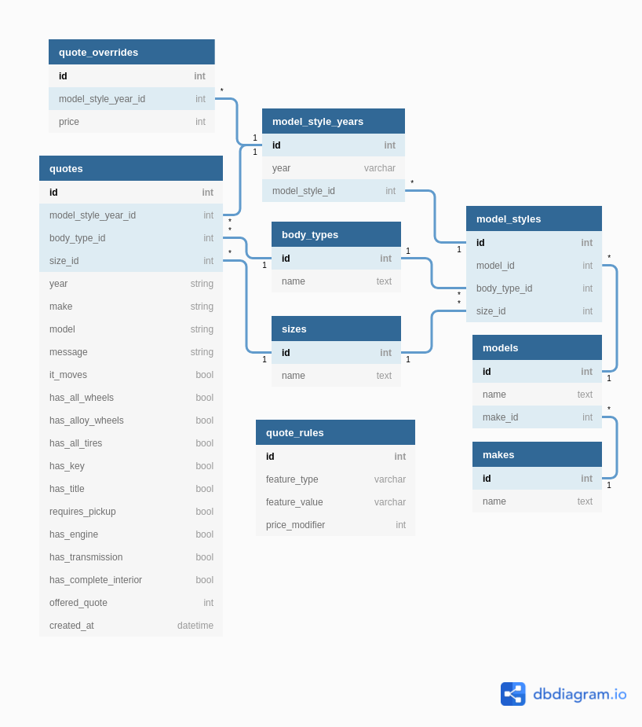
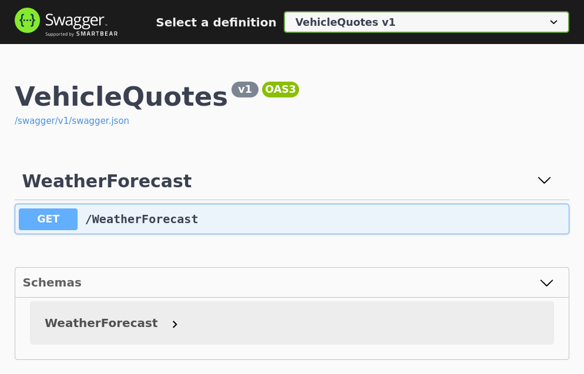
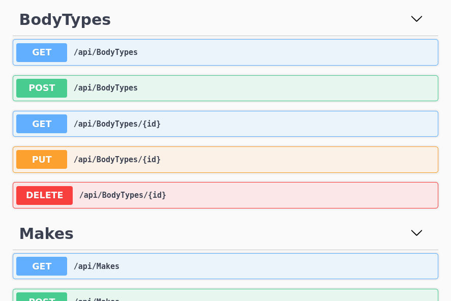
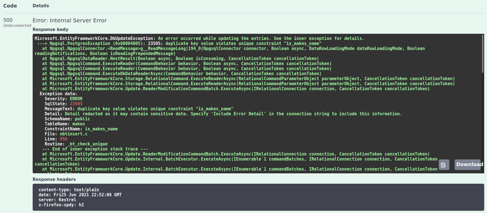
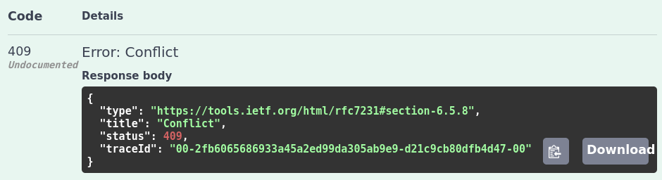
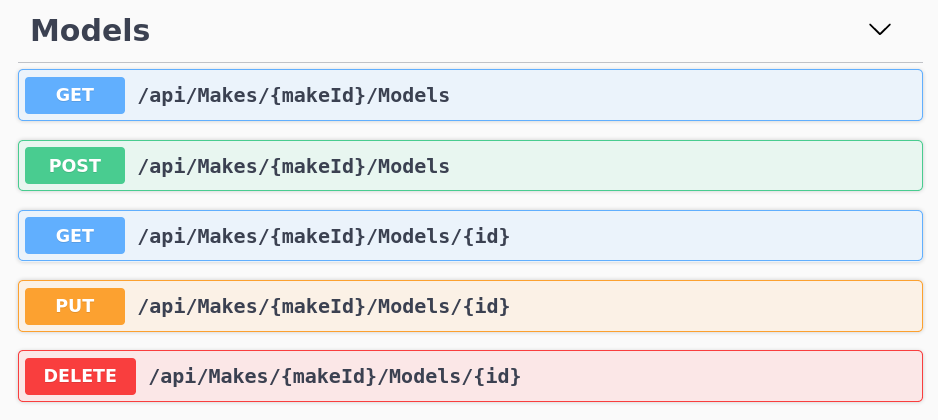
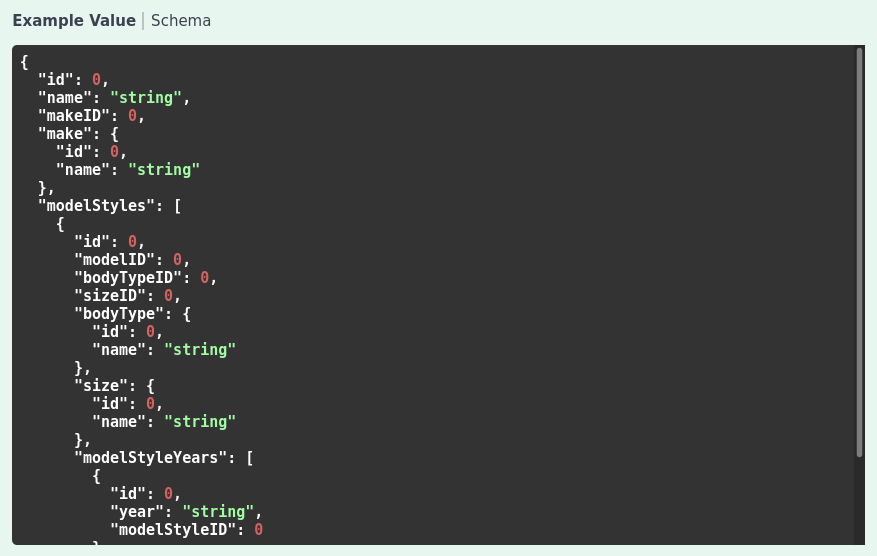

# Building REST APIs with .NET 5, ASP.NET Core and PostgreSQL

This is old news by now, but I'm still amazed by the fact that nowadays .NET is open source and can run on linux. I truly believe that this new direction can help the technology realize its true potential, since it's no longer shackled to Windows based deployments. I've personally been outside the .NET game for a good while, but with the milestone release of .NET 5, I think now is a great time to dive in.

So I thought of taking some time to do just that, really dive in, see what's new, and get a sense of the general developer experience that the current incarnation of .NET offers. So in this blog post, I'm going to chronicle my experience developing a simple, but complete REST API application. Along the way, I'll touch on the most common problems that one runs into when develping such applications and how are they solved in the .NET world. So think of this piece as a sort of tutorial or overview of the most common framework features when it comes to developing REST APIs.

First, let's get familiar with what we're building.

## The demo application

The application that we'll be building throughout this article will address a request from a hypothetical car junker business. Our client wants to automate the proces of calculating how much money to offer their customers for their vehicles, given certain information about them. And they want an app to do that. We are building the back end component that will support that app. It is a REST API that allows users to provide vehicle information (year, make, model, condition, etc) and will produce a quote of how much money would our hypothetical client be willing to pay for it.

Here's a short list of features that we need to implement in order to fulfill that requirement:

1. Given a vechicle model and condition, calculate a price.
2. Store and manage pricing rules that are used to calculate vehicle prices.
3. Store and manage pricing overrides on a vehicle model basis. Price overrides are used regardless of the current rules.
4. CRUD vehicle models so that overrides can the specified for them.

## The data model

Here's what our data model looks like:



The main table in our model is the `quotes` table. It stores all the requests for quotes received from our client's customers. It captures all the relevant vehicle information in terms of model and condition. It also captures the offered quote; that is, the money value that our system calculates for their vehicle.

The `quotes` table includes all the fields that identify a vehicle: year, make, model, body style and size. It also includes an `model_style_year_id` field which is an optional foreign key to another table. This FK points to the `model_style_years` table which contains specific vehicle models that our system can store explicitly.

The idea of this is that, when a customer submits a request for a quote, if we have their vehicle registered in our database, then we can populate this foreign key and link the quote with the specific vehicle that it's quoting. If we don't have their vehicle registered, then we leave that field unpopulated. Either way, we can offer a quote. The only difference being the level or certainty of such quote.

The records in the `model_style_years` table represent specific vechicles. That whole hierarchy works like this: A vehicle make (e.g. Honda, Toyota, etc in the `makes` table) has many models (e.g. Civic, Corolla, etc in the `models` table), each model has many styles (the `model_styles` table). Styles are combinations of body types (the `body_types` table) and sizes (the `sizes` table) (e.g. Mid-size Sedan, Compact Coupe, etc). And finally, each model style has many years (via the `model_style_years` table).

This model allows us very fine grained differentiation between vehicles. For example, we can have a "2008 Honda Civic Hatchback which is a Compact car" and also a "1990 Honda Civic Hatchback which is a Sub-compact". That is, same model, different year, size or body type. 

We also have a `quote_rules` table which stores the rules that are applied when it comes to calculating a vehicle quote. The rules are pairs of key-values with an associated monetary value. So for example, rules like "a vehicle that has alloy wheels is worth $10 more" can be expressed in the table with a record where `feature_type` is "has_alloy_wheels", `feature_value` is "true" and `price_modifier` is "10".

Finally, we have a `quote_overrides` table which specifies a flat, static price for specific vehicles (via the link to the `model_style_years` table). The idea here is that if some customer requests a quote for a vehicle for which we have an override, no price calculation rules are applied and they are offered what is specified in the override record.

## Setting up the PostgreSQL database with Docker

For this project, our database of choice is PostgreSQL. Luckily for us, getting a PostgreSQL instance up and runnig is very easy thanks to docker.

> If you want to learn more about dockerizing a typical web application, take a look at [this article](https://www.endpoint.com/blog/2020/08/27/containerizing-magento-with-docker-compose-elasticsearch-mysql-and-magento) that explains the process in detail.

Once you have docker installed in your machine, getting a PostgreSQL instance is as symple as running the following command:

```sh
$ docker run -d \
    --name vehicle-quote-postgres \
    -p 5432:5432 \
    --network host \
    -e POSTGRES_DB=vehicle_quote \
    -e POSTGRES_USER=vehicle_quote \
    -e POSTGRES_PASSWORD=password \
    postgres
```

Here we'er asking docker to run a new container based on the latest `postgres` image, name it `vehicle-quote-postgres`, specify the port to use the default PostgreSQL one, make it accessible to the local network (with the `--network host` option) and finally, specify a few environment variables that the `postgres` image uses when building our new instance to set up the default database name, user and password (with the three `-e` options).

After docker is done working its magic, you should be able to access the databse with something like:

```sh
$ docker exec -it vehicle-quote-postgres psql -U vehicle_quote
```

That will result in:

```sh
$ docker exec -it vehicle-quote-postgres psql -U vehicle_quote
psql (13.2 (Debian 13.2-1.pgdg100+1))
Type "help" for help.

vehicle_quote=#
```

This command is connecting to our new `vehicle-quote-postgres` container and then, from within the container, using the command line client `psql` in order to connect to the database.

If you have `psql` installed in your own machine, you use it directly to connect to the PostgreSQL instance running inside the container:

```sh
$ psql -h localhost -U vehicle_quote
```

This is possible because we specified in our `docker run` command that the container would be accepting traffic over port 5432 (`-p 5432:5432`) and that it would be accesible within the same network as our actual machine (`--network host`).

## Installing the .NET 5 SDK

Ok, with that out of the way, let's install .NET 5.

.NET 5 truly is multiplatform, so whatever environment you prefer to work with, they've got you covered. You can go to [the .NET 5 download page](https://dotnet.microsoft.com/download/dotnet/5.0) and pick your desired flavor of the SDK.

On Ubuntu 20.10, which is what I'm running, installation is painless. It's your typical process with APT and [this page from the official docs](https://docs.microsoft.com/en-us/dotnet/core/install/linux-ubuntu#2010-) has all the details.

First step is to add the Microsoft package repository:

```sh
$ wget https://packages.microsoft.com/config/ubuntu/20.10/packages-microsoft-prod.deb -O packages-microsoft-prod.deb

$ sudo dpkg -i packages-microsoft-prod.deb
```

Then, install with APT like one would any other software package:

```sh
$ sudo apt-get update; \
  sudo apt-get install -y apt-transport-https && \
  sudo apt-get update && \
  sudo apt-get install -y dotnet-sdk-5.0
```

Run `dotnet --version` in your console and you should see something like this:

```sh
$ dotnet --version
5.0.301
```

## Creating our ASP.NET Core REST API project

Ok now that we have our requirements, database and SDK, let's start setting up our project. We do so with the following command:

```sh
$ dotnet new webapi -o VehicleQuotes
```

This instructs the dotnet command line tool to create a new REST API web application project for us in a new `VehicleQuotes` directory.

As a result, dotnet will give you a `The template "ASP.NET Core Web API" was created successfully.` message and a new directory will be created with our web application files. The newly created `VehicleQuotes` looks like this:

```
.
├── appsettings.Development.json
├── appsettings.json
├── Controllers
│   └── WeatherForecastController.cs
├── obj
│   ├── project.assets.json
│   ├── project.nuget.cache
│   ├── VehicleQuotes.csproj.nuget.dgspec.json
│   ├── VehicleQuotes.csproj.nuget.g.props
│   └── VehicleQuotes.csproj.nuget.g.targets
├── Program.cs
├── Properties
│   └── launchSettings.json
├── Startup.cs
├── VehicleQuotes.csproj
└── WeatherForecast.cs
```

Important things to note here are the `appsettings.json` and `appsettings.Development.json` files which contain environment specific configuration values; the `Controllers` directory where we define our application controllers and action methods (i.e. our REST API endpoints); the `Program.cs` and `Startup.cs` files that contain our application's entry point and bootstrapping logic; and finally `VehicleQuotes.csproj` which is the file that contains project wide configuration that the framework cares about like references, compilatin targets, and other options. Feel free to explore.

The `dotnet new` command has given us quite a bit. These files make up a fully working application that we can run and play around with. It even has a Swagger UI, as I'll demonstrate shortly. A great place to get started from.

> You can also get a pretty comprehensive `.gitignore` file by running the `dotnet new gitignore` command.

From inside the `VehicleQuotes` directory, you can run the application with:

```
$ dotnet run
```

Which will start up a development server and give out the following output:

```
$ dotnet run
Building...
info: Microsoft.Hosting.Lifetime[0]
      Now listening on: https://localhost:5001
info: Microsoft.Hosting.Lifetime[0]
      Now listening on: http://localhost:5000
info: Microsoft.Hosting.Lifetime[0]
      Application started. Press Ctrl+C to shut down.
info: Microsoft.Hosting.Lifetime[0]
      Hosting environment: Development
info: Microsoft.Hosting.Lifetime[0]
      Content root path: /home/kevin/projects/endpoint/blog/VehicleQuotes
```

Open up a browser window and go to `https://localhost:5001/swagger` to find a Swagger UI listing our API's endpoints:



As you can see we've got a GET WeatherForecast endpoint in our app. This is included by default in the `webapi` project template that we specified in our call to `dotnet new`. You can see it defined in the `Controllers/WeatherForecastController.cs` file.

## Installing packages we'll need 

Now let's install all the tools and libraries we will need for our application. First, we install the ASP.NET Code Generator tool which we'll use later for scaffolding controllers:

```sh
$ dotnet tool install --global dotnet-aspnet-codegenerator
```

We also need to install the Entity Framework command line tools which help us with creating and applying database migrations:

```sh
$ dotnet tool install --global dotnet-ef
```

Now, we need to install a few libraries that we'll use in our project. First are all the packages that allow us to use Entity Framework Core, provide scaffolding support and give us a detailed debugging page for database errors:

```sh
$ dotnet add package Microsoft.VisualStudio.Web.CodeGeneration.Design
$ dotnet add package Microsoft.EntityFrameworkCore.Design
$ dotnet add package Microsoft.EntityFrameworkCore.SqlServer
$ dotnet add package Microsoft.AspNetCore.Diagnostics.EntityFrameworkCore
```

We also need the EF Core driver for PostgreSQL which will allow us to interact with our database:

```sh
$ dotnet add package Npgsql.EntityFrameworkCore.PostgreSQL
```

Finally, we need another package that will allow us to use the snake case naming convention for our database tables, fields, etc. We need this because EF Core uses capitalized camel case by default, which is not very common in the PostgreSQL world, so this will allow us to play nice. This is the package:

```sh
$ dotnet add package EFCore.NamingConventions
```

## Connecting to the database and performing initial app configuration

In order to connect to, query and modify a database using EF Core, we need to create a `DbContext`. This is a class that serves as the entry point into the database. Create a new directory called `Data` in the project root and add this new `VehicleQuotesContext.cs` file to it:

```cs
using Microsoft.EntityFrameworkCore;

namespace VehicleQuotes
{
    public class VehicleQuotesContext : DbContext
    {
        public VehicleQuotesContext (DbContextOptions<VehicleQuotesContext> options)
            : base(options)
        {
        }
    }
}
```

As you can see this is just a simple class that inherits from EF Core's `DbContext` class. That's all we need for now. We will continue building on this class as we add new tables and cofigurations.

Now, we need to add this class into ASP.NET Core's built in IoC container so that it's available to controllers and other classes via dependency injection, and tell it how to find our database. Go to `Startup.cs` and add the following using statement near the top of the file:

```cs
using Microsoft.EntityFrameworkCore;
```

That will allow us to do the following change in the `ConfigureServices` method:

```diff
public void ConfigureServices(IServiceCollection services)
{

    // ...

+    services.AddDbContext<VehicleQuotesContext>(options =>
+        options
+            .UseNpgsql(Configuration.GetConnectionString("VehicleQuotesContext"))
+    );
}
```

`services` contains all the objects (known as "services") that are available in the app for dependency injection. So here, we're adding our newly created `DbContext` to it, specifying that it will connect to a PostgreSQL database (via the `options.UseNpgsql` call), and that it will use a connection string named `VehicleQuotesContext` from the app's default configuration file. So let's add the connection string then. To do so, change the `appsettings.json` like so:

> `UseNpgsql` is an extension method made available to us by the `Npgsql.EntityFrameworkCore.PostgreSQL` package that we installed in the previous step.

```diff
{
  "Logging": {
    "LogLevel": {
      "Default": "Information",
      "Microsoft": "Warning",
      "Microsoft.Hosting.Lifetime": "Information"
    }
  },
-  "AllowedHosts": "*"
+  "AllowedHosts": "*",
+  "ConnectionStrings": {
+      "VehicleQuotesContext": "Host=localhost;Database=vehicle_quote;Username=vehicle_quote;Password=password"
+  }
}
```

This is your typical PostgreSQL connection string. The only gotcha is that it needs to be specified under `ConnectionStrings` -> `VehicleQuotesContext` so that our call to `Configuration.GetConnectionString` can find it.

Now let's put the `EFCore.NamingConventions` package to good use and configure EF Core to use sake case when naming database objects. Add the following to the `ConfigureServices` method in `Startup.cs`:

```diff
public void ConfigureServices(IServiceCollection services)
{
    // ...

    services.AddDbContext<VehicleQuotesContext>(options =>
        options
            .UseNpgsql(Configuration.GetConnectionString("VehicleQuotesContext"))
+           .UseSnakeCaseNamingConvention()
    );
}
```

> `UseSnakeCaseNamingConvention` is an extension method made available to us by the `EFCore.NamingConventions` package that we installed in the previous step.

Now let's make logging a little bit more verbose with:

```diff
public void ConfigureServices(IServiceCollection services)
{
    // ...

    services.AddDbContext<VehicleQuotesContext>(options =>
        options
            .UseNpgsql(Configuration.GetConnectionString("VehicleQuotesContext"))
            .UseSnakeCaseNamingConvention()
+           .UseLoggerFactory(LoggerFactory.Create(builder => builder.AddConsole()))
+           .EnableSensitiveDataLogging()
    );
}
```

This will make sure full databse queries appear in the log in the console, including parameter values. This could expose sensitive data so be careful when using `EnableSensitiveDataLogging` in production.

We can also add the following service configuration to have the app display detailed error pages when something related to the databse or migrations goes wrong:

```diff
public void ConfigureServices(IServiceCollection services)
{
    // ...

+   services.AddDatabaseDeveloperPageExceptionFilter();
}
```

> `AddDatabaseDeveloperPageExceptionFilter` is an extension method made available to us by the `Microsoft.AspNetCore.Diagnostics.EntityFrameworkCore` package that we installed in the previous step.

Finally, one last configuration I like to do is have the Swagger UI show up at the root URL. So that instead of using `https://localhost:5001/swagger`, we're able to just use `https://localhost:5001`. We do so by by updating the `Configure` method this time, in the same `Startup.cs` file that we've been working on:

```diff
public void Configure(IApplicationBuilder app, IWebHostEnvironment env)
{
    if (env.IsDevelopment())
    {
        app.UseDeveloperExceptionPage();
        app.UseSwagger();
-       app.UseSwaggerUI(c => c.SwaggerEndpoint("/swagger/v1/swagger.json", "VehicleQuotes v1"));
+       app.UseSwaggerUI(c => {
+           c.SwaggerEndpoint("/swagger/v1/swagger.json", "VehicleQuotes v1");
+           c.RoutePrefix = "";
+       });
    }
```

The magic is done by the `c.RoutePrefix = "";` line which makes it so there's no need to put any prefix in order to acess the autogenerated Swagger UI.

Try it out. Do `dotnet run` and navigate to `https://localhost:5001` and you should see the Swagger UI there.

## Creating model entities, migrations and updating the database

Alright, with all that configuration out of the way, let's implement some of our actual application logic now. Refer back to our data model. We'll start by defining our three simplest tables: `makes`, `sizes` and `body_types`. With EF Core, we define tables via so-called POCO entities. Which are simple C# classes with some properties. The classes become tables and the properties become the table fields. Instances of these classes represent records in the databse.

So, create a new `Models` directory in our project's root and add these three files:

```cs
// Models/BodyType.cs
namespace VehicleQuotes.Models
{
    public class BodyType
    {
        public int ID { get; set; }
        public string Name { get; set; }
    }
}
```

```cs
// Models/Make.cs
namespace VehicleQuotes.Models
{
    public class Make
    {
        public int ID { get; set; }
        public string Name { get; set; }
    }
}
```

```cs
// Models/Size.cs
namespace VehicleQuotes.Models
{
    public class Size
    {
        public int ID { get; set; }
        public string Name { get; set; }
    }
}
```

Now, we add three corresponding `DbSet`s to our `DbContext` in `Data/VehicleQuoteContext.cs`. Here's the diff:

```diff
using Microsoft.EntityFrameworkCore;
+using VehicleQuotes.Models;

namespace VehicleQuotes
{
    public class VehicleQuotesContext : DbContext
    {
        public VehicleQuotesContext (DbContextOptions<VehicleQuotesContext> options)
            : base(options)
        {
        }

+       public DbSet<Make> Makes { get; set; }
+       public DbSet<Size> Sizes { get; set; }
+       public DbSet<BodyType> BodyTypes { get; set; }
    }
}
```

This is how we tell EF Core to build tables in our databse for our entities. You'll see later how we use those `DbSet`s to access the data in those tables. For now, let's create a migration script that we can later run to apply changes to our database. Run the following to have EF Core create it for us:

```sh
$ dotnet ef migrations add AddLookupTables
```

Now take a loot at the newly created `Migrations` directory. It contains a few new files, but the one we care about right now is `Migrations/{TIMESTAMP}_AddLookupTables.cs`. In its `Up` method, it's got some code in there that will modify the databse structure when run. That's right, the EF Core tooling has inspected our project, identified the new entities, and automatically generated a migration script for us that creates tables for them. Notice also how the tables and fields use the snake case naming convention, just as we specified with the call to `UseSnakeCaseNamingConvention` in `Startup.cs`.

Now, to actually run the migration script and apply the changes to the database, we do:

```sh
$ dotnet ef database update
```

That command inspects our project to find any migrations that haven't been run yet, and applies them. In this case, we only have one, so that's what it runs. Look at the output in the console to see it working its magic step by step:

```sh
$ dotnet ef database update
Build started...
Build succeeded.
warn: Microsoft.EntityFrameworkCore.Model.Validation[10400]
      Sensitive data logging is enabled. Log entries and exception messages may include sensitive application data; this mode should only be enabled during development.

...

info: Microsoft.EntityFrameworkCore.Database.Command[20101]
      Executed DbCommand (4ms) [Parameters=[], CommandType='Text', CommandTimeout='30']
      CREATE TABLE sizes (
          id integer GENERATED BY DEFAULT AS IDENTITY,
          name text NULL,
          CONSTRAINT pk_sizes PRIMARY KEY (id)
      );
info: Microsoft.EntityFrameworkCore.Database.Command[20101]
      Executed DbCommand (1ms) [Parameters=[], CommandType='Text', CommandTimeout='30']
      INSERT INTO "__EFMigrationsHistory" (migration_id, product_version)
      VALUES ('20210625212939_AddLookupTables', '5.0.7');
Done.
```

Notice how it warns us about potential exposure of sensitive data because of that `EnableSensitiveDataLogging` option we opted into in `Startup.cs`. Also, EF Core related logs are extra verbose showing all database operations because of another configuration option that we applied there: the `UseLoggerFactory(LoggerFactory.Create(builder => builder.AddConsole()))` one.

You can connect to the database with the `psql` command line client and see that the changes took effect:

```
$ psql -h localhost -U vehicle_quote

...

vehicle_quote=# \c vehicle_quote 
psql (12.7 (Ubuntu 12.7-0ubuntu0.20.10.1), server 13.2 (Debian 13.2-1.pgdg100+1))
You are now connected to database "vehicle_quote" as user "vehicle_quote".
vehicle_quote=# \dt
                   List of relations
 Schema |         Name          | Type  |     Owner     
--------+-----------------------+-------+---------------
 public | __EFMigrationsHistory | table | vehicle_quote
 public | body_types            | table | vehicle_quote
 public | makes                 | table | vehicle_quote
 public | sizes                 | table | vehicle_quote
(4 rows)

vehicle_quote=# \d makes
                            Table "public.makes"
 Column |  Type   | Collation | Nullable |             Default              
--------+---------+-----------+----------+----------------------------------
 id     | integer |           | not null | generated by default as identity
 name   | text    |           |          | 
Indexes:
    "pk_makes" PRIMARY KEY, btree (id)
```

There are our tables in all their normalized, snake cased glory. The `__EFMigrationsHistory` table is used internally by EF Core to keep track of which migrations have been applied.

## Creating controllers for CRUDing our tables

Now that we have that, let's add a few endpoints to support basic CRUD of those tables. We can use the `dotnet-aspnet-codegenerator` scaffoldind tool that we installed earlier. For the three that we have, we would do:

```
$ dotnet aspnet-codegenerator controller \
    -name MakesController \
    -m Make \
    -dc VehicleQuotesContext \
    -async \
    -api \
    -outDir Controllers

$ dotnet aspnet-codegenerator controller \
    -name BodyTypesController \
    -m BodyType \
    -dc VehicleQuotesContext \
    -async \
    -api \
    -outDir Controllers

$ dotnet aspnet-codegenerator controller \
    -name SizesController \
    -m Size \
    -dc VehicleQuotesContext \
    -async \
    -api \
    -outDir Controllers
```

Those commands tell the scaffolding tool to create new controllers that:

1. Is named as given by the `-name` option.
2. Uses the model class specified in the `-m` option.
3. Uses our `VehicleQuotesContext` to talk to the databse. As per the `-dc` option.
4. Defines the methods using `async`/`await` syntax. Given by the `-async` option. 
5. Is an API controller. Specified by the `-api` option.
6. Is created in the `Controllers` directory. Via the `-outDir` option.

Explore the new files that got created in the `Controllers` directory: `MakesController.cs`, `BodyTypesController.cd` and `SizesController.cs`. The controllers have been generated with the necessary [Action Methods](https://docs.microsoft.com/en-us/aspnet/mvc/overview/older-versions-1/controllers-and-routing/aspnet-mvc-controllers-overview-cs#understanding-controller-actions) to fetch, create, update and delete their corresponding entities. Try `dotnet run` and navigate to `https://localhost:5001` to see the new endpoints in the Swagger UI:



Try it out! You can interact with each of the endpoints from the Swagger UI and it all works as you'd expect.

## Adding unique constraints via indexes

Ok, our app is coming along well. Right now though, there's an issue with the tables that we've created. It's possible to create vehicle makes with the same name. The same is true for body types and sizes. This doesn't make much sense for these tables. So let's fix that by adding a uniqueness constraint. We can do it by creating a unique database index using EF Core's `Index` attribute. For example, we can modify our `Models/Make.cs` like so:

```diff
+using Microsoft.EntityFrameworkCore;

namespace VehicleQuotes.Models
{
+   [Index(nameof(Name), IsUnique = true)]
    public class Make
    {
        public int ID { get; set; }
        public string Name { get; set; }
    }
}
```

In fact, do the same for our other entities in `Models/BodyType.cs` and `Models/Size.cs`. Don't forget the `using Microsoft.EntityFrameworkCore` statement.

With that, we can create a new migration:

```
$ dotnet ef migrations add AddUniqueIndexesToLookupTables
```

That will result in a new migration script in `Migrations/{TIMESTAMP}_AddUniqueIndexesToLookupTables.cs`. It's `Up` method looks like this:

```cs
protected override void Up(MigrationBuilder migrationBuilder)
{
    migrationBuilder.CreateIndex(
        name: "ix_sizes_name",
        table: "sizes",
        column: "name",
        unique: true);

    migrationBuilder.CreateIndex(
        name: "ix_makes_name",
        table: "makes",
        column: "name",
        unique: true);

    migrationBuilder.CreateIndex(
        name: "ix_body_types_name",
        table: "body_types",
        column: "name",
        unique: true);
}
```

As you can see, new unique indexes are being created on the tables and fields that we specified. Like before, apply the changes to the database structure with:

```sh
$ dotnet ef database update
```

Now if you try to create, for example, a vehicle make with a repeated name, you'll get an error. Try doing so by `POST`ing to `/api/Makes` via the Swagger UI:



## Reponding with specific HTTP error codes (409 Conflict)

The fact that we can now enforce unique constraints is all well and good. But the error scenario is not very user friendly. Instead of returning an "500 Internal Server Error" status code with a wall of text, we should be responding with something more sensible. Maybe a 409 Conflict would be more appropriate for this kind of error. We can easily update our controllers to handle that scenario. What we need to do is update the methods that handle the `POST` and `PUT` endpoints so that they catch the `Microsoft.EntityFrameworkCore.DbUpdateException` exception and return the proper response. Here's how we would do it for the `MakesController`:

```diff
// ...
namespace VehicleQuotes.Controllers
{
    [Route("api/[controller]")]
    [ApiController]
    public class MakesController : ControllerBase
    {
        // ...

        [HttpPut("{id}")]
        public async Task<IActionResult> PutMake(int id, Make make)
        {
            // ...

            try
            {
                await _context.SaveChangesAsync();
            }
            // ...
+           catch (Microsoft.EntityFrameworkCore.DbUpdateException)
+           {
+               return Conflict();
+           }

            return NoContent();
        }

        [HttpPost]
        public async Task<ActionResult<Make>> PostMake(Make make)
        {
            _context.Makes.Add(make);
-           await _context.SaveChangesAsync();

+           try
+           {
+               await _context.SaveChangesAsync();
+           }
+           catch (Microsoft.EntityFrameworkCore.DbUpdateException)
+           {
+               return Conflict();
+           }

            return CreatedAtAction("GetMake", new { id = make.ID }, make);
        }

        // ...
    }
}
```

Go ahead and do the same for the other two, and try again to POST a repeated make name via the Swagger UI. You should see this now instead:



Much better now, don't you think?

## Adding a more complex entity to the model

Now let's work on an entity that's a little bit more complex: the one we will use to represent vehicle models.

For this entity, we don't want our API to be as low level as for the other three, where it was basically a thin wrapper over database tables. We want it to be a little bit more abstract and not expose the entire database structure verbatim.

Refer back to the data model. We'll add `models`, `model_styles` and `model_style_years`. Let's start by adding the following classes:

```cs
// Models/Model.cs
using System.Collections.Generic;

namespace VehicleQuotes.Models
{
    public class Model
    {
        public int ID { get; set; }
        public string Name { get; set; }
        public int MakeID { get; set; }

        public Make Make { get; set; }

        public ICollection<ModelStyle> ModelStyles { get; set; }
    }
}
```

```cs
// Models/ModelStyle.cs
using System.Collections.Generic;

namespace VehicleQuotes.Models
{
    public class ModelStyle
    {
        public int ID { get; set; }
        public int ModelID { get; set; }
        public int BodyTypeID { get; set; }
        public int SizeID { get; set; }

        public Model Model { get; set; }
        public BodyType BodyType { get; set; }
        public Size Size { get; set; }

        public ICollection<ModelStyleYear> ModelStyleYears { get; set; }
    }
}
```

```cs
// Models/ModelStyleYear.cs
namespace VehicleQuotes.Models
{
    public class ModelStyleYear
    {
        public int ID { get; set; }
        public string Year { get; set; }
        public int ModelStyleID { get; set; }

        public ModelStyle ModelStyle { get; set; }
    }
}
```

Notice how some of these entities now include properties whose types are other entities. Some of them are collections even. These are called Navigation Properties and are how we tell EF Core that our entities are related to one another. These will result in foreign keys being created in the database.

Take the `Model` entity for example. It has a property `Make` of type `Make`. It also has a `MakeID` property of type `int`. EF Core sees this and figures out that there's a relation between the `makes` and `models` tables. Specifically, that `models` have a `make`. A many-to-one relation where the `models` table stores a foreign key to the `makes` table.

Similarly, the `Model` entity has a `ModelStyles` property of type `ICollection<ModelStyleYear>`. This tells EF Core that `models` have many `model_styles`. This one is a one-to-many relation from the perspective of the `models` table. The foreign key lives in the `model_styles` table and points back to `models`.

After that, same as before, we have to add the corresponding `DbSet`s to our `DbContext`:

```diff
// ...

namespace VehicleQuotes
{
    public class VehicleQuotesContext : DbContext
    {
        // ...

+       public DbSet<Model> Models { get; set; }
+       public DbSet<ModelStyle> ModelStyles { get; set; }
+       public DbSet<ModelStyleYear> ModelStyleYears { get; set; }
    }
}
```

Don't forget the migration script. First create it:

```
$ dotnet ef migrations add AddVehicleModelTables
```

And then apply it:

```
$ dotnet ef database update
```

## Adding composite unique indexes

These vehicle model related tables also need some uniqueness enforcement. This time however, the unique keys are composite. Meaning that they involve multiple fields. For vehicle models for example, it makes no sense to have multiple records with the same make and name. It does make sense however to have multiple models with the same name, as long as they belong to different makes. We can solve for that with a composite index. Here's how we create one of those with EF Core:

```diff
using System.Collections.Generic;
+using Microsoft.EntityFrameworkCore;

namespace VehicleQuotes.Models
{
+   [Index(nameof(Name), nameof(MakeID), IsUnique = true)]
    public class Model
    {
        // ...
    }
}
```

Very similar to what we did with the `Make`, `BodyType` and `Size` entities. The only difference is that this time we included multiple fields in the parameters for the `Index` attribute.

We should do the same for `ModelStyle` and `ModelStyleYear`:

```diff
using System.Collections.Generic;
+using Microsoft.EntityFrameworkCore;

namespace VehicleQuotes.Models
{
+   [Index(nameof(ModelID), nameof(BodyTypeID), nameof(SizeID), IsUnique = true)]
    public class ModelStyle
    {
        // ...
    }
}
```

```diff
+using Microsoft.EntityFrameworkCore;

namespace VehicleQuotes.Models
{
+   [Index(nameof(Year), nameof(ModelStyleID), IsUnique = true)]
    public class ModelStyleYear
    {
        // ...
    }
}
```

Don't forget the migrations:

```
$ dotnet ef migrations add AddUniqueIndexesForVehicleModelTables

$ dotnet ef database update
```

## Adding controller with custom routes

Our model dictates that vehicle models belong in a make. In other words, a vehicle model has no meaning by itself. It only has meaning within the context of a make. Ideally, we want our API routes to reflect this concept. In other words, instead of URLs for models to look like this: `/api/Models/{id}`; we'd rather them look like this: `/api/Makes/{makeId}/Models/{modelId}`. Let's go ahead and scaffold a controller for this entity:

```
$ dotnet aspnet-codegenerator controller \
    -name ModelsController \
    -m Model \
    -dc VehicleQuotesContext \
    -async \
    -api \
    -outDir Controllers
```

Now let's change the resulting `Controllers/ModelsController.cs` to use the URL structure that we want. To do so, we modify the `Route` attribute that's applied to the `ModelsController` class to this:

```cs
[Route("api/Makes/{makeId}/[controller]/")]
```

Do a `dotnet run` and take a peek at the Swagger UI on `https://localhost:5001` to see what the Models endpoint routes look like now:



The vehicle model routes are now nested within makes now, just like we wanted.

Of course, this is just eyecandy for now. We need to actually use this new `makeId` parameter for the logic in the endpoints. For example, one would expect a `GET` to `/api/Makes/1/Models` to return all the vehicle models that belong to the make with `id` 1. But right now, all vehicle models are returned regardless. All other endpoints behave similarly, there's no limit to the operations on the vehicle models. The given `makeId` is not used at all.

Let's update the `ModelsController`'s `GetModels` method (which is the one that handles the `GET /api/Makes/{makeId}/Models` endpoint) to behave like one would expect. It should look like this:

```cs
[HttpGet]
public async Task<ActionResult<IEnumerable<Model>>> GetModels([FromRoute] int makeId)
{
    var make = await _context.Makes.FindAsync(makeId);

    if (make == null)
    {
        return NotFound();
    }

    return await _context.Models.Where(m => m.MakeID == makeId).ToListAsync();
}
```

See how we've included a new parameter to the method: `[FromRoute] int makeId`. This is how we tell ASP.NET Core that this endpoint will use that `makeId` parameter coming from the URL route. Then, we use our `DbContext` to try and find the make that corresponds to the given identifier. This is done in `_context.Makes.FindAsync(makeId)`. Then, if we couldn't find the given make, we return a `404 Not Found` HTTP status code as per the `return NotFound();` line. Finally, we query the `models` table for all the records whose `make_id` matches the given parameter. That's done in the last line of the method.

> We have access to the `DbContext` because it has been injected as a dependency into the controller via its constructor by the framework.

> [The official documentation](https://docs.microsoft.com/en-us/ef/core/querying/) is a great resource to learn about all the posibilities when querying data with EF Core.

Let's update the `GetModel` method, which handles the `GET /api/Makes/{makeId}/Models/{id}` endpoint, similarly.

```diff
[HttpGet("{id}")]
-public async Task<ActionResult<Model>> GetModel(int id)
+public async Task<ActionResult<Model>> GetModel([FromRoute] int makeId, int id)
{
-   var model = await _context.Models.FindAsync(id);
+   var model = await _context.Models.FirstOrDefaultAsync(m =>
+       m.MakeID == makeId && m.ID == id
+   );

    if (model == null)
    {
        return NotFound();
    }

    return model;
}
```

We've once again included the `makeId` as a parameter to the method and modified the EF Core query to use both the make id and the vehicle model id when looking for the record.

And that's the gist of it. Other methods would be updated similarly.

## Using resource models as DTOs for controllers

Now, I did say at the begining that we wanted the vehicle model endpoint to be a bit more abstract. Right now it's operating directly over the EF Core entities and our table. As a result, creating new vehicle models via the `POST /api/Makes/{makeId}/Models` endpoint is a pain. Take a look at the Swagger UI request schema for that endpoint:



This is way too much. Let's make it a little bit more user friendly by making it more abstract.

To do that, we will introduce what I like to call a Resource Model (or DTO, or View Model). This is a class whose only purpose is to streamline the API contract of the endpoint by defining a set of fields that clients will use to make requests and interpret responses. Something that's simpler than our actual database structure, but still captures all the information that's important for our application. We will update the `ModelsController` so that it's able to receive objects of this new class as requests, operate on them, translate them to our EF Core entities and actual database records, and return them as a response. The hope is that, by hiding the details of our database structure, we make it easier for clients to interact with our API.

So let's create a new `ResourceModels` directory in our project's root and add these two classes:

```cs
// ResourceModels/ModelSpecification.cs
namespace VehicleQuotes.ResourceModels
{
    public class ModelSpecification
    {
        public int ID { get; set; }
        public string Name { get; set; }

        public ModelSpecificationStyle[] Styles { get; set; }
    }
}
```

```cs
// ResourceModels/ModelSpecificationStyle.cs
namespace VehicleQuotes.ResourceModels
{
    public class ModelSpecificationStyle
    {
        public string BodyType { get; set; }
        public string Size { get; set; }

        public string[] Years { get; set; }
    }
}
```

With these two, instead of that mess from above, clients `POST`ing to `/api/Makes/{makeId}/Models` will be able to use a request like this:

```json
{
  "name": "string",
  "styles": [
    {
      "bodyType": "string",
      "size": "string",
      "years": [
        "string"
      ]
    }
  ]
}
```

Which is much simpler. We have the vehicle model name and an array of styles. Each style has a body type and a size, which we can specify by their name because those are unique keys. We don't need their integer ids (i.e. primary keys) in order to find to them. Then, each style has an array of strings that contain the years in which those styles are available for that model. The make is part of the URL already, so we don't need to also specify it in the request payload.

Let's update our ModelsController to use these Resource Models instead of the `Model` EF Core entity.

## Adding input validation

with built in data annotations attributes

with custom validation attributes for the years thing

with custom validation attributes for body type and size that talks to the databse for lookup table data

## Adding controller for quote rules

incluing custom action method and route for getting feature types

add custom validation, unique constratint, 409

## Another example of resource models with quote overrides

## Finally the quote model

optional foreign key

## New resource model and controller and service

example of reflection, dependency injection

## Adding seed data for lookup tables

remove endpoints on body type and size that are not needed now

## Improving the swaagger doc via XML comments

## Configuring the app via json settings and environment variables

