[Photo](https://unsplash.com/photos/cpbWNtkKoiU) by [Sam Beasley](https://unsplash.com/@sam_beasley)

The devops world seems to have been taken over by [Kubernetes](https://kubernetes.io/) during the past few years. And rightfully so, I believe, as it is a great piece of software that promises and delivers when it comes to managing deployments of complex systems.

Kubernetes is hard though. But it's all good, I'm not a devops engineer. As a software developer, I shouldn't care about any of that. Or should I? Well... Yes. I know that very well after being thrown head first into a project that heavily involves Kubernetes, without knowing the first thing about it.

Even if I wasn't in the role of a devops engineer, as a software developer, I had to work with it in order to set up dev environments, troubleshoot system issues, and make sound design and architectural decisions.

So, after a healthy amount of struggle, I eventually gained some understanding on the subject. In this blog post I'll share those learnings. My hope is to put out there the things I wish I knew when I first encountered and had to work with k8s. So, I'm going to introduce the basic concepts and building blocks of Kubernetes. Then, I'm going to walk you through the process of containerizing a sample application, developing all the Kubernetes configuration files necesary for deploying it into a Kubernetes cluster, and actually deploying it into a local development cluster. We will end up with an application and its associated database running completely on and being managed by Kubernetes.

In short: if you know nothing about Kubernetes, and are interested in learning, read on. This post is for you.

# What is Kubernetes?

Simply put, Kubernetes is software for managing [computer clusters](https://en.wikipedia.org/wiki/Computer_cluster). That is, groups of computers that are working together in order to process some workload or offer a service. Kubernetes does this by leveraging [application containers](https://www.docker.com/resources/what-container). Kubernetes will help you out in [automating the deployment, scaling and management of containerized aplications](https://kubernetes.io/).

Once you've designed an application's complete execution environment and associated components, using Kubernetes you can specify all that declaratively via configuration files. Then, you'll be able to deploy that application with a single command. Once deployed, Kubernetes will give you tools to check on the health of your application, recover from issues, keep it running, scale it, etc.

There are a few basic concepts that we need to be familiar with in order to effectively work with Kubernetes. I think the [official documentation](https://kubernetes.io/docs/concepts/) does a great job in explaining this, but I'll try to summarize.

## Nodes, pods and containers

First up is "[containers](https://kubernetes.io/docs/concepts/containers/)". If you're interested in Kubernetes, chances are that you've already been exposed to some sort of container technology like [Docker](https://www.docker.com/). If not, no worries. For our purposes here, we can think of containers as an isolated process, with its own resources and file system, in which an application can run.

A container has all the software dependencies that an application needs to run, including the application itself. From the application's perspective, the container is its execution environment: the "machine" in which it's running. In more practical terms, a container is a form of packaging, delivering and executing an application. The advantage is that, instead of installing the application and its dependencies directly into the machine that's going to run it; having it containerized allows for a container runtime (like Docker) to just run it as a self-contained unit. This makes it possible for the application to be able to run anywhere that has the container runtime installed, with minimal configuration.

Something very related to containers is the concept of [images](https://kubernetes.io/docs/concepts/containers/images/). You can think of images as basically the blueprint for containers. An image is the spec, and the container is the instance that's actually running.

When deploying applications into Kubernetes, this is how it runs them: via containers. In other words, for Kubernetes to be able to run an application, it needs to be delivered to it within a container.

Next is the concept of a "[node](https://kubernetes.io/docs/concepts/architecture/)". This is very straightforward and not even specific to Kubernetes. A node is a computer within the cluster. That's it. Like I said before, Kubernetes is built to manage computer clusters. A "node" is just one computer, either virtual or physical, within that cluster.

Then there's "[pods](https://kubernetes.io/docs/concepts/workloads/pods/)". Pods are the main executable units in Kubernetes. When we deploy an application or service into a Kubernetes cluster, it runs within a pod. Kubernetes works with containerized applications though, so it is the pods that take care of running said containers within them.

These three work very closely together within Kubernetes. To sumarize: containers run within pods which in turn exist within nodes in the cluster.

There are other key components to talk about like [deployments](https://kubernetes.io/docs/concepts/workloads/controllers/deployment/), [services](https://kubernetes.io/docs/concepts/services-networking/service/), [replica sets](https://kubernetes.io/docs/concepts/workloads/controllers/replicaset/) and [persistent volumes](https://kubernetes.io/docs/concepts/storage/persistent-volumes/). But I think that's enough theory for now. We'll learn more about all these as we get our hands dirty working though our example. So let's get started with our demo and we'll be discovering and discusing them organically as we go through it.

# Installing and setting up Kubernetes

The first thing we need is a Kubernetes environment. There are many Kubernetes implementations out there. [Google](https://cloud.google.com/kubernetes-engine), [Microsoft](https://azure.microsoft.com/en-us/services/kubernetes-service/) and [Amazon](https://aws.amazon.com/eks) offer so-called managed Kubernetes solutions on their respective cloud platforms, for example. There are also implementations that one can install and run on their own, like [kind](https://kind.sigs.k8s.io/docs/), [minikube](https://minikube.sigs.k8s.io/docs/) and [microk8s](https://microk8s.io/). We are going to use microk8s for our demo. For no particular reason other than "this is the one I know".

When done installing, microk8s will have set up a whole Kubernetes cluster, with your machine as its one and only node.

## Installing microk8s

So, if you're in Ubuntu and have [snapd](https://snapcraft.io/docs/installing-snapd), installing microk8s is easy. The [official documentation](https://microk8s.io/docs) explains it best. You install it with a command like this:

```
$ sudo snap install microk8s --classic --channel=1.21
```

microk8s will create a user group which is best to add your user account to in order to execute commands that would otherwise require admin priviledges. You can do so with:

```
$ sudo usermod -a -G microk8s $USER
$ sudo chown -f -R $USER ~/.kube
```

With that, our very own Kubernetes cluster, courtesy of microk8s, should be ready to go. Check its status with:

```
$ microk8s status --wait-ready
```

You should see a "microk8s is running" message along with some specifications on your cluster. Including the available add-ons, which ones are enabled and which ones are disabled. 

You can also shutdown your cluster anytime with `microk8s stop`. Use `microk8s start` to bring it back up.

## Introducing kubectl

microk8s also comes with [kubectl](https://kubectl.docs.kubernetes.io/guides/introduction/kubectl/). This is our gateway into Kubernetes, as this is the command line tool that we use to interact with it. By default, microk8s makes it so we can call it using `microk8s kubectl ...`. That is, namespaced. This is useful if you have multiple Kubernetes implementations running at the same time, or another, separate kubectl. I don't, so I like to create an alias for it, so that I can call it without having to use the `microk8s` prefix. You can do it like so:

```
$ sudo snap alias microk8s.kubectl kubectl
```

Now that all that's done, we can start talking to our Kubernetes cluster. We can ask it for example to tell us which are the nodes in the cluster with this command:

```
$ kubectl get nodes
```

That will result in something like:

```
NAME     STATUS   ROLES    AGE   VERSION
pop-os   Ready    <none>   67d   v1.21.4-3+e5758f73ed2a04
```

The only node in the cluster is your own machine. In my case, my machine is called "pop-os" so that's what shows up. Yout can get more information out of this commant by using `kubectl get nodes -o wide`.

## Installing add-ons

microk8s supports many add-ons that we can use to enhance our Kubernetes installation. We are going to need a few of them so let's install them now. They are:

1. The [dashboard](https://microk8s.io/docs/addon-dashboard), which gives us a nice web GUI which serves as a window into our cluster. In there we can see all that's running, see logs, run commands, etc.
2. [dns](https://microk8s.io/docs/addon-dns), which sets up DNS for within the cluster. In general it's a good idea to enable this one because other add-ons use it.
3. storage, which allows the cluster to access the host machine's disk for storage. The application that we will deploy needs a persistent database so we need that plugin to make it happen.
4. registry, which sets up a [container image](https://kubernetes.io/docs/concepts/containers/images/) registry that Kubernetes can access. Like I said, Kubernetes runs containerized applications. Containers are based on images. So, having this add-on allows us to define an image for our application and make it available to Kubernetes.

To install these, just run the following commands:

```
$ microk8s enable dashboard
$ microk8s enable dns
$ microk8s enable storage
$ microk8s enable registry
```

Those are all the add-ons that we'll use.

## Introducing the Dashboard

The dashboard is one we can play with right now. In order to access it, first run this:

```
$ microk8s dashboard-proxy
```

That will start up a proxy that will allow is access into the dashboard. The command will give you an URL and login token that you can use to access the dashboard. It results in an output like this:

```
Checking if Dashboard is running.
Dashboard will be available at https://127.0.0.1:10443
Use the following token to login:
<YOUR LOGIN TOKEN>
```

Now you can navigate to that URL in your browser and you'll find a screen like this:

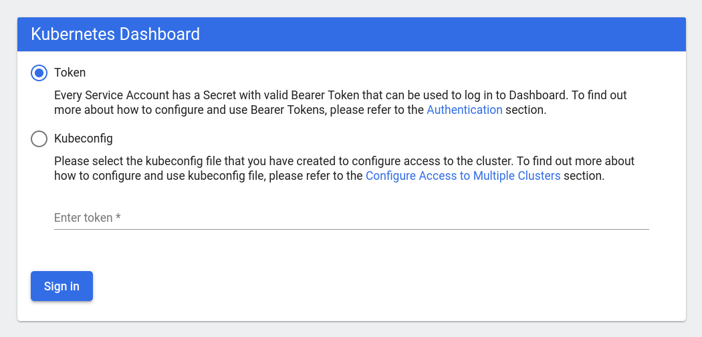

Make sure the "Token" option is selected, and take the login token generated by the `microk8s dashboard-proxy` command from before and paste it in the field in the page. Click the "Sign In" button and you'll be able to see the dashboard, allowing you access to many aspects of your cluster. It should look like this:

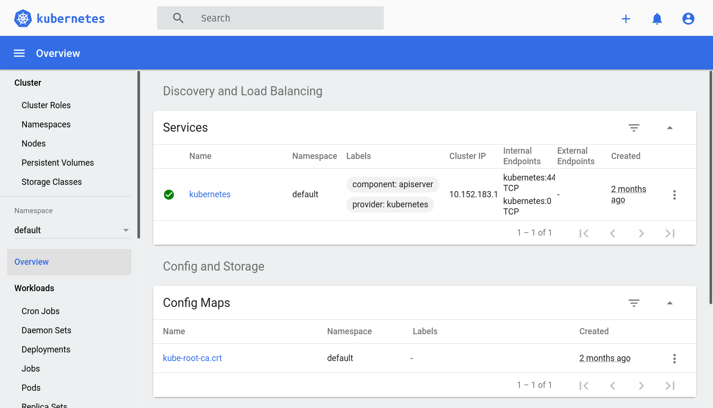

Feel free to play around with it a little bit. You don't have to understand everything yet though. As we work though our example, we'll see how the dashboard and the other add-ons come into play.

# Deploying applications into a Kubernetes cluster

With all that setup out of the way, we can start using our k8s cluster for what it was designed: running applications.

## Deployments

Pods are very much the stars of the show when it comes to Kubernetes. However, most of the time we don't create them directly. We usually do so through "[deployments](https://kubernetes.io/docs/concepts/workloads/controllers/deployment/)". Deployments are a more abstract concept in Kubernetes. They basically control pods and make sure they behave as specified. You can think of them as wrappers for pods which make our lives easier than if we had to handle pods directly. Let's go ahead and create a deployment, that way things will be clearer.

In kubernetes, there are various ways of managing objects like deployments. For this post, I'm going to focus exclusively on the configuration-file-driven declarative approach as that's the one better suited for real world scenarios.

> You can learn more about the different ways of interacting with kubernetes objects in [the official documentation](https://kubernetes.io/docs/concepts/overview/working-with-objects/object-management/).

So, simply put, if we want to create a deployment then we need to author a file that defines it. A simple deployment specification looks like this:

```yml
# nginx-deployment.yaml
apiVersion: apps/v1
kind: Deployment
metadata:
  name: nginx-deployment
  labels:
    app: nginx
spec:
  replicas: 3
  selector:
    matchLabels:
      app: nginx
  template:
    metadata:
      labels:
        app: nginx
    spec:
      containers:
      - name: nginx
        image: nginx:1.14.2
        ports:
        - containerPort: 80
```

> This example is taken straight from [the official documentation](https://kubernetes.io/docs/concepts/workloads/controllers/deployment/).

Don't worry if most of that doesn't make sense at this point. I'll explain it into detail later. First, let's actually do something with it.

Save that in a new file. You can call it `nginx-deployment.yaml`. Once that's done, you can actually create the deployment (and its associated objects) in your k8s cluster with this command:

```
$ kubectl apply -f nginx-deployment.yaml
```

Which should result in the following message:

```
deployment.apps/nginx-deployment created
```

And that's it for creating deployments! (Or any other type of object in kubernetes for that matter). We define the object in a file and then invoke `kubectl`'s `apply` command. Pretty simple.

> If you want to delete the deployment, then this command will do it:
>
> ```
> $ kubectl delete -f nginx-deployment.yaml 
> deployment.apps "nginx-deployment" deleted
> ```

## Using kubectl to explore a deployment

Now, let's inspect our cluster to see what this command has done for us.

First, we can ask it directly for the deployment with:

```
$ kubectl get deployments
```

Which outputs:

```
NAME               READY   UP-TO-DATE   AVAILABLE   AGE
nginx-deployment   3/3     3            3           2m54s
```

As you can see, the deployment that we just created is right there with the name that we gave it.

Like I said, deployments are used to manage pods, and that's just what the `READY`, `UP-TO-DATE` and `AVAILABLE` columns allude to with those values of `3`. This deployment has three pods because, in our yaml file, we specified we wanted three replicas with the `replicas: 3` line. Each "replica" is a pod. For our example, that means that we will have three instances of [NGINX](https://www.nginx.com/) running side by side.

We can see the pods that have been created for us with this command:

```
$ kubectl get pods
```

Which gives us something like this:

```
NAME                                READY   STATUS    RESTARTS   AGE
nginx-deployment-66b6c48dd5-fs5rq   1/1     Running   0          55m
nginx-deployment-66b6c48dd5-xmnl2   1/1     Running   0          55m
nginx-deployment-66b6c48dd5-sfzxm   1/1     Running   0          55m
```

The exact names will vary, as the ids are autogenerated. But as you can see, this command gives us some basic information about our pods. Remember that pods are the ones that actually run our workloads via containers. The `READY` field is particularly insteresting in this sense then because it tells us hoy many containers are running in the pods vs how many are supposed to run. So, `1/1` means that the pod has one container ready out of 1. In other words, the pod is fully ready.

## Using the dashboard to explore a deployment

Like I said before, the dashboard offers us a window into our cluster. Let's see how we can use it to see the information that we just saw via `kubectl`. Navigate into the dashboard via your browser and you should now see that some new things have appeared:

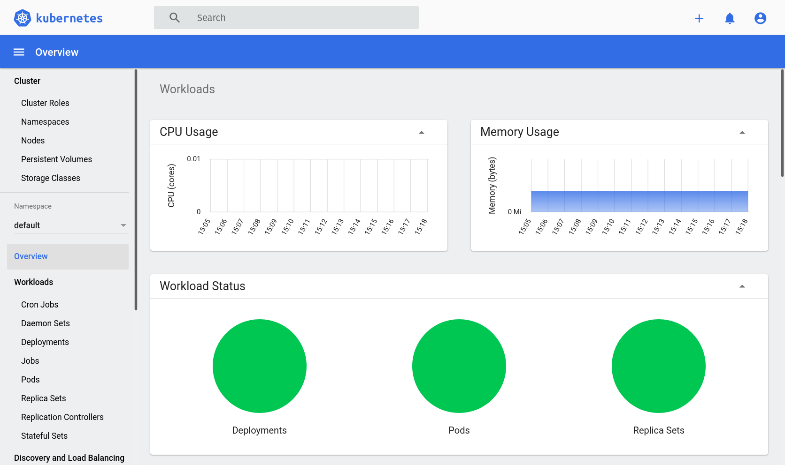

We now have new "CPU Usage" and "Memory Usage" sections that give us insight into the utilization of our machine's resources.

There's also "Workload status" that has some nice graphs giving us a glance at the status of our deployments, pods and [replica sets](https://kubernetes.io/docs/concepts/workloads/controllers/replicaset/).

> Don't worry too much about replica sets right now, as we seldom interact with them directly. Suffice it to say, replica sets are objects that deployments rely on to make sure that the number of specified replica pods is maintained. As always, there's more info in [the official documentation](https://kubernetes.io/docs/concepts/workloads/controllers/replicaset/).

Scroll down a little bit more and you'll find the "Deployments" and "Pods" sections, which contain the inforamtion that we've already seen via `kubectl` before.

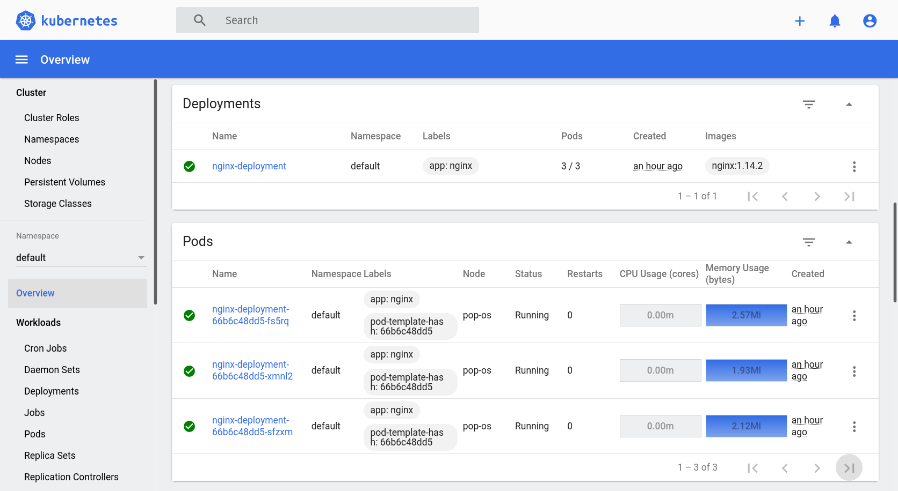

Feel free to click around and explore the capabilities of the dashboard.

## Dissecting the deployment configuration file

Now that we have a basic understanding of deployments and pods, and how to create them. Let's look more closely into the configuration file that defines it. This is what we had:

```yml
# nginx-deployment.yaml
apiVersion: apps/v1
kind: Deployment
metadata:
  name: nginx-deployment
  labels:
    app: nginx
spec:
  replicas: 3
  selector:
    matchLabels:
      app: nginx
  template:
    metadata:
      labels:
        app: nginx
    spec:
      containers:
      - name: nginx
        image: nginx:1.14.2
        ports:
        - containerPort: 80
```

This example is very simple, but it touches on the key aspects of deployment configuration. We will be building more complex deployments as we work through this article, but this is a great start. Let's start at the top:

- `apiVersion`: Under the hood, a kubernetes cluster exposes its functionality via a REST API. We seldom interact with this API directly because we have `kubectl` that takes care of it for us. `kubectl` takes our commands, translates them into HTTP requests that the k8s REST API can understand, sends them, and gives us back the results. So, this `apiVersion` field specifies which version of the k8s REST API are we expecting to talk to.
- `kind`: It represents the type of object that the configuration file defines. All objects in kubernetes can be managed via yml configuration files and `kubectl apply`. So, this field specifies which one we are managing at any given time.
- `metadata.name`: Quite simply, the name of the object. It's how we and kubernetes refers to it.
- `metadata.labels`: These help us further categorize cluster objects. These have no real effect in the system so they are useful for user help more than anything else.
- `spec`: This contains the actual functional specification for the behavior of the deployment. More details below.
- `spec.replicas`: The number of replica pods that the deployment should create. We already talked a bit about this before.
- `spec.selector.labels`: This is one case when labels are actually important. Remember that when we create deployments, replica sets and pods are created with it. Within the k8s cluster, they each are their own individual objects though. This field is the mechanism that k8s uses to associate a given deployment with its replica set and pods. In practice, that means that whatever labels are in this field need to match the labels in `spec.template.metadata.labels`. More on that one below.
- `spec.template`: Specifies the configuration of the pods that will be part of the deployment.
- `spec.template.metadata.labels`: Very similar to `metadata.labels`. The only difference is that those labels are added to the deployment; while these ones are added to the pods. The only notable thing is that these labels are key for the deplopyment to know which pods it should care about. As explained in above.
- `spec.template.spec`: This section specifies the actual functional configuration of the pods.
- `spec.template.spec.containers`: This section specifies the configuration of the containers that will be running inside the pods. It's an array so there can be many. In our example we have only one.
- `spec.template.spec.containers[0].name`: The name of the container.
- `spec.template.spec.containers[0].image`: The image that will be used to build the container.
- `spec.template.spec.containers[0].ports[0].containerPort`: A port through which the contianer will accept traffic from the outside. In this case, `80`.

> You can find a detailed description of all the fields supported by deployment configuration files [in the official API reference documentation](https://kubernetes.io/docs/reference/generated/kubernetes-api/v1.22/#deployment-v1-apps). And much more!

## Connecting to the containers in the pods

Kubernetes allows us to connect to the containers running inside pods. This is pretty easy to do with `kubectl`. All we need to know the name of the pod and the container that we want to connect to. If the pod is running only one container (like our nginx one does), then we don't need the container name. We can find out the names of our pods with:

```
$ kubectl get pods
NAME                                READY   STATUS    RESTARTS   AGE
nginx-deployment-66b6c48dd5-85nwq   1/1     Running   0          25s
nginx-deployment-66b6c48dd5-x5b4x   1/1     Running   0          25s
nginx-deployment-66b6c48dd5-wvkhc   1/1     Running   0          25s
```

Pick one of those, and we can open a bash session in it with:

```
$ kubectl exec -it nginx-deployment-66b6c48dd5-85nwq -- bash
```

Which results in a prompt like this:

```
root@nginx-deployment-66b6c48dd5-85nwq:/# 
```

We're now connected to the continer in one of our nginx pods. There isn't a lot to do with this right now, but feel free to explore it. It's got its own processes and file system which are isolated from the other replica pods and your actual machine.

We can also connect to containers via the dashboard. Go back to the dashboard in your browser, log in again if the session expired, and scroll down to the "Pods" section. Each pod in the list has an action menu with an "Exec" command. See it here:

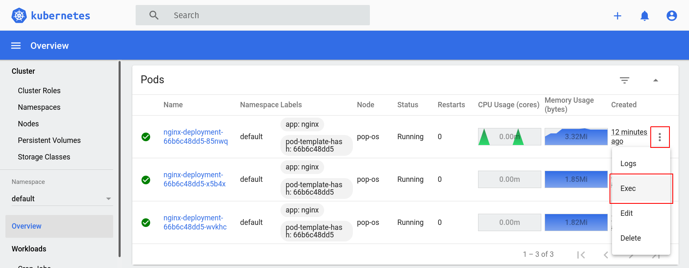

Click it, and you'll be taken to a screen with a console just like the one we obtained via `kubectl exec`:

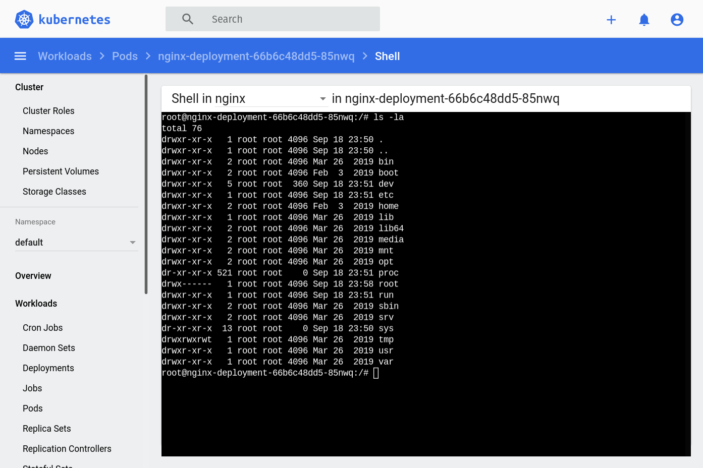

The dashboard is quite useful, right?

## Services

So far, we've learned quite a bit about deployments. How to specify and create them, how to explore them via command line and the dashboard, how to interact with the pods, etc. We haven't seen a very important part yet though: Actually accessing the application that has been deployed. That's where [services](https://kubernetes.io/docs/concepts/services-networking/service/) come in. We use services to expose an application running in a set of pods to the world outside the cluster.

Here's what a configuration file for a service that exposes access to our nginx deployment could look like:

```yml
# nginx-service.yaml
apiVersion: v1
kind: Service
metadata:
  name: nginx-service
spec:
  type: NodePort
  selector:
    app: nginx
  ports:
    - name: "http"
      port: 80
      targetPort: 80
      nodePort: 30080
```

Same as with the deployment's configuration file, this one also has a `kind` field that specifies what it is; and a name given to it via the `metadata.name` field. The `spec` section is where things get interesting.

- `spec.type` specifies, well... The type of the service. Kubernetes supports many [types of services](https://kubernetes.io/docs/concepts/services-networking/service/#publishing-services-service-types). For now, we want a `NodePort`. This type of service makes sure to expose itself as a static port (given by `spec.ports[0].nodePort`) on every node in the cluster. In our set up, we only have one node, which is our own machine.
- `spec.ports` defines which ports of the pods' containers will the service expose.
- `spec.ports[0].name`: The name of the port. To be used elsewhere to reference the specific port.
- `spec.ports[0].port`: The port that will be exposed by the service.
- `spec.ports[0].targetPort`: The port that the service will target in the container.
- `spec.ports[0].nodePort`: The port that the service will expose in all the nodes of the cluster.

Same as with deployments, we can create such a service with the `kubectl apply` command. If you save the contents from the YAML above into a `nginx-service.yaml` file, you can run the following to create it:

```
$ kubectl apply -f nginx-service.yaml
```

And to inspect it and validate that it was in fact created:

```
$ kubectl get services
NAME            TYPE        CLUSTER-IP      EXTERNAL-IP   PORT(S)        AGE
kubernetes      ClusterIP   10.152.183.1    <none>        443/TCP        68d
nginx-service   NodePort    10.152.183.22   <none>        80:30080/TCP   27s
```

The dashboard also has a section for services. It looks like this:

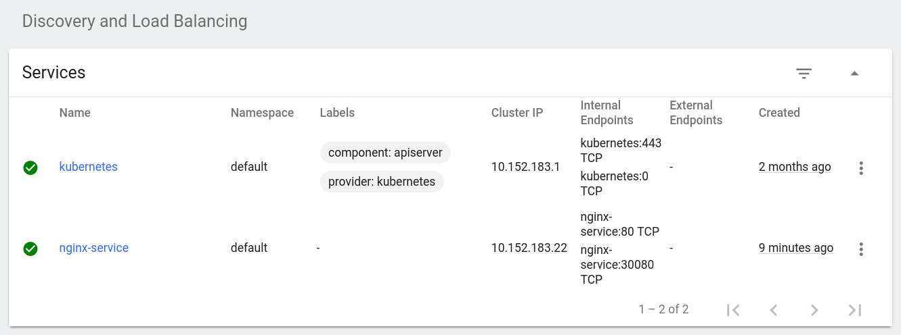

## Accessing an application via a service

We can access our service in a few different ways. We can use its "cluster IP" which we obtain from the output of the `kubectl get services` command. As given by the example above, that would be `10.152.183.22` in my case. Browsing to that IP gives us the familiar nginx default welcome page:

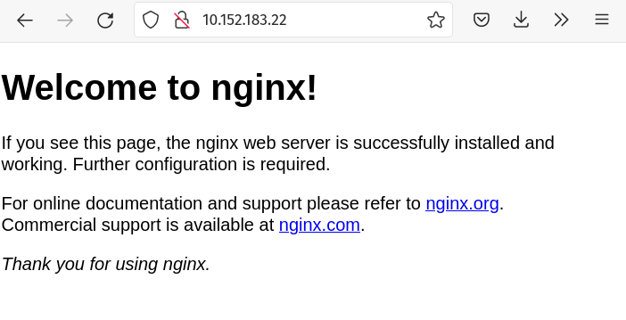

Another way is by using the "NodePort". Remember that the "NodePort" specifies the port in which the service will be available on every node of the cluster. With our current microk8s setup, our own machine is a node in the cluster. So, we can also access the nginx that's running in our kubernetes cluster using `localhost:30080`. `30080` is given by the `spec.ports[0].nodePort` field in the service configuration file from before. Try it out:

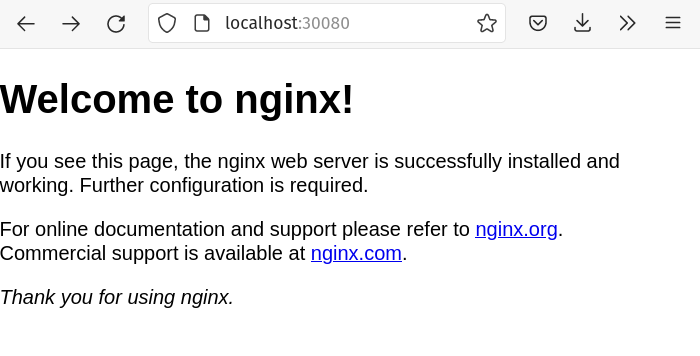

How cool is that? We have identical, replicated NGINX instances running in a kubernetes cluster that's installed locally in our machine.

# Deploying our own custom application

Alright, by deploying NGINX, we've learned a lot about nodes, pods, deployments, services and how they all work together to run and serve an application from a kubernetes cluster. Now, let's take all that knowledge and try and do the same for a completely custom application of our own.

## What are we building

The application that we are going to deploy into our cluster is a simple one with only two components: a REST API written with [.NET 5](https://dotnet.microsoft.com/) and a [Postgres](https://www.postgresql.org/) database. You can find the source code [in GitHub](https://github.com/megakevin/end-point-blog-dotnet-5-web-api). It's an API for supporting a hypothetical front end application for capturing used vehicle information and calculating their value in dollars.

> If you're interested in learning more about the process of actually writing that app, it's all documented in another blog post: [Building REST APIs with .NET 5, ASP.NET Core, and PostgreSQL](https://www.endpoint.com/blog/2021/07/dotnet-5-web-api/).

# Deploying the database

Let's begin with the Postgres database. Similar as before, we start by setting up a deployment with one pod and one container. We can do so with a deployment configuration YAML file like this:

```yml
# db-deployment.yaml
apiVersion: apps/v1
kind: Deployment
metadata:
  name: vehicle-quotes-db
spec:
  selector:
    matchLabels:
      app: vehicle-quotes-db
  replicas: 1
  template:
    metadata:
      labels:
        app: vehicle-quotes-db
    spec:
      containers:
        - name: vehicle-quotes-db
          image: postgres:13
          ports:
            - containerPort: 5432
              name: "postgres"
          env:
            - name: POSTGRES_DB
              value: vehicle_quotes
            - name: POSTGRES_USER
              value: vehicle_quotes
            - name: POSTGRES_PASSWORD
              value: password
          resources:
            limits:
              memory: 4Gi
              cpu: "2"
```

This deployment configuration YAML file is similar to the one we used for NGINX before, but it introduces a few new elements:

- `spec.template.spec.containers[0].ports[0].name`: We can give specific names to ports which we can reference later, elsewhere in the k8s configurations.
- `spec.template.spec.containers[0].env`: This is a list of environment variables that will be defined in the container inside the pod. In this case, we've specified a few variables that are necessary to configure the Postgres instance that will be running. We're using [the official Postgres image from Dockerhub](https://hub.docker.com/_/postgres), and it calls for these variables. Their purpose should be self explanatory, they specify database name, username and password.
- `spec.template.spec.containers[0].resources`: This field defines the hardware resources that the container needs in order to function. We can specify upper limits with `limits` and lower ones with `requests`. You can learn more about resource management in [the official documentation](https://kubernetes.io/docs/concepts/configuration/manage-resources-containers/). In our case, we've kept it simple and used `limits` to prevent the container from using more than 4Gi of memory and 2 CPU cores.

Now, let's save that YAML into a new file called `db-deployment.yaml` and run the following:

```
$ kubectl apply -f db-deployment.yaml 
```

Which should output:

```
deployment.apps/vehicle-quotes-db created
```

After a few seconds, you should be able to see the new deployment and pod via `kubectl`:

```
$ kubectl get deployment -A
NAMESPACE            NAME                        READY   UP-TO-DATE   AVAILABLE   AGE
...
default              vehicle-quotes-db           1/1     1            1           9m20s
```

```
$ kubectl get pods -A
NAMESPACE            NAME                                         READY   STATUS    RESTARTS   AGE
...
default              vehicle-quotes-db-5fb576778-gx7j6            1/1     Running   0          9m22s
```

Remember you can also see them in the dashboard:

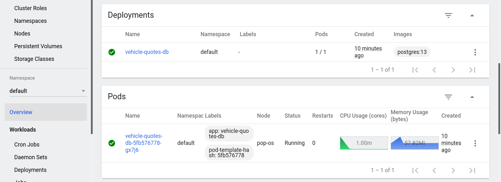

## Connecting to the database

Let's try connecting to the Postgres instance that we just deployed. Take note of the pod's name and and try:

```
$ kubectl exec -it <DB_POD_NAME> -- bash
```

You'll get a bash session on the container that's running the database. For me, given the pod's autogenerated name, it looks like this:

```
root@vehicle-quotes-db-5fb576778-gx7j6:/#
```

From here, you can connect to the database using the [psql](https://www.postgresql.org/docs/13/app-psql.html) command line client. Remember that we told the Postgres instance to create a `vehicle_quotes` user. We set it up via the container environment variables on our deployment configuration. As a result, we can do `psql -U vehicle_quotes` to connect to the database. Put together, it all looks like this:

```
$ kubectl exec -it vehicle-quotes-db-5fb576778-gx7j6 -- bash
root@vehicle-quotes-db-5fb576778-gx7j6:/# psql -U vehicle_quotes
psql (13.3 (Debian 13.3-1.pgdg100+1))
Type "help" for help.

vehicle_quotes=# \l
                                            List of databases
      Name      |     Owner      | Encoding |  Collate   |   Ctype    |         Access privileges         
----------------+----------------+----------+------------+------------+-----------------------------------
 postgres       | vehicle_quotes | UTF8     | en_US.utf8 | en_US.utf8 | 
 template0      | vehicle_quotes | UTF8     | en_US.utf8 | en_US.utf8 | =c/vehicle_quotes                +
                |                |          |            |            | vehicle_quotes=CTc/vehicle_quotes
 template1      | vehicle_quotes | UTF8     | en_US.utf8 | en_US.utf8 | =c/vehicle_quotes                +
                |                |          |            |            | vehicle_quotes=CTc/vehicle_quotes
 vehicle_quotes | vehicle_quotes | UTF8     | en_US.utf8 | en_US.utf8 | 
(4 rows)
```

Pretty cool, don't you think? We have a database running on our cluster now with minimal effort. There's a slight problem though...

## Persistent volumes and claims

The problem in our database is that any changes are lost if the pod or container were to shut down or reset for some reason. This is because all the database files live inside the container's file system. So if the container is gone, the data is also gone.

In Kubernetes, pods are supposed to be treated as ephemeral entities. The idea is that pods should easily be brought down and replaced by new podsm, and users and clients shouldn't even notice. This is all Kubernetes working as expected. That is to say, pods should be as stateless as possible to work well with this behavior. However, a database is, by definition, not stateless. So, what we need to do to solve this problem is have some available disk space from outside the cluster that can be used by our database to store its files. Something persistent that won't go away if the pod or container goes away. That's where [persistent volumes and persistent volume claims](https://kubernetes.io/docs/concepts/storage/persistent-volumes/) come in.

We will use a persistent volume (PV) to define a directory in our host machine that we will allow our Postgres container to use to store data files. Then, a persistent volume claim (PVC) is used to define a "request" for some of that available disk space that a specific container can make. In short, a persistent volume says to k8s "here's some storage that the cluster can use"; and a persistent volume claim says "here's a portion of that storage that's available for containers to use".

## Configuration files for the PV and PVC

Start by tearing down our currently broken Postgres deployment:

```
$ kubectl delete -f db-deployment.yaml
```

Now let's add two new YAML configuration files. One for the persistent volume:

```yaml
# db-persistent-volume.yaml
apiVersion: v1
kind: PersistentVolume
metadata:
  name: vehicle-quotes-postgres-data-persisent-volume
  labels:
    type: local
spec:
  claimRef:
    namespace: default
    name: vehicle-quotes-postgres-data-persisent-volume-claim
  storageClassName: manual
  capacity:
    storage: 5Gi
  accessModes:
    - ReadWriteOnce
  hostPath:
    path: "/home/kevin/projects/vehicle-quotes-postgres-data"
```

In this config file, we already know about the `kind` and `metadata` fields. A few of the other elements are interesting though:

- `spec.claimRef`: Contains identifying information about the claim that's associated with the PV. Used to bind the PVC with a specific PVC. Notice how it matches the name defined in the PVC config file from below.
- `spec.capacity.storage`: Is pretty straightforward in that it specifies the size of the persistent volume.
- `spec.accessModes`: Defines how the PV can be accessed. In this case, we're using `ReadWriteOnce` so that it can only be used by a single node in the cluste which is allowed to read from and write into the PV.
- `spec.hostPath.path`: Specifies the directory in the host machine's file system where the PV will be mounted. Simply put, the containers in the cluster will have access to the specific directory defined here. I've used `"/home/kevin/projects/vehicle-quotes-postgres-data"` because that makes sense on my own machine. I've you're following along, make sure to set it to something that makes sense in your environment.

> hostPath is just one type of persistent volume which works well for development deployments. For production, managed Kubernetes implementations like the ones from Google or Amazon have their own types which are more appropriate for production.

We also need another config file for the persistent volume claim:

```yaml
# db-persistent-volume-claim.yaml
apiVersion: v1
kind: PersistentVolumeClaim
metadata:
  name: vehicle-quotes-postgres-data-persisent-volume-claim
spec:
  volumeName: vehicle-quotes-postgres-data-persisent-volume
  storageClassName: manual
  accessModes:
    - ReadWriteOnce
  resources:
    requests:
      storage: 5Gi
```

Like I said, PVCs are essentially usage requests for PVs. So, the config file is simple in that it's mostly specified to match the PV.

- `spec.volumeName`: Is the name of the PV that this PVC is going to access. Notice how it matches the name that we defined in the PV's config file.
- `spec.resources.requests`: Defines how much space this PVC requests from the PV. In this case, we're just requesting all the space that the PV has available to it, as given by its config file: 5Gi.

## Configuring the deployment to use the PVC

After saving those files, all that's left is to update the database deployment configuration to use the PVC. Here's what the updated config file would look like:

```diff
apiVersion: apps/v1
kind: Deployment
metadata:
  name: vehicle-quotes-db
spec:
  selector:
    matchLabels:
      app: vehicle-quotes-db
  replicas: 1
  template:
    metadata:
      labels:
        app: vehicle-quotes-db
    spec:
      containers:
        - name: vehicle-quotes-db
          image: postgres:13
          ports:
            - containerPort: 5432
              name: "postgres"
+         volumeMounts:
+           - mountPath: "/var/lib/postgresql/data"
+             name: vehicle-quotes-postgres-data-storage
          env:
            - name: POSTGRES_DB
              value: vehicle_quotes
            - name: POSTGRES_USER
              value: vehicle_quotes
            - name: POSTGRES_PASSWORD
              value: password
          resources:
            limits:
              memory: 4Gi
              cpu: "2"
+     volumes:
+       - name: vehicle-quotes-postgres-data-storage
+         persistentVolumeClaim:
+           claimName: vehicle-quotes-postgres-data-persisent-volume-claim
```

First, notice the `volumes` section at the bottom of the file. Here's where we define the volume that will be available to the container, give it a name and specify which PVC it will use. The `spec.template.volumes[0].persistentVolumeClaim.claimName` needs to match the name of the PVC that we defined in `db-persistent-volume-claim.yaml`.

Then, up in the `containers` section, we define a `volumeMounts` element. We use that to specify which directory within the container will map to our PV. In this case, we've set the container's `/var/lib/postgresql/data` directory to use the volume that we defined at the bottom of the file. That volume is backed by our persistent volume claim, which is in turn backed by our persistent volume. The significance of the `/var/lib/postgresql/data` directory is that this is where Postgres stores database files by default.

In summary: We created a persistent volume that defines some disk space in our machine that's available to the cluster; then, we defined a persistent volume claim that represents a request of some of that space that a container can have access to; after that, we defined a volume within our pod configuration in our deployment to point to that persistent volume claim; and finally, we defined a volume mount in our container that uses that volume to store Postgres' database files.

By setting it up this way, we've made it so that regardless of how many Postgres pods come and go, the database files will always be persisted, because they now live outside the container. They are stored in our host machine instead.

## Applying changes

Now let's see it in action. Run the following three commands to create the objects:

```
$ kubectl apply -f db-persistent-volume.yaml
$ kubectl apply -f db-persistent-volume-claim.yaml
$ kubectl apply -f db-deployment.yaml
```

After a while, they will show up in the dashboard. You already know how to look for deployments and pods. For persistent volumes, click the "Persistent Volumes" option under the "Cluster" section in the sidebar:

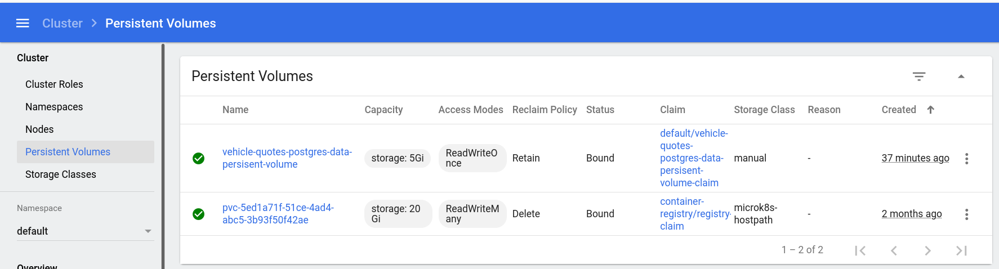

Persistent volume claims can be found in the the "Persistent Volume Claims" option under the "Config and Storage" section in the sidebar:

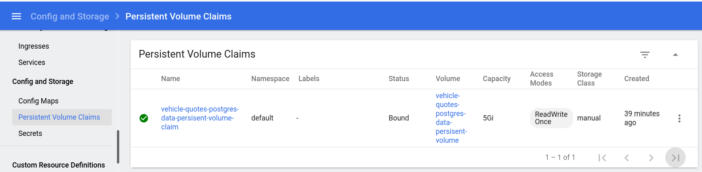

Now, try connecting to the database (using `kubectl exec -it vehicle-quotes-db-5fb576778-gx7j6 -- bash` and then `psql -U vehicle_quotes`) and creating some tables. Something simple like this would work:

```sql
CREATE TABLE test (test_field varchar);
```

Now, delete the objects:

```
$ kubectl delete -f db-deployment.yaml
$ kubectl delete -f db-persistent-volume-claim.yaml
$ kubectl delete -f db-persistent-volume.yaml
```

Create them again:

```
$ kubectl apply -f db-persistent-volume.yaml
$ kubectl apply -f db-persistent-volume-claim.yaml
$ kubectl apply -f db-deployment.yaml
```

Connect to the database again and you should see that the table is still there:

```
vehicle_quotes=# \c vehicle_quotes 
You are now connected to database "vehicle_quotes" as user "vehicle_quotes".
vehicle_quotes=# \dt
           List of relations
 Schema | Name | Type  |     Owner      
--------+------+-------+----------------
 public | test | table | vehicle_quotes
(1 row)
```

That's just what we wanted: the database is persisting independently of what happens to the pods and containers.

## Exposing the database as a service

Lastly, we need to expose the database as a service so that the rest of the cluster can access it without having to use explicit pod names. We don't need this for our testing, but we do need it for later when we deploy our web app, so that it can reach the database. As you've seen, services are easy to create. Here's the YAML config file:

```yaml
# db-service.yaml
apiVersion: v1
kind: Service
metadata:
  name: vehicle-quotes-db-service
spec:
  type: NodePort
  selector:
    app: vehicle-quotes-db
  ports:
    - name: "postgres"
      protocol: TCP
      port: 5432
      targetPort: 5432
      nodePort: 30432
```

Save that into a new `db-service.yaml` file and don't forget to `kubectl apply -f db-service.yaml`.

# Deploying the web application

Now that we've got the database sorted out, let's turn our attention to the app itself. As you've seen, Kubernetes runs apps as containers. That means that we need images to build those containers. A custom web application is no exception. We need to build a custom image that contains our application so that it can be deployed into Kubernetes.

> If you're following along, now would be a good time to download the source code of the web application that we're going to be playing with. You can find it on [GitHub](https://github.com/megakevin/end-point-blog-dotnet-5-web-api).

## Building the web application image

The first step for building a container image is writing a [Dockerfile](https://docs.docker.com/engine/reference/builder/). Since our application is a [Web API](https://dotnet.microsoft.com/apps/aspnet/apis) built using .NET 5, I'm going to use a slightly modified version of the Dockerfile used by [Visual Studio Code](https://code.visualstudio.com/)'s [development container demo for .NET](https://github.com/microsoft/vscode-remote-try-dotnetcore/blob/main/.devcontainer/Dockerfile
). These development containers are excellent for, well... development. You can see the original in the link above, but here's mine:

```dockerfile
# [Choice] .NET version: 5.0, 3.1, 2.1
ARG VARIANT="5.0"
FROM mcr.microsoft.com/vscode/devcontainers/dotnet:0-${VARIANT}

# [Option] Install Node.js
ARG INSTALL_NODE="false"

# [Option] Install Azure CLI
ARG INSTALL_AZURE_CLI="false"

# Install additional OS packages.
RUN apt-get update && export DEBIAN_FRONTEND=noninteractive \
    && apt-get -y install --no-install-recommends postgresql-client-common postgresql-client

# Run the remaining commands as the "vscode" user
USER vscode

# Install EF and code generator development tools
RUN dotnet tool install --global dotnet-ef
RUN dotnet tool install --global dotnet-aspnet-codegenerator
RUN echo 'export PATH="$PATH:/home/vscode/.dotnet/tools"' >> /home/vscode/.bashrc

WORKDIR /app

# Prevent the container from closing automatically
ENTRYPOINT ["tail", "-f", "/dev/null"]
```

> There are [many other](https://github.com/microsoft/vscode-dev-containers/tree/main/containers) development containers for other languages and fameworks. Take a look at the [microsoft/vscode-dev-containers GitHub repo](https://github.com/microsoft/vscode-dev-containers) to learn more.

An interesting thing about this Dockerfile is that we install the `psql` command line client so that we can connect to our Postgres database from within the web application container. The rest is stuff specific to .NET and the particular image we're basing this Dockerfile on, so don't sweat it too much.

Be sure to save that into a new file called `Dockerfile`.

## Making the image accessible to Kubernetes

Now that we have a Dockerfile, we can use it to build an image that Kubernetes is able to use to build a container to deploy. So that Kubernetes can see it, we need to build it in a specific way and push it into a registry that's accessible to Kubernetes. Remember how we ran `microk8s enable registry` to install the registry add-on when we were setting up microk8s? That will pay off now.

First, we build the image:

```
$ docker build . -f Dockerfile -t localhost:32000/vehicle-quotes-dev:registry
```

That will take some time to download and set up everything. Once that's done, we push the image to the registry:

```
$ docker push localhost:32000/vehicle-quotes-dev:registry
```

That will also take a little while.

## Deploying the web application

The next step is to create a deployment for the web app. Like usual, we start with a deployment YAML configuration file. Let's call it `web-deployment.yaml`:

```yaml
# web-deployment.yaml
apiVersion: apps/v1
kind: Deployment
metadata:
  name: vehicle-quotes-web
spec:
  selector:
    matchLabels:
      app: vehicle-quotes-web
  replicas: 1
  template:
    metadata:
      labels:
        app: vehicle-quotes-web
    spec:
      containers:
        - name: vehicle-quotes-web
          image: localhost:32000/vehicle-quotes-dev:registry
          ports:
            - containerPort: 5000
              name: "http"
            - containerPort: 5001
              name: "https"
          volumeMounts:
            - mountPath: "/app"
              name: vehicle-quotes-source-code-storage
          env:
            - name: POSTGRES_DB
              value: vehicle_quotes
            - name: POSTGRES_USER
              value: vehicle_quotes
            - name: POSTGRES_PASSWORD
              value: password
            - name: CUSTOMCONNSTR_VehicleQuotesContext
              value: Host=$(VEHICLE_QUOTES_DB_SERVICE_SERVICE_HOST);Database=$(POSTGRES_DB);Username=$(POSTGRES_USER);Password=$(POSTGRES_PASSWORD)
          resources:
            limits:
              memory: 2Gi
              cpu: "1"
      volumes:
        - name: vehicle-quotes-source-code-storage
          persistentVolumeClaim:
            claimName: vehicle-quotes-source-code-persisent-volume-claim
```

This deployment configuration should look very familiar to you by now as it is very similar to the ones we've already seen. There are a few notable elements though:

- Notice how whe specified `localhost:32000/vehicle-quotes-dev:registry` as the container image. This is the exact same name of the image that we built and pushed into the registry before.
- In the environment variables section, the one named `CUSTOMCONNSTR_VehicleQuotesContext` is interesting for a couple of reasons:
  - First, the value is a Postgres connection string being built off of other environment variables using the following format: `$(ENV_VAR_NAME)`. That's a neat feature of Kubernetes config files that allows us to reference variables to build other ones.
  - Second, the `VEHICLE_QUOTES_DB_SERVICE_SERVICE_HOST` environment variable used within that connection string is not defined anywhere in our configuration files. That's an automatic environment variable that Kubernetes injects on all containers when there are services available. In this case, it contains the hostname of the `vehicle-quotes-db-service` that we created a few sections ago. The automatic injection of this `*_SERVICE_HOST` variable always happens as long as the service is already created by the time that the pod gets created. We have already created the service so we should be fine using the variable here. As usual, there's more info in the [official documentation](https://kubernetes.io/docs/concepts/services-networking/service/#environment-variables).

As you may have noticed, this deployment has a persistent volume. That's to store the application's source code. Or, more accurately, to make the source code, which lives in our machine, available to the container. This is a development setup after all, so we want to be able to edit the code from the comfort of our own file system, and have the container inside the cluster be aware of that.

Anyway, let's create the assocuated persistet volume and persistent volume claim. Here's the PV (save it as `web-persistent-volume.yaml`):

```yaml
# web-persistent-volume.yaml
apiVersion: v1
kind: PersistentVolume
metadata:
  name: vehicle-quotes-source-code-persisent-volume
  labels:
    type: local
spec:
  claimRef:
    namespace: default
    name: vehicle-quotes-source-code-persisent-volume-claim
  storageClassName: manual
  capacity:
    storage: 1Gi
  accessModes:
    - ReadWriteOnce
  hostPath:
    path: "/home/kevin/projects/vehicle-quotes"
```

And here's the PVC (save it as `web-persistent-volume-claim.yaml`):

```yaml
# web-persistent-volume-claim.yaml
apiVersion: v1
kind: PersistentVolumeClaim
metadata:
  name: vehicle-quotes-source-code-persisent-volume-claim
spec:
  volumeName: vehicle-quotes-source-code-persisent-volume
  storageClassName: manual
  accessModes:
    - ReadWriteOnce
  resources:
    requests:
      storage: 1Gi
```

The only notable element here is the PV's `hostPath`. I have it pointing to the path where I downloaded the app's source code from [GitHub](https://github.com/megakevin/end-point-blog-dotnet-5-web-api). Make sure to do the same on your end.

Finally, tie it all up with a service that will expose the development build of our REST API. Here's the config file:

```yaml
# web-service.yaml
apiVersion: v1
kind: Service
metadata:
  name: vehicle-quotes-web-service
spec:
  type: NodePort
  selector:
    app: vehicle-quotes-web
  ports:
    - name: "http"
      protocol: TCP
      port: 5000
      targetPort: 5000
      nodePort: 30000
    - name: "https"
      protocol: TCP
      port: 5001
      targetPort: 5001
      nodePort: 30001

```

Should be pretty self explanatory at this point. In this case, we expose two ports, one for HTTP and another for HTTPS. Our .NET 5 Web API works with both so that's why we specify them here. This configuration says that the service should expose port `30000` and send traffic that comes into that port from the outside world into port `5000` on the container. Likewise, outside traffic coming to port `30001` will be sent to port `5001` in the container. 

Save that file as `web-service.yaml` and we're ready to apply the changes:

```
$ kubectl apply -f web-persistent-volume.yaml
$ kubectl apply -f web-persistent-volume-claim.yaml
$ kubectl apply -f web-deployment.yaml
$ kubectl apply -f web-service.yaml
```

Feel free to explore the dashboard's "Deployments", "Pods", "Services", "Persistent Volumes" and "Persistent Volume Claims" sections to see the fruits of our labor.

## Starting the application

Let's now do some final setup and start up our application. Start by connecting to the web application pod:

```
$ kubectl exec -it vehicle-quotes-web-86cbc65c7f-5cpg8 -- bash
```

> Remember that the pod name will be different for you, so copy it from the dashboard or `kubectl get pods -A`.

You'll get a prompt like this:

```
vscode ➜ /app (master ✗) $
```

Try `ls` to see all of the app's source code files courtesy of the PV that we set up before:

```
vscode ➜ /app (master ✗) $ ls
Controllers     Dockerfile.prod  Models      README.md       Startup.cs            appsettings.Development.json  k8s      queries.sql
Data            K8S_README.md    Program.cs  ResourceModels  Validations           appsettings.json              k8s_wip
Dockerfile.dev  Migrations       Properties  Services        VehicleQuotes.csproj  database.dbml                 obj
```

Now it's just a few .NET commands to get the app up and running. First, compile and download packages:

```
$ dotnet build
```

That will take a while. Once done, let's build the databse schema:

```
$ dotnet ef database update
```

And finally, run the development web server:

```
$ dotnet run
```

> If you get a "System.InvalidOperationException: Unable to configure HTTPS endpoint." error message while trying `dotnet run`. Then follow the error message's instructions and run `dotnet dev-certs https --trust`. This will generate a development certificate so that the dev server can serve HTTPS.

As a result, you should see this:

```
vscode ➜ /app (master ✗) $ dotnet run
Building...
info: Microsoft.Hosting.Lifetime[0]
      Now listening on: https://0.0.0.0:5001
info: Microsoft.Hosting.Lifetime[0]
      Now listening on: http://0.0.0.0:5000
info: Microsoft.Hosting.Lifetime[0]
      Application started. Press Ctrl+C to shut down.
info: Microsoft.Hosting.Lifetime[0]
      Hosting environment: Development
info: Microsoft.Hosting.Lifetime[0]
      Content root path: /app
```

It indicates that the application is up and running. Now, navigate to `http://localhost:30000` in your browser of choice and you should see out REST API's Swagger UI:

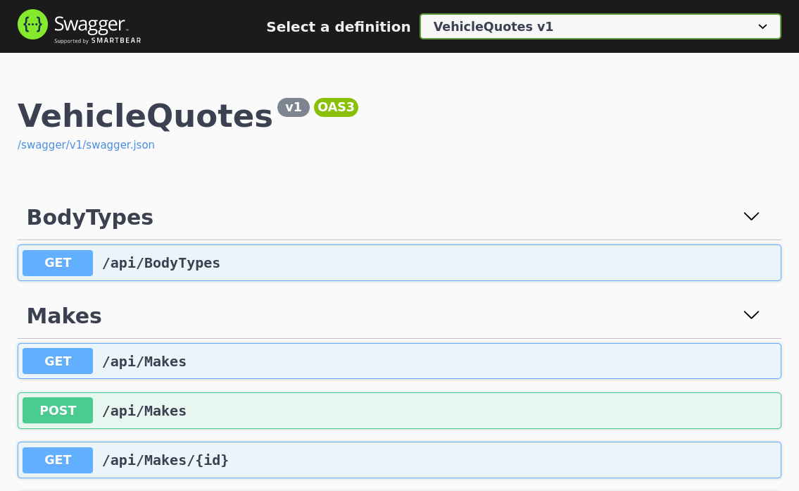

Notice that `30000` is the port we specified in the `web-service.yaml`'s `nodePort` for the `http` port. That's the port that the service exposes to the world outside the cluster. Notice also how our .NET web app's development server listens to traffic coming from ports `5000` and `5001` for HTTP and HTTPS respectively. That's why we configured `web-service.yaml` like we did.

Outstanding! All our hard work has paid off and we have a full fledged web application running in our Kubernetes cluster. This is quite a momentous occasion. We've built a custom image that can be used to create containers to run a .NET web application, pushed that image into our local registry so that k8s could use it, and deployed a fully functioning application. As a cherry on top, we made it so the source code is super easy to edit, as it lives within our own machine's filesystem and the container in the cluster accesses it directly from there. Quite an accomplishment.

Now it's time to go the extra mile and organize things a bit. Let's talk about Kustomize next.

# Putting it all together with Kustomize

[Kustomize](https://kubectl.docs.kubernetes.io/guides/introduction/kustomize/) is a tool that helps us improve Kubernetes declarative object management with configuration files (which is what we've been doing throughout this post). Kustomize has useful features that help with better organizing configuration files, managing configuration variables and support for deployment variants (for things like dev vs test vs prod environments). Let's explore what Kustomize has to offer.

First, be sure to tear down all the objects that we have created so far as we will be replacing them later once we have a setup with Kustomize. This will work for that:

```
$ kubectl delete -f db-service.yaml
$ kubectl delete -f db-deployment.yaml
$ kubectl delete -f db-persistent-volume-claim.yaml
$ kubectl delete -f db-persistent-volume.yaml

$ kubectl delete -f web-service.yaml
$ kubectl delete -f web-deployment.yaml
$ kubectl delete -f web-persistent-volume-claim.yaml
$ kubectl delete -f web-persistent-volume.yaml
```

Next, let's reorganize our `db-*` and `web-*` YAML files like this:

```
k8s
├── db
│   ├── db-deployment.yaml
│   ├── db-persistent-volume-claim.yaml
│   ├── db-persistent-volume.yaml
│   └── db-service.yaml
└── web
    ├── web-deployment.yaml
    ├── web-persistent-volume-claim.yaml
    ├── web-persistent-volume.yaml
    └── web-service.yaml
```

As you can see, we've put them all inside a new `k8s` directory, and further divided them into `db` and `web` sub-directories. `web-*` files went into the `web` directory and `db-*` files went into `db`. At this point, the prefixes on the files are a bit redundant so we can remove them. After all, we know what component they belong to because of the name of their respective sub-directories.

So it should end up looking like this:

```
k8s
├── db
│   ├── deployment.yaml
│   ├── persistent-volume-claim.yaml
│   ├── persistent-volume.yaml
│   └── service.yaml
└── web
    ├── deployment.yaml
    ├── persistent-volume-claim.yaml
    ├── persistent-volume.yaml
    └── service.yaml
```

> kubectl's `apply` and `delete` commands support directories as well, not only individual files. That means that, at this point, to build up all of our objects you could simply do `kubectl apply -f k8s/db` and `kubectl apply -f k8s/web`. This is much better than what we've been doing until now where we had to specify every single file. Still, with Kustomize, we can do better than that...

## The Kustomization file

We can bring everything together with a `kustomization.yaml` file. For our setup, here's what it could look like:

```yaml
# k8s/kustomization.yaml
kind: Kustomization

resources:
  - db/persistent-volume.yaml
  - db/persistent-volume-claim.yaml
  - db/service.yaml
  - db/deployment.yaml
  - web/persistent-volume.yaml
  - web/persistent-volume-claim.yaml
  - web/service.yaml
  - web/deployment.yaml
```

This first iteration of the Kustomization file is simple. It just lists all of our other config files in the [`resources`](https://kubectl.docs.kubernetes.io/references/kustomize/kustomization/resource/) section in their relative locations. Save that as `k8s/kustomization.yaml` and you can apply it with the following:

```
$ kubectl apply -k k8s
```

The `-k` option tells `kubectl apply` to look for a Kustomization within the given directory and use that to build the cluster objects. After running it, you should see the familiar output:

```
service/vehicle-quotes-db-service created
service/vehicle-quotes-web-service created
persistentvolume/vehicle-quotes-postgres-data-persisent-volume created
persistentvolume/vehicle-quotes-source-code-persisent-volume created
persistentvolumeclaim/vehicle-quotes-postgres-data-persisent-volume-claim created
persistentvolumeclaim/vehicle-quotes-source-code-persisent-volume-claim created
deployment.apps/vehicle-quotes-db created
deployment.apps/vehicle-quotes-web created
```

Feel free to explore the dashboard or `kubectl get` commands to see the objects that got created. You can connect to pods, run the app, query the database, everything. Just like we did before. The only difference is that now everything is neatly organized and there's a single file that serves as a bootstrap for the whole setup. All thanks to Kustomize and the `-k` option.

`kubectl delete -k k8s` can be used to tear everything down.

## Defining reusable configuration values with ConfigMaps

Another useful feature of Kustomize is [ConfigMaps](https://kubernetes.io/docs/concepts/configuration/configmap/). These allow us to specify configuration variables in the Kustomization and use them throughout the rest of the resource config files. A good candidate to demonstrate their use are the environment variables that configure our Postgres database and the connection string in our web application.

We're going to make changes to the config so be sure to tear everything down with `kubectl delete -k k8s`.

We can start by adding the following to the `kustomization.yaml` file:

```diff
# k8s/kustomization.yaml
kind: Kustomization

resources:
  - db/persistent-volume.yaml
  - db/persistent-volume-claim.yaml
  - db/service.yaml
  - db/deployment.yaml
  - web/persistent-volume.yaml
  - web/persistent-volume-claim.yaml
  - web/service.yaml
  - web/deployment.yaml

+configMapGenerator:
+  - name: postgres-config
+    literals:
+      - POSTGRES_DB=vehicle_quotes
+      - POSTGRES_USER=vehicle_quotes
+      - POSTGRES_PASSWORD=password
```

The `configMapGenerator` section is where the magic happens. We've kept it simple and defined the variables as literals. `configMapGenerator` is much more flexible than that though, accepting external configuration files. [The official documentation](https://kubectl.docs.kubernetes.io/references/kustomize/kustomization/configmapgenerator/) has more details.

Now, let's see what we have to do to actually use those values in our configuration.

First up is the database deployment configuration file, `k8s/db/deployment.yaml`. Update its `env` section like so:

```diff
# k8s/db/deployment.yaml
# ...
env:
-  - name: POSTGRES_DB
-    value: vehicle_quotes
-  - name: POSTGRES_USER
-    value: vehicle_quotes
-  - name: POSTGRES_PASSWORD
-    value: password
+  - name: POSTGRES_DB
+    valueFrom:
+      configMapKeyRef:
+        name: postgres-config
+        key: POSTGRES_DB
+  - name: POSTGRES_USER
+    valueFrom:
+      configMapKeyRef:
+        name: postgres-config
+        key: POSTGRES_USER
+  - name: POSTGRES_PASSWORD
+    valueFrom:
+      configMapKeyRef:
+        name: postgres-config
+        key: POSTGRES_PASSWORD
# ...
```

Notice how we've replaced the simple key-value pairs with new, more complex objects. Their `name`s are still the same, the have to be because that's what the Postgres database container expects. But instead of a litetal, "hard coded" value, we have cahnged them to these `valueFrom.configMapKeyRef` objects. Their `name`s match the `name` of the `configMapGenerator` we configured in the Kustomization. Their `key`s match the keys of the literal values that we specified in the `configMapGenerator`'s `literals` field. That's how it all ties together.

Similarly, we can update the web application deployment configuration file, `k8s/web/deployment.yaml`. Its `env` section would look like this:

```diff
# k8s/web/deployment.yaml
# ...
env:
-  - name: POSTGRES_DB
-    value: vehicle_quotes
-  - name: POSTGRES_USER
-    value: vehicle_quotes
-  - name: POSTGRES_PASSWORD
-    value: password
+  - name: POSTGRES_DB
+    valueFrom:
+      configMapKeyRef:
+        name: postgres-config
+        key: POSTGRES_DB
+  - name: POSTGRES_USER
+    valueFrom:
+      configMapKeyRef:
+        name: postgres-config
+        key: POSTGRES_USER
+  - name: POSTGRES_PASSWORD
+    valueFrom:
+      configMapKeyRef:
+        name: postgres-config
+        key: POSTGRES_PASSWORD
  - name: CUSTOMCONNSTR_VehicleQuotesContext
    value: Host=$(VEHICLE_QUOTES_DB_SERVICE_SERVICE_HOST);Database=$(POSTGRES_DB);Username=$(POSTGRES_USER);Password=$(POSTGRES_PASSWORD)
# ...
```

The exact same change as with the database deployment. Out with the hard coded values and in with the new ConfigMap-driven ones.

Try `kubectl apply -k k8s` and you'll see that things are still working well. Try to connect to the web application pod and build and run the app.

## Using bases, overlays and patches to create variants for production and development environments

The crowning achievement of Kustomize is its ability to fascilitate multiple deployment variants. Variants, as the name suggests, are variations of deployment configurations that are ideal for setting up various execution environments for an application. Think development, staging, production, etc. All based on a common set of reusable configurations to avoid superfluous repetition.

Kustomize does this by introducing the concepts of [bases and overlays](https://kubectl.docs.kubernetes.io/guides/introduction/kustomize/#2-create-variants-using-overlays). A base is a set of configs that can be reused but not deployed on its own, and overlays are the actual configurations that use and extend the base and can be deployed.

To demonstrate this, let's build two variants: one for development and another for production. Let's consider the one we've already built to be the development variant and work towards properly specifying it as so, and building a new production variant.

> Note that the so-called "production" variant is not meant to be production worthy. It's just an example to illustrate the concepts and process of building bases and overlays. It does not meet the rigors of a proper production system.

The strategy I like to use is to just copy everything over from one variant to another, impleemnt the differences, and identify the common elements and extract them into a base that both use.

Let's begin by creating a new `k8s/dev` directory and move all of our YAML files into it. That will be our "development overlay". Then, make a copy the `k8s/dev` directory and all of its contents and call it `k8s/prod`. That will be our "production overlay". Let's also create a `k8s/base` directory to store the common files. That will be our "base". It should be like this:

```
k8s
├── base
├── dev
│   ├── kustomization.yaml
│   ├── db
│   │   ├── deployment.yaml
│   │   ├── persistent-volume-claim.yaml
│   │   ├── persistent-volume.yaml
│   │   └── service.yaml
│   └── web
│       ├── deployment.yaml
│       ├── persistent-volume-claim.yaml
│       ├── persistent-volume.yaml
│       └── service.yaml
└── prod
    ├── kustomization.yaml
    ├── db
    │   ├── deployment.yaml
    │   ├── persistent-volume-claim.yaml
    │   ├── persistent-volume.yaml
    │   └── service.yaml
    └── web
        ├── deployment.yaml
        ├── persistent-volume-claim.yaml
        ├── persistent-volume.yaml
        └── service.yaml
```

Now we have two variants, but they don't do us any good because they aren't any different. we'll now go through each file one by one and identify which aspects need to be the same and which need to be different between our two variants:

1. `db/deployment.yaml`: I want the same database instance configuration for both our variants. So we copy the file into `base/db/deployment.yaml` and delete `dev/db/deployment.yaml` and `prod/db/deployment.yaml`.
2. `db/persistent-volume-claim.yaml`: This one is also the same for both variants. So we copy the file into `base/db/persistent-volume-claim.yaml` and delete `dev/db/persistent-volume-claim.yaml` and `prod/db/persistent-volume-claim.yaml`.
3. `db/persistent-volume.yaml`: This file defines the location in the host machine that will be available for the Postgres instance that's running in the cluster to store its data files. I do want this path to be different between variants. So let's leave them where they are and do the following changes to them: For `dev/db/persistent-volume.yaml`, change its `spec.hostPath.path` to `"/path/to/vehicle-quotes-postgres-data-dev"`. For `prod/db/persistent-volume.yaml`, change its `spec.hostPath.path` to `"/path/to/vehicle-quotes-postgres-data-prod"`. Of course, adjust the paths to something that makes sense in your environment.
4. `db/service.yaml`: There doesn't need to be any difference on this file between the variants so we copy the file into `base/db/service.yaml` and delete `dev/db/service.yaml` and `prod/db/service.yaml`.
5. `web/deployment.yaml`: There are going to be quite a few differences between the dev and prod deplopyments of the web application. So we leave them as they are. Later we'll see the differences in great detail.
6. `web/persistent-volume-claim.yaml`: This is also going to be different. Let's leave it be now and we'll come back to it later.
7. `web/persistent-volume.yaml`: Same as `web/persistent-volume-claim.yaml`. Leave it be for now.
8. `wev/service.yaml`: This one is going to be the same for both dev and prod so let's do the usual and copy it into `base/web/service.yaml` and remove `dev/web/service.yaml` and `prod/web/service.yaml`

> The decissions taken when designing the overlays and the base may seem arbitrary. That's because they totally are. The purpose of this article is to demonstrate Kustomize's features, not produce a real world, production worthy setup.

Once all those changes are done, you should have the following file structure:

```
k8s
├── base
│   ├── db
│   │   ├── deployment.yaml
│   │   ├── persistent-volume-claim.yaml
│   │   └── service.yaml
│   └── web
│       └── service.yaml
├── dev
│   ├── db
│   │   └── persistent-volume.yaml
│   ├── kustomization.yaml
│   └── web
│       ├── deployment.yaml
│       ├── persistent-volume-claim.yaml
│       └── persistent-volume.yaml
└── prod
    ├── db
    │   └── persistent-volume.yaml
    ├── kustomization.yaml
    └── web
        ├── deployment.yaml
        ├── persistent-volume-claim.yaml
        └── persistent-volume.yaml
```

Much better, huh? We've gotten rid of quite a bit of repetition. But we're not done just yet. The base also needs a Kustomization file. Let's create it as `base/kustomization.yaml` and add these contents:

```yaml
# base/kustomization.yaml
kind: Kustomization

resources:
  - db/persistent-volume-claim.yaml
  - db/service.yaml
  - db/deployment.yaml
  - web/service.yaml

configMapGenerator:
  - name: postgres-config
    literals:
      - POSTGRES_DB=vehicle_quotes
      - POSTGRES_USER=vehicle_quotes
      - POSTGRES_PASSWORD=password
```

As you can see, the file is very similar to the other one we created. We just list the resources that we moved into the `base` directory and define the database environment variables via the `configMapGenerator`. We need to define the `configMapGenerator` here because we've moved all the other files that use them into here.

Now that we have the base defined, we need to update the `kustomization.yaml` file of the overlays to use it. We also need to update them so that they only point to the resources that they need to.

Here's what the changes to the "dev" overlay's `kustomization.yaml` file look like:

```diff
# dev/kustomization.yaml
kind: Kustomization

+bases:
+  - ../base

resources:
  - db/persistent-volume.yaml
-  - db/persistent-volume-claim.yaml
-  - db/service.yaml
-  - db/deployment.yaml
  - web/persistent-volume.yaml
  - web/persistent-volume-claim.yaml
-  - web/service.yaml
  - web/deployment.yaml

-configMapGenerator:
-  - name: postgres-config
-    literals:
-      - POSTGRES_DB=vehicle_quotes
-      - POSTGRES_USER=vehicle_quotes
-      - POSTGRES_PASSWORD=password
```

As you can see we removed the `configMapGenerator` and the individual resources that were already defined in the base. Most importantly, we've added a `bases` that indicates that our Kustomization over on the `base` directory is this overlay's base.

The changes to the "prod" overlay's `kustomization.yaml` file are identical. Go ahead and make them.

At this point, you can run `kubectl apply -k k8s/dev` or `kubectl apply -k k8s/prod` and things should work just like before.

> Don't forget to also do `kubectl delete -k k8s/dev` or `kubectl delete -k k8s/dev` when you're done testing the previous commands, as we'll continue doing changes to the configs.


# Bonus: Using the cluster as a development environment with Visual Studio Code


# Building the prod web application image

# Building a deployment for the web application for prod

patches


