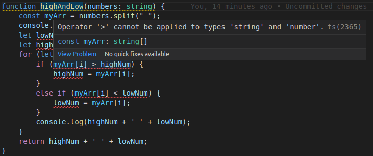

Recently a valued colleague approached me with a JavaScript problem. This individual is new to programming and is working on a self-taught course. The assignment was fairly simple; take a list of space delimited integers and find the maximum and minimum values. If you are an experienced developer you can probably already guess where this is going.

```javascript
function highAndLow(numbers){
    const myArr = numbers.split(" ")
    console.log(myArr);
    let lowNum = myArr[0];
    let highNum = myArr[0];
    for (let i = 0; i<myArr.length; i++) {
      if (myArr[i] > highNum) {
        highNum = myArr[i];
      } else if (myArr[i] < lowNum) {
        lowNum = myArr[i];
      }
      console.log(highNum + ' ' + lowNum);
    }
    return highNum + ' ' + lowNum
  }

console.log(highAndLow("8 3 -5 42 -1 0 0 -9 4 7 4 -4"))
```

and this produced the output

```javascript
"8 -1"
```

These are clearly not the maximum or minimum values.

After looking at it for a few moments I recognized a classic JavaScript pitfall; “failure to explicitly convert stringy numbers to actual number types.”

You see, JavaScript tries to be clever. JavaScript tries to get it right. JavaScript tries to say “the thing you are doing looks like something that you would do with numbers so I’m going to automatically convert these stringy numbers to number-numbers for you.” The problem is that JavaScript is NOT clever, it is in fact very dumb about this. The further problem is when developers come to trust and rely on automatic conversion. Careers have been ruined that way.

In this case the naive programmer would say “Well I’m comparing the things with a mathematical operator (< and >) so JS should treat the values as numbers, right?” Wrong. JavaScript compares them alphabetically, NOT numerically. Except that even the “alphabetical” comparison kind of sucks but that’s another blog post. JS doesn't even attempt to convert to numbers in this case.

Repeat after me: “ALWAYS EXPLICITLY CONVERT STRINGY NUMBERS TO ACTUAL NUMBERS EVEN IF THE LANGUAGE CLAIMS TO DO IT AUTOMATICALLY”. I don’t care if it’s JavaScript, Perl, some fancy Python package, it doesn’t matter. DO NOT TRUST AUTOMATIC TYPE CONVERSION. You will get it wrong. It will get it wrong. There will be tears.

Fixing this program is as simple as changing one line to explicitly convert the numbers from strings.

```javascript
    const myArr = numbers.split(" ").map(n=>Number.parseInt(n, 10))
```

`Number.parseInt(n, 10)` is the “one true way” to turn a string-number into a number-number in JavaScript. NEVER omit the 10; it is technically “optional” but you will regret it if you omit it, trust me; if you are reading base 10 numbers, tell JavaScript so explicitly. Otherwise it will again try to be clever but be not-clever and probably screw up the conversion by guessing the wrong radix.

It’s good that the developer caught this error visually, also, because they did not include a unit test. Errors like this slip through the cracks all. the. time.

Even TypeScript would not catch this. This function is perfectly legal TypeScript. There’s nothing illegal about comparing strings with < or >. TS could only catch this if the developer provided additional type information up front, EG



Now that we’ve TOLD the compiler “this is a string” and “this is a number”, now it can helpfully tell us “hey you’re trying to mix strings and numbers in a not-good way”.

So it all comes back to the mantra of “Always explicitly convert strings to numbers. Always.” And if you're bothering to use TypeScript go the extra step and actually tell it what the types are. Don't make it guess; it might guess wrong. Explicit is better than implicit.

Some things never change.
