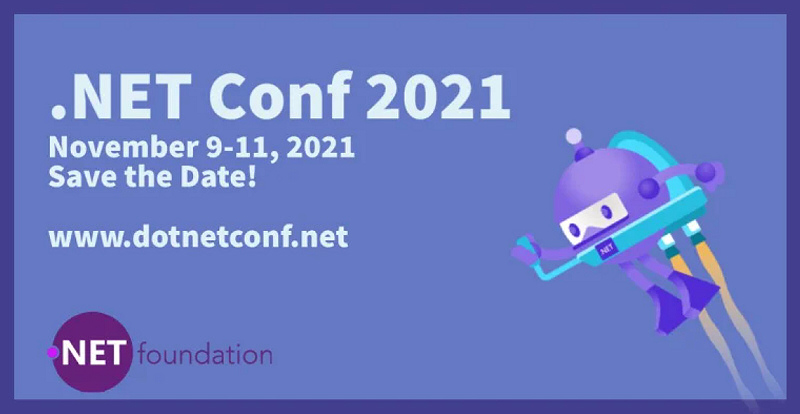
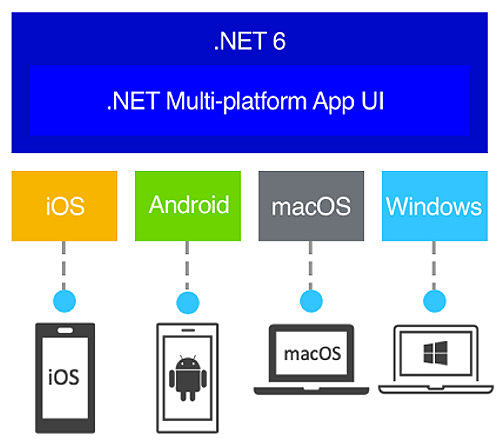
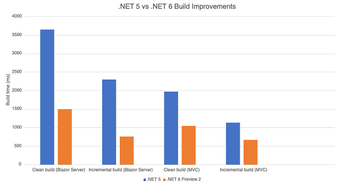

It's that time of the year again! It has been almost one year since .NET 5 was launched on the [.NET Conf 2020](/blog/2020/11/dotnet-5-released-net-conf-2020/), unifying .NET Framework and .NET Core into a single, open-source and cross-platform framework. And with .NET 6 around the corner, it's time to prepare for the new edition: [.NET Conf 2021](https://www.dotnetconf.net/), starting on November 9th.

This edition will be the 11th online conference, and the [Agenda](https://www.dotnetconf.net/agenda) will mainly focus on the .NET 6 launch and the new C# 10, along with some coding challenges and community sessions. The event is organized by both the .NET Community and Microsoft. The main changes that will likely be discussed at the conference, based on what we've seen through the previews, might include:

### Mobile development

We will see several changes to the web mobile app development works under .NET 6. With a smaller, optimized and optional SDK for mobile based on [Xamarin](https://dotnet.microsoft.com/apps/xamarin), now called Multi-platform App UI or MAUI, developing an app that targets multiple mobile platforms should be simpler than ever.

### Hot reload (after some struggling)

The [Hot Reload feature](https://devblogs.microsoft.com/dotnet/introducing-net-hot-reload/), which will allow to make and apply changes to the code in execution time, will be finally available in .NET 6. There was some noise about it in the past days since Microsoft made a decision to lock it to Visual Studio 2022, which is a Windows-limited mostly-paid product. But after the open source community made it clear they were angry about it, Microsoft [reversed the change](https://devblogs.microsoft.com/dotnet/update-on-net-hot-reload-progress-and-visual-studio-2022-highlights/) and the feature will be available for all platforms.

### Blazor 6

The new version of Blazor will also have improvements. One of the main features is the implementation of [ahead-of-time compilation](https://devblogs.microsoft.com/aspnet/asp-net-core-updates-in-net-6-preview-4/#blazor-webassembly-ahead-of-time-aot-compilation), that allows generating WebAssembly code during the publishing process. That way, the application performance is increased, since it can run natively instead of needing a .NET IL interpreter.

### LTS (Long Term Support)

.NET 6 is a Long Term Support version, which means that it will have support for at least years after its release. The current version, .NET 5, is a General Availability (GA) version, which means it support will generally end six months after the next release is available.

Several improvements were introduced to different aspects of the framework, including [AOT compilation](https://www.reddit.com/r/dotnet/comments/o21i5k/webassembly_aot_support_is_now_available_with_net/) or the [Minimal API Framework](https://dotnetcoretutorials.com/2021/07/16/building-minimal-apis-in-net-6/). There are also improvements to the build speed as we can see in the chart below. A complete list of breaking changes can be seen [here](https://docs.microsoft.com/en-us/dotnet/core/compatibility/6.0).

Bonus: Although not part of the event itself, the new version of Visual Studio will also be available from November 8th, and it will be launched on an [online event](https://visualstudio.microsoft.com/launch/) that Microsoft is preparing with several presentations from the development team.

As we did last year, the .NET team at End Point will be listening to the talks and presentations from the conference, and trying out the new features that will be publicly available on November 9th. Exciting days ahead! We hope to see you there.