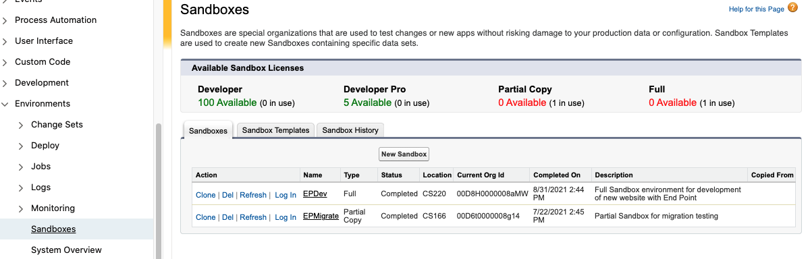
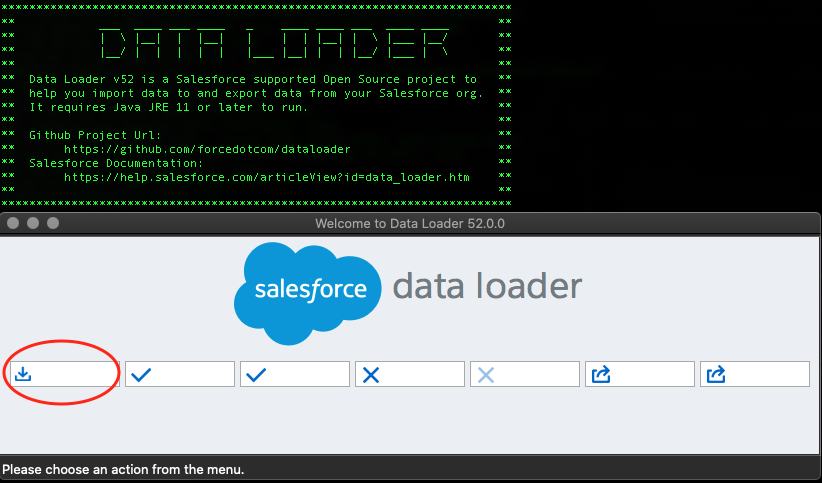
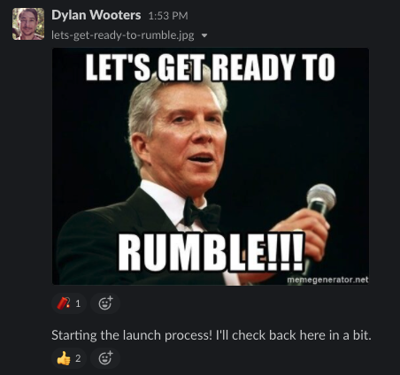

<small>Photo by Dylan Wooters, 2021</small>

## Intro
End Point recently completed a [new e-commerce website](https://www.eiffeltrading.com/), built using Nuxt, Node.js and [Algolia](https://www.algolia.com/), and backed by Salesforce data. As part of website project, the client also wanted to re-categorize their products. They had already updated the data in a Salesforce sandbox, and needed a way to promote the changes to production, in conjunction with the launch of the new website.

This data migration initially seemed like a simple request, but it ended up being one of the more challenging parts of the project. While there are clear instructions on how to migrate *code* changes from a sandbox to production (via [change sets](https://help.salesforce.com/s/articleView?id=sf.changesets.htm&type=5)), there is very little information on how to migrate *data*. 

In this blog post, I will outline the solution we developed, which involved writing a custom migration script using the [JSForce](https://jsforce.github.io/) library, testing using additional Sandboxes, and planning for a rollback. Hopefully this can serve as a blueprint for developers faced with the same task.

## First, why not use Data Loader to migrate?

The Salesforce [Data Loader](https://developer.salesforce.com/docs/atlas.en-us.234.0.dataLoader.meta/dataLoader/data_loader.htm) is a clunky yet reliable application that allows you to load large amounts of data directly into a Salesforce org. It will work to migrate data if the requirements are not complex. For example, if you only need to load data into a few objects, and there are no connected objects or parent-child relationships. We chose not to use Data Loader for a few important reasons:

 - The data we were migrating was complex. Three levels of hierarchical categories were stored in Salesforce as separate custom objects, attached to another custom object representing products.  To make things worse, the category objects were also all attached to each other in a parent-child hierarchy. To load this data using the Data Loader and CSV files was very time-consuming and error-prone.
 - We needed a fast and reproducible migration process. We had a strict cutover time for the launch of the new website, and the migration therefore had to run quickly.

We did end up using Data Loader as part of our rollback process, but more on that later in step 6.

## Our Solution

### 1. Export JSON data from the sandbox

For our source data, I exported JSON from the Salesforce Sandbox using the [JSForce CLI](https://jsforce.github.io/start/#command-line-interface), specifically the [query function](https://jsforce.github.io/document/#query). Having the source data in JSON was easier than parsing CSV files exported directly from Salesforce. I committed the query commands to our git repo for easy access during the actual production migration.

Here is a basic example of how to export data using the JSForce CLI.

`jsforce -c dylan@endpointdev.com -e "query('SELECT Id, Name, CreatedDate FROM Account')" > sandbox-export.json`

### 2. Write a custom migration script

We were already using JSForce in our project to sync Salesforce data with the Algolia search engine, so we decided to also use the library to migrate data. I won't dive into the specifics of how to use JSForce in this article, since we have [another post](https://www.endpointdev.com/blog/2020/03/salesforce-integration-with-node/) that does that well. 

My basic approach to writing the script started with asking the question, **what would we do if we had direct access to the Salesforce database**? Once I had all of the set-based INSERT and UPDATE operations mapped out, I then translated that into procedural TypeScript code. 

Here is a basic example from the migration script, where we are reading data from the JSON exported from the sandbox and loading it into Salesforce production.

```javascript
import  *  as  fs  from  'fs';
import  *  as  path  from  'path';
import  *  as  jsforce  from  'jsforce';

const  openConnection = async() => {
  let  conn = new  jsforce.Connection({
    loginUrl :  process.env.instanceURL
  });
  await  conn.login(process.env.username  as  string, process.env.password  as  string);
  console.log('info',`Connected to Salesforce.`);
  return  conn;
}

const  getJson = (filename: string) => {
  return  JSON.parse(
    fs.readFileSync(
      path.resolve(__dirname,'sandbox-data/' + filename)
    ).toString()
  );
};

const  segmentData = getJson('new-segments.json');
const  connection = await  openConnection();

for (let  i=0;i<segmentData.records.length;i++) {
  let  segment = segmentData.records[i];
  //Ignore Marine Equipment segment since it already exists
  if (segment.Name != 'Marine Equipment') {
    await  connection.sobject('Segment__c').create({
      Name:  segment.Name,
      Description__c:  segment.Description__c,
      Meta_Description__c:  segment.Meta_Description__c,
      Meta_Keywords__c:  segment.Meta_Keywords__c,
      SubHeader__c:  segment.SubHeader__c
    });
  }
}
```
### 3. Come up with a plan for testing data changes

After the migration script runs, you'll need a way to verify that the data was loaded successfully and according to the requirements. For us, this meant working with our client to develop a smoke testing plan. After running our script, we switched a test version of the website to run against the migrated data in a Salesforce sandbox, and then used the plan to test all of the website functionality to make sure everything worked and the data looked correct. You'll want to develop a plan based on your specific use case, whether than means verifying changes in Salesforce, or an integrated system/website.

### 4. Test the migration script against a copy of production
Once you have the migration script and test plan completed, you'll want to run the script against a copy of Salesforce production. The easiest way to do this is to create a new Full sandbox in Salesforce. However, if you're short on full sandbox licenses, you can create a Partial Copy, choosing only the options that are targeted in your script. Both sandboxes can be created by navigating to the Setup page in Salesforce, and then going to Platform Tools > Environments > Sandboxes.



After the script runs successfully, you can evaluate the data in the target Sandbox to make sure everything looks correct. In our case, this involved pointing a test version of the new site to the migrated data.

**One important caveat in this step is the refresh interval for the sandbox**. Full sandboxes have a refresh interval of 30 days, and partials have an interval of 5 days. What this essentially means is that you can't easily press a button and refresh the Sandbox after running the migration script, in case you need to make a change or fix an error. As a result, it's best to have the data exported from Salesforce production, and understand how to rollback the script updates. More on this in the next sections.

### 5. Export data from Salesforce production

Obtain a copy of the Salesforce production data by using the Data Export feature. This can be used as source data for a rollback, if errors occur in either testing the migration script, or the real run against production.

To export data from Salesforce, first make a list of all the objects that will be affected by the migration. Then, navigate to the Salesforce Setup page, and go to Administration > Data > Data Export. Click the Export Now button and choose the applicable objects (or choose Include All Data), and hit Start Export. The data export will take a bit, but you should get an email from Salesforce once it is complete.

### 6. Perform a test rollback

After you test the migration script, if you find that the data is incorrect, you can perform a rollback using the Salesforce Data Loader. Even if the script runs successfully, you'll want to test a rollback in case an error occurs during the real run. Here's how I did it:

 1. [Download and install](https://developer.salesforce.com/docs/atlas.en-us.234.0.dataLoader.meta/dataLoader/loader_install_general.htm) the Data Loader for your platform
 2. Delete all the data for each affected object. To do this, log into Salesforce and open the Developer Console, then click on the Debug menu and choose "Open execution anonymous window". Use the following code snippet to delete all data, replacing the `Yourobject__c` with the name of the target object. Again, you'll need to do this for each object that was affected by your script.

```
List<Yourobject__c> SobjLst = [select id from Yourobject__c]; delete SobjLst;
```
	
 3. Finally, re-insert the data using the CSV backups from step 4. In the Data Loader, choose the Insert method, and log into Salesforce. Be sure to use an account with the proper write permissions. Then go through the Data Loader wizard, choosing the applicable CSV backup file and load the data back into Salesforce. Repeat for each affected object.



<small>Not the prettiest application, at least on a Mac. Circled in red is the Insert button.</small>

This process turned out to be quite cumbersome for our project, due to the complexity of the data. It ended up taking several rounds of manual work in Excel (vlookups) to align all of the connected object ids correctly. It took me back to my first job after college. Hopefully your attempt will be easier! If it proves to be challenging, check out the [online version](https://dataloader.io/) of the Data Loader. It has expanded features that make it easier to import objects with relationships. Note, however, that the online version is only free for up to 10,000 records.

### 7. Run the script against production



<small>Starting the "livestream" of our website launch in Slack!</small>

Finally it's time for the main event. Before you run your script against Salesforce production, be sure to export both the data from the Sandbox and the data from Production (steps 1 and 4). This will ensure that the most recent data gets migrated, and will set you up for a rollback if something goes wrong. 

After your migration script (hopefully) runs without errors, use the testing plan from step 3 to verify that the data is correct. Once you've verified everything, give yourself a pat on the back for successfully navigating the arcane and treacherous world of a Salesforce data migration!

### Summary

If your Salesforce data model is complex, consider using the steps above to migrate data from your sandbox to production. It will ensure a successful migration, especially if need a fast and repeatable process. If your data is simple and you are migrating a few objects, check out the Salesforce [Data Loader application](https://developer.salesforce.com/docs/atlas.en-us.234.0.dataLoader.meta/dataLoader/data_loader.htm) or [DataLoader.io](https://dataloader.io/).
