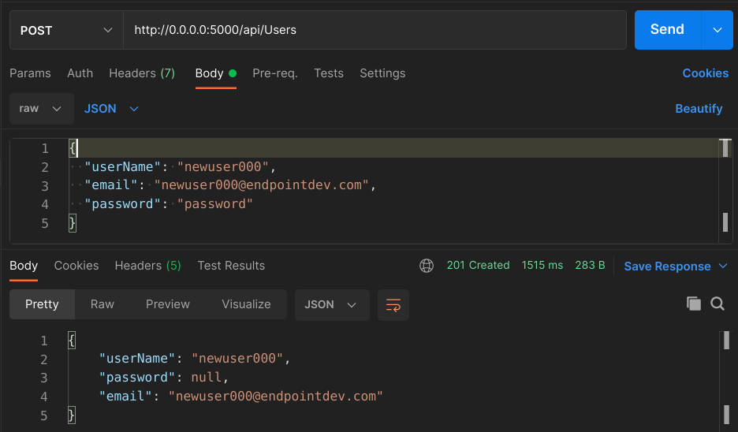
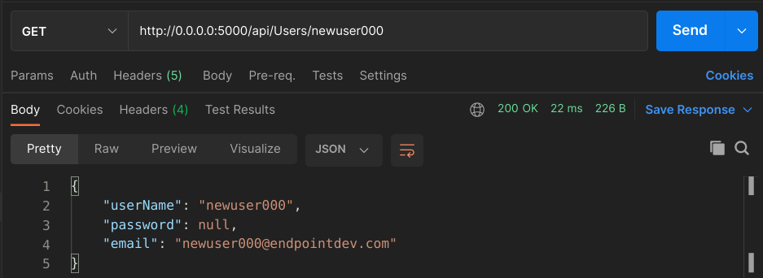

<!-- Photo by Jon Jensen -->

Authentication is a complex space. There are many problem scenarios and many more solutions. When it comes to [Web APIs](https://docs.microsoft.com/en-us/aspnet/core/tutorials/first-web-api?view=aspnetcore-6.0&tabs=visual-studio-code) written with [ASP.NET Core](https://github.com/dotnet/aspnetcore), there are various fully featured options like [Duende
IdentityServer](https://duendesoftware.com/) or [Azure Active Directory](https://docs.microsoft.com/en-us/azure/api-management/api-management-howto-protect-backend-with-aad). These promise to be "everything but the kitchen sink" solutions which are robust and allow you to deal with many complex requirements.

But what if our requirements dictate that we need something simpler? Do we have to roll out our own from scratch? Or does ASP.NET Core offer smaller, customizable, somewhat independent puzzle pieces that we can put together without having to write all the code ourselves and still have a good amount of control?

Spoiler alert: The answer to that last question is yes. And we're going to talk about it in this very article.

## Two approaches to authentication: JWT and API Keys

In this article, we'll take an existing ASP.NET Core Web API and add authentication capabilities to it. Specifically, we'll support two authentication schemes commonly used for Web APIs: JWT and API Keys. Also, we will use our own database for storage of user accounts and credentials.

The project that we will work with is a simple ASP.NET Web API backed by a [Postgres](https://www.postgresql.org/) database. It has a few endpoints for [CRUD](https://en.wikipedia.org/wiki/Create,_read,_update_and_delete)ing automotive related data and for calculating values of vechicles based on various aspects of them. You can read all about the process of building it [here](https://www.endpointdev.com/blog/2021/07/dotnet-5-web-api/). I also added a few database integration tests for it [here](https://www.endpointdev.com/blog/2022/01/database-integration-testing-with-dotnet/).

You can find it [on GitHub](https://github.com/megakevin/end-point-blog-dotnet-5-web-api). If you'd like to follow along, clone the repository and checkout this commit: [cd290c765fcd2c6693008d3dc76fa931098dcaa0](https://github.com/megakevin/end-point-blog-dotnet-5-web-api/tree/cd290c765fcd2c6693008d3dc76fa931098dcaa0). It represents the project as it was before applying all the changes from this article.

<!-- TODO: Write a quick thing about getting the app up and runnig -->

## Managing user accounts with ASP.NET Core Identity

Let's deal first with the requirement of storing the user accounts in our own database.

Luckily for us, ASP.NET Core provides us with [Identity](https://docs.microsoft.com/en-us/aspnet/core/security/authentication/identity?view=aspnetcore-6.0&tabs=netcore-cli). This is an API that offers a comprehensive solution for authentication. It can connect with the aforementioned Duende
IdentityServer for [OpenID Connect](https://openid.net/connect/) and [OAuth 2.0](https://oauth.net/2/), supports authentication via third parties like Facebook or Google, supports full integration with and scaffolding capabilities for user interfaces on web apps and.

Most importnanly for us, it suports management of user accounts stored in our own database. It includes data for third party logins, passwords, roles for authorization, email confirmation, access tokens, etc.

That's a lot of of functionality baked in there. But we don't need all that, so let's see how we can take only the bits and pieces that we need in order to fulfill our specific requirements.

Specifically, we want:

1. Tables in our database for storage of user accounts and passwords.
2. A programatic way to create, fetch and validate users using those tables.

It's actually pretty simple.

### Install the necessary NuGet packages

First, we need to install a couple of [NuGet](https://www.nuget.org/) packages:

- [Microsoft.AspNetCore.Identity](https://www.nuget.org/packages/Microsoft.AspNetCore.Identity/) which contains the core library.
- [Microsoft.AspNetCore.Identity.EntityFrameworkCore](https://www.nuget.org/packages/Microsoft.AspNetCore.Identity.EntityFrameworkCore) which includes the classes that Identity needs in order to properly interact with [Entity Framework](https://docs.microsoft.com/en-us/ef/), which is what we're using in our Web API for interfacing with the database.

We can install them by running these two commands from the `VehicleQuotes` directory:

```
$ dotnet add package Microsoft.AspNetCore.Identity
$ dotnet add package Microsoft.AspNetCore.Identity.EntityFrameworkCore
```

That will add the following lines to the `VehicleQuotes/VehicleQuotes.csproj` project file:

```diff
<Project Sdk="Microsoft.NET.Sdk.Web">
  ...
  <ItemGroup>
    ...
+   <PackageReference Include="Microsoft.AspNetCore.Identity" Version="2.2.0" />
+   <PackageReference Include="Microsoft.AspNetCore.Identity.EntityFrameworkCore" Version="6.0.5" />
    ...
  </ItemGroup>
</Project>
```

### Update the DbContext to include the Identity tables

Next step is to configure our `DbContext` class so that it includes the new tables that we need from the Identity library. So let's go to `VehicleQuotes/Data/VehicleQuotesContext.cs` and update it to do so:

We need to include these new `using` statements at the top of the file so that we have access to the classes that we need from the Nuget packages we just installed:

```csharp
using Microsoft.AspNetCore.Identity;
using Microsoft.AspNetCore.Identity.EntityFrameworkCore;
```

Next, instead of `DbContext`, the `VehicleQuotesContext` class should inherit from `IdentityUserContext<IdentityUser>`.

`IdentityUserContext` is a class provided by ASP.NET Core Identity that's designed so that our `DbContext` can inherit from it and gain user management functionality. Namely, it includes a new `DbSet` (and consequently, a table) for holding user accounts (aptly named `Users`), among other things that we won't need.

> `IdentityUserContext` has a more feature rich counterpart called `IdentityDbContext`, which also includes `DbSet`s to support roles based authorization. We don't need all that so we use its simpler cousin. Feel free to explore the [source code on GitHub](https://github.com/dotnet/aspnetcore/blob/main/src/Identity/EntityFrameworkCore/src/IdentityDbContext.cs) to see all it offers.

The [generic type parameter](https://docs.microsoft.com/en-us/dotnet/standard/generics/) that we give it, `IdentityUser`, is a class that's also provided by the Identity library. Its purpose is to serve as a default [Entity Type](https://docs.microsoft.com/en-us/ef/core/modeling/entity-types?tabs=data-annotations) for our user model and, as a consequence, our `Users` `DbSet`.

In summary, by having our `DbContext` class inherit from `IdentityUserContext<IdentityUser>`, we're telling Identity that we want it to augment our `DbContext` (and database) to include the core user management tables and that we want our users table to have the same columns as `IdentityUser`.

> If we wanted to include more columns in our users table, what we would have to do is create a new class, make it inherit from `IdentityUser`, define any additional fields that we want on it, and use that class as a type parameter to `IdentityUserContext`. For us for now, the default works just fine. You can learn more about customizing Identity in [the official docs](https://docs.microsoft.com/en-us/aspnet/core/security/authentication/customize-identity-model?view=aspnetcore-6.0).

The change looks like this:

```diff
- public class VehicleQuotesContext : DbContext
+ public class VehicleQuotesContext : IdentityUserContext<IdentityUser>
```

Finally, `IdentityUserContext` has some logic that it needs to run when it is being created. In order to allow it to run that logic, let's add the following line to our `VehicleQuotesContext`'s `OnModelCreating` method:

```diff
protected override void OnModelCreating(ModelBuilder modelBuilder)
{
+   base.OnModelCreating(modelBuilder);
    // ...
}
```

Just calling `IdentityUserContext`'s own `OnModelCreating` implementation so that it can set itself up properly.

The complete file should be looking like this now:

```csharp
using Microsoft.AspNetCore.Identity;
using Microsoft.AspNetCore.Identity.EntityFrameworkCore;
using Microsoft.EntityFrameworkCore;
using VehicleQuotes.Models;

namespace VehicleQuotes
{
    public class VehicleQuotesContext : IdentityUserContext<IdentityUser>
    {
        public VehicleQuotesContext (DbContextOptions<VehicleQuotesContext> options)
            : base(options)
        {
        }

        public DbSet<Make> Makes { get; set; }
        public DbSet<Size> Sizes { get; set; }
        public DbSet<BodyType> BodyTypes { get; set; }

        public DbSet<Model> Models { get; set; }
        public DbSet<ModelStyle> ModelStyles { get; set; }
        public DbSet<ModelStyleYear> ModelStyleYears { get; set; }

        public DbSet<QuoteRule> QuoteRules { get; set; }
        public DbSet<QuoteOverride> QuoteOverides { get; set; }

        public DbSet<Quote> Quotes { get; set; }

        protected override void OnModelCreating(ModelBuilder modelBuilder)
        {
            base.OnModelCreating(modelBuilder);

            modelBuilder.Entity<Size>().HasData(
                new Size { ID = 1, Name = "Subcompact" },
                new Size { ID = 2, Name = "Compact" },
                new Size { ID = 3, Name = "Mid Size" },
                new Size { ID = 5, Name = "Full Size" }
            );

            modelBuilder.Entity<BodyType>().HasData(
                new BodyType { ID = 1, Name = "Coupe" },
                new BodyType { ID = 2, Name = "Sedan" },
                new BodyType { ID = 3, Name = "Hatchback" },
                new BodyType { ID = 4, Name = "Wagon" },
                new BodyType { ID = 5, Name = "Convertible" },
                new BodyType { ID = 6, Name = "SUV" },
                new BodyType { ID = 7, Name = "Truck" },
                new BodyType { ID = 8, Name = "Mini Van" },
                new BodyType { ID = 9, Name = "Roadster" }
            );
        }
    }
}
```

### Applying database changes

The `Users` `DbSet` that we added into our data model by inheriting from `IdentityUserContext<IdentityUser>` will become a table once we create and apply a database migration. That's what we will do next.

That's simple in ASP.NET Core. All we need to do is run a command like this:

```
dotnet ef migrations add AddIdentityTables
```

That should produce a new migration file named something like `20220605003253_AddIdentityTables.cs`. If you explore it, you'll see how it contains the definitions for a few new database tables. Including the one that we want: `AspNetUsers`. That's the one that we will use to store our user account records.

Next, we apply the migration with:

```
dotnet ef database update
```

If you now connect to the database, you'll see the new tables in there.

If you have the database running in a docker container like we discussed in the beginning of the article, you should be able to connect to it with:

```
$ psql -h localhost -U vehicle_quotes
```

Then, to see the tables:

```
vehicle_quotes=# \dt
                    List of relations
 Schema |         Name          | Type  |     Owner      
--------+-----------------------+-------+----------------
 public | AspNetUserClaims      | table | vehicle_quotes
 public | AspNetUserLogins      | table | vehicle_quotes
 public | AspNetUserTokens      | table | vehicle_quotes
 public | AspNetUsers           | table | vehicle_quotes
 ...
(14 rows)
```

And that's pretty much it when it comes to having a sensible storage for user accounts. That was pretty inexpensive wasn't it? All we had to do was install some NuGet packages, tweak our existing DbContext, and run some migrations.

The best thing is that we're not done yet. We can also take advantage of ASP.NET Core Identity to manage users programatically. Instead of interacting with these tables directly, we will use the service classes provided by Identity to create new users, fetch existing ones and validate their credentials.

Before we can do that though, we must first do some configuration in our app's `Startup` class so that said services are properly setup to our liking and are made available to our application.

<!-- Next step for us is creating and fetching users. Let's see how we can make that happen. -->

### Configuring the Identity services

We need to add some code to `VehicleQuotes/Startup.cs` With it, we configure the Identity system and add a few service classes to ASP.NET Core's IoC container so that they are available to our app via Dependency Injection.

We need a new `using` statement:

```csharp
using Microsoft.AspNetCore.Identity;
```

And the following code added to the `ConfigureServices` method:

```csharp
services
    .AddIdentityCore<IdentityUser>(options => {
        options.SignIn.RequireConfirmedAccount = false;
        options.User.RequireUniqueEmail = true;
        options.Password.RequireDigit = false;
        options.Password.RequiredLength = 6;
        options.Password.RequireNonAlphanumeric = false;
        options.Password.RequireUppercase = false;
        options.Password.RequireLowercase = false;
    })
    .AddEntityFrameworkStores<VehicleQuotesContext>();
```

The call to `AddIdentityCore` makes several Identity utility classes available to the application. Among those, `UserManager` is the only one we will use. We will use it later to... well, manage users. You can also see how we've set a few options related to how the user accounts are handled. `options.SignIn.RequireConfirmedAccount` controls whether new accounts need to be confirmed via email before they are available. With `options.User.RequireUniqueEmail`, we tell Identity to enforce uniqueness of emails on user accounts. And Finally the `options.Password.*` options configure the password strength requirements.

> You can explore all the available options in [the official docs](https://docs.microsoft.com/en-us/dotnet/api/microsoft.aspnetcore.identity.identityoptions?view=aspnetcore-6.0).

Then, the call to `AddEntityFrameworkStores` tells the Identity system that it should use our `VehicleQuotesContext` for data storage.

### Creating users

With that configuration out of the way, we can now write some code to create new user accounts. To keep things simple, we'll add a new `UsersController` to our project that will expose a new endpoint that offers that funcitonality.

Let's start with this in `VehicleQuotes/Controllers/UsersController.cs`:

```csharp
using Microsoft.AspNetCore.Identity;
using Microsoft.AspNetCore.Mvc;

namespace VehicleQuotes.Controllers
{
    [Route("api/[controller]")]
    [ApiController]
    public class UsersController : ControllerBase
    {
        private readonly UserManager<IdentityUser> _userManager;

        public UsersController(
            UserManager<IdentityUser> userManager
        ) {
            _userManager = userManager;
        }
    }
}
```

As you can see, this controller defines a dependency on `UserManager<IdentityUser>`; an instance of which is injected via the constructor. This is one of the classes made available to us when we configured the Identity core services in our app's `Startup`. We will use is to create new user records.

Before that though, we need to define a new class that encapsulates the payload for a request to our endpoint. When it comes to creating user accounts, all we need is a username, a password and an email. As such, we add the following class in a new `VehicleQuotes/ResourceModels/User.cs` file:

```csharp
using System.ComponentModel.DataAnnotations;

namespace VehicleQuotes.ResourceModels
{
    public class User
    {
        [Required]
        public string UserName { get; set; }
        [Required]
        public string Password { get; set; }
        [Required]
        public string Email { get; set; }
    }
}
```

Now, we shall use this type as the parameter for a new `PostUser` action method in the `UserController` which will expose the new user account creation endpoint in our API. The method looks like this:

```csharp
// POST: api/Users
[HttpPost]
public async Task<ActionResult<User>> PostUser(User user)
{
    if (!ModelState.IsValid)
    {
        return BadRequest(ModelState);
    }

    var result = await _userManager.CreateAsync(
        new IdentityUser() { UserName = user.UserName, Email = user.Email },
        user.Password
    );

    if (!result.Succeeded)
    {
        return BadRequest(result.Errors);
    }

    user.Password = null;
    return Created("", user);
}
```

Be sure to also add the following `using` statements:

```csharp
using System.Threading.Tasks;
using VehicleQuotes.ResourceModels;
```

`System.Threading.Tasks` allows us to reference the class `Task<>` which is the return type of the new `PostUser` method. `VehicleQuotes.ResourceModels` is where our new `User` class lives.

Thanks to the instance of `UserManager<IdentityUser>` that we're holding onto, this method is very straight forward. The most interesting portion is this:

```csharp
var result = await _userManager.CreateAsync(
    new IdentityUser() { UserName = user.UserName, Email = user.Email },
    user.Password
);
```

Here we're new'ing up an `IdentityUser` instance using the given request parameters and passing it on to `UserManager<IdentityUser>`'s `CreateAsync` method, along with the password that was also given in the incoming request. This puts the Identity system to work for us and properly create a new user account.

Then, we can inspect its return value (which we capture in the `result` variable) to determine if the operation was successful. That way we can respond appropriately to our API's caller.

Finally, with...

```csharp
user.Password = null;
return Created("", user);
```

We return the data representing the newly created user account but we're discreet and make sure not to include the password.

With that, we can test our API. Fire it up with `dotnet run` (or [`dotnet watch`](https://docs.microsoft.com/en-us/aspnet/core/test/hot-reload?view=aspnetcore-6.0)!) and send a `POST` request to our new endpoint at `http://0.0.0.0:5000/api/Users` with a payload like this:

```json
{
  "userName": "newuser000",
  "email": "newuser000@endpoint.com",
  "password": "password"
}
```

I just tried it in [Postman](https://www.postman.com/) and this is what it looked like:



Feel free to test it out further. Try repeated emails or usernames. Try passwords that don't meet the criteria we defined when configuring Identity in the app's `Startup` class. It all works as you'd expect.

You can inspect the database and see the newly created record too:

```psql
vehicle_quotes=# select id, user_name, email, password_hash from "AspNetUsers";
-[ RECORD 1 ]-+--------------------------------------
id            | aaad07b4-f109-4255-8caa-185fd7694c72
user_name     | newuser000
email         | newuser000@endpoint.com
password_hash | AQAAAAEAACcQAAAAEJJTV7M2Ejqd3K3iC...
```

And there it is, that's our record. With a hashed password and everything.

Now let's see what would an endpoint to fetch users look like:

### Fetching users

`UserManager<IdentityUser>` offers a `FindByNameAsync` method that we can use to retrieve users by name. We can add a new endpoint that leverages it like so:

```csharp
// GET: api/Users/username
[HttpGet("{username}")]
public async Task<ActionResult<User>> GetUser(string username)
{
    IdentityUser user = await _userManager.FindByNameAsync(username);

    if (user == null)
    {
        return NotFound();
    }

    return new User
    {
        UserName = user.UserName,
        Email = user.Email
    };
}
```

This is even more straightforward than the previous one. We just call the `FindByNameAsync` method by giving it the username of the account we want, make sure that we atually found it, and then just return the data.

For the response, we use the same `User` class that we created to represent the input for the creation endpoint. If we added more fields to the user profile, we could include them here. Alas, we only have username and email for now.

Restart the app and we can now make a request like this:



Pretty neat, huh? Try a username that does not exist and you should see the API respond with a 404.

>One quick improvement that we can do before we move on: let's change `PostUser`'s return statement to this:
>
>```csharp
>return CreatedAtAction("GetUser", new { username = user.UserName }, user);
>```
>
>All that does is include a `Location` header on the POST Users endpoint's >response that contains the URL for the newly created user. [That's just being a good citizen](https://developer.mozilla.org/en-US/docs/Web/HTTP/Status/201).

## Implementing JWT Bearer Token authentication

Now that we have the user management capabilities that we need, let's implement some actual authentication. We will start by adding [JWT](https://jwt.io/) based authentication to our API.

The strategy that we will use is create a new API endpoint that clients can `POST` credentials to and that will respond to them with a fresh, short lived token. They will then be able to use that token for subsequent requests by including it via headers.

We will pick a random endpoint to secure, just to serve as an example. That is, an endpoint that requires authentication in order to be accessed. `GET api/BodyTypes` is a good candidate. It is defined in `VehicleQuotes/Controllers/BodyTypesController.cs`'s `GetBodyTypes` action method. Feel free to test it out.

## Implementing API Key authentication
