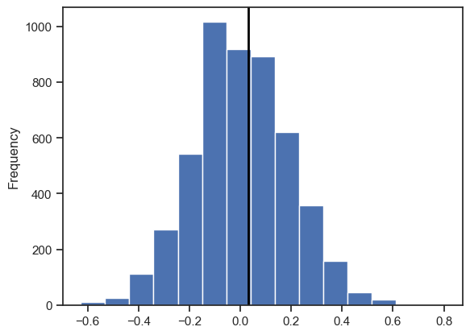

[Photo by Mikhail Nilov](https://www.pexels.com/photo/chemist-in-complete-ppe-holding-test-tubes-9243513/)


## A/B Testing

"An A/B" testing is an experiment with two groups to establish of two treatments, products, procedures, or the like is superior. Often one of the two treatments is the standard existing treatment, or no treatment." (P. Bruce, A. Bruce, P. Gedeck, Page 88, Practical Statistics for Data Scientists 2nd Edition).

A/B testing is used for determining which treatment shows a significant impact and very useful in e-commerce and marketing.

Let's consider we have a web site and we want to analyse the page visits of page A and page B. Page A is the existing (control) group, and page B would be the alternative treatment.

In preparation of an A/B testing we would start with the following steps:

* Define hypothesis (`null hypothesis` (H<sub>0</sub>) and `alternative hypothesis`)
* Prepare control and treatment groups

Then we'll apply the A/B test on the dataset.

### Purpose

You usually have an existing state (an existing web page) to see its performance against a new version of it (a new design of that web page). Your new and existing versions can show different performance in terms of marketing and visitor attention. By applying A/B tests you want to understand if the new version is showing better or worse performance than the existing version by chance or due to the significance of design change.

## Example

As an example case let's say we want to compare the conversion rates for visitors of page A and page B. So, if we show the aggregated results of our collected data for both pages as below:

**Page A**<br>
Conversion: 231<br>
Not Conversion: 11779<br><br>

**Page B**<br>
Conversion: 196<br>
Not Conversion: 9823<br>

The data to be sampled can vary. A very simple dataset could be a list of numeric results of  observations. Spent time on a control and a treatment web page, the weight of patients with and without treatments etc. The permutation sampling of these results would be simply picking the values from the combined list of both groups.

In our conversion example the nature of the groups are similar but the values are slightly different as holding the conversion and not conversion (like 1/0) states. However, we can still use a simple statistic like `mean` to make our permutation test calculation.

### Null hypothesis

Let's build our null hypothesis around our experiment. In this example the null hypothesis would be `conversion rate of A ≥ conversion rate of B`. So, the alternative hypothesis would be `conversion rate of B > conversion rate of A`.
In a significance test we usually aim to answer the question if we will reject the null hypothesis or fail to reject the null hypothesis.


### Data preprocessing and clean-up

Since the conversion/not conversion results are just kind of yes/no (or binomial) type of results we might prefer 1/0 values for the results.

Conversion samples for Page A + B:

```Python
import pandas as pd
import random

conversion = [1] * 231
conversion.extend([0] * 11779)
random.shuffle(conversion)
conversion = pd.Series(conversion)
```

### Permutation test

To get the result for the purpose of claiming if the difference between the control and treatment groups is due to chance or not we could use [permutation test](https://en.wikipedia.org/wiki/Permutation_test). "In a permutation procedure, two or more samples are involved, typically the groups in an A/B or other hypothesis test. Permute means to change the order of a set of values." (P. Bruce, A. Bruce, P. Gedeck, Page 97, Practical Statistics for Data Scientists 2nd Edition).

Permutation sampling is performed using the following steps;

1. Combine the results from the different groups into a single data set.
2. 2. Shuffle the combined data and then randomly draw (without replacement) a resample of the same size as group A (clearly it will contain some data from the other groups).
3. 3. From the remaining data, randomly draw (without replacement) a resample of the same size as group B.
4. 4. Do the same for groups C, D, and so on. You have now collected one set of resamples that mirror the sizes of the original samples.
5. 5. Whatever statistic or estimate was calculated for the original samples (e.g., differ‐ ence in group proportions), calculate it now for the resamples, and record; this constitutes one permutation iteration.
6. 6. Repeat the previous steps R times to yield a permutation distribution of the test statistic.

To produce a p-value regarding the results of the permutation test we need to calculate the observed statistic.

```
observed_percentage_diff = 100 * (196 / 10019 - 231 / 12010)
```
Which results `0.032885893156042734` for our observation.

Below is a simple permutation test implementation you can find. (P. Bruce, A. Bruce, P. Gedeck, Page 99, Practical Statistics for Data Scientists 2nd Edition).

```Python
def perm_fun(x, nA, nB):
    n = nA + nB
    idx_B = set(random.sample(range(n), nB))
    idx_A = set(range(n)) - idx_B
    return x.loc[list(idx_B)].mean() - x.loc[list(idx_A)].mean()
```

The point of permutation test is repeating the sampling too many times like 5000 times.

```
perm_diffs = [100 * perm_fun(conversion, 12010, 10019) for _ in range(5000)]
```

### Results

`perm_diffs` holds the percentage differences of the sampling data we generated. Now we have permutation test sampling differences and observed difference to be plotted.

```
import matplotlib.pyplot as plt

plt.hist(perm_diffs,  bins=15)
plt.axvline(x = observed_percentage_diff, color='black', lw=2)
plt.show()
```



This plot shows us that the observed difference is well within the `confidence level`. By looking at the result although we can easily identify the location observation it is always good to check the `p-value` to make bolder comment on it.

In this example our p-value is;

`p_value = np.mean([diff > observed_percentage_diff for diff in perm_diffs])`

which results 0.4204. Then we compare `p-value` with `alpha` which is usually taken as `0.05`. If the p-value is less then alpha then we reject the null hypothesis. So in our example the p-value is extremely high and we failed to reject the null hypothesis and the result and we can say that the difference between group A and group B is most like due to chance rather than the treatment we applied.

## Conclusion

The results of a significance tests are not explicitly taken to accept the null hypothesis, but rather helps to understand if the treatments are affecting the results of the experiments or the results are most like due to chance. The A/B (or in some cases more groups like C/D/E..) experiments are helpful to understand the treatment or chance is most likely to blame for the results.
