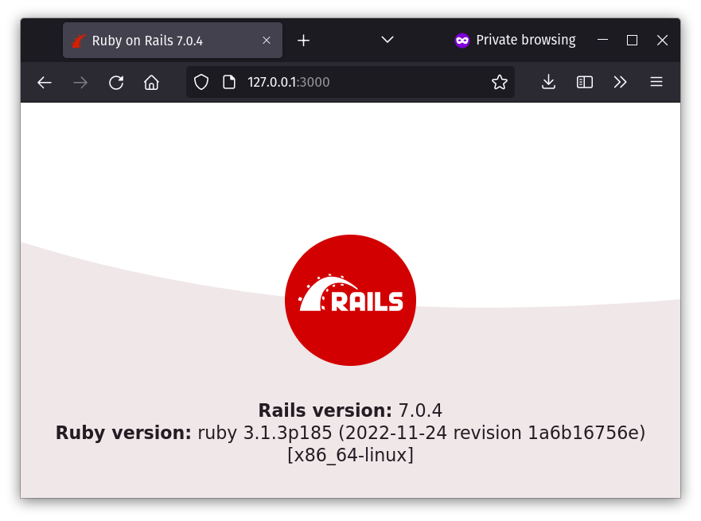

One of the great gifts from the advent of [Docker](https://www.docker.com/) and [containers](https://www.docker.com/resources/what-container/) is the ability to get a competent development environment up and running very quickly. Regardless of programming language or tech stack, there is probably an image in [DockerHub](https://hub.docker.com/) or elsewhere that you can use to set up a container for development, either verbatim or as a basis for more complex setups. Moreover, even if your development environment is complex, once you have containerized it, it's easy to replicate for new team members.

[VS Code](https://code.visualstudio.com/), one of the most popular editors/IDEs today, with help from the [Dev Containers](https://marketplace.visualstudio.com/items?itemName=ms-vscode-remote.remote-containers) extension, makes the task of setting up a container for software development easier than ever.

To demonstrate that, we're going to walk through setting up such an environment for developing Ruby on Rails applications.

## Setting up a Ruby Dev Container

As I alluded to before, all we need is Docker, VS Code and the extension. Once you have those [installed](https://www.docker.com/get-started/), we can easily create a new Docker container ready for Ruby on Rails development and have VS Code connect to it, resulting in a fully featured development environment.

### Creating the configuration file

To get started, create a new directory and open it in VS Code with something like:

```sh
$ mkdir ruby-dev-container
$ cd ruby-dev-container
$ code .
```

Now, in VS Code, bring up the [Command Palette](https://code.visualstudio.com/docs/getstarted/userinterface#_command-palette) with `Ctrl + Shift + P`. In it, run the "Dev Containers: Add Dev Container Configuration Files..." command. In the resulting menu, select "Show All Definitions..." option and look for Ruby.


From here on, the menu will ask you to select a version of Ruby and whether you want to include any additional features in the resulting development container. At the time of this writing, 3.1 was the latest Ruby that appeared so I selected that. Also, we don't need any additional features so I selected none.

> There are many options here for many different languages and tech stacks. For example, there's Ruby, which we selected, but there are also ones that come out of the box with [Sinatra](https://sinatrarb.com/), Rails and even [Postgres](https://www.postgresql.org/). Feel free to peruse! You can learn more about Dev Containers in [the official site](https://containers.dev/) and on [GitHub](https://github.com/devcontainers).

Anyway, after going through that and clicking the OK button, the extension will have produced a `.devcontainer/devcontainer.json` file with these contents:

```json
{
	"name": "Ruby",
	// Or use a Dockerfile or Docker Compose file. More info: https://containers.dev/guide/dockerfile
	"image": "mcr.microsoft.com/devcontainers/ruby:0-3.1"

	// ...
}
```

### Customizing the Dev Container

As you can see, this is a JSON file that specifies what the dev container will look like. The most important part is the `image` field which defines the image that the container will be running. In this case, it's the "Ruby 3.1" image provided by the [Microsoft Artifact Registry](https://mcr.microsoft.com/).

I like to add a few lines to this file to further configure the container. It ends up looking like this:

```json
{
	"name": "Ruby",
	// Or use a Dockerfile or Docker Compose file. More info: https://containers.dev/guide/dockerfile
	"image": "mcr.microsoft.com/devcontainers/ruby:0-3.1",

	// Use 'forwardPorts' to make a list of ports inside the container available locally.
	"forwardPorts": [3000],

	// Configure tool-specific properties.
	"customizations": {
		// Configure properties specific to VS Code.
		"vscode": {
			// Add the IDs of extensions you want installed when the container is created.
			"extensions": [
				"rebornix.Ruby"
			]
		}
	}
}
```

`"forwardPorts": [3000]` makes the container's port 3000 reachable from the local host machine's browser. That means that whenever we do `bin/rails server` from inside the container, we will be able to navigate to the app from our browser.

The `customizations` section installs the [Ruby VS Code extension](https://marketplace.visualstudio.com/items?itemName=rebornix.Ruby) in the container. This is surely optional but makes the development experience a little bit more fun. You can add any extensions you'd like here.

### Running the Container

Now, to actually run and connect VS Code to a new container using the image and configs specified in the `.devcontainer/devcontainer.json` file; bring up the [Command Palette](https://code.visualstudio.com/docs/getstarted/userinterface#_command-palette) again with `Ctrl + Shift + P` and run the "Dev Containers: Reopen in Container" command.

With that, VS Code will invoke Docker to download the image and create a new container based on it. It will also run and configure the container based on what's specified in `.devcontainer/devcontainer.json`, and finally, connect to it.

> When that's done, you should be able to see the container running with `docker ps`.

That will take a while, but once it's done, you'll be able to open VS Code's integrated terminal (with `` Ctrl + ` ``) and that will bring up a bash session in the container. From here, we can finally run all our usual Ruby and Rails commands to set up our project.

> Feel free to explore the container's environment. `ruby -v` for example will show that Ruby is ready to go in there.

### Creating the new project

First, install the rails gem:

```sh
$ gem install rails
```

Then, create the new project:

```sh
$ rails new . --minimal
```

And finally, run the app:

```sh
$ bin/rails server
```

Open a browser and navigate to [http://127.0.0.1:3000/](http://127.0.0.1:3000/)` to see the classic Rails hello world screen:



And that's all! I use Ruby on Rails on a daily basis, so that's what I've chosen to demonstrate here. However, there are many more options of programming languages and technologies when it comes to Dev Containers. All of them share very similar setup processes. And even if there isn't an image optimized for development readily available in the Microsoft Artifact Registry, you can always author your own custom Dockerfile and use that for whatever use case you may have.
