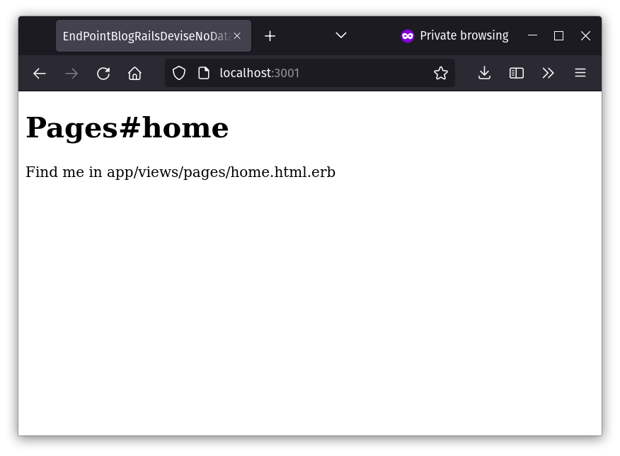
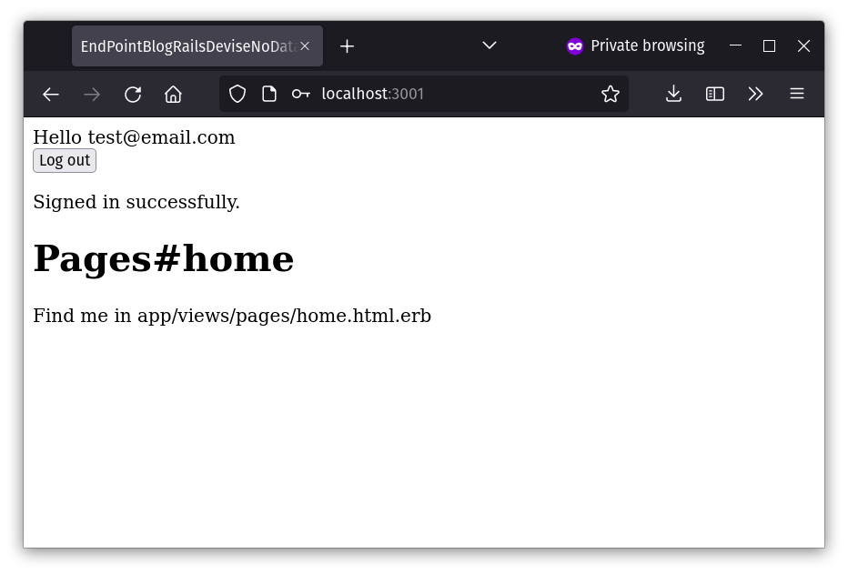

We can pretty much say that thanks to the venerable [Devise](https://github.com/heartcombo/devise) [gem](https://rubygems.org/), the authentication problem has been solved in [Ruby on Rails](https://rubyonrails.org/). There are some instances however, when the requirements veer a little further away from convention and some customization needs to happen.

Such was the case of a recent project where we had to implement authentication and session management on a small web application that would serve as an [API gateway](https://microservices.io/patterns/apigateway.html) into other system components. The interesting part was that there was no database to store accounts, and credentials would have to be validated against an external web service.

Luckily for us, the Devise gem is customizable enough to be able to fulfill this requirement via custom authentication strategies. With custom authentication strategies, one can implement completely bespoke authentication logic while still enjoying a lot of the features that Devise offers out of the box.

In this article, we're going to walk through doing just that. Let's get started.

> To learn more about this capability of Devise, and how it relates to the underlying [Warden](https://github.com/wardencommunity/warden) concepts, here are some interesting sources:
> - [Remote authentication with devise](https://4trabes.com/2012/10/31/remote-authentication-with-devise/).
> - [Devise authentication strategies](https://insights.kyan.com/devise-authentication-strategies-a1a6b4e2b891).
> - [Custom authentication methods with Devise](http://blog.plataformatec.com.br/2019/01/custom-authentication-methods-with-devise/).
> - [Warden strategies](https://github.com/wardencommunity/warden/wiki/Strategies).

## Setting up a new Rails project

If you want to work along with me, and you like [Docker](https://www.docker.com/) and [VS Code](https://code.visualstudio.com/), take a look at [this blog post](https://www.endpointdev.com/blog/2023/01/developing-rails-apps-in-a-dev-container-with-vs-code/) to learn how to set up a containerized development environment for Ruby on Rails with minimal effort.

If not, you can follow [the official docs](https://www.ruby-lang.org/en/documentation/installation/) for installing Ruby.

Either way, once you have your environment ready, we can go ahead and start setting up our new Rails project.

First, make sure to install the rails gem:

```sh
$ gem install rails
```

Then, make sure you are located in the directory where you want to create the new project and do:

```sh
$ rails new . --minimal
```

> `--minimal` is an option to `rails new` added in version 6.1 that disables a lot of default features and gems. You can learn more about it [here](https://github.com/rails/rails/pull/39282).

## Installing Devise

Now, we need to add the Devise gem by adding this to your `Gemfile`:

```rb
gem "devise"
```

And then running the following to install it in the project:

```sh
$ bin/rails generate devise:install
```

Let's also create a "home" page to which we will point the app root route to. Run:

```sh
$ bin/rails generate controller Pages home --no-helper
```

That will create a new `PagesController` with a `home` action and its corresponding view.

Next, in the `config/routes.rb` file, replace the `get 'pages/home'` line created by the previous command with `root "pages#home"`.

Also, like I said at the beginning, we won't use a database for storing accounts or validating credentials. So, we can comment out this line on the Devise initilizer at `config/initializers/devise.rb`:

```ruby
Devise.setup do |config|
  # ...
  # ==> ORM configuration
  ## require 'devise/orm/active_record'
  # ...
end
```

Now we have a strong enough foundation to get started. Run `bin/rails server` and navigate to the URL that the Puma development server produced and you should see this:



## Defining the User model

For Devise to work, it needs to be associated with a model class from our app that represents user accounts. Normally, this would be some `ActiveRecord::Base` derived class, like most conventional implementations. For us though, this will not work because, like I said at the beginning, we don't have a database. Accounts nor credentials will be stored locally but rather, in an external web service.

So what we do instead is define a class that looks *enough* like an ActiveRercord such that Devise can work with it. Thanks to Rails' modularity, this is easy, as we only need to include a few modules into said class. Here's what our `User` model class ends up looking like:

```ruby
# app/models/user.rb
class User
  include ActiveModel::API
  include ActiveModel::Validations
  extend ActiveModel::Callbacks
  extend Devise::Models

  define_model_callbacks :validation

  attr_accessor :email, :password
end
```

As you can see, all we have done is `include` and `extend` various modules as well as define the validation callbacks. This will augment the class with the APIs necessary for Devise to be able to interact with it properly. We also define an email and password fields which will be our credentials.

> You can read more about `ActiveModel::Callbacks` and `define_model_callbacks` [here](https://api.rubyonrails.org/classes/ActiveModel/Callbacks.html).

Now that this class is available, in order to tell Devise that it needs to work with it, we add the following line to the `config/routes.rb` file:

```diff
Rails.application.routes.draw do
  # ...
+  devise_for :users
end
```

## Implementing the custom authentication strategy

Now that Devise is hooked up, let's finally implement the custom authentication strategy. For this we will take three steps:

1. Write a component that implements the authentication logic.
2. Write a component that implements the serialization logic.
3. Register the new strategy in the initializer and model class.

Let's get started with step 1, and here's what the class looks like:

```ruby
# app/custom_auth/devise/strategies/custom_authenticatable.rb
# Based on https://gist.github.com/madtrick/3917079
module Devise
  module Strategies
    # The class needs to inherit from Devise::Strategies::Authenticatable which
    # implements most of the underlying logic for auth strategies in Devise.
    # You can read the code here:
    # https://github.com/heartcombo/devise/blob/main/lib/devise/strategies/authenticatable.rb
    class CustomAuthenticatable < Authenticatable
      # This is the method called by Warden to authenticate a user.
      # More info in https://github.com/wardencommunity/warden/wiki/Strategies#authenticate
      def authenticate!
        if credentials_valid?
          # Signals Warden that the authentication was successful.
          # Expects an instance of the model class that Device is configured to work with.
          # This should be the user account that matches the provided credentials.
          success!(validated_user)
        else
          # Signals Warden that the authentication failed.
          fail!
        end
      end

      private

      # Returns a boolean indicating whether the provided credentials are valid.
      # This is where you can implement any bespoke logic to do so: Read a file,
      # call a service, validate a one-time-use token, etc.
      #
      # authentication_hash is provided by the base class and includes all the
      # fields included in the login form.
      def credentials_valid?
        authentication_hash[:email] == "test@email.com" && authentication_hash[:password] == "password"
      end

      def validated_user
        # mapping.to is a reference to the model class that Devise is configured
        # to use that represents user accounts. In this case, it's the User class.
        mapping.to.new(
          email: authentication_hash[:email],
          password: authentication_hash[:password]
        )
      end
    end
  end
end
```

Feel free to read through that code and the comments for some explanations on what each piece does. There are a few key points to go over. First of all, the class needs to inherit from `Devise::Strategies::Authenticatable`. This is the base class that Devise provides for us to create custom authentication strategies. The most important method that we need to define is `authenticate!`. This method is invoked by the powers that be (i.e. Warden) to run the actual authentication logic. After calling it, Warden expects it to invoke either `success!` or `fail!`, depending on the authentication results, and the rest of the system will act accordingly. `success!` expects an instance of User being passed as an argument. This User instance represents the account that matches the given credentials.

The `authenticate!` method is where Devise and Warden give you the ability to fully customize how to authenticate the given credentials. I've chosen to implement a simple check against hardcoded values for our example here, but this can be anything. In my real world use case, I had to make a call to an external web service, but you could also check a file, validate a token with some algorithm, anything that's possible with Ruby and Rails really.

Next step is to implement the logic that serializes and deserializes the instance of User that represents the logged in account to and from the Rails session store. This is encapsulated in a very simple module that looks like this:

```ruby
# app/custom_auth/devise/models/custom_authenticatable.rb
# Based on https://gist.github.com/madtrick/3916999
module Devise
  module Models
    module CustomAuthenticatable
      extend ActiveSupport::Concern

      module ClassMethods
        # Recreates a resource from session data.
        #
        # It takes as many params as elements in the array returned in
        # serialize_into_session.
        def serialize_from_session(email)
          new(email:)
        end

        # Returns an array with the data from the user that needs to be
        # serialized into the session.
        def serialize_into_session(user)
          [user.email]
        end
      end
    end
  end
end
```

And this one is very self-explanatory. There's a `serialize_into_session` method that receives the User instance for the logged in account and returns an array of the individual fields of it that we want Devise to include in the session data that persists across requests. And there's also a `serialize_from_session` method that receives the fields from the serialized array as individual parameters and has to return a new User instance.

And finally, we need to register the new strategy and put it to work. We do that by adding these lines in the Devise initilizer at `config/initializers/devise.rb`:

```ruby
Devise.setup do |config|
  # ...
  config.warden do |manager|
    manager.strategies.add(:custom, Devise::Strategies::CustomAuthenticatable)
    manager.default_strategies(scope: :user).unshift(:custom)
  end

  Devise.add_module :custom_authenticatable, controller: :sessions, route: :session, strategy: :custom
  # ...
end
```

Here, we've registered our new custom authentication strategy with Warden and added it as a default. We've also declared a new Devise "module" (via the [`Devise.add_module`](https://www.rubydoc.info/github/plataformatec/devise/Devise.add_module) method) that will use that strategy (as given by the `strategy:` parameter) and act as part of the sessions-related functionality (as given by the `controller:` and `route:` parameters). This means that, by adding this module to our User model class, Devise will render the routes necessary for session handling. Namely, sign_in and sign_out. Like this:

```sh
 $ bin/rails routes
              Prefix Verb   URI Pattern               Controller#Action
    new_user_session GET    /users/sign_in(.:format)  devise/sessions#new
        user_session POST   /users/sign_in(.:format)  devise/sessions#create
destroy_user_session DELETE /users/sign_out(.:format) devise/sessions#destroy
```

Now, all that's left is adding the module to the `User` class at `app/models/user.rb`.

```ruby
class User
  # ...
  devise :custom_authenticatable, authentication_keys: [:email, :password]
end
```

Note how we specify the `authentication_keys` to be `email` and `password`. The same fields that `Devise::Strategies::CustomAuthenticatable` uses to run the validation logic, and are defined as attributes in `User`. These can be anything really. The nice thing about using `email` and `password` in particular is that Devise's default views and controllers already work with these fields, so no additional changes and configurations need to be done if we follow that convention.

With all this, we're basically plugging some of our code right in the middle of Devise's logic for authentication and leveraging the rest of the functionality provided by it, like automatic views and controllers and such. As we'll see next.

## Implementing session management

Now that we've laid out all the piping that we need, the rest of the work to add support for sessions to our little test app is actually just business as usual with Devise.

By adding the `custom_authenticatable` Devise module to the User class, and the `devise_for :users` line on the `config/routes.rb` file, the session management actions are already in. So all we have to do is add a few links to actually use them. Adding the following snippet on `app/views/layouts/application.html.erb` inside the `<body>` element will suffice:

```html
<% if user_signed_in? %>
  <span>Hello <%= current_user.email %></span>
  <%= button_to "Log out", destroy_user_session_path, method: :delete %>
<% else %>
  <%= link_to "Log in", new_user_session_path %>
<% end %>

<p class="notice"><%= notice %></p>
<p class="alert"><%= alert %></p>
```

This should be very familiar if you've worked with Devise before. If not, there are more details [here](https://github.com/heartcombo/devise/wiki/How-To:-Add-sign_in,-sign_out,-and-sign_up-links-to-your-layout-template).

All this does is show a link to the log in page when there's no user logged in; and a hello message along with a log out button when there is.

Run the app with `bin/rails server`, click the "Log in" link, and you'll see Devise's default log in page. Type in the hardcoded credentials from `Devise::Strategies::CustomAuthenticatable` and submit the form to see something like this:



We've just been redirected back to the root and are greeted and shown a result message courtesy of Devise.

And that's it! We've developed a pretty simple custom authentication strategy for Devise that's very straightforward. It does not use a database at all! The important thing though, is that we can use this pattern to implement any number of more complex procedures. And we've done so in a way that does not lock us out of leveraging the rest of Devise's out-of-the-box capabilities like automatic controllers and views.
