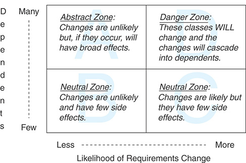
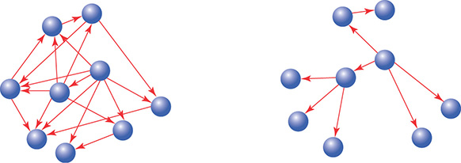
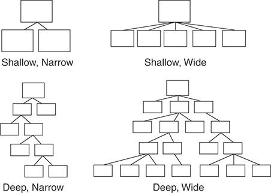
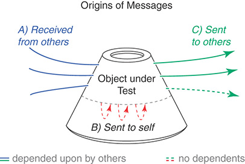
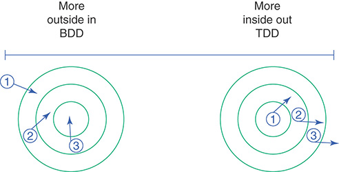

[Practical Object-Oriented Design: An Agile Primer Using Ruby](https://www.poodr.com/) by [Sandi Metz](https://sandimetz.com/) is one of those books that everybody who writes or aspires to write object-oriented code should read. Indeed, a read through this book will be of value for seasoned practitioners and inexperienced novices alike. Whether it be to discover new concepts, remember why they are important, or articulate the reasons behind that warm fuzzy feeling you get in your stomach when you read well designed code; POODR can help.

I personally really like this book, and here at End Point it does have quite a following as well. [It was the subject of a study group that we ran back in 2016](https://www.endpointdev.com/blog/2016/08/ruby-fight-club/). In fact, I like to dust it off every now and then to give it a re-read. To help with that, I've come up with a list of key takeaways from the book, with some of my own interpretations sprinkled in. For me, it serves as a sort of summary to help commit the book's contents to memory. I thought I'd share it with you today.

> While this book uses the Ruby language for its examples and discussions, the concepts it describes are equally applicable to any classical object-oriented language. Dynamically typed language users do get a little more mileage than users of statically typed ones. But still, something like 90% of the content is relevant to both. For this summary, I've taken care not to tie the discussion to Ruby too much and be as language agnostic as possible. I've chosen to write the code examples in C#.

> Images taken from the book. Code taken from the book's examples in Ruby and translated to C#.

# Chapter 1: Object-Oriented Design

## About design

1. Following the principles and patterns of object-oriented design produces code that is both cost-effective and a joy to work with. "Cost effective" means that it doesn't take more effort than necessary to evolve. To change.
2. The reason design is important is because software changes. A good design is one that makes software easy to change.
3. Object-oriented design sees the world as a collection of parts that interact with each other. The parts, we call "objects", and the interactions, we call "messages".
4. In order to send messages to each other, objects need to have some knowledge about one another. This knowledge produces "dependencies" between them.
5. Managing these dependencies is a big part of object-oriented design. OOD aims to create dependencies in such a way that they don't make the process of changing objects too difficult.
6. Design is important no matter the size of the application. Because both small and large applications change. And change is what design allows. A badly designed small application will eventually become a badly designed large one.
7. Design is the way in which code is arranged. Good design is an arrangement of code that makes change easy.
8. Our job as developers is to take our application's requirements and our knowledge of design principles and use that to produce code that is cost effective today and tomorrow. Code that is easy to change.
9. The idea is not to predict future changes. Instead, we have to accept that change will come and prepare for it. We prepare for it by writing code that leaves our options open for the future.
10. "The purpose of design is to allow you to design later, and its primary goal is to reduce the cost of change".

## Failures of design

11. **Design fails when you don't do it**. Code bases that lack in design will eventually evolve into unmaintainable messes. Change become increasingly hard even for the most minor new requirements. "Throwing everything away and beginning from scratch" becomes a viable alternative.
12. **Design fails when you overdesign**. Armed with basic design skills, it's easy to fall into the trap of developing wrong abstractions, applying principles incorrectly, seeing the wrong pattern in the wrong context. Applications that suffer from overdesign become gigantic castles of code full of indirection that become hard to change.
13. **Design fails when you separate it from programming**. Design is best executed as an iterative and incremental process with a quick feedback loop. The design needs to be adjusted frequently, as understanding of the domain changes. Design that is dictated to programmers from on high as part of a "[Big Up Front Design](https://en.wikipedia.org/wiki/Big_design_up_front)" is doomed to failure. Such arrangements are not agile enough to be resilient to requirement changes.

## Agile and design

14. Agile says: "Avoid Big Up Front Design because you can't know what the application will end up being because requirements always change and they do so often".
15. Agile also says: "Good design is essential. Because change comes often, your code needs to be ready to accommodate those changes in an efficient and cost effective way."
16. Design is not a "one time at the beginning of the project" type of task. It is an ongoing, iterative and incremental task that happens as requirements change, and our domain knowledge and skills increase.

## Metrics

17. Bad object-oriented Design metrics are an indicator of a bad design. But good metrics are not an indicator of good design. A code base with bad metrics will most likely be hard to change.
18. The ideal software metric would be "**cost per feature per time interval**". But this is nigh on impossible to calculate because "cost", "feature" and "time interval" are in most cases nebulous concepts.
19. Still, "cost per feature per time interval" tells us that our goal should always be to write code with a low cost per feature. Making sure that it is also low cost to evolve in the future.

## Technical debt

20. **Technical debt** is borrowing time from the future. That is, putting out a bad design today in order to release a feature quickly. Tomorrow, when change comes, the bad design will prevent cost effective change. So time will have to be spent refactoring, turning the bad design into a good one. If refactoring doesn't happen, the debt increases, making future changes more and more expensive.
21. How much design you do depends on your skill and your time frame. You can't do so much design that it prevents you from delivering on time. Design is an investment, and for an investment to be good, it needs to return some profit. Good design's returns are quick and plentiful.
22. "The trick to getting the most bang for your design buck is to acquire an understanding of the theories of design and to apply them appropriately, at the right time, and in the right amounts".

# Chapter 2: Designing Classes with a Single Responsibility

## About classes

1. **Classes** are the most basic organizational structure of object-oriented systems written with class-based object-oriented languages. As such, that's the first thing that we focus on when designing such systems.
2. Your first instinct should be to keep things simple. Use classes to model only the features that your application needs today and make sure that they are easy to change tomorrow.
3. "Design is more the art of preserving changeability than it is the act of achieving perfection".

## Write code that is TRUE

4. In order to be easy to change, code should be **TRUE**.
5. **Code should be "Transparent"**. It should be easy to tell what will be the consequences of changing the code.
6. **Code should be "Reasonable"**. The cost of a change should be proportional to the size of the requirement that provoked the change.
7. **Code should be "Usable"**. The code should be easy to reuse in other situations than the one it's currently being used on.
8. **Code should be "Exemplary"**. The code should exhibit qualities that guide and/or encourage those who change it to keep and replicate those qualities.
9. The [Single Responsibility Principle](https://en.wikipedia.org/wiki/Single_responsibility_principle) is a prerequisite to creating code that is TRUE.

## Single Responsibility

10. A class should have one single responsibility. That means that it needs to do one thing and do it well. It needs to be as small as possible and fulfill a single purpose. It needs to have only one reason to change.
11. A good way to identify what classes your system needs is to read through your user stories or problem descriptions and identify **nouns**. Those nouns are good candidates for classes.
12. If there are **verbs** and **properties** associated with those nouns, then it is most likely a class. Because classes represent bundles of both data (attributes) and behavior (methods).
13. Classes that have many responsibilities are hard to reuse. And because they are not "Usable", they are not easy to change.
14. A class that has many responsibilities usually has unrelated code is tangled together within it. This makes the class hard to reason about, and hard to reuse.
15. In order to reuse the behavior defined within a class with multiple tangled responsibilities, you either need to duplicate code or use the entire class, even the parts that you don't need.
16. If you use a class that has many reasons to change, when something unrelated to your use case changes, you will still have to change your code. This is unexpected and surprising. This is not "Transparent".
17. Depending on classes that have many responsibilities increases the chances of your application breaking.
18. A good way to determine whether a class has a single responsibility is to try an enunciate what it does in a single sentence. That sentence should be simple, because classes should be simple. Look out for the words "and" and "or" in this sentence, as they point to it having more than one responsibility.
19. Another good way to determine whether a class has a single responsibility is thinking about every one of its methods as a question that the class would be able to respond to if it were a sentient being. For example "Array, what is your length?". If the question doesn't make sense, then maybe the method does not belong in the class.
20. **Cohesion** is the measure of how related to their core purpose are the elements of a component. Classes that have a single responsibility are highly cohesive because all of their parts work towards a single goal.

## When to make design decisions

21. Only design as much as you need to for right now. Don't make design decisions prematurely. Sometimes waiting for more information before committing to a design is the way to go. More information in the future will often reveal a better design.
22. Consider postponing design decisions when the information available to you today does not point clearly to a good design. Also, when the cost of not doing it now does not considerably make tomorrow's change more expensive.
23. On the other hand, consider that a class that's left in a "bad state", may be reused by others. Making their code depend on badly designed code. The application will suffer as a result.
24. The structure of a class is supposed to reveal your design's intention to other developers. When it doesn't, when it is not "Exemplary", then future maintenance costs increase.
25. The tension between "improve it now" and "improve it later" is always present. Our job as designers is to strike a good balance "between the needs of the present and the possibilities of the future" so that the costs of change are kept low.

## Techniques for writing code that's easy to change

26. **Depend on behavior, not data: Hide instance variables**. Instead of accessing instance variables directly, use accessor methods. Even from within the class that owns them. "Always send messages to access data".
27. That way you consolidate the knowledge of what the data represents in a single place. Single Responsibility Principle in action. Changing it becomes easy as a result because instead of changing references to a variable in potentially multiple places; you only need to change the definition of a method, in a single location.
28. **Depend on behavior, not data: Hide data structures**: When code depends on or receives as input a complex data structure like a big array or hash; encapsulate the data structure in a class with clear interface, instead of accessing and manipulating the structure directly.
29. Directly manipulating complex data structures is a style of coding that tends to propagate. If the incoming data structure changes, even slightly, then a lot of your code needs to also change because it depends on its very particular structure.
30. Handling complex raw data structures through classes and messages with clear intention revealing names, demystifies the structure and gives it meaning within the context of the application domain.

> For example, instead of this:
> 
> ```csharp
> class ObscuringReferences
> {
>     int[][] data;
> 
>     public ObscuringReferences(int[][] data)
>     {
>         this.data = data;
>     }
> 
>     public IEnumerable<int> GetDiameters()
>     {
>         return data.Select(cell => cell[0] + (cell[1] * 2));
>     }
> }
> ```
> 
> ...do this:
> 
> ```csharp
> class RevealingReferences
> {
>     IEnumerable<Wheel> Wheels { get; set; }
> 
>     public RevealingReferences(int[][] data)
>     {
>         Wheels = Wheelify(data);
>     }
> 
>     // This method is now more readable.
>     public IEnumerable<int> GetDiameters()
>     {
>         return Wheels.Select(wheel => wheel.Rim + (wheel.Tire * 2));
>     }
> 
>     // Now everyone can send rim/tire to wheel.
>     record Wheel(int Rim, int Tire);
> 
>     private IEnumerable<Wheel> Wheelify(int[][] data)
>     {
>         return data.Select(cell => new Wheel(cell[0], cell[1]));
>     }
> }
> ```

31. **Enforce single responsibility everywhere: Extract extra responsibilities from methods**. Methods should also have a single responsibility. Just like classes, that makes them easy to reuse, change and understand.
32. To determine if a method has a single responsibility, the same techniques that work for classes apply. Try to enunciate their purpose in a single sentence, and ask them what they do.
33. Methods that iterate on items and act upon them too is a common case of multiple responsibilities. Separating iteration and action into two methods is a common refactoring to correct it.
34. Complex calculations embedded within methods are also good candidates to be separated into other methods. It gives them a name and makes them reusable.

> For example, instead of this:
> 
> ```csharp
> IEnumerable<int> GetDiameters()
> {
>     return Wheels.Select(wheel => wheel.Rim + (wheel.Tire * 2));
> }
> ```
> 
> ...do this:
> 
> ```csharp
> // First - iterate over the collection.
> IEnumerable<int> _GetDiameters()
> {
>     return Wheels.Select(wheel => GetDiameter(wheel));
> }
> 
> // Second - calculate diameter of ONE wheel.
> int GetDiameter(Wheel wheel)
> {
>     return wheel.Rim + (wheel.Tire * 2);
> }
> ```

35. These refactorings are useful and necessary even when you don't know what the final design will look like. In fact, these refactorings (and good practices like these) will often reveal the final design.
36. Small methods with single responsibility have many benefits. They: Make a class's details, features and components more obvious, are self-documenting, encourage reuse, establish a style of programming that is self-perpetuating, become easy to move to another class when and if that time comes.
37. **Enforce single responsibility everywhere: Isolate extra responsibilities in classes**. Move the responsibilities that are extraneous to a class into another class. If you can afford it, create a separate class to hold them. If not, at least encapsulate them in an embedded class so that they are contained and don't leak.
38. Embedded classes say: This class only has meaning and value when thought about within the context of this other class.
39. Embedded classes can be easily promoted to independent classes later if the need arises.
40. Once all methods inside a class have a single responsibility and are each doing the smallest useful thing, it becomes easier to identify the features that may belong to another class.
41. The purpose of design is not to produce "perfect" code but instead to produce code that's "good enough".
42. The Single Responsibility Principle "allows change without consequence and reuse without duplication".

# Chapter 3: Managing Dependencies

## About dependencies

1. Objects should have a single responsibility and do the smallest useful thing. This means that, in order to fulfill complex application requirements, objects need to collaborate with one another.
2. Objects collaborate by knowing things about and sending messages to each other. That creates **dependencies**. A good design manages these dependencies, making sure they don't couple objects so much that change becomes painful.
3. **Coupling** measures how much inter-dependency exists between software components. High coupling makes things hard to change.
4. An object has a dependency when it knows **the name of another class**.
5. An object has a dependency when it knows **the name of a method from another class**.
6. An object has a dependency when it knows **the arguments of that method**.
7. An object has a dependency when it knows **the order of those arguments**.
8. Dependencies create a situation where if an object changes, then other objects that depend on it may be forced to change as well.
9. Dependencies couple objects to each other. Highly coupled objects behave as if they were a unit. It becomes hard to reuse one without the other. If not managed properly, dependencies will disseminate and entangle the entire code base.
10. Some dependencies are unavoidable. So the purpose of design is to reduce and contain dependency. Ensure objects only have the minimum number of dependencies that they need to do their jobs. Keep the essential ones, remove the rest.

## Techniques for writing loosely coupled code

11. [**Dependency injection**](https://en.wikipedia.org/wiki/Dependency_injection). It can help eliminate dependencies on concrete classes. Instead of instantiating new objects of another class inside your object, let it receive it as a constructor or method parameter. The object's users can do the instantiation.
12. An object that knows less can often times do more. The knowledge of how to instantiate a particular object limits its potential. Object creation and utilization don't need to be contained within the same unit of code.
13. When an object hard-codes the reference to a class, it advertises that it can't work with any other type. Replace the reference to the concrete class with an abstraction (e.g. an [interface](https://en.wikipedia.org/wiki/Interface_(object-oriented_programming)) or [duck type](https://en.wikipedia.org/wiki/Duck_typing)). That gives it the flexibility to be able to collaborate with other objects that respond to the same messages.

> With dependency injection you can turn this:
> 
> ```csharp
> class Gear
> {
>     float Ratio { get; set; }
>     int Rim { get; set; }
>     int Tire { get; set; }
> 
>     public Gear(float ratio, int rim, int tire)
>     {
>         Ratio = ratio;
>         Rim = rim;
>         Tire = tire;
>     }
> 
>     public float GetGearInches()
>     {
>         return Ratio * new Wheel(Rim, Tire).GetDiameter();
>     }
> }
> ```
> 
> Into this:
> 
> ```csharp
> class Gear
> {
>     float Ratio { get; set; }
>     Wheel Wheel { get; set; }
> 
>     // Instead of rim and tire, Gear's constructor now receives a wheel.
>     public Gear(float ratio, Wheel wheel)
>     {
>         Ratio = ratio;
>         Wheel = wheel;
>     }
> 
>     public float GetGearInches()
>     {
>         // Instead of creating a new wheel, it uses the one that's been injected.
>         return Ratio * Wheel.GetDiameter();
>     }
> }
> ```

14. Sometimes it is not possible to remove a dependency from an object. In those cases, your best bet is to isolate it.
15. **Isolate dependencies: Isolate instance creation**. Sometimes it is not possible to apply dependency injection. In those cases, the next best thing is to encapsulate instantiation of external classes into their own methods.
16. An instantiation encapsulated in a method allows the code to clearly and explicitly communicate that there's an extraneous dependency here. One that we'd like to remove but for now cannot. We also protect the class from that dependency propagating through it.
17. **Isolate dependencies: Isolate vulnerable external messages**. The same technique can be applied to invocations of methods on external classes. Encapsulate such calls into their own methods in order to contain the dependency.

> Here's how isolating some dependencies could look like. From this:
> 
> ```csharp
> float GetGearInches()
> {
>     return Ratio * new Wheel(Rim, Tire).GetDiameter();
> }
> ```
> 
> ...to this:
> 
> ```csharp
> float GetGearInches()
> {
>     return Ratio * GetWheelDiameter();
> }
> 
> // The dependency on the Wheel class is isolated in this method.
> int GetWheelDiameter()
> {
>     return new Wheel(Rim, Tire).GetDiameter();
> }
> ```

18. **Reduce argument dependencies: Use keyword arguments**. If your language supports them, keyword arguments are a great way of reducing the dependency incurred via method invocations. They allow the parameters to be sent in any order, which means that changes to the method's definition and signature are less likely to cause the callers to have to also change. Also, they have a self-documenting property on both caller and callee. (See [Named arguments in C#](https://learn.microsoft.com/en-us/dotnet/csharp/programming-guide/classes-and-structs/named-and-optional-arguments) and [keyword arguments in Ruby](https://thoughtbot.com/blog/ruby-2-keyword-arguments)).
19. **Reduce argument dependencies: Explicitly define defaults**. If your language has the feature, parameter defaults are a great way of reducing dependencies to method parameters, as establishing a default for a parameter makes it optional.
20. **Reduce argument dependencies: Isolate multiparameter initialization**. If you don't own the code for a complex object initialization or method invocation, you can always encapsulate it in an object or method of your own. It can be done with a thin wrapper that exposes an interface that follows the techniques we've discussed and that uses the language of your application.
21. Classes should depend on things that change less often than they do.
22. There are three truths about code related to change and dependencies: 1. "Some classes are more likely to change than others". 2. "Concrete classes are more likely to change than abstract classes". 3. "Changing a class that has many dependents will have many consequences".
23. It's OK to depend on classes with a low likelihood of change. For example, classes in the built-in library of your language generally will change less than your own custom classes. Framework classes commonly change less often too, but that may not always be the case if you framework is new or rapidly evolving.
24. Abstractions are generally much more stable than concretions. Because of this, **it is safer to depend on abstract classes** (e.g. interfaces and duck types) than on concrete ones.
25. Avoid classes that have lots of dependencies. Any changes done to them produce a ripple effect of changes throughout the code base. Also, because of that, people will go through great lengths to try to avoid changing them.
26. When thinking about dependents and likelihood of change, **the following are harmless**: 1. Classes with few dependents and low likelihood of change (e.g. specialized infrastructure interaction classes). 2. Classes with few dependents and high likelihood of change (e.g. concrete classes that implement your app's domain logic). 3. Classes with many dependents and low likelihood of change (e.g. interfaces and other abstractions).
27. When thinking about dependents and likelihood of change, **the following is harmful**: Classes with many dependents and high likelihood of change (e.g. concrete classes that are used throughout the code base).



# Chapter 4: Creating Flexible Interfaces

## About interfaces

1. The messages that objects pass between each other are a big concern for design. In addition to what objects know (responsibilities), and who they know (dependencies), design cares about how they talk to one another. Messages pass between objects through their interfaces.
2. In a well designed application, the messages that pass between objects follow a pattern that's closer to the diagram on the right than that of the diagram on the left:



3. Objects that expose too much of themselves and know too much about others are hard to reuse and make systems hard to change.
4. Objects that minimize what they expose of themselves and know little about others are easily reusable and changeable.
5. An object's **public interface** is the set of messages that it responds to. That is, the set of methods that other objects are welcome to invoke. Good design calls for objects with clear and concise public interfaces.
6. Classes should have one responsibility, but they will likely have many methods. Some methods are more general and expose the main features of a class, they are the services that the class offers its callers. These should make up the class' public interface. Other methods are more specific, serve to support those features, and contain implementation details internal to the class and uninteresting to callers. These make up the class' private interface.
7. **The methods in a class' public interface**: 1. "Reveal its primary responsibility". 2. "Are expected to be invoked by others". 3. "Are not likely to change". 4. "Are safe for others to depend on". 5. "Are directly covered by tests".
8. **The methods in a class' private interface**: 1. "Handle implementation details". 2. "Are not expected to be invoked by other objects". 3. "Are likely to change". 4. "Are unsafe for others to depend on". 5. "May not even be referenced in the tests".
9.  Public methods list the specific features of a class that allow it to fulfill its responsibility. They advertise to the world what's the purpose of the class they belong to.
10. Public methods are stable, expected to not change often, so others are welcome to depend on them.
11. Private methods are not stable at all. They are hidden from others so nobody should not depend on them.

## Discovering less obvious objects and messages

12. When analyzing a problem domain, the nouns in the narrative usually become your first classes. These are called "**Domain Objects**".
13. Don't let Domain Objects be your only classes though. Shift your focus into messages and away from classes to discover new, less obvious objects that will home key functionality. Not doing so will risk overloading your domain objects with more responsibility than what they can handle.
14. [UML sequence diagrams](https://en.wikipedia.org/wiki/Sequence_diagram) are an excellent way to explore design alternatives. You can use them to draft objects and their interactions. I.e. the messages they send each other. They are quick, low cost and allow easy communication of ideas between team members. Here's an online tool that generates them based on plain text: [sequencediagram.org](https://sequencediagram.org/).
15. The transition from class-based design to message-based design is one that yields more flexible applications. It means asking "I need to send this message, who should respond to it?" instead of "I know I need this class, what should it do?".

## Focusing on "What" instead of "How"

16. Public methods should focus on "What" instead of "How". That is, they should express what the caller wants instead of how the callee must behave.
17. If you're in a situation where an object calls many methods on another in succession, try to refactor so that all the logic is executed as a result of a single message. This consolidation reduces the size of the second object's public interface, which reduces what callers need to know about it, which reduces dependency, which makes change easier. The caller only knows "what" it needs, not "how" to make the callee deliver.

> When focusing on "what" instead of "how", code like this:
> 
> ```csharp
> class Trip
> {
>     IEnumerable<Bicycle> Bicycles { get; set; }
>     Mechanic Mechanic { get; set; }
> 
>     public void Prepare()
>     {
>         foreach (var bike in Bicycles)
>         {
>             Mechanic.CleanBicyble(bike);
>             Mechanic.PumpTires(bike);
>             Mechanic.LubeChain(bike);
>             Mechanic.CheckBrakes(bike);
>         }
>     }
> }
> 
> class Mechanic
> {
>     public void CheckBrakes(Bicycle bike) { }
>     public void CleanBicyble(Bicycle bike) { }
>     public void LubeChain(Bicycle bike) { }
>     public void PumpTires(Bicycle bike) { }
> }
> ```
> 
> Can be transformed into code like this:
> 
> ```csharp
> class Trip
> {
>     IEnumerable<Bicycle> Bicycles { get; set; }
>     Mechanic Mechanic { get; set; }
> 
>     // This method was greatly simplified and its dependencies were reduced.
>     public void Prepare()
>     {
>         foreach (var bike in Bicycles)
>         {
>             Mechanic.PrepareBicycle(bike);
>         }
>     }
> }
> 
> class Mechanic
> {
>     public void PrepareBicycle(Bicycle bike)
>     {
>         CleanBicyble(bike);
>         PumpTires(bike);
>         LubeChain(bike);
>         CheckBrakes(bike);
>     }
> 
>     // Notice how Mechanic's public interface was reduced considerably.
>     // All of these methods are private now.
>     private void CheckBrakes(Bicycle bike) { }
>     private void CleanBicyble(Bicycle bike) { }
>     private void LubeChain(Bicycle bike) { }
>     private void PumpTires(Bicycle bike) { }
> }
> ```

## Liberate objects from their context

18. The things that an object knows about others make up its context. What other objects it calls and how. What it needs in order to be able to work.
19. A good design tries to allow objects to work with minimal context. "Objects that have a simple context are easy to use and easy to test; they expect few things from their surroundings. Objects that have a complicated context are hard to use and hard to test; they require complicated setup before they can do anything".
20. In order to reduce context, we need to reduce the knowledge that callers have about the other components they call. A simple public interface helps with that. In practical terms that means fewer and less verbose methods, fewer parameters, fewer dependencies. 
21. **Objects need to trust their collaborators to do their part**. Focusing on what the caller wants instead of what the callee does is a way of keeping context in check. This allows objects to collaborate with others regardless of the type they are and what they do.
22. Dependency injection is a mechanism through which objects can collaborate with others when they don't know their type. A dependency injected via parameter (declared as an interface or duck type) hides its identity from its user.
23. Naming the methods of this injected dependency from the perspective of the caller reveals a generic interface that offers the features that the caller wants in the vocabulary that it understands. The caller does not need to know what the injected dependency does, only what it needs it to do.
24. Highly coupled objects with verbose public interfaces say to their collaborators: "I know what I want, and I know how you do it".
25. More decoupled objects with concise public interfaces say to their collaborators: "I know what I want, and I know what you do".
26. Highly decoupled objects with concise public interface and minimal required context say to their collaborators: "I know what I want, and I trust you to do your part."

> When objects trust their collaborators, and focus on what they want instead of what others do, the previous Trip/Mechanic example can become like this:
> 
> ```csharp
> class Trip
> {
>     public IEnumerable<Bicycle> Bicycles { get; set; }
>     Mechanic Mechanic { get; set; }
> 
>     public void Prepare()
>     {
>         // Trip now fully trusts Mechanic, and doesn't even know what it does.
>         Mechanic.PrepareTrip(this);
>     }
> }
> 
> class Mechanic
> {
>     // The knowledge of "how a mechanic prepares a trip" now completely lives
>     // within Mechanic.
>     public void PrepareTrip(Trip trip)
>     {
>         foreach (var bike in trip.Bicycles)
>         {
>             PrepareBicycle(bike);
>         }
>     }
> 
>     private void PrepareBicycle(Bicycle bike)
>     {
>         CleanBicyble(bike);
>         PumpTires(bike);
>         LubeChain(bike);
>         CheckBrakes(bike);
>     }
> 
>     private void CheckBrakes(Bicycle bike) { }
>     private void CleanBicyble(Bicycle bike) { }
>     private void LubeChain(Bicycle bike) { }
>     private void PumpTires(Bicycle bike) { }
> }
> ```

## Rules of thumb for writing code with good interfaces

27. **Create explicit interfaces**. Be intentional and obvious when defining public and private methods. Use your language access modifiers (i.e. public, private, protected, etc). Your public methods should: 1. Be explicitly identified as such. 2. Be more about what than how. 3. Have names that are unlikely to change. 4. Use keyword arguments.
28. **Respect the public interface of others**. Invoke only public methods on the classes that you use. Avoid circumventing their public interfaces and directly calling private members. Depending on the private interface of framework and library classes is like a ticking time bomb. The reason they are private is because they are expected to change or disappear entirely.
29. **Minimize context**. Focus on "what" instead of "how" when designing public interfaces. Favor public methods that allow callers to access your classes' functionality without having to know how they do it. Use interface and duck types to name methods from the perspective of and with the vocabulary of the callers.
30. If you have to interact with a class that does not have a clean interface, and you don't own it or otherwise can't refactor it so that it does, isolate it. Use the same techniques for dependency isolation mentioned in Chapter 3. Wrap the invocation in a new class or method to contain it and give that wrapper a clean public interface.
31. **Follow the law of Demeter**. The law of Demeter states that you shouldn't chain multiple method calls that navigate across many different types of objects. In other words "talk only to your close neighbors" or "use only one dot".

> Violations ot the law of Demeter look like this:
> 
> ```csharp
> customer.GetBicycle().Wheel.Rotate();
> ```

32. Violations of the law of Demeter make for code that's not TRUE. Changes in the object at the end of the chain ripple through the entire chain. This is unexpected and laborious, making the code neither Transparent nor Reasonable. The class that uses the chain depends on all the objects in the chain, making it non-Usable. These chains are easy to replicate and harm changeability, making the code not Exemplary.
33. Always evaluate the cost of violating the law of Demeter versus the cost of abiding by it. Method chains that ultimately read an attribute are generally less harmful. Also, method chains on really stable classes like those of your language library or framework have low impact.
34. Delegation can appear to be a solution to law of Demeter violations. Unfortunately, all it does is remove the evidence that it's there.
35. In reality, a violation to the law of Demeter indicates that there's an object missing or that the public interface of an object is lacking. Find the object, and its interface, by thinking more about messages and less about classes. Define the interface by thinking about what the object needs of its collaborators, and not about how it can get it by itself.

# Chapter 5: Reducing Costs with Duck Typing

## About duck types

1. **Duck types** are public interfaces that manifest themselves across classes. When multiple classes accept the same messages (i.e. define methods with the same signature), they are said to be of the same duck type.
2. "Duck type" is a dynamic language concept. Static languages offer equivalent features via "[interfaces](https://en.wikipedia.org/wiki/Interface_(object-oriented_programming))".
3. The difference is that, in statically typed languages, interfaces need to be explicitly defined in code and concrete classes need to explicitly implement them. On the other hand, duck types in dynamically typed languages need only be acknowledged in an abstract sense. They don't have to be explicitly defined in code.
4. Duck types and interfaces establish a contract. A set of messages that a given object is expected to be able to receive. A protocol that users of these objects can be confident that they will adhere to.
5. Just as a class can implement multiple interfaces; an object can be of many duck types. That's because interfaces and duck types materialize depending on the situation in which objects that implement them are used. The same object can be used in different places for different things. Each user will see the object from their own perspective, and each can expect it conform to a different interface. See the [interface segregation principle](https://en.wikipedia.org/wiki/Interface_segregation_principle).
6. Moreover, code that depends on an interface or duck type is flexible enough to collaborate with any concrete class that implements that interface or duck type. See the [Liskov substitution principle](https://en.wikipedia.org/wiki/Liskov_substitution_principle). 
7. As we've established, it's better to depend on abstractions than to depend on concretions. So, users of an object should not care what its type is, only what it does. Behavior over identity. In other words, they should focus on messages and public interfaces, instead of specific classes. Duck types and interfaces bring to the forefront what an object does and abstracts away what it is.
8. Applying duck types on a situation makes the code more abstract and less concrete. Concrete code is easier to understand but harder to extend. Abstract code is harder to understand at the beginning but easier to change. In the long run, abstract code tends to reduce maintenance costs.
9. When an object invokes methods on multiple objects in order to achieve a single purpose, that's a situation where a duck type may be helpful. Think from the perspective of the caller and what it needs to come up with a message that makes sense for it to send its many collaborators. That method should be part of the public interface of each of its collaborators. To the caller's eyes, each of its collaborators belong in the same duck type.

## Writing code that leverages duck types

10. Whenever you see conditional logic that sends a different message depending on the concrete class of a given object, that's the code telling you that it needs a duck type or interface.
11. Come up with a message that makes sense from the perspective of the caller and add it to each of the classes expected by your code in the conditional. These classes now share the same public interface, they are of the same duck type. Then remove the conditional and just call that method. Replace conditional logic with [polymorphism](https://en.wikipedia.org/wiki/Polymorphism_(computer_science)).
12. In general, try to avoid code that explicitly mentions concrete classes or checks for the existence of particular methods in order to determine further behavior. Instead, come up with a shared interface and send those messages to the collaborators regardless of their actual type.

> Higly conditional and concrete logic like this:
> 
> ```csharp
> class Trip
> {
>     public IEnumerable<Bicycle> Bicycles { get; set; }
>     public IEnumerable<Customer> Customers { get; set; }
>     public Vehicle Vehicle { get; set; }
> 
>     public void Prepare(IEnumerable preparers)
>     {
>         foreach (var preparer in preparers)
>         {
>             if (preparer is Mechanic)
>             {
>                 ((Mechanic)preparer).PrepareBicycles(Bicycles);
>             }
>             else if (preparer is TripCoordinator)
>             {
>                 ((TripCoordinator)preparer).BuyFood(Customers);
>             }
>             else if (preparer is Driver)
>             {
>                 ((Driver)preparer).GasUp(Vehicle);
>                 ((Driver)preparer).FillWaterTank(Vehicle);
>             }
>         }
>     }
> }
> 
> class Mechanic
> {
>     public void PrepareBicycles(IEnumerable<Bicycle> bicycles) { }
> }
> 
> class TripCoordinator
> {
>     public void BuyFood(IEnumerable<Customer> customers) { }
> }
> 
> class Driver
> {
>     public void FillWaterTank(Vehicle vehicle) { }
>     public void GasUp(Vehicle vehicle) { }
> }
> ```
> 
> ...can be rewritten to be more abstract if we leverage polymorphism. Like this:
> 
> ```csharp
> class Trip
> {
>     public IEnumerable<Bicycle> Bicycles { get; set; }
>     public IEnumerable<Customer> Customers { get; set; }
>     public Vehicle Vehicle { get; set; }
> 
>     // This method can be much simpler now, and abstract.
>     // Ready to collaborate with any "TripPreparer".
>     // The conditional logic has been replaced with polymorphism.
>     public void Prepare(IEnumerable<ITripPreparer> preparers)
>     {
>         foreach (var preparer in preparers)
>         {
>             preparer.PrepareTrip(this);
>         }
>     }
> }
> 
> // New interface that all preparers implement. It has a single method.
> // It greatly simplifies the communication between Trip and its many
> // possible preparers.
> interface ITripPreparer
> {
>     void PrepareTrip(Trip trip);
> }
> 
> class Mechanic : ITripPreparer
> {
>     public void PrepareTrip(Trip trip)
>     {
>         PrepareBicycles(trip.Bicycles);
>     }
> 
>     private void PrepareBicycles(IEnumerable<Bicycle> bicycles) { }
> }
> 
> class TripCoordinator : ITripPreparer
> {
>     public void PrepareTrip(Trip trip)
>     {
>         BuyFood(trip.Customers);
>     }
> 
>     private void BuyFood(IEnumerable<Customer> customers) { }
> }
> 
> class Driver : ITripPreparer
> {
>     public void PrepareTrip(Trip trip)
>     {
>         FillWaterTank(trip.Vehicle);
>         GasUp(trip.Vehicle);
>     }
> 
>     private void FillWaterTank(Vehicle vehicle) { }
>     private void GasUp(Vehicle vehicle) { }
> }
> ```

13. The one exception to this rule is when dealing with exceptionally stable classes. Like those in your language libraries, where the introduction of duck types would mean modifying core language libraries. Explicit type checks against these classes are usually low cost.
14. Duck types are abstract and less obvious in the code. That's why they need to be well documented and tested.

# Chapter 6: Acquiring Behavior through Inheritance

## About inheritance

1. **Inheritance** establishes a relationship between two classes where it is said that a subclass or derived class A "is a" superclass or base class B.
2. Inheritance can be more technically defined as an "automatic message forwarding mechanism". That is, when a subclass receives a message that it cannot respond to directly (i.e. a method that it does not implement), the language runtime takes care of automatically sending the message to the superclass.
3. That is, inheritance establishes a hierarchy where superclasses share their code with their subclasses.
4. Subclasses are meant to be specialized versions of their superclass. Subclasses should be "the same, plus more" when compared to their superclass. They should offer the same public interface.
5. Inheritance is ideal to solve the problem where you need a series of slightly different classes that share a lot of their behavior.
6. A tell tale sign that inheritance needs to be applied is when there's code that contains an "if" statement that checks an attribute that contains the "category" of the object, and based on that determines what code to execute. Watch out for this anti pattern and variables with names like "type", "category", "style" that control branches in behavior.
7. This is an anti pattern that reveals that the object knows too much and needs to be broken down into smaller pieces. It increases the costs of change.

> Here's what the anti pattern looks like:
> 
> ```csharp
> class Bicycle
> {
>     string Style { get; set; }
>     string TapeColor { get; set; }
>     string FrontShock { get; set; }
> 
>     public Bicycle(Dictionary<string, string> options)
>     {
>         Style = options["style"];
>         TapeColor  = options["tape_color"];
>         FrontShock = options["front_shock"];
>     }
> 
>     // Checking 'style' starts down a slippery slope.
>     public Dictionary<string, string> GetSpares()
>     {
>         if (Style == "road")
>         {
>             return new() {
>                 ["chain"] = "11-speed",
>                 ["tire_size"] = "23",
>                 ["tape_color"] = TapeColor
>             };
>         }
>         else if (Style == "mountain")
>         {
>             return new() {
>                 ["chain"] = "11-speed",
>                 ["tire_size"] = "2.1",
>                 ["front_shock"] = FrontShock
>             };
>         }
>     }
> }
> ```

## Applying inheritance

8. Be on the lookout for existing classes that may lead you in the wrong path when it comes to inheritance. More often than not, classes that already exist in the code base are not good candidate to extension via inheritance. Not good candidate to be superclasses.
9. The path forward is likely to be a new class to serve as the base, and then update your existing class to be a subclass. Then add other subclasses as peers of it.
10. For inheritance to work, the objects being modeled truly need to share a generalization-specialization relationship.
11. The superclass needs to define the common behavior that is shared among subclasses. The subclasses define the specializations.
12. In many cases, the superclass should be **abstract**. Meaning that they are not supposed to be instantiated. They represent an incomplete object which only becomes whole when looked at in the context of each of its subclasses.
13. It almost never makes sense to create a superclass with only a single subclass. In fact, creating an inheritance hierarchy with two subclasses is often risky. You risk coming up with the wrong abstraction.
14. Three subclasses is the sweet spot to commit to inheritance. Put off the decision to implement inheritance until that point, if you can. That's the point when there's enough information available to confidently determine an abstraction that will be useful and cost effective.
15. If you put off implementing an inheritance hierarchy, then you won't be able to share code between the highly related classes. That will likely lead to code repetition, which is also costly. Consider what costs more: having the repetition for the time being; or doing nothing and waiting for more information to avoid making the wrong decision.
16. "Every decision you make includes two costs: one to implement it and another to change it when you discover that you were wrong".
17. When refactoring towards an inheritance hierarchy, consider that "promoting" code from the concrete subclass up into the abstract superclass is often easier and less error prone.
18. Errors in promoting are easy to identify and fix. All that can happen if you miss a promotion is that a subclass that was meant to inherit some behavior won't have it.
19. Going in the opposite direction and missing a "demotion" will produce design errors that are harder to spot and have dire consequences if left alone.
20. That would mean that concrete behavior, which does not apply to all subclasses, stays incorrectly in the abstract base class. That'll throw a wrench in the works and the whole inheritance hierarchy will be on shaky grounds. The abstract base class won't be generic enough and subclasses will be tempted to circumvent it.
21. "The general rule for refactoring into a new inheritance hierarchy is to arrange code so that you can promote abstractions rather than demote concretions".
22. The [template method pattern](https://en.wikipedia.org/wiki/Template_method_pattern) provides a clean way of defining a common basic algorithm in the superclass and allowing subclasses to supply specializations for it. Superclasses can define an algorithm, and call certain methods in key points within it. These are extension points. These methods can then be implemented by subclasses, letting them control part of the overall logic.
23. When promoting concrete code to the more abstract superclass, consider using the template method when methods cannot be promoted wholesale, and have to be broken up instead. The parts that can be promoted become the template method, the parts that can't, become the specialization methods that each concrete subclass implements.
24. To avoid future bugs, superclasses should provide default implementations for the specialization methods that it expects its subclasses to implement. These can be no-ops or, even better, raise errors. These errors let developers know that extending this inheritance hierarchy requires these methods to be implemented.
25. [Hook methods](https://www.geeksforgeeks.org/ruby-hook-methods/) are a slightly lighter iteration of the template method concept that helps alleviate superclass-subclass coupling. Same principle, let the superclass send a message that the subclass implements in order to provide a specialization.
26. A hook method need not be a part of a common abstract algorithm, hence the slight distinction from the full fledged template method design pattern.
27. Beware of subclasses explicitly invoking functionality on their superclasses. Languages often offer keywords such as "[base](https://learn.microsoft.com/en-us/dotnet/csharp/language-reference/keywords/base)" or "[super](https://www.rubyguides.com/2018/09/ruby-super-keyword/)" that allow easily sending messages to superclasses. These are dangerous because they couple subclasses with their superclasses. They reveal that subclasses know the general algorithm.
28. The template method pattern and hook methods invert this dependency, allowing the superclass to call the subclass. Allowing the subclass to provide specializations without knowing too much about the superclass.

> Here's an example of a properly factored inheritance hierarchy:
> 
> ```csharp
> // The main purpose of the base class is to establish a basic functionality
> // that can be easily extended by subclasses.
> // This class cannot be instantiated, as given by the "abstract" modifier.
> // This means that our application has no need of holding onto pure Bicycle
> // instances, only the concrete subclasses are to be used.
> // This abstract class is just a vehicle for sharing code between other classes.
> abstract class Bicycle
> {
>     public string Size { get; set; }
>     public string Chain { get; set; }
>     public string TireSize { get; set; }
> 
>     // Notice how this constructor implements the template method pattern
>     // in order to allow subclasses to make changes to the overall algorithm.
>     // Specifically, it allows them to provide default values for the Chain and
>     // TireSize attributes as well as run any additional logic after
>     // initialization.
>     public Bicycle(Dictionary<string, string> options)
>     {
>         Size = options.GetValueOrDefault("size");
>         Chain  = options.GetValueOrDefault("chain") ?? GetDefaultChain();
>         TireSize = options.GetValueOrDefault("tire_size") ?? GetDefaultTireSize();
> 
>         AfterInitialize(options);
>     }
> 
>     // This method establishes the basic spares information and allows
>     // subclasses to supply more by calling the GetLocalSpares hook method.
>     public Dictionary<string, string> GetSpares()
>     {
>         var defaultSpares = new Dictionary<string, string> {
>             ["tire_size"] = "23",
>             ["chain"] = "11-speed"
>         };
> 
>         return new(defaultSpares.Concat(GetLocalSpares()));
>     }
> 
>     // This method, which is marked as abstract, has to be implemented by
>     // subclasses. It allows subclasses to contribute specializations.
>     protected abstract string GetDefaultTireSize();
> 
>     // These methods, marked as virtual, all have default implementations of
>     // varying complexity but the important aspect is that they can be
>     // overridden by subclasses. They also allow subclasses to contribute
>     // specializations.
>     protected virtual void AfterInitialize(Dictionary<string, string> options) { }
>     protected virtual Dictionary<string, string> GetLocalSpares() => new();
>     protected virtual string GetDefaultChain() => "11-speed";
> }
> 
> // Notice how the following concrete subclasses are very simple.
> // Extending this kind of code is easy, because creating new subclasses is easy.
> // They leverage their abstract base class to implement most of their features.
> // Their job is to supply specializations on the core logic defined in the base
> // class. To do so, they override the hook methods defined by the base class.
> class RoadBike : Bicycle
> {
>     public string TapeColor { get; set; }
> 
>     public RoadBike(Dictionary<string, string> options) : base(options) { }
> 
>     protected override void AfterInitialize(Dictionary<string, string> options) =>
>         TapeColor = options.GetValueOrDefault("tape_color");
> 
>     protected override Dictionary<string, string> GetLocalSpares() =>
>         new() { ["tape_color"] = TapeColor };
> 
>     protected override string GetDefaultTireSize() => "23";
> }
> 
> class MountainBike : Bicycle
> {
>     public string FrontShock { get; set; }
>     public string RearShock { get; set; }
> 
>     public MountainBike(Dictionary<string, string> options) : base(options) { }
> 
>     protected override void AfterInitialize(Dictionary<string, string> options)
>     {
>         FrontShock = options.GetValueOrDefault("front_shock");
>         RearShock = options.GetValueOrDefault("rear_shock");
>     }
> 
>     protected override Dictionary<string, string> GetLocalSpares() =>
>         new() { ["front_shock"] = FrontShock };
> 
>     protected override string GetDefaultTireSize() => "2.1";
> }
> 
> class RecumbentBike : Bicycle
> {
>     public string Flag { get; set; }
> 
>     public RecumbentBike(Dictionary<string, string> options) : base(options) { }
> 
>     protected override void AfterInitialize(Dictionary<string, string> options) =>
>         Flag = options.GetValueOrDefault("flag");
> 
>     protected override Dictionary<string, string> GetLocalSpares() =>
>         new() { ["flag"] = Flag };
> 
>     protected override string GetDefaultChain() => "10-speed";
>     protected override string GetDefaultTireSize() => "28";
> }
> ```

# Chapter 7: Sharing Role Behavior with Modules

## About roles

1. Using classical inheritance is always optional. Every situation that calls for inheritance could be solved using another technique that allows for sharing code between otherwise unrelated classes.
2. The concept of "**roles**" is an alternative to classical inheritance. This concept emerges from the need of multiple classes to be used in a particular context to do the same thing. So they themselves need to share behavior.
3. Think of a role as an augmented form of a duck type. A group of classes are said to play the same role when they belong in the same duck type or implement the same interface. In addition to exposing the same public interface, roles allow them to share internal behavior.
4. Roles are ideal for storing responsibilities that are orthogonal to classes. It allows classes that are otherwise unrelated to share behavior. They establish a "behaves like" type of relationship between objects, as opposed to the "is a" relationship that is established with inheritance.
5. When you include a module into an existing class, all the methods defined in the module become available to the class. This is the same thing that happens when a subclass inherits from a superclass.
6. Many languages offer native features to allow for this kind of relationship between objects. In Ruby, we use [Modules](http://ruby-for-beginners.rubymonstas.org/advanced/modules.html). Other languages use [Mixins](https://www.pythontutorial.net/python-oop/python-mixin/), [Traits](https://www.php.net/manual/en/language.oop5.traits.php), [Default Methods](https://docs.oracle.com/javase/tutorial/java/IandI/defaultmethods.html). Simply put, all these are ways of bundling together a group of methods that can be easily plugged into existing classes.

## Writing inheritable code

7. The same principles, techniques and anti patterns that apply to the design of duck types and inheritance hierarchies also apply to roles.
8. Beware of objects that use a variable with a name like "type", "category" or "kind" to determine what code to execute. The object is likely concealing (and acting like) two or more types. These would be subclasses or module includers.
9. When code is checking the type of an object to decide which message to send it, that's a signal that there's a missing abstraction. There's a duck type or role in there that needs to be explicitly brought to light. A public interface needs to be defined for it. If there is a need to share behavior, put it in a module, mixin, etc.
10. "All of the code in the abstract superclass should apply to every class that inherits it".
11. Beware of subclasses or module includers that override a superclass/module method just to raise a "not implemented" error. Chances are that if only part of the superclass applies to it, then it doesn't belong in the hierarchy. Or maybe the whole hierarchy needs a redesign.
12. Subclasses agree to the contract specified by their superclasses. They must respond to every message in the superclass' public interface, accept the same types of inputs and return the same types outputs.
13. Put in other words, "subtypes must be substitutable for their supertype". That is, all subclasses should act like their superclass. This means that any code that expects a superclass should be able to work, without change, with all its subclasses as well. That's the [Liskov substitution principle](https://en.wikipedia.org/wiki/Liskov_substitution_principle).
14. Through the concept of [variance](https://en.wikipedia.org/wiki/Covariance_and_contravariance_(computer_science)), subclasses have a slightly higher degree of freedom. Subclasses can accept inputs of more abstract types and can return outputs of more concrete types than those specified in the superclass' public interface while still being substitutable for their superclass.
15. For example, given a class "Object" that is a superclass of a class "String"; if a method in a superclass accepts a String parameter, the subclass could override that same method and accept Object and still be compliant. Likewise, if a method in a superclass returns an Object result, the subclass could return a String for that same method, and sill be compliant. Still be substitutable.
16. In other words, some code that sends a message with a String parameter can send the same message to a receiver that accepts Object. Likewise, some code that expects an Object as a result of sending a message can send the same message to a receiver that returns a String. Because a String "is an" Object, any code that works with an Object can work with a String, it'll just treat it like an Object and only access Object's public interface, which String fully supports.

> This is what variance allows:
> 
> ```csharp
> class Superclass
> {
>     public virtual Object DoSomething(String parameter) => new Object();
> }
> 
> class Subclass : Superclass
> {
>     public override String DoSomething(Object parameter) => "the result";
> }
> ```
>
> Be aware that C# currently does not support variance in parameters, only in return types. So this code would not actually work as it is, since the parameter types are different.

17. The template method pattern is the ideal technique for creating superclasses that are easy to inherit from. It allows clean separation of an abstract algorithm from the concrete specializations.
18. Be on the lookout for code that directly invokes superclass behavior with keywords like "super" or "base" etc. Instead, use hook methods to allow subclasses to contribute to parts of the common algorithm.
19. Favor shallow hierarchies instead of deep ones. Narrow is also preferable to wide. Wide ones are easier to live with as long as they are shallow. But deep and wide ones are a maintenance nightmare. That is, keep the vertical levels of inheritance as low as you can. Hierarchies with many layers of superclasses are hard to understand and maintain.



# Chapter 8: Combining Objects with Composition

## About composition

1. **Composition** establishes a "has a" relationship between objects. It is a technique where you combine simple, independent objects to turn them into larger, more complex ones. Composition combines distinct parts so that the resulting entity is more than the sum of its parts.
2. In composition, the composed or container object "has a" component, contained or part. Mechanically, that usually means that the container's class has an attribute which holds a reference to the part object. It's a dependency that's usually injected via constructor parameter.
3. The container communicates with the part via its public interface. Part plays a role, and the container collaborates with it. This means that containers generally interact with their parts through interfaces or duck types.
4. Composition is generally a cheaper alternative to code sharing when compared to inheritance.
5. When refactoring from inheritance into composition, the parts sometimes need to share some code, in addition to sharing the same public interface. This is because all possible parts play the same role for the container. In these cases, an inheritance hierarchy of parts may be what's needed. Or they could also share behavior via modules or mixins.
6. In technical terms, the technique of composition takes two forms: **aggregation** and, well **composition**. Under composition, parts don't have any use or value outside of its container objects. Under aggregation, on the other hand, parts can live on their own.

## Factories

7. When creating certain objects becomes complex, encapsulate that complexity into a factory. That way the knowledge is stored in a single place in the code base. In principle, factories are simple: They are objects that create other objects.
8. An advantage of factories is that they make easy the process of turning complex data structures into objects. You can have a "specification", stored as pure data in a file or database. The factory then can implement the logic that understand the meaning of the data structure and how to create living objects based on it.

## Deciding between inheritance and composition

9. Inheritance and composition are fundamentally code arrangement techniques where logic is distributed among various objects. With inheritance, objects are organized into a strict hierarchical structure and get automatic message delegation. With composition, objects are independent from each other but messages need to be manually delegated.
10. In general "[favor composition over inheritance](https://en.wikipedia.org/wiki/Composition_over_inheritance)". Composition is lower cost (i.e. fewer dependencies) than inheritance in most circumstances where both could be used to solve a problem.

## Pros and cons of inheritance

11. When properly applied, inheritance is excellent at producing code that is Reasonable, Usable and Exemplary.
12. **Inheritable code is Reasonable** because small changes in code can produce great changes in behavior. This is because code near the top of the hierarchy is defined once but used by all subclasses. Changing such code allows to alter the behavior of many subclasses.
13. **Inheritable code is Usable** because superclasses are literally designed to be easy to reuse. Inheritance hierarchies adhere to the [open-closed principle](https://en.wikipedia.org/wiki/Open%E2%80%93closed_principle). It's easy to extend the hierarchy by creating new subclasses without having to touch existing code. Thus, reusing it.
14. **Inheritable code is Exemplary** because they intrinsically provide a clear path to extend them. Even novice programmers won't have a hard time creating new subclasses when the superclasses implement template methods and hooks which guide any extension efforts.
15. One important disadvantage of inheritance is that the cost of mistakes is considerably high. Incorrect applications of inheritance are costly, whether it be that the wrong abstraction was created or that inheritance was just the wrong tool for the job altogether.
16. Another disadvantage is that, for other contexts outside of the hierarchy, the ways in which it's possible to interact with the hierarchy are limited. If the behavior defined within the hierarchy needs to be used, a subclass needs to be created. Other use cases may be incapable of tolerating that dependency.
17. If you're writing a framework or a library, this aspect becomes even more important. You can't know all the scenarios in which your library will be used, and forcing users to create subclasses in order to reuse the logic defined in the hierarchy may be more than what they can afford.

## Pros and cons of composition

18. "When using composition, the natural tendency is to create many small objects that contain straightforward responsibilities that are accessible through clearly defined interfaces". "Composition results in applications built of simple, pluggable objects that are easy to extend and have a high tolerance for change".
19. When properly applied, composition is excellent at producing code that is Transparent, Reasonable and Usable.
20. **Composable code is Transparent** because small objects are easy to understand and changes have obvious effects. These objects also don't necessarily form part of hierarchies, which means they are not susceptible to changes in superclasses.
21. **Composable code is Reasonable** because its easy to extend behavior by just implementing new objects that play the role of parts. All that new parts need to do is implement the public interface that the container object already expects.
22. **Composable code is Usable** because its made up of small independent objects. They don't have any structural dependencies preventing them from being reused in different contexts, completely unrelated to the container or even the part role.
23. One disadvantage of composition is the fact that it may be more difficult to understand how the whole application works. While the individual objects may be small and simple; how they come together to solve problems may not be.
24. Another disadvantage is that objects need to delegate messages to each other manually, as opposed to inheritance where this happens automatically. This means that there is the explicit dependency of the container object having to know which messages to call on its parts.
25. Composition excels at separating containers from parts and assembling such objects. However, it doesn't have an answer for the scenario where it is necessary to handle a collection of types of parts that are very similar to each other. That's where inheritance comes in.
26. Use inheritance for "is a" relationships. Use duck types, interfaces, and behavior sharing via modules or mixins for "behaves like a" relationships. Use composition for "has a" relationships.

# Chapter 9: Designing Cost-Effective Tests

## The benefits of testing

1. The goal of design is to write code that is easy to change. In order to do that, we need good object-oriented design skills, good refactoring skills and good testing skills.
2. Good object-oriented design skills are needed because badly designed code, by definition, is hard to change.
3. Good refactoring skills are needed because design needs to be evolving constantly. As new requirements and new information about the domain become available, the code needs to adapt.
4. Good testing skills are needed because high value, solid tests enable continuous refactoring without fear of breaking the code.
5. Just like design, the true purpose of testing is to reduce costs. Tests do help reduce bugs, provide documentation, and improve the design; but those are only the means through which tests achieve their ultimate goal of reducing the cost of change.
6. **Tests help by finding bugs**: Test help expose bugs early in the process. Bugs are easier to find and cheaper to correct the closer in time we are to their introduction. Tests done at the same time a feature is being implemented catches bugs before they go out the door. Bugs caught early are not given the change to cause problems or have code depend on them.
7. **Tests help by supplying documentation**: Tests represent the best and most reliable documentation of the design. When static documents and memories get outdated and/or disappear, tests remain. Write tests that tell the story of how the code works.
8. **Tests help by deferring design decisions**: As a code base evolves, there will be spots in the code that are less than stellar. Spots which we're not confident yet to commit to a particular design. So we postpone making a decision and hack together a solution that works today. However, we know that it will need to be refactored to handle the requirements of tomorrow. These spots represent a lack of knowledge. Knowledge that the design is waiting for in order to improve. While waiting for that knowledge to come, we put the hack behind a clear, stable public interface and write our tests against that. In doing so, we'll be free to refactor into a good design when the missing information arrives. Knowing that the tests have our backs.
9. **Tests help by supporting abstractions**: "Good design naturally progresses toward small independent objects that rely on abstractions." One disadvantage to this is that, while small independent objects are easy to understand by themselves, the behavior of the whole application, with all the little objects working together, becomes obscured. Tests solve that problem by highlighting the abstractions, their interfaces, how to work with them, and how they work together.
10. **Tests help by exposing design flaws**: If tests are hard to write, that's the perfect indicator that the code under test is hard to reuse. Which indicates high coupling, which indicates increased costs of change. If testing an object requires a lot of setup and a lot of other objects, then it requires too much context and has too many dependencies.

## What, when and how to test



11. "One simple way to get better value from tests is to write fewer of them. The safest way to accomplish this is to test everything just once and in the proper place".
12. **Tests should focus only on the incoming messages** that are defined in each object's public interface ("A" in the picture above). That is, the public methods. Public interfaces expose the services that a class offers its users. They are also stable, so depending on them is safe. Tests that cover public methods are resilient to refactorings and add value because they exercise objects in the same way that their users in application code do. 
13. **Never test private methods** ("B" in the picture above). They are meant to be used by the object internally. They change often and other objects should not depend on them because they will have to change with them. The same applies to tests. Tests that exercise private code break on every refactoring.
14. An object's test suite should **never assert on the return value of outgoing messages** that it sends to other objects ("C" in the picture above). These messages are part of the public interface of the receiver object, so the receiver's test suite should be the one testing it.
15. On the other hand, an object's test suite should **always assert that necessary outgoing messages are sent**, and with the correct parameters ("C" in the picture above).
16. A "test of state" is a test that asserts on the return value of a method.
17. A "test of behavior" is a test that asserts on whether the object under test calls a particular method on another object, how many times, and with what parameters.
18. A "query" is a method call with no side effects that is only made to get some value back.
19. A "command" is a method call that has side effects that are important to the overall application.
20. **All public methods should be covered by tests of state**. A test suite should only cover the public methods of its own object under test.
21. **Queries should not be tested for state or behavior**.
22. **Commands should be tested for behavior**.
23. Write tests first when it makes sense to do so. Writing tests before implementing the feature establishes an intention for the design from the beginning. Since tests are reuse, they make sure the code to be written will have the bare minimum of reusability.
24. Test first is no silver bullet though. Even though it helps steer the design in the right direction, by itself, it won't produce a well designed application. Fundamental object-oriented design techniques still need to be applied.
25. Well designed applications are easy to change. Well designed tests may never have to change. This is because they depend on abstractions and public interfaces, which are stable.
26. Two major styles of testing exist: Behavior Driven Development and Test Driven Development.
27. "BDD takes an outside-in approach, creating objects at the boundary of an application and working its way inward, mocking as necessary to supply as-yet-unwritten objects".
28. "TDD takes an inside-out approach, usually starting with tests of domain objects and then reusing these newly created domain objects in the tests of adjacent layers of code".
29. **Both styles can be followed to produce valuable tests**.



## Writing valuable tests

30. **Incoming messages (I.e. public methods) need to be covered by tests of state**. That is, validating the values that they return.
31. Be on the lookout for public methods that don't receive any calls. These are good candidates for deletion. If no other object calls it, then it needs to be private.
32. **Objects should be tested in isolation**. When that's not possible, there's a problem with the design. It means that the object is too coupled to its collaborators and can't be reused on its own. It needs to be refactored.
33. It's important that objects are tested in isolation because a test suite should care only about the one object that its testing. The other objects will be tested by their own test suites. Changes in an object should affect its own test suite, not that of other objects.
34. When the object under test depends on another object in order to work properly, refactor into dependency injection and have the test provide the dependency that way.
35. When using dependency injection, don't pass in a concrete, "real" object in your tests. Instead, inject a **test double** or **mock** into the object under test.
36. Dependency injection also hints at the emergence of a role, an interface or duck type. Instead of depending on a concrete class, refactor the object under test to depend on a role. The double or mock in the test suite will be one of the objects that play the collaborator role that the object under test expects.
37. **Private methods and query method calls need not be tested at all**.
38. Testing private methods is redundant because they are internal to the object under test and invoked by public methods, which already have tests.
39. Private methods are also unstable. Not meant to be depended on because they change often. That will make for brittle tests.
40. Private methods covered by tests may mislead others in thinking that the method is stable and thus, dependable.
41. Query method call results are not relevant to the overall application, only to the object under test. They are hidden within it. Also, the receiver of the query already includes tests for it, given that its part of its public interface. So, they should be ignored by the test suite.
42. **Command method calls do need to be covered by tests** in order to prove that they were called and with the correct parameters. In other words, it is the responsibility of the object under test to send that message, so its test suite needs to prove it.
43. Mocks are the way to test that command messages get sent. They help with tests of behavior. Using mocks, injected into the object under test, a test case can validate that the method is called properly.
44. Commands should be tested for behavior, not state. So, mocks should not be used for tests of state. That is, tests should not be concerned with asserting on what they return. However, they can be configured to return some value, if the operation requires it.
45. In dynamically typed languages that don't have the compiler to do type checks, it is important to test objects for conformance with the public interfaces of their roles, and for proper integration with their inheritance hierarchies.
46. "**Tests should document the existence of roles, prove that each of their players behave correctly, and show that dependents interact with them appropriately**".
47. Pragmatically, this means writing test cases that assert on whether objects implement the specific messages defined in their roles' public interface and those that their superclasses expect from them.
48. Multiple subclasses will undoubtedly share many of the same tests. In those cases, try to encapsulate the test cases into reusable components that every subclass' test suite can invoke. Just like in application code, it's better to avoid repetition.
49. Testing abstract base classes can sometimes be challenging because they are not supposed to be instantiated. In some languages, it is downright impossible to instantiate classes marked as abstract. For these scenarios, a test specific subclass can be created with minimal implementation that allows tests to exercise the base class.
50. To avoid test brittleness, test doubles that play certain roles and inherit from superclasses should also be tested for conformance.
