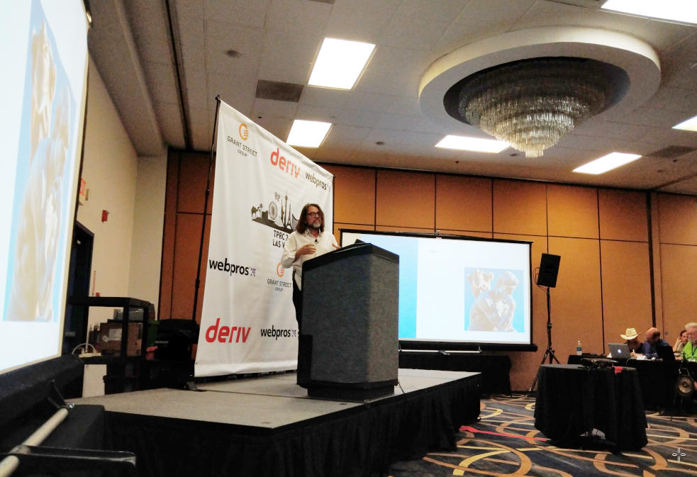
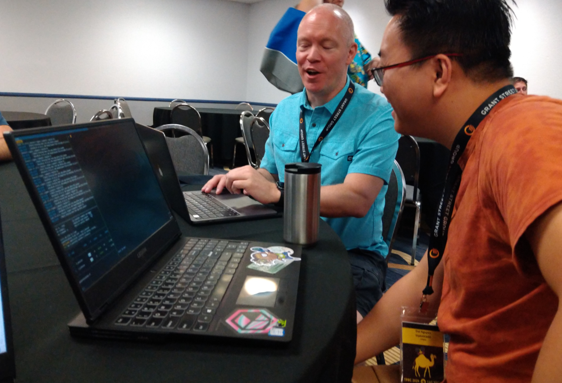
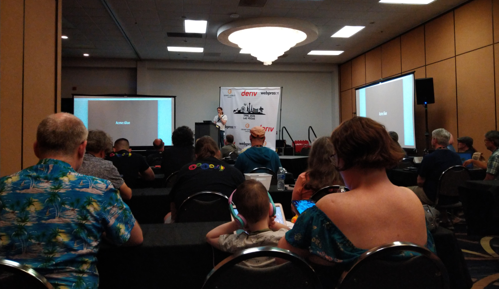

<!--Photo by Andrew Baerg, 2024.--->

I attended [The Perl and Raku Conference](https://tprc.us/tprc-2024-las/) in Las Vegas, NV, which took place June 25-28, 2024. It was HOT outside (over 40C/110F) but we stayed cool inside at the [Alexis Park Resort](https://www.alexispark.com/).

[Curtis Poe (Ovid)](https://curtispoe.org/) got things started with the keynote encouraging us to [Party Like It's 19100+e^iπ](https://youtu.be/22-7yP0inu8), and reminded us that Vegas is lexically scoped! (what happens in Vegas, stays in Vegas). More importantly he reminded us that Perl is about people, not just the technology, one that has been [meeting all over the world](https://bit.ly/perl-events) since 1999, with this being the 25th anniversary of the The Perl Conference (aka YAPC::NA).


<!--Photo by Andrew Baerg, 2024.--->

Meeting in person with people who you interact with primarily through digital channels, code commits, and [MetaCPAN](https://metacpan.org) documentation really highlighted the importance of the community. On the first day, I messed up timezones, showed up an hour before registration opened, and witnessed the conference organizers and core members arrive and greet each other with hugs. And I also enjoyed visiting with one of the very welcoming [TPRF](https://www.perlfoundation.org/) board members.

Many of the speakers and attendees put a "Hallway++" sticker on their badge which simply meant "talk to me, I'm here to meet and get to know people". At breakfast one morning, I had the privelege of sitting with [Jason Crome](https://cromedome.net/), the core maintainer of [Dancer](https://perldancer.org), a framework that I have used extensively. It was amazing to be able to pick the brain of one of the people who has intimate knowledge of the software.


<!--Photo by Andrew Baerg, 2024.--->

The Perl community is large and diverse, which was reflected in hearing about the [Science Perl Committee](https://perlcommunity.org/science/) and the all Perl [Koha Library Software](https://koha-community.org/) in use at over 4,000 libraries and with its own annual conference. It was cool to hear about the [Glue Photo Project](https://leejo.github.io/acme-glue-talk/presentation.html#1), making [algorithmic music](https://github.com/ology/Perl-Algorithmic-Music-2024), and gaming with the [TinyNES](https://youtu.be/7wTmA4xm6i4).

Every community will experience conflict and this one is no different. The impact of [Sawyer's resignation at TPRC 2023](https://youtu.be/Q1H9yKf8BI0) could be felt at this conference, and in response the community is focused on making things better with a [new standards of conduct](https://news.perlfoundation.org/post/new-standaards-of-conduct).

It wouldn't be a conference in 2024 without AI. We had some [Musings on Generative AI](https://youtu.be/y3llSkCJnWk) and an introduction to [PerlGPT, A Code Llama LLM Fine-Tuned For Perl](https://youtu.be/Agw6E1omIvY).

And there was of course a lot of talks about actual Perl code!

One of the things I enjoy about attending conferences is discovering things that I wasn't looking for. [Chad Granum](https://blogs.perl.org/users/chad_exodist_granum/) gave a lightning talk on [goto::file](https://metacpan.org/pod/goto::file) and I noticed the use of [line directives](https://perldoc.perl.org/perlsyn#Plain-Old-Comments-%28Not!%29) which can be extremely helpful in debugging eval'd code. For example, let's say you are eval'ing subs into a hashref and then calling them like so:

```perl
my $sub1 = "sub {\n  print 'foo';\n  print 'bar';\n print 'baz';\n}";
my $sub2 = "sub {\n  print 'foo';\n  print 'bar';\n warn 'baz';\n}";
my $Sub = {
  sub1 => eval $sub1,
  sub2 => eval $sub2,
};
$Sub->{sub1}->();
$Sub->{sub2}->();
```

Any warn or die output will give you a line number, but no context as to which sub it originated from:

```sh
baz at (eval 2) line 4.
```

Making use of a line directive when eval'ing the subs like this:

```perl
my $sub1 = "sub {\n  print 'foo';\n  print 'bar';\n print 'baz';\n}";
my $sub2 = "sub {\n  print 'foo';\n  print 'bar';\n warn 'baz';\n}";
my $Sub = {
  sub1 => eval qq(#line 1 "sub1"\n$sub1),
  sub2 => eval qq(#line 1 "sub2"\n$sub2),
};
$Sub->{sub1}->();
$Sub->{sub2}->();
```

Will now result in a much more friendly:

```sh
baz at sub2 line 4.
```

And in true open source fashion, this has been turned into a [pull request for Interchange](https://github.com/interchange/interchange/pull/150)!

I always enjoy hearing from others in the community about [CPAN modules](https://metacpan.org) that are in their toolbox. I learned about [DBIx::QuickDB](https://metacpan.org/pod/DBIx::QuickDB), which you can use to spin up a database server on the fly, especially useful for disconnecting your tests from needing a running database server, and also enables running concurrent tests which require a database server that would otherwise conflict. Combine this with a [DBIx::Class](https://metacpan.org/pod/DBIx::Class) schema and [DBIx::Class::Fixtures](https://metacpan.org/pod/DBIx::Class::Fixtures) and you have a very nice way to run some tests against fixed data:

```perl
use DBIx::QuickDB PSQL_DB  => {driver => 'PostgreSQL'};
my $dbh = PSQL_DB->connect;
$schema = Some::Schema->connect( sub { $dbh }, { on_connect_do => ["..."] } );
$schema->deploy();
my $fixtures = DBIx::Class::Fixtures->new({ config_dir => '...' });
$fixtures->populate({ no_deploy => 1, schema => $schema, directory => '...' });

ok($schema->resultset('Foo')->count >= 1, 'database populated');
```

[Damian Conway](http://damian.conway.org) gave a keynote on [The Once and Future Perl](https://youtu.be/0x9LD8oOmv0), showing how far Perl has come as a language and how it's rich history can be leveraged into the future - "if you can envisage what you could have done better in the past, then you can probably think of ways to make the future brighter!".

He showed off his new [Multi::Dispatch](https://metacpan.org/pod/Multi::Dispatch) module which you can use now to write incredibly extensible (and beautiful) code. Here it is in action with a simple Data::Dumper clone in 5 lines of code:

```perl
use v5.26;
use Multi::Dispatch;

multi dd :before :where(VOID) (@data)   { say &next::variant }
multi dd ($k, $v)                       { dd($k) . ' => ' . dd($v) }
multi dd ($data :where(ARRAY))          { '[' . join(', ', map {dd($_)}                 @$data) . ']' }
multi dd ($data :where(HASH))           { '{' . join(', ', map {dd($_, $data->{$_})} keys %$data) . '}' }
multi dd ($data)                        { '"' . quotemeta($data) . '"' }

say dd ['foo', { bar => "baz" }];
```

With [Smartmatch (give/when) scheduled for deprecation in 5.42](https://perldoc.perl.org/perldeprecation) he has written a new drop-in replacement that uses Multi::Dispatch, [Switch::Right](https://metacpan.org/pod/Switch::Right), which addresses the issues with the original implementation that was in core.

Also on display was the new [class syntax](https://perldoc.perl.org/perlclass) introduced into core in 5.38 with `use feature 'class'`. Here's an example of how it looks:

```perl
use v5.40;
use feature 'class';

class Point {
  field $x :param = 0;
  field $y :param = 0;

  method describe () {
      say "A point at ($x, $y)\n";
   }
}

Point->new(x => 5, y => 10)->describe;
```

If you are waiting for Perl 7, Damian is here to tell you that the future is now, you don't have to wait for Perl 7 (or 17), it's Perl 5 with Multi::Dispatch and `use feature 'class'`!

The last day of the conference provided an opportunity to go deeper into learning the new class syntax with a workshop on building a [rogue-like adventure game](https://github.com/perigrin/going-rogue-class) from scratch.

So what's next? The [London Perl & Raku Workshop](https://act.yapc.eu/lpw2024/) is taking place on October 26, 2024 and Perl 5.42 is just around the corner!


<!--Photo by Andrew Baerg, 2024.--->

-JAPH (Just Another Perl Hacker)

