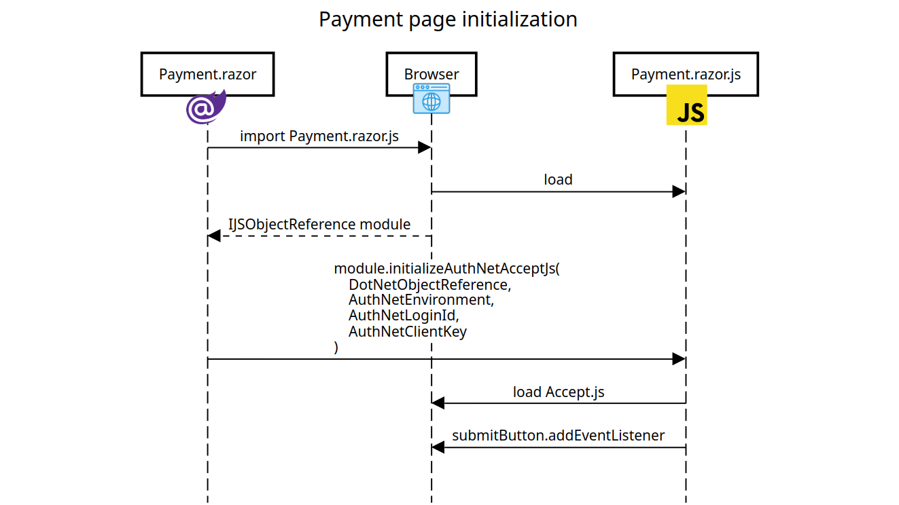
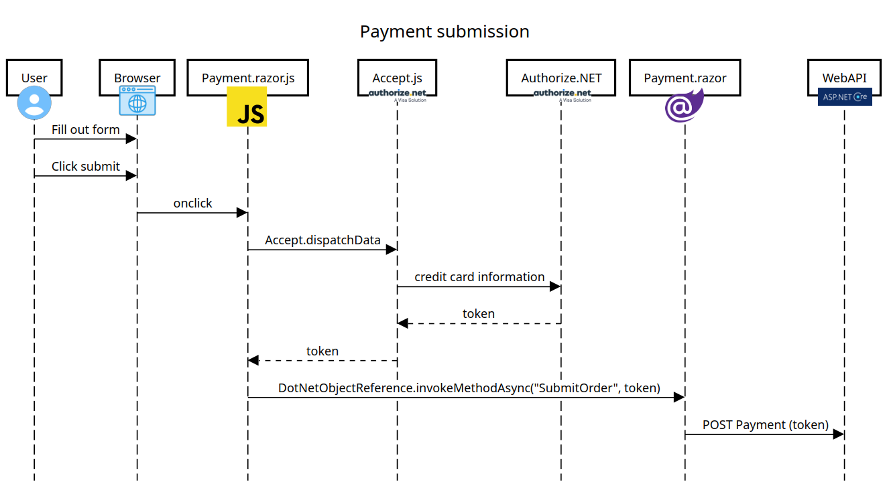

Blazor, the SPA framework from ASP.NET Core is excellent technology. It is however, very particular when it comes to interacting with JavaScript. The reason being that Blazor apps are written in C#, with Razor templates. So, if a Blazor app needs to interact with a JavaScript library, for example, to process credit card payments through Authorize.NET, special care is needed. In this article, we'll see an approach on how to make that happen.

We'll develop a Blazor WebAssembly Standalone app which will include a form to capture credit card information and send it to Authorize.NET using their Accept.js frontend integration library. Then, Authorize.NET will return back a payment token that represents the captured credit card. Our frontend will then submit the resulting token to a backend API to actually effectuate the payment.

This backend API, which we'll also develop, will be a simple ASP.NET Core Web API. It'll include an endpoint for submitting payment transactions to Authorize.NET, given the token obtained via Accept.js.

> You can find the all the source code discussed here [on GitHub](https://github.com/megakevin/end-point-blog-blazor-authorize-net).

# The backend

Let's begin by creating a new ASP.NET Core Web API project with this:

```sh
dotnet new webapi --use-controllers -o BlazorAuthorizeNet.WebApi
```

We also need to install Authorize.NET's NuGet package:

```sh
cd BlazorAuthorizeNet.WebApi
dotnet add package AuthorizeNet.Core --version 8.0.1
```

## Interacting with Authorize.NET

Now we have to create a class to submit payment transactions to Authorize.NET. You can arrive at something like this by reading the Authorize.NET documentation. But here's what we will go with:

First a class to set up the connection and serve as entry point:

```csharp
// BlazorAuthorizeNet.WebApi/Payments/AuthorizeNetPaymentGateway.cs

using AuthorizeNet.Api.Contracts.V1;
using AuthorizeNet.Api.Controllers.Bases;
using BlazorAuthorizeNet.WebApi.Models;

namespace BlazorAuthorizeNet.WebApi.Payments;

// Provives an interface for interacting with the Authorize.NET payment processor.
public class AuthorizeNetPaymentGateway : IPaymentGateway
{
    private readonly IConfiguration _configuration;

    public AuthorizeNetPaymentGateway(IConfiguration configuration)
    {
        _configuration = configuration;
    }

    // Submits a payment transaction to Authorize.NET
    public PaymentTransactionResult CreatePaymentTransaction(Order order)
    {
        PrepareConnection();
        return AuthorizeNetCreateTransaction.Run(order);
    }

    // This method sets up the AuthorizeNet.Core client library's connection to Authorize.NET's Web API.
    // The values for RunEnvironment and MerchantAuthentication are constructed based on app settings.
    private void PrepareConnection()
    {
        ApiOperationBase<ANetApiRequest, ANetApiResponse>.RunEnvironment =
            _configuration["AuthNetEnvironment"] == "Production" ?
                AuthorizeNet.Environment.PRODUCTION : AuthorizeNet.Environment.SANDBOX;

        ApiOperationBase<ANetApiRequest, ANetApiResponse>.MerchantAuthentication = new()
        {
            name = _configuration["AuthNetLoginId"],
            ItemElementName = ItemChoiceType.transactionKey,
            Item = _configuration["AuthNetTransactionKey"],
        };
    }
}

```

Then a class that implements the actual call to Authorize.NET's endpoint and the parsing of the response:

```csharp
// BlazorAuthorizeNet.WebApi/Payments/AuthorizeNetCreateTransaction.cs

using AuthorizeNet.Api.Contracts.V1;
using AuthorizeNet.Api.Controllers;
using BlazorAuthorizeNet.WebApi.Models;

namespace BlazorAuthorizeNet.WebApi.Payments;

// Calls the Authorize.NET "Create an Accept Payment Transaction" API endpoint.
// https://developer.authorize.net/api/reference/index.html#accept-suite-create-an-accept-payment-transaction
internal static class AuthorizeNetCreateTransaction
{
    // This method accepts an Order object, which is nothing more than a DTO that contains all the information needed
    // to piece together a request payload for Authorize.NET's "Create an Accept Payment Transaction" API endpoint.
    // It constructs a new object that represents such payload (i.e. the createTransactionRequest), submits the request,
    // and handles the respose.
    //
    // It returns a PaymentTransactionResult which is, again, a DTO that captures important information from the
    // response from Authorize.NET so that the code and issued the request can act according to the response.
    internal static PaymentTransactionResult Run(Order order)
    {
        // 1. Construct the request payload.
        var request = new createTransactionRequest
        {
            transactionRequest = new transactionRequestType
            {
                transactionType = transactionTypeEnum.authCaptureTransaction.ToString(),

                amount = order.Total,
                payment = BuildPayment(order),
                billTo = BuildBillingAddress(order),
                lineItems = BuildLineItems(order)
            }
        };

        // 2. Send the request.
        var controller = new createTransactionController(request);
        controller.Execute();

        var response = controller.GetApiResponse();

        // 3. Process the response.
        return BuildResult(response);
    }

    // As we've mentioned before, the way we're going to process payments is using Authorize.NET's Accept.js client side
    // library to tokenize a credit card. This is the method that constructs the part of the request that instructs
    // Authorize.NET to process the payment in that fashion. It uses an "opaqueDataType" which contains the "Nonce
    // descriptor" and "Nonce value" fields. These fields represent the tokenized credit card sent to the backend by the
    // frontend.
    private static paymentType BuildPayment(Order order) =>
        new()
        {
            Item = new opaqueDataType
            {
                dataDescriptor = order.PaymentMethodNonceDescriptor,
                dataValue = order.PaymentMethodNonceValue
            }
        };

    private static customerAddressType BuildBillingAddress(Order order) =>
        new()
        {
            firstName = order.BillingAddress.FirstName,
            lastName = order.BillingAddress.LastName,
            address = order.BillingAddress.StreetOne,
            city = order.BillingAddress.City,
            zip = order.BillingAddress.ZipCode,
            state = order.BillingAddress.StateCode,
            country = order.BillingAddress.CountryCode
        };

    private static lineItemType[] BuildLineItems(Order order) =>
        order.Items.Select(item => new lineItemType
        {
            itemId = item.Id.ToString(),
            name = item.ProductName,
            quantity = item.Quantity,
            unitPrice = item.UnitPrice
        }).ToArray();

    // This method constructs a PaymentTransactionResult based on the response from Authorize.NET.
    // It inspects the response in various ways to determine whether it was successful or erroneus and extracts useful
    // information from it.
    private static PaymentTransactionResult BuildResult(createTransactionResponse? response)
    {
        if (response == null)
        {
            return PaymentTransactionResult.Failure(
                errorMessage: "No response from gateway"
            );
        }

        if (response.messages.resultCode != messageTypeEnum.Ok)
        {
            if (response.transactionResponse != null && response.transactionResponse.errors != null)
            {
                return PaymentTransactionResult.Failure(
                    response.transactionResponse.errors[0].errorCode,
                    response.transactionResponse.errors[0].errorText
                );
            }
            else
            {
                return PaymentTransactionResult.Failure(
                    response.messages.message[0].code,
                    response.messages.message[0].text
                );
            }
        }

        if (response.transactionResponse.messages == null)
        {
            if (response.transactionResponse.errors != null)
            {
                return PaymentTransactionResult.Failure(
                    response.transactionResponse.errors[0].errorCode,
                    response.transactionResponse.errors[0].errorText
                );
            }
            else
            {
                return PaymentTransactionResult.Failure(
                    errorMessage: "Unexpected format for error response from gateway"
                );
            }
        }

        return PaymentTransactionResult.Success(
            response.transactionResponse.transId,
            response.transactionResponse.responseCode,
            response.transactionResponse.messages[0].code,
            response.transactionResponse.messages[0].description,
            response.transactionResponse.authCode
        );
    }
}
```

Those classes have the core logic for interacting with Authorize.NET to submit payment transactions using credit cards tokenized with Accept.js. There are additional supporting DTOs used here like `PaymentTransactionResult` and `Order`. You can see them [on GitHub](https://github.com/megakevin/end-point-blog-blazor-authorize-net/tree/main/BlazorAuthorizeNet.WebApi/Models).

The `AuthorizeNetPaymentGateway` class also employs various configuration settings necessary for interacting with Authorize.NET: `AuthNetEnvironment`, `AuthNetLoginId` and `AuthNetTransactionKey`. So we need to make sure to define them in the WebApi project's `appsettings.json` file:

```json
{
  // ...
  "AuthNetEnvironment": "Sandbox",
  "AuthNetLoginId": "<YOUR_AUTH_NET_LOGIN_ID>",
  "AuthNetTransactionKey": "<YOUR_AUTH_NET_TRANSACTION_KEY>"
}
```

These values are unique to the particular Authorize.NET account being used.

## Defining the API endpoint

We also need to define the endpoint for the frontend to submit the payment. This controller does this:

```csharp
// BlazorAuthorizeNet.WebApi/Controllers/PaymentsController.cs

using Microsoft.AspNetCore.Mvc;
using BlazorAuthorizeNet.WebApi.Models;
using BlazorAuthorizeNet.WebApi.Payments;

namespace BlazorAuthorizeNet.WebApi.Controllers;

[ApiController]
[Route("[controller]")]
public class PaymentsController : ControllerBase
{
    private readonly IPaymentGateway _paymentGateway;

    public PaymentsController(IPaymentGateway paymentGateway)
    {
        _paymentGateway = paymentGateway;
    }

    // POST: Payments
    [HttpPost]
    public ActionResult PostPayment([FromBody] PaymentPayload payload)
    {
        // To keep things simple, this endpoint expects the values obtained from Authorize.NET's Accept.js that
        // represent the tokenized credit card, encapsulated in PaymentPayload.
        //
        // For the details of the actual "product" that was "purchased", we simulate an order by creating a hardcoded
        // object here. Of course, for real world applications, the generation of the "Order" object would be much more
        // complex.
        Order order = new(
            Total: 100.00m,
            Items:
            [
                new OrderItem(1, "Product A", 1, 50.00m),
                new OrderItem(2, "Product B", 1, 50.00m)
            ],
            BillingAddress: new Address(
                FirstName: "John",
                LastName: "Doe",
                StreetOne: "123 Main St",
                StreetTwo: "Suite A",
                City: "New York",
                ZipCode: "12345",
                StateCode: "CA",
                CountryCode: "US"
            ),
            // Importantly, we include the payment token values here.
            PaymentMethodNonceValue: payload.PaymentMethodNonceValue,
            PaymentMethodNonceDescriptor: payload.PaymentMethodNonceDescriptor
        );

        // Then we simply submit the payment via our payment gateway object and return a response based on the result
        // we get from Authorize.NET.
        var result = _paymentGateway.CreatePaymentTransaction(order);

        if (result.IsSuccess) return Ok(result);
        else return BadRequest(result);
    }
}
```

This endpoint expects a request payload that includes the values obtained from Authorize.NET's Accept.js after tokenizing the credit card. `PaymentPayload` represents the data structure and it looks like this:

```csharp
// BlazorAuthorizeNet.WebApi/Models/PaymentPayload.cs

namespace BlazorAuthorizeNet.WebApi.Models;

public record PaymentPayload(
    string PaymentMethodNonceValue,
    string PaymentMethodNonceDescriptor
);
```

This means that when calling this endpoint, clients would have to provide a JSON payload that looks like this:

```json
// POST Payments

{
    "PaymentMethodNonceValue": "<PAYMENT_METHOD_NONCE_VALUE>",
    "PaymentMethodNonceDescriptor": "<PAYMENT_METHOD_NONCE_DESCRIPTOR>"
}
```


Finally, we need to update the WebApi project's `Program.cs` file in a couple of ways. We need to configure the Dependency Injection so that the `AuthorizeNetPaymentGateway` is available to the controller, and we also need to enable CORS. We do need CORS of course, because the project is a Web API meant to be called from a browser app, which may or may not be running in the same domain as the API. Here's what it ends up looking like:

```diff
using BlazorAuthorizeNet.WebApi.Payments;

var builder = WebApplication.CreateBuilder(args);

+// Add services to the container.
+builder.Services.AddScoped<IPaymentGateway, AuthorizeNetPaymentGateway>();
+
+// CORS configuration to allow requests from other origins.
+builder.Services.AddCors(options =>
+{
+    options.AddDefaultPolicy(policy =>
+    {
+        var origins = builder.Configuration["AllowedOrigins"]?.Split(",");
+        if (origins == null || origins.Length == 0) return;
+
+        policy.WithOrigins(origins)
+            .AllowAnyHeader()
+            .AllowAnyMethod()
+            .AllowCredentials();
+    });
+});

builder.Services.AddControllers();
// Learn more about configuring OpenAPI at https://aka.ms/aspnet/openapi
builder.Services.AddOpenApi();

var app = builder.Build();

// Configure the HTTP request pipeline.
if (app.Environment.IsDevelopment())
{
    app.MapOpenApi();
}

app.UseHttpsRedirection();

+// Enable CORS.
+app.UseCors();

app.UseAuthorization();

app.MapControllers();

app.Run();
```

Here we've included usage of a new configuration setting: `AllowedOrigins`. This is meant to be the URL where the frontend will be running. Whatever it is, we need to make sure to define it in the WebApi project's `appsettings.json` file:

```json
{
  // ...
  "AllowedOrigins": "<YOUR_FRONTEND_URL>",
}
```

# The frontend

Now for the frontend, we need to create a project for a Blazor WebAssembly Standalone app. This command does it:

```sh
dotnet new blazorwasm -o BlazorAuthorizeNet.Frontend
```

Next we create a new "Payment" page. This is the page where the interaction between Blazor and JavaScript will happen. This page will also submit the credit card information to Authorize.NET, and pass the resulting token to our backend API, to effectuate the payment. Here's an overview of how it will all work:

We will define a new `Payment.razor` component which will include the form to capture the credit card information. It will also include logic to load the JavaScript module that will handle interactions with Authorize.NET. This JavaScript module will be defined in a new `Payment.razor.js` file and will take care of loading Authorize.NET's Accept.js library. It will also wire up the logic to initiate the call to Authorize.NET when the user submits the form.

Once everything is initialized and rendered. The user will fill out the form and hit the submit button. Then the logic in `Payment.razor.js` will kick in and use the Accept.js library to send the credit card information to Authorize.NET, and obtain a single-use payment token. Then, it will invoke a method in the `Payment.razor` Blazor component, giving it the token, so that it can be sent to our backend API and submit the payment to Authorize.NET.

## Payment page initialization



Let's start implementing the initialization side of things by defining our `Payment.razor` component. Here's the template part:

```html
<!-- BlazorAuthorizeNet.Frontend/Pages/Payment.razor -->

@page "/Payment"

@implements IAsyncDisposable

@inject IConfiguration Config
@inject HttpClient HttpClient
@inject ILogger<Payment> Logger;
@inject IJSRuntime JS

<PageTitle>Home</PageTitle>

<h1>Submit Payment</h1>

<section class="py-5">
    <div class="container px-4 px-lg-5 my-5">
        <h1>Checkout</h1>

        <div class="card mb-4 p-3">
            <h4 class="mb-3">Payment Information</h4>

            <div class="mb-3">
                <div class="form-floating">
                    <input
                        type="text" name="cardNumber" id="cardNumber"
                        class="form-control" placeholder="4111111111111111"
                    />
                    <label for="cardNumber" class="form-label">
                        Card Number
                    </label>
                </div>
            </div>

            <div class="row">
                <div class="col">
                    <div class="form-floating">
                        <input
                            type="text" name="expMonth" id="expMonth"
                            class="form-control" placeholder="12"
                        />
                        <label for="expMonth" class="form-label">
                            Expiration Month
                        </label>
                    </div>
                </div>
                <div class="col">
                    <div class="form-floating">
                        <input
                            type="text" name="expYear" id="expYear"
                            class="form-control" placeholder="34"
                        />
                        <label for="expYear" class="form-label">
                            Expiration Year
                        </label>
                    </div>
                </div>
                <div class="col">
                    <div class="form-floating">
                        <input
                            type="text" name="cardCode" id="cardCode"
                            class="form-control" placeholder="123"
                        />
                        <label for="cardCode" class="form-label">CVV</label>
                    </div>
                </div>
            </div>
        </div>

        <div class="d-flex justify-content-end">
            <button
                id="SubmitOrderButton" type="button"
                class="btn btn-outline-dark"
            >
                Place Order
            </button>
        </div>

        <ul id="AuthNetErrors" class="validation-errors"></ul>

        @if (!string.IsNullOrEmpty(errorMessage))
        {
            <div class="alert alert-danger" role="alert">
                @errorMessage
            </div>
        }

        @if (!string.IsNullOrEmpty(successMessage))
        {
            <div class="alert alert-success" role="alert">
                @successMessage
            </div>
        }
    </div>
</section>
```

The HTML template itself is very unremarkable. It's just a form for capturing credit card number, expiration date, and CVV; along with a button to submit the form. What's interesting about this code are the `@inject` statements at the top. Especially the `@inject IJSRuntime JS` one. `IJSRuntime` is the object that allows Blazor components to invoke JavaScript logic in the browser. We will see how the component uses it next.

Here's the logic of the component:

```csharp
// BlazorAuthorizeNet.Frontend/Pages/Payment.razor

@code {
    // We use this to store a reference to the current Blazor component. When passed to JavaScript code, it allows
    // JavaScript to call methods defined in this component.
    private DotNetObjectReference<Payment>? objRef;

    // This represents a JavaScript module. We use it to store a reference to Payment.razor.js and invoke functions
    // defined in it.
    private IJSObjectReference? module;

    private string? errorMessage;
    private string? successMessage;

    // This method initializes the reference to this Blazor component, loads the Payment.razor.js file, and calls the
    // initializeAuthNetAcceptJs function defined in it.
    protected override async Task OnAfterRenderAsync(bool firstRender)
    {
        if (firstRender)
        {
            // Create a reference to this Blazor component which we will use below to pass to the
            // initializeAuthNetAcceptJs function defined in Payment.razor.js.
            objRef = DotNetObjectReference.Create(this);

            // Here we're essentially issing a command to the browser's JavaScript runtime. We're using JavaScript's
            // import statement to load the Payment.razor.js file as a module.
            // https://developer.mozilla.org/en-US/docs/Web/JavaScript/Reference/Statements/import
            module = await JS.InvokeAsync<IJSObjectReference>(
                "import", "./Pages/Payment.razor.js"
            );

            // Finally, we call the initializeAuthNetAcceptJs function, passing it the DotNetObjectReference as well as
            // a few app settings. This method initializes Accept.js on the page.
            await module.InvokeVoidAsync(
                "initializeAuthNetAcceptJs",
                objRef,
                Config["AuthNetEnvironment"] ?? "Sandbox",
                Config["AuthNetLoginId"],
                Config["AuthNetClientKey"]
            );
        }
    }

    // The DotNetObjectReference and IJSObjectReference objects need to be disposed manually.
    public async ValueTask DisposeAsync()
    {
        objRef?.Dispose();

        if (module is not null)
        {
            await module.DisposeAsync();
        }
    }
}
```

Here's where things start to get interesting. The `OnAfterRenderAsync` method demonstrates how Blazor interacts with JavaScript. In this method, which gets called by the framework when the component has completed rendering, we:

1. Make sure to run the logic only once using `if (firstRender)`.
2. Instantiate a `DotNetObjectReference` object, which Blazor will pass to JavaScript to allow the JavaScript code to call Blazor back once it's done its work.
3. Instantiate the JavaScript module defined in `Payment.razor.js`.
4. Call the `initializeAuthNetAcceptJs` function in the JavaScript module which will set up Accept.js.

We also have a `DisposeAsync` method that's necessary for disposing resources like the `DotNetObjectReference` and `IJSObjectReference` instances.

Notice also how we're using a few configuration settings here: `AuthNetEnvironment`, `AuthNetLoginId`, `AuthNetClientKey` and `WebApiUrl`. These are defined in `BlazorAuthorizeNet.Frontend/wwwroot/appsettings.json`. Something like this:

```json
// BlazorAuthorizeNet.Frontend/wwwroot/appsettings.json

{
  "WebApiUrl": "<YOUR_WEB_API_URL>",
  "AuthNetEnvironment": "Sandbox",
  "AuthNetLoginId": "<YOUR_AUTH_NET_LOGIN_ID>",
  "AuthNetClientKey": "<YOUR_AUTH_NET_CLIENT_KEY>"
}
```

Now we can look at the JavaScript to be defined in `Payment.razor.js`.

```javascript
// BlazorAuthorizeNet.Frontend/Pages/Payment.razor.js

// Sets up the page for interaction with Accept.js.
export function initializeAuthNetAcceptJs(dotNet, authNetEnvironment, authNetLoginId, authNetClientKey) {
    loadScript(authNetEnvironment);
    setUpSubmit(authNetLoginId, authNetClientKey, dotNet);
}

// Loads the Accept.js frontend library.
function loadScript(authNetEnvironment) {
    // Accept.js offers two different versions of the library, one for production and one for testing (i.e. sandbox)
    // So, we need to load one or the other depending on the given "authNetEnvironment".
    const acceptJsUrl = authNetEnvironment == "Production" ?
        "https://js.authorize.net/v1/Accept.js" :
        "https://jstest.authorize.net/v1/Accept.js";

    console.log("Loading Authorize.Net Accept.js from: ", acceptJsUrl);

    // Manually create a <script> element and attach it to the current DOM.
    var script = document.createElement('script');
    script.src = acceptJsUrl;
    document.body.appendChild(script);
}

function setUpSubmit(authNetLoginId, authNetClientKey, dotNet) {
    // We'll implement this soon
}
```

As we've mentioned before, this is a JavaScript module. This module exposes one single function: `initializeAuthNetAcceptJs`. We `export` this function because that's the one that the Blazor component needs to call. What this function does is set up the page for interacting with Authorize.NET via its Accept.js library.

For now, all it does is load the `Accept.js` library directly from Authorize.NET. Depending on the `AuthNetEnvironment` config setting, either the production version or the sandbox version of the library is loaded.

We also have a `setUpSubmit` function here and we'll talk about it next.

## Payment submission



Now the stage is set to allow users to enter their credit card information and submit it for payment processing. Let's add this method to the `Payment.razor` component:

```csharp
// BlazorAuthorizeNet.Frontend/Pages/Payment.razor

record PaymentResponseSuccess(string MessageDescription);
record PaymentResponseError(string ErrorMessage);

// The JSInvokable attribute allows this method to be invoked from JavaScript via the passed DotNetObjectReference.
[JSInvokable]
public async void SubmitOrder(string paymentMethodNonceValue, string paymentMethodNonceDescriptor)
{
    successMessage = null;
    errorMessage = null;

    // Calls the backend Web API's endpoint and sends it the nonce value and descriptor. That is, the tokenized
    // representation of the credit card that we obtained from Accept.js.
    using var response = await HttpClient.PostAsJsonAsync(
        $"{Config["WebApiUrl"]}/Payments",
        new
        {
            PaymentMethodNonceValue = paymentMethodNonceValue,
            PaymentMethodNonceDescriptor = paymentMethodNonceDescriptor
        }
    );

    // Handle the response by partsing the contents and displaying messages in the page accordingly.
    var isSuccess = response.IsSuccessStatusCode;

    if (isSuccess)
    {
        var success = await response.Content.ReadFromJsonAsync<PaymentResponseSuccess>();
        successMessage = success?.MessageDescription;
    }
    else
    {
        var error = await response.Content.ReadFromJsonAsync<PaymentResponseError>();
        errorMessage = error?.ErrorMessage;
    }

    StateHasChanged();
}
```

The first thing to note about the `SubmitOrder` method is that it is annotated with the `[JSInvokable]` attribute. This attribute allows the JavaScipt code to call this method, through the `DotNetObjectReference` instance that it is given. Other than that, the method is straightforward. It calls the `POST Payments` endpoint, passing it the values returned by Authorize.NET (i.e. `paymentMethodNonceValue` and `paymentMethodNonceDescriptor`), which are given to our Blazor component by our JavaScrpt module.

And of course, we need to update our JavaScrpt module to do the rest of the logic of calling Authorize.NET and this new `SubmitOrder` method. Here's how we implement the `setUpSubmit` function in `Payment.razor.js`:

```javascript
// BlazorAuthorizeNet.Frontend/Pages/Payment.razor.js

// Wires up the onclick event handler that submits the credit card information to Authorize.NET via Accept.js, captures
// the returned tokenized card, and sends it to the Blazor component.
function setUpSubmit(authNetLoginId, authNetClientKey, dotNet) {
    const submitButton = getSubmitButton();
    submitButton.addEventListener("click", () => doSubmit(authNetLoginId, authNetClientKey, dotNet));
}

function doSubmit(authNetLoginId, authNetClientKey, dotNet) {
    disableSubmitButton();
    clearErrors();

    // Send the credit card details to Authorize.NET, and...
    sendPaymentDataToAuthNet(
        authNetLoginId,
        authNetClientKey,
        // ...when successful, use the DotNetObjectReference given by Blazor to call the SubmitOrder on the
        // Payment.razor component. Sending it the tokenized credit card.
        response => {
            dotNet.invokeMethod(
                "SubmitOrder",
                response.opaqueData.dataValue,
                response.opaqueData.dataDescriptor
            );
        }
    );
}

// This function constructs the payload that Accept.js expects containing the credit card information and sends it.
function sendPaymentDataToAuthNet(authNetLoginId, authNetClientKey, onDone) {
    var authData = {
        clientKey: authNetClientKey,
        apiLoginID: authNetLoginId
    };

    var cardData = {
        cardNumber: document.getElementById("cardNumber").value?.replace(/\s+/g, ''),
        month: document.getElementById("expMonth").value,
        year: document.getElementById("expYear").value,
        cardCode: document.getElementById("cardCode").value
    };

    // In addition to credit cards, Accept.js also supports charging a bank account. This commented out code
    // demonstrates how to do that.
    /* var bankData = {
        accountNumber: document.getElementById('accountNumber').value,
        routingNumber: document.getElementById('routingNumber').value,
        nameOnAccount: document.getElementById('nameOnAccount').value,
        accountType: document.getElementById('accountType').value
    }; */

    var data = {
        authData,
        cardData
        /* bankData: */
    };

    console.log("Request to Authorize.Net: ", data);
    Accept.dispatchData(data, response => handleAuthNetResponse(response, onDone));
}

function handleAuthNetResponse(response, onDone) {
    console.log("Response from Authorize.Net: ", response);
    if (response.messages.resultCode === "Error") {
        console.log("Error from Authorize.Net: ", response);

        displayErrors(response.messages.message);
    } else {
        onDone(response);
    }

    enableSubmitButton();
}

// This function populates the "AuthNetErrors" <ul> with items containing descriptions of the errors returned by
// Auhtorize.NET.
function displayErrors(errors) {
    const errorList = document.getElementById("AuthNetErrors");

    errors.forEach(error => {
        const li = document.createElement("li");
        li.textContent = getErrorMessage(error.code);
        li.className = "validation-message";
        errorList.appendChild(li);
    });
}

// These are some of the most common errors that we should expect from Authorize.NET.
// Learn more at https://developer.authorize.net/api/reference/features/acceptjs.html#Appendix_Error_Codes
function getErrorMessage(errorCode) {
    const map = {
        "E_WC_04": "Please provide card number, expiration month, year and CVV.",
        "E_WC_05": "Please provide valid card number.",
        "E_WC_06": "Please provide valid expiration month.",
        "E_WC_07": "Please provide valid expiration year.",
        "E_WC_08": "Please provide a future expiration date.",
        "E_WC_15": "Please provide valid CVV.",
        "E_WC_20": "Please provide valid card number."
    };

    return map[errorCode] || "We couldn't process your card at this time. Please try again.";
}

function getSubmitButton() {
    return document.getElementById("SubmitOrderButton");
}

function enableSubmitButton() {
    const submitButton = getSubmitButton();
    submitButton.disabled = false;
}

function disableSubmitButton() {
    const submitButton = getSubmitButton();
    submitButton.disabled = true;
}

function clearErrors() {
    const errorList = document.getElementById("AuthNetErrors");
    errorList.innerHTML = "";
}
```

This code wires up logic so that when the form submit button is clicked: the captured credit card information is sent to Authorize.NET; any errors from Authorize.NET are handled and displayed to the user; and, when successful, the returned payment token is sent back to the Blazor component, so that it can send it to the backend API. Most of this logic is very similar to what you would find in the official documentation from Authorize.NET, except for the part that interacts with our Blazor component.

And that's all for now! In this article we've seen how to build a Blazor WebAssembly Standalone application, which interfaces with Authorize.NET through their Accept.js frontend library, to tokenize a credit card and submit payment transactions by calling a backend API.
