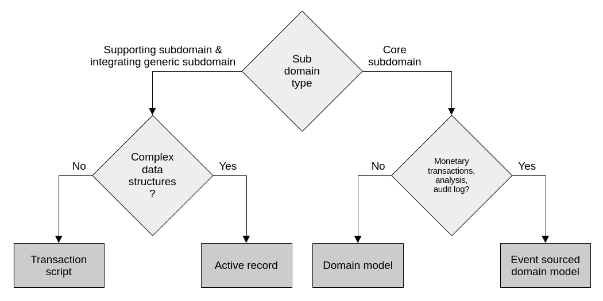
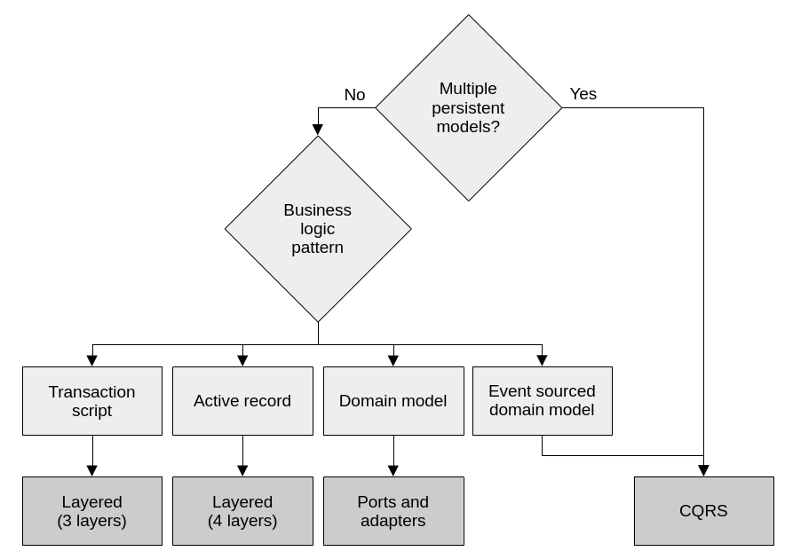
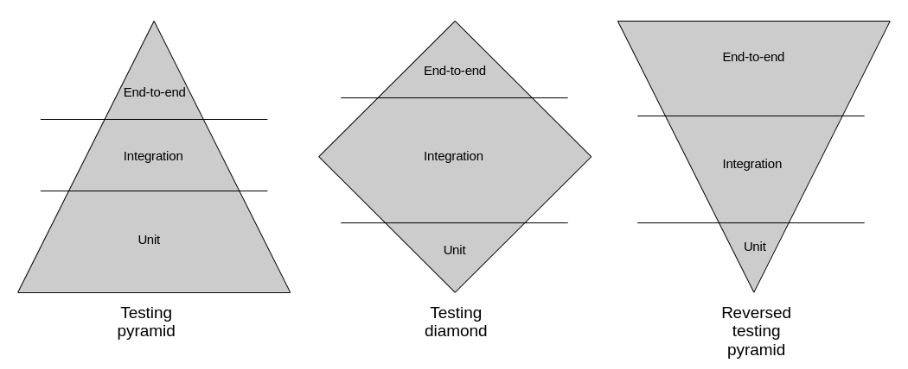
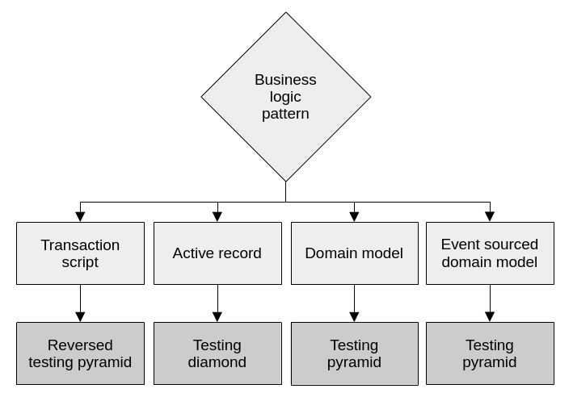
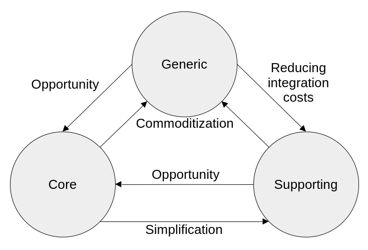
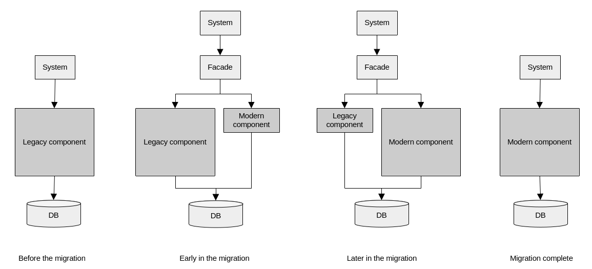

# Applying Domain-Driven Design in Practice

> This is part 4 of a series of blog posts on Domain-Driven Design:
>
> 1. [High level system analysis and design with Domain-Driven Design](https://www.endpointdev.com/blog/)
> 2. [Implementing business logic with Domain-Driven Design](https://www.endpointdev.com/blog/)
> 3. [Designing software architecture with Domain-Driven Design](https://www.endpointdev.com/blog/)
> 4. [Applying Domain-Driven Design in Practice](https://www.endpointdev.com/blog/)

**Domain-Driven Design** is an approach to software development that focuses on, [as Eric Evans puts it](https://www.oreilly.com/library/view/domain-driven-design-tackling/0321125215/), "tackling the complexity in the heart of software". And what is in the heart of software? The business domain in which it operates. Or more specifically: a **model** of it, made of code. That is, the code that implements the business logic that comes into play when solving problems within the realm of a particular business activity.

DDD is not just about writing code though. It's a whole methodology that touches on business needs, requirements gathering, organizational dynamics, high level architectural design, and lower level patterns for implementing software intensive systems.

As a result, DDD offers a treasure trove of concepts, patterns and tools that can be applied to any software project, regardless of the size and complexity.

In this series of blog posts we're going to explore many aspects of DDD. We will be following the structure laid out by [Vlad Khononov](https://vladikk.com/)'s excellent book on the topic "[Learning Domain-Driven Design: Aligning Software Architecture and Business Strategy](https://www.oreilly.com/library/view/learning-domain-driven-design/9781098100124/)". So you can think of this series as a summary of that book. An abridged version that can serve as a review for anybody who has read it; but also as an entry point for people who are new to DDD.

## Table of contents

- [Applying Domain-Driven Design in Practice](#applying-domain-driven-design-in-practice)
  - [Table of contents](#table-of-contents)
  - [Section 10: Design heuristics](#section-10-design-heuristics)
    - [Bounded contexts](#bounded-contexts)
    - [Business logic implementation patterns](#business-logic-implementation-patterns)
    - [Architectural patterns](#architectural-patterns)
    - [Testing strategy](#testing-strategy)
  - [Section 11: Evolving design decisions](#section-11-evolving-design-decisions)
    - [Changes in the domain](#changes-in-the-domain)
    - [Organizational changes](#organizational-changes)
    - [Domain knowledge changes](#domain-knowledge-changes)
    - [Growth](#growth)
  - [Section 12: Domain-driven design in the real world](#section-12-domain-driven-design-in-the-real-world)
    - [Strategic analysis](#strategic-analysis)
    - [Modernization strategy](#modernization-strategy)
    - [Selling Domain-driven design](#selling-domain-driven-design)
  - [Finally](#finally)

## Section 10: Design heuristics

At this point in the series we've explored a number of tools and patterns to work with DDD. We also touched on what kinds of problems they solve and how to apply them. We learned how to analyze business domains, how to design high level components, how to implement business logic, how to organize code bases and how system components interact. In this section, we'll discuss a series of heuristics that we can use to make decisions as to when to apply these techniques.

### Bounded contexts

When designing **bounded contexts**, that is, the physically separated system components, size is not a useful metric. Instead, consider the **model** that they contain, and make sure they are cohesive. In fact, breaking down a system into many bounded contexts too early is a form of premature optimization that can be costly when done wrongly. And at the beginning of a project, when domain knowledge is likely as low as it will ever be, it's easy to get it wrong.

A system that's broken up into many physical components is more expensive to maintain because changes usually propagate across them. This is due to obvious technical reasons, but can also be exacerbated by organizational reasons. For example, when the bounded contexts are maintained by different teams.

So, **start with bounded contexts with broader boundaries**. And then, as the system matures and the team acquires more domain knowledge, **refactor into separate system components when needed**.

### Business logic implementation patterns

At its core, DDD is about **letting the business domain drive software design decisions**. This means that we should strive to use the right tool for the job. As we've discussed before, the level of complexity of the domain at hand is what determines which **business logic implementation patterns** should be applied. The more complex the problem at hand, the more elaborate the chosen pattern for the solution. Luckily, we learned that we can classify subdomains by their level of complexity, so we can use subdomain types to drive our decision making. This is explained in this diagram:

*Complexity, subdomain types and particular business requirements are what drive how we implement business logic.*

### Architectural patterns

Once we have decided how to implement the business logic, it's easy to decide which **architectural pattern** to develop our system with. The decision on what architecture to use is dependent on the business requirements and the business logic pattern we've selected:

*The architecture is driven by whether we need multiple models to represent the same data and the business logic pattern.*

If a system is using an event sourced domain model, or it needs multiple persistence models, CQRS is almost a requirement. Otherwise the system would be very limited in its querying capabilities. For a plain domain model, a ports and adapters architecture is ideal because it allows the domain model to be completely decoupled from data persistence concerns. For the active record pattern, it's best to go with a layered architecture that includes a service layer. The service layer orchestrates the active records to execute the business operations. Finally, a simple three-layered architecture is sufficient for transaction scripts, where no advanced abstractions are needed to accommodate complex business logic.

### Testing strategy

Generally, there are three kinds of automated tests: **end-to-end**, **integration** and **unit tests**. A test suite in any given system can choose to lean more into one kind and less on the others, forming one of three possible scenarios: the testing **pyramid**, **diamond** and **reverse pyramid**.

*A test suite can be imbalanced in terms of the kinds of tests that it implements. Depending on the kind of system that is being tested, it is often more valuable to have more tests of one kind and fewer of others.*

How does it choose? It does so based on the patterns that it uses for implementing its business logic and its architecture. Here's the decision tree:

*The patterns we chose for business logic and architecture often give us a good idea of what kinds of tests we should focus more on.*

A domain model leans heavily on components that are testable as units. Plain old objects like aggregates and value objects can be very well covered in isolation by unit tests. Active records on the other hand, are tightly coupled with database interaction logic. In these cases, business logic is usually distributed between the active records themselves, the database, and service objects. Integration tests are the most appropriate kinds of tests for this type of system, as they exercise multiple layers at once, and how they interact. Finally, pure transaction script systems benefit more from end-to-end tests. This is because their abstractions are shallow, so the system components are often hard to decompose and test in a meaningful way. Also, their logic is simple, so tests that exercise entire workflows can be very effective.

## Section 11: Evolving design decisions

Of course, software very rarely stays static. On the contrary, it evolves. So far we've been mainly discussing how to create software that's well designed using DDD's concepts. However, if change is not managed correctly, not even the best designed software can resist becoming an unmaintainable mess that is prohibitively expensive to evolve. In this section we will discuss the main forces that produce change, and how to cope with it.

### Changes in the domain

As we've seen before, **it is crucial to know the business domain in which the software that we build operates**. In particular it's important to decompose the domain into many subdomains and identify their type: core, supporting and generic. That knowledge drives important design decisions. As an organization evolves and grows though, there's a good chance that the subdomains that compose it change from one type to another. Our designs need to react accordingly to these changes.

Core and supporting subdomains can become **commoditized** and become generic. For example, when off-the-shelf solutions become available that cover their functionality. Through emerging **business opportunities**, generic and supporting subdomains can become core subdomains. This is the case when the company discovers a competitive advantage in an aspect of its business that it thought was nothing special. Likewise, a core subdomain can become a supporting one when it **stops representing a business advantage** but still remains very unique to the business, prompting a divestment and simplification of its logic. Finally, generic subdomains being served by off-the-shelf solutions may be **costly to acquire or integrate**. In such cases, a company might decide to go with an in-house solution, turning it into a supporting subdomain.

*Subdomain types are not static. These often change during the lifetime of a business.*

Changes to subdomains directly affect the bounded contexts (i.e. the system's high level physical components, applications, services, etc) that work with them, and their related high level design decisions. Namely, their integration patterns and their ownership.

If a subdomain is becoming a core subdomain, **we need to consider how its bounded contexts are integrated with others**. A core subdomain calls for an anticorruption layer in order to protect its model and for an open-host service with a published language in order to protect the models of its consumers. So, these patterns need to be implemented for the bounded contexts in the newly born core subdomain. Also, separate ways is a big no-no for core subdomains. We don't want important and complex business logic to be duplicated and risk inconsistencies. So we have to make sure to move away from that, and implement one of the consumer-supplier patterns discussed earlier.

The **ownership strategy is also determined by the type of subdomain**. When a subdomain morphs into a core subdomain, development needs to be moved in-house, or to trusted development partners. This is where domain experts are closest and the highest skill level is available. Supporting subdomain implementation and generic subdomain integration on the other hand, are fine to be outsourced or handled by more junior teams.

Of course, **a change in subdomain should also affect the way in which the business logic is modeled**. If the change is in the direction of more complexity, for example when a supporting subdomain becomes a core subdomain, that will manifest in the code base as an increase in difficulty when implementing new features, duplication and bugs; as the original design can no longer support the complexity that the business demands.

In these cases, we need to refactor the business logic and use the pattern that best supports the new subdomain complexity needs. Here are a few pointers on how to transition from simpler business logic implementation patterns to more complex ones:

1. **Transaction script to active record**. These are very similar in that they both model the business as procedural scripts. The advantage of active record is that it provides an abstraction over complex data structures. So, when refactoring transaction scripts into active records, look for direct data access and manipulation with SQL and move that logic into the active record objects. Start with the most complex structures.

2. **Active record to domain model**. When the logic that orchestrates the active records becomes overly complex, duplicated and/or inconsistent, refactor into a domain model. Identify data structures that could be made immutable and encapsulate them and their related logic as value objects. Look for all logic that modifies system state and encapsulate it as methods inside the active records, then make all setters private. This makes sure all modifications of state happen inside the objects that are getting modified. These are your first rudimentary entities and commands. Next, examine the object hierarchies that are emerging, as these are your aggregates. Use the guiding rules of keeping them small, their transactional boundaries tight, and ensuring they contain only the data they need to be strongly consistent. Finally, identify a root for each aggregate. This will be the entry point for their public interface.

3. **Domain model to event sourced domain model**. In order to transition into an event sourced domain model, the key is to stop modifying the aggregates' data directly and instead, produce domain events that reflect the changes. Make sure to capture those events reliably, and implement the projections necessary to take collections of events and turn them into fully hydrated aggregates. One tricky part of the migration is how to deal with the existing state-based data. There are two ways of doing this: One way is to model a "migration" event, which represents each aggregate in full, as they were before event sourcing was implemented. Another way is to try and reverse engineer a series of past events out of each aggregate in an attempt to approximate their history as if event sourcing was always present.

### Organizational changes

Organizational changes should also trigger changes in the system's design. Namely, **the strategies that bounded contexts use to communicate with each other**. These can change as a result of changes in the communication and collaboration levels of the teams involved.

For example, when the development division grows to the point that new teams are created, a single bounded context that was maintained by the original smaller team needs to be separated into finer granularity ones. This way we maintain single team ownership for bounded contexts.

Additionally, when teams that own bounded contexts that are tightly integrated grow distant, the integration patterns used need to evolve to reflect the new reality of the organization. A partnership style integration should evolve into a customer-supplier or even separate ways one.

### Domain knowledge changes

At its core, DDD is about having business domain knowledge drive software design decisions. As a greater understanding of the problem domain develops, so too should the design evolve to incorporate the new knowledge.

The beginning of a project is often the time when we have the weakest understanding of the domain. We can use this realization to drive the decisions related to how we will decompose a system into bounded contexts. **At the early stages, it's better to err on the side of fewer separations**, and bigger bounded contexts with wider boundaries. This is because a premature separation that ends up being wrong is very costly to live with and very costly to fix later. The contrary is much less expensive and less risky: decomposing a monolithic system later when domain knowledge has solidified and we're better equipped to make those decisions.

Unfortunately, it is also possible for domain knowledge to get lost over time. Documentation can become stale and business experts and developers may leave the organization and leave a vacuum of knowledge. **It is important to be proactive in maintaining the domain knowledge** via training, maintenance of documents, and ongoing discussions. The [EventStorming workshop](https://en.wikipedia.org/wiki/Event_storming) is a good tool for recovering lost knowledge.

### Growth

In software projects, growth is always desirable. After all, growth means that the software is useful, that the project is successful, and that stakeholders and users want to continue investing in it and evolving it with new capabilities. **Unregulated growth however, can turn a code base into a big ball of mud**. This happens when changes and additions are done haphazardly without evaluating the original design decisions.

To make sure a code base grows in a healthy manner, the key principle is this: **identifying and eliminating accidental complexity**. That is, all complexity that is not essential to the problem domain. Complexity that arises by accident, due to bad design decisions. Here are a few aspects to keep in check to prevent build up of accidental complexity:

- **Subdomains**: As the business grows, the subdomains also morph, their types change and their boundaries shift. It's important to keep track of how the subdomains are evolving because that gives us the ability to choose the appropriate technical solutions for them.
- **Bounded contexts**: Growth can also cause the boundaries of bounded contexts to become hazy. Models from other contexts can leak and bounded contexts can become bloated with logic that belongs elsewhere or overly dependent on others. We need to be vigilant of this and make sure to keep bounded contexts focused and their boundaries solid. Make sure they stay internally cohesive, and split logic into new bounded contexts when needed.
- **Aggregates**: Similar to bounded contexts, unregulated growth can cause aggregates to accumulate extraneous logic, expanding them unnecessarily. As we know, the golden rule for aggregates is for them to be only as big as they need to be to include only the data that needs to be strongly consistent for them to be able to fulfill the business requirements. We need to make sure aggregates only contain the logic that's closely related to their purpose in the domain. When necessary, new aggregates can be created for new logic.

## Section 12: Domain-driven design in the real world

Some common misconceptions about DDD are that it can only be applied in greenfield projects where the entire team are DDD experts and that all the tools need to be included wholesale for the practice to be effective. This couldn't be further from the truth. In fact, **brownfield projects that have already proven their business value but have accumulated tech debt are the ones that stand to benefit the most from applying DDD**. In these situations, the patterns we've discussed can be gradually introduced, within the context of a greater effort to modernize the code base.

### Strategic analysis

Unsurprisingly, when introducing DDD into an organization, the first step should be to understand its business domain. To this end, key questions ought to be asked:

1. What is the organization's business domain?
2. Who are its customers?
3. What service or product does it provide to its customers?
4. Who are its competitors?

That'll give us a general understanding of its **business goals**. Then, a good place to look next is the **organizational structure**. The divisions, departments, etc. That'll give us insight into the subdomains. Next, we should analyze these subdomains and identify their types.

The core subdomains will be the areas of **business differentiation and competitive advantage**. Some intellectual property, patent or algorithm that gives them an edge against their competitors. Unfortunately, you are also likely to find core subdomains in the software that's worst designed. Usually legacy systems that everybody is afraid of refactoring due to their immense business value. For generic subdomains, identify where **off the shelf solutions** are deployed or **open source components** are integrated. Finally, supporting subdomains will be whatever is left. Those applications that have been **developed in house but are not particularly interesting**. Mostly CRUDs and ETLs. They may also be badly designed, but the pain they cause is much less severe because they don't change too often nor do they offer great business value.

Next, dig deeper and explore the current design. **Identify the high level physical software components**: applications, services, backend jobs. These likely won't be clearly defined bounded contexts in the DDD sense, but will give you a starting point in moving in that direction for system decomposition. The key here is to identify the components that have decoupled lifecycles. The ones that can be evolved, built and deployed independently. Next, identify the patterns that have been used to implement their interactions with one another, their internal architecture and business logic. Make sure they are appropriate for the level of complexity of the business problems they are addressing.

Finally, **identify where domain knowledge has been lost** and endeavor to recover it. As mentioned earlier, the EventStorming workshop is a great exercise to go through for this.

### Modernization strategy

When it comes to modernizing a code base by moving it in the direction of DDD, **it's better to start small and do it gradually**. "Big rewrite" projects are rarely successful, and should be avoided. Here are some suggestions to keep in mind:

When working on a big monolithic system, it's often useful to **start by making its logical boundaries explicit along the lines of the subdomains** that it contains. Separation into bounded contexts would be the ideal, but it is often too big a task to undertake in one fell swoop. For example, instead of having namespaces and modules reference technical patterns, it is often useful to have them reflect the subdomains. That is, instead of namespaces like `Store.WebUI`, `Store.Infrastructure` or `Store.Services`; that can be reorganized into the likes of `Store.Inventory`, `Store.OrderProcessing`, `Store.ShoppingCart`. That can become the basis for further physical separation down the line. Also remember to apply similar separation to other places where code lives, like stored procedures in the database or serverless functions in a cloud provider.

When it comes to physical separation of modules, starting small is also advisable. Instead of decomposing a big monolith into many microservices right away, **identify one or two modules that would provide the highest business value** and extract those. The logical boundaries discussed in the previous paragraph are a good guide, as these can be promoted into physical boundaries.

For business logic and internal component architecture, **look for the pain**. The areas of a code base where matters of core subdomains are handled, and which have been implemented using inappropriate patterns for their level of complexity, are usually the ones to attack first, as they will provide the most benefit for being in better shape. These are the areas that produce more pain for developers, where changes are overly expensive. Beware of big jumps though. Refactoring transaction scripts directly into an event sourced domain model is a risky proposition. Tackling the entire codebase all at once is also dangerous. It's better to do it gradually, picking specific use cases or business operations and evolving them one by one, step by step. Continue to avoid a big rewrite, and instead operate in small incremental steps.

This migration can be done in place, but also, the [strangler fig pattern](https://martinfowler.com/bliki/StranglerFigApplication.html) can be a good choice for these. With this pattern, the main idea is to create a new component to replace an old legacy one. The new strangler component grows gradually as more and more features are migrated from the old one, until it becomes obsolete and gets fully replaced. In the period of time in which both old and new components are "alive", a facade is put in between them and the rest of the system. This facade takes care of gradually re-routing messages to the new component as they come online. Ultimately, the facade gets removed when the new component is ready to handle all the requests that the legacy one used to support.

*With the strangler fig pattern, we develop a new component that gradually replaces a legacy one. During the transition, both components work with the same database, and the rest of the system interacts with them through a facade.*

### Selling Domain-driven design

Finally, don't fall into the trap of thinking that you need to sell your entire organization on DDD in order to start using it. **DDD is first and foremost an engineering practice**, and as engineers it is up to us to use it. It doesn't need to be an organizational strategy, you can still reap the benefits of DDD by incorporating it into your professional toolbox.

For example, **you can make the decision to develop and use the ubiquitous language**. Listen to domain experts and other stakeholders to learn the terms and concepts and make sure the code speaks the same language. Also, use that language yourself in all project communications. Try to identify and resolve inconsistencies. Do this with the help of domain experts, who are often happy to talk to developers, even in informal settings.

For big systems, explore the options for decomposition **using bounded contexts as guiding principles**, even if not calling them out by name explicitly. Think of the principles behind the pattern: "All-in-one" solutions are often ineffective and incur high cognitive load and complexity. So, alleviate this by separating them into decoupled physical components, each with its own model of the domain, geared towards solving specific problems. Remember that high ownership is a desirable trait. To that end, ensure that a given code base is owned by a single team. This way we can avoid friction when the teams cannot collaborate effectively.

Similarly, when implementing business logic using the domain model patterns we've seen, **think about the principles behind them**. About their purpose and advantages when compared to the alternatives. To protect data consistency, you can make transactional boundaries explicit by leveraging aggregates. Aggregates are great places to encapsulate related business logic. This prevents logic from being duplicated, becoming out of sync, and far away from the data structures that it manages. For the same reasons, prefer application logic implemented in aggregates instead of stored procedures. Make sure the aggregates and the transactional boundaries they represent stay small. This keeps aggregate complexity from getting out of hand and also helps with performance. Also, when long term data consistency is a concern, traditional log files fall short. In these cases event sourcing is more reliable.

At the end of the day, **remember to be pragmatic with DDD**. It is not an all-or-nothing proposition. Feel free to pick the tools, patterns and practices that will give you the greatest bang for the buck in your particular situation. Even if they are different from the ones we've discussed so far. The most important thing is to come up with effective models, cultivate a ubiquitous language, and work closely with domain experts. Keep in mind that DDD is not necessarily about value objects, entities and aggregates. DDD is about putting the business domain front and center, analyzing it and letting it drive the design, and coming up with effective models of the domain that can solve specific problems.

## Finally

And with that we've reached the end of this series of blog posts discussing domain-driven design. Like I mentioned at the beginning, this series is greatly inspired by [Vlad Khononov](https://vladikk.com/)'s book: "[Learning Domain-Driven Design: Aligning Software Architecture and Business Strategy](https://www.oreilly.com/library/view/learning-domain-driven-design/9781098100124/)". This book does a great job in democratizing DDD, as Evans' original work can be somewhat dense at times. And while I went through a lot of the topics that he covers in his book, there are many more that I didn't, like EventStorming, microservices, event driven architectures, data warehouses, lakes and meshes, and their relationship with DDD. So I can't recommend strongly enough that you pick it up yourself. It is a great addition to the shelf of any software engineering professional. My hope is that this series has served as a solid introduction and encourages readers to dig deeper into the topic.
