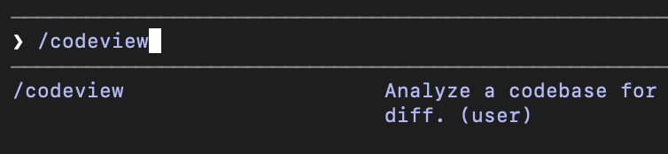
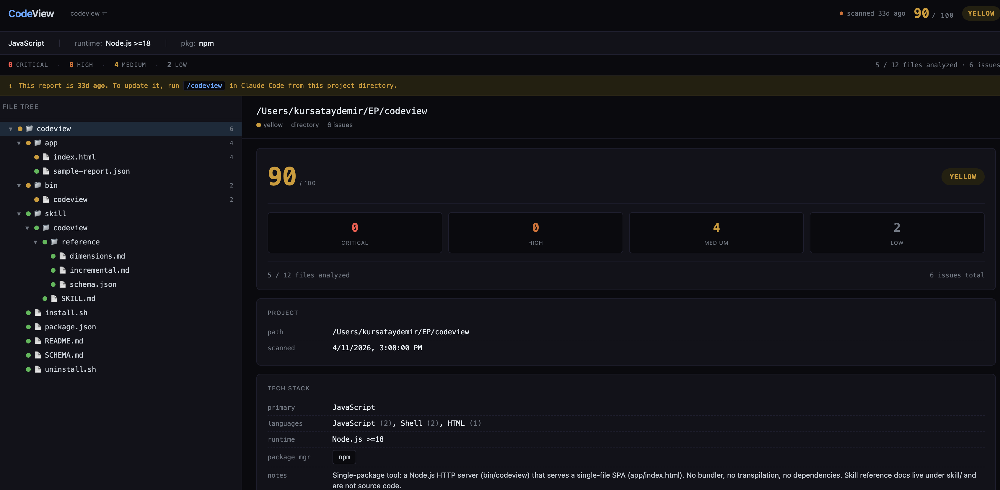
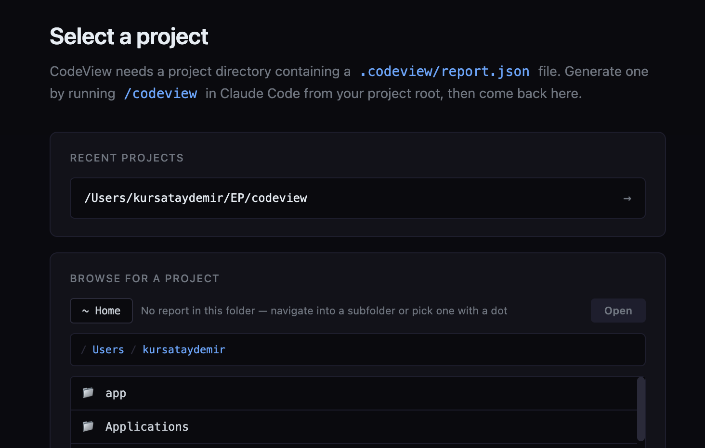

# Reading the Code: Introducing CodeView

There's a shift happening in how software gets built. A few years ago, if you developed a feature, you'd typically read every line of it shipped, maybe more than once. But now, you give a prompt to Claude or Cursor or Codex, watch a wall of code stream into your editor, run the tests, and ship.

This sounds often fine. Sometimes it's better than fine, as AI catches edge cases, writes more tests, and applies patterns we'd be too lazy to apply by hand. But something quietly gets lost; nobody reads the code in detail anymore. Not the human, who trusted the AI. Not the AI, which already moved on to the next task. The code exists. It works on the happy path. And it slowly accumulates the kind of small wrongs that compound into the kind of large incidents nobody can debug at 2am.

CodeView is a small tool that is made to surface those small wrongs. It's a code health dashboard built specifically for AI-assisted codebases, the situation where the code is technically yours but nobody has ever read it.

## What CodeView Is and What It Isn't

CodeView is a starting point for reviewing your codebase, not a final verdict. I want to put that up front, because it's the core design choice everything else flows from.

The use of it is very simple:

1. You run `/codeview` command in Claude Code from your project directory.



2. Claude walks the codebase, analyzes each file across 24 health dimensions, and writes a JSON report to `.codeview/report.json`.
3. You run `<codeview-local-repo>/bin/codeview` in your terminal, which opens a small web dashboard showing the report as a navigable file tree with green/yellow/red status dots and an issues panel on the right.



That's it. Everything is in your local. No additional cloud service, no sign up, no API key beyond your existing Claude Code session. Two pieces of software: a Claude Code skill (a markdown file telling Claude what to look for and what JSON shape to produce) and a zero-dependency Node.js HTTP server that renders the report in a HTML SPA.

So, why do I say "starting point, not verdict"? Because the analysis is done by an LLM, and LLMs are non-deterministic. Two runs on the same codebase produce overlapping but not identical reports. Some findings are false positives. Some real issues are missed. The same input run twice can produce different severities for the same finding.

That's fine as long as you treat it like a starting point to understand what is going on with your code if you haven't been reading your codebase. It's not fine if you treat it like a CI gate that has to pass.

Conventional static analysis like linters, type checkers, is deterministic and narrow. It catches what it's built to catch and nothing else. LLMs are non-deterministic and broad. They can catch things no linter has rules for, like "this function is named `getActiveUser` but doesn't actually filter by `active`". They can also be confidently wrong. CodeView is a tool for the first category. Use it for what it's good at.

## The Categories That CodeView Looks For

CodeView tracks 24 dimensions grouped into four categories. A few are aimed specifically at the things AI-generated code tends to get wrong.

**Security (5 dimensions)**

Hardcoded secrets and API keys. Missing auth on endpoints. Known CVEs in dependencies. Dev environment configurations in production configurations. Unvalidated input flowing into SQL/shell/HTML sinks. Secret leakage in logs.

**Correctness (5 dimensions)**

This is where the AI-specific ones live mostly:

**`silent-error-handling`**: Empty `catch` blocks, `.catch(() => {})`, swallowing errors so the function "succeeds" with garbage. This is the single most common AI failure mode I've seen. The AI usually doesn't have an idea how to handle the error, so it just lets it pass. The function still returns and the bug ships.

**`default-return-masking`**: `try { return await fetchUsers() } catch { return [] }`. The caller can no longer tell "no users" apart from "the database is down". Tests pass and production silently degrades.

**`broken-implementation`**: The function name, documentation, or test claims one thing but the code does something else or incorrectly implemented. This happens when the AI misunderstands a requirement and confidently writes the wrong code under the right name.

**`unhandled-async`**: Floating promises, missing `await`, `.then()` without `.catch()`.

**`implementation-drift`**: Comments, types, or README sections that contradict the code. The code changed, the docs didn't, and a future reader (or future AI) will trust the wrong one.

**Maintainability (10 dimensions)**

Dead code, duplicates code, type escapes, commented-out code, TODO notes, complexity hotspots, long files, orphaned/circular dependencies, inconsistent patterns. The big ones for AI code are **`type-safety-escapes`** dimension, for example when the AI hits a type error, the easiest fix is to use `any` on it. And **`inconsistent-patterns`** dimension, for instance the AI applies the patterns it sees nearby so a codebase that grew organically with AI assistance often has three different error-handling idioms and four naming conventions.

**Quality (4 dimensions)**

Test coverage, logging hygiene, hardcoded magic numbers, side effects at module load time.

The full list with detection patterns and example code lives in `skill/codeview/reference/dimensions.md`. The skill prompt tells Claude which dimensions are relevant to which file types, so it isn't wasting tokens checking SQL injection on a CSS file.

## Simple Architecture

The whole code review is structured around one file: `.codeview/report.json`. The skill writes it. The app reads it. That's the only contract:

- Without the bundled webapp the portable JSON report can be reused.
- The webapp can render any report not just ones generated locally. Point it at a report from any codebase.
- Don't like Claude as the analyzer? Write your own and produce the same JSON shape. Don't like the dashboard? Render the JSON however you want. Or use the skill file in any other AI agent.
- There's no database: State is a flat JSON file on disk. The running-instances registry (`~/.codeview/running.json`) is also JSON.

The launcher is plain Node.js with zero npm dependencies. It uses `http` from the standard library, serves a single HTML file and the generated report JSON, and exposes a small API for the onboarding screen (browse the filesystem, switch projects, view the demo).



A few patterns in the launcher worth calling out for anyone who wants to crib them:

- **Atomic writes**: State files are written to a `.tmp.PID` sibling and renamed. Readers never see partial JSON, even when two `codeview` processes update state concurrently.
- **Origin-checked CORS for localhost**: Mutating endpoints reject any non-loopback Origin, and reject missing Origin headers on POST, otherwise a local non-browser process could CSRF you.
- **Sandboxed filesystem browsing**: The onboarding screen lets you navigate folders to find a report, but the `/api/browse` endpoint refuses to leave your home directory.
- **Loopback-only binding**: `server.listen(port, '127.0.0.1')`, never on the network, even if your firewall is open.
- **PID liveness pruning**: When the state file lists an instance whose PID is dead, it's removed transparently. No stale lock files.

The skill enforces atomic writes for the report (`report.json.tmp` then rename) so the dashboard never reads a half-written JSON file mid-scan.

## Status Colors and Scores

CodeView shows both a **score** (0–100) and a **status** (green/yellow/red). They look like they'd be derived from each other. They are not. Score is a weighted sum of issues: `100 − (critical × 15) − (high × 5) − (medium × 2) − (low × 0.5)`, floored at zero. It's a rough "how much technical debt is here" gauge. Status is determined by severity counts. Any critical or high issue is red. Any medium or low (and no critical/high) is yellow. Zero issues is green.

A project with a score of 85 and a single high-severity finding is still red, not yellow. The score might look healthy, but you have an actual bug or security hole, and the dashboard should not let you pretend otherwise.

The same rule applies recursively to directories. A directory's status is the worst status of any descendant. So even if 99% of your code is clean, one critical issue in one of the files makes the root node red. This is intentional. A score is for trends; a color is for triage.

## Incremental Analysis

The first scan is a full pass, very source file Claude can see (respecting `.gitignore` and a built-in exclude list for `node_modules`, `dist`, `.venv`, build output, generated files) gets analyzed. Subsequent scans only re-analyze files that actually changed.

For git repos, "changed" means `git diff --name-only <lastCommit> HEAD` plus uncommitted changes plus untracked files. A small state file remembers the last commit SHA. Re-running on the same commit with a clean working tree is a no-op, the report is already current.

For non-git projects, the state file stores SHA-256 hashes of each file. Changed hash → re-analyze. Missing → remove from report. New file → analyze it. Same hash → skip.

Findings for unchanged files are preserved across scans. The tree and severity totals are rebuilt from the merged issue list. This matters because LLM scans aren't cheap, and the goal is to make `/codeview` cheap enough that you'd run it before every PR.

## Eating its own dog food

I ran CodeView on CodeView itself. The score initally came out at **75/100**, with status **yellow** a some medium and low issues. Then I fixed some of them and reran `codeview` on the codebase and this is the final score (90/100) that it can live with. Every finding was real and worth fixing.

This is a useful proof point in both directions. It found real issues, they were real, and I fixed them. But it can miss things a human reviewer would catch, and it assigned severities I might have argued with. That's the whole "starting point, not verdict" frame in practice; the report is a list of leads, and the value is in the leads it surfaces, not in the score it prints.

I also ran CodeView on a separate project that had been built heavily with AI assistance. It surfaced real issues across the full severity range from low-priority hygiene up to a critical missing-authentication gap, with dead code and other maintainability findings in between. The report makes those findings actionable; alongside the detected tech stack and the overall issue distribution, each issue carries a description, the exact file and line, a code snippet, and a suggested fix. Seeing why a finding is a finding, not just that one exists, is what turns the report into something worth reading rather than something to glance at.


## Limitations

As I mentioned previously CodeView is an LLM-driven analyzer. That means:

- False positives happen. Claude can sometimes flag code that's fine. You'll learn to recognize the pattern.
- False negatives happen. Claude can sometimes miss real issues, especially ones that require cross-file reasoning or knowledge of your specific business logic.
- Two runs can disagree. Severity calls in particular are inconsistent.
- Token cost scales with codebase size. Large monorepos cost real money to scan. Incremental scans help; pointing the scan at a subdirectory helps more.
- It is not a CI gate. Do not block PRs on the score. Do not make red status a hard fail. Treat the dashboard as a starting point for a human review, not a substitute for one.

It's worth being equally honest about the alternative. Static analysis tools, linters, type checkers, security scanners, produce consistent, explicit, repeatable output. That's their biggest advantage, and it's a real one. But deterministic isn't the same as correct. Most non-trivial findings still involve approximating intent; what a function is supposed to do, whether an input is really user-controlled, whether this branch was meant to be unreachable. The tool guesses too, with hand-coded rules instead of learned ones, and the output is still a list of candidates a human has to triage, usually by dismissing the false positives. The distinctive thing static analysis gives you isn't truth but consistency.

## Why Skill?

The unconventional choice here is using a Claude Code skill as the analyzer instead of building a traditional static analysis tool. Because LLMs are good at semantic analysis, no language-specific rule-sets are needed, and easy to add new dimensions, skill is the prompt and can be reused in different agents.

The cost is the cost of LLM analysis (tokens, non-determinism). The benefit is leverage, a small skill file, no language matrix, no plugin system, no parser maintenance. For an early prototype trying to find out whether semantic AI code review is even useful, that trade is good.

## Getting Started

```bash
git clone https://github.com/<your-org>/codeview ~/codeview
cd ~/codeview
./install.sh
```

The installer symlinks the skill into `~/.claude/skills/codeview` and optionally puts the `codeview` launcher on your PATH. Restart Claude Code once so it picks up the skill. Then, from any project:

```bash
/codeview          # in Claude Code generates the report
```

```bash
codeview           # in terminal, opens the dashboard
```

A demo result can be viewed with this command on the dashboard:

```bash
codeview --demo    # in terminal, renders the bundled sample report
```

## Final Words

CodeView is intentionally small and this version covers the core flow end-to-end. There are some things that would be worth iterating on like better incremental signals, skill command arguments pointing specific issues found etc.

If you're a desperate vibe-coder or you've ever shipped a feature you didn't fully read, this tool is for you. Not because it'll catch everything, but because it'll catch something, and that something is a whole lot better than your current mode of not reading the code at all.
