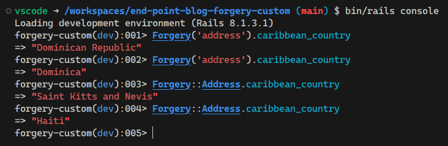

When it comes to generating fake data for testing (or any other purpose), most Rails projects nowadays use the [Faker](https://github.com/faker-ruby/faker) gem. With a simple function call, you can generate a random name, email, telephone number, etc.

However, if you're still using the [Forgery](https://github.com/sevenwire/forgery) gem, there's a neat trick that it has up its sleeve that, even though Faker can also do it, I'd say it feels more natural with Forgery: creating custom dictionaries. That is, defining a custom list of values and having the gem use that list as its data source.

This might be useful when you want to generate random-ish data, but want to limit the possible values.

In this short and sweet blog post, I show you how.

First, we add the gem to our Gemfile:

```ruby
gem "forgery", ">= 0.8.1"
```

Then, we run its generator:

```sh
bundle exec rails generate forgery
```

This generates a directory structure under `lib` which serves as the foundation for our customizations:

```sh
lib
└── forgery
    ├── dictionaries
    ├── extensions
    ├── forgeries
    └── formats
```

Under `lib/forgery/dictionaries` we will put a raw text file with the list of words that we want our custom dictionary to contain. Under `lib/forgery/forgeries` we will put the Ruby class through which our code will be able to access the dictionary.

For example, here's a dictionary of countries in the Caribbean. We store this in `lib/forgery/dictionaries/caribbean_countries`:

```txt
Antigua and Barbuda
Bahamas
Barbados
Cuba
Dominica
Dominican Republic
Grenada
Haiti
Jamaica
Saint Kitts and Nevis
Saint Lucia
Saint Vincent and the Grenadines
Trinidad and Tobago
```

And the forgery class looks like this:

```rb
# lib/forgery/forgeries/address.rb

# The important detail is to inherit from "Forgery"
class Forgery::Address < Forgery
  def self.caribbean_country
    # caribbean_countries should match the name of the file from which we want
    # to fetch values. This file must exist under lib/forgery/dictionaries.
    dictionaries[:caribbean_countries].random
  end
end
```

Of course, the name of the class and the method can be anything. The important detail is that our custom class needs to inherit from the `Forgery` class and that the name we pass to the `dictionaries` method needs to match the file we created under `lib/forgery/dictionaries`.

With that done, we can now call our forgery like so:

```ruby
Forgery('address').caribbean_country

# or

Forgery::Address.caribbean_country
```



And that's all for now! We recently used this technique in a legacy project to help implement a feature where random, human-friendly Wi-Fi passwords had to be auto-generated for newly onboarded users. Pretty neat!
